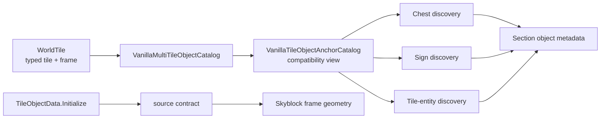

# Multi-tile object catalog

TerraRuntime owns the source-backed frame-anchor rules used to discover chests, signs and supported tile entities in section metadata. Vanilla frame arithmetic belongs to a tile-object definition boundary rather than to whichever packet or persistence encoder happens to need it.

## Ownership

`VanillaMultiTileObjectDefinition` records a typed `TileTypeId`, base-style width and height, placement origin, metadata family, frame periods and whether the metadata anchor requires `FrameY == 0`. The current runtime catalog remains intentionally limited to object families emitted by `WorldSectionObjectMetadataEncoder`.

## Source-backed worldgen geometry

The same pinned `TileObjectData.Initialize` source contract also verifies a small set of frame-important world-generation objects which do not carry section side-table metadata and therefore do not belong in `VanillaMultiTileObjectCatalog` itself.

Skyblock currently consumes the verified `Style3x2` association for:

| Object | Tile ID | Geometry | Frame grid used by worldgen |
|---|---:|---:|---|
| Demon / Crimson Altar | 26 | `$3\times2$` | `$18$` px cells; Crimson uses its style offset |
| Hellforge | 77 | `$3\times2$` | `$18$` px cells |
| Lihzahrd Altar | 237 | `$3\times2$` | `$18$` px cells |

This distinction is deliberate: geometry can be source-backed without pretending that an object owns chest/sign/tile-entity metadata.

## Compatibility rule

The definitions are pinned to TerrariaServer 1.4.5.8 `TileObjectData.Initialize`. The source-contract workflow verifies seven inherited base styles, their association with the 15 supported section-metadata object types, and the three additional `Style3x2` progression objects used by Skyblock.

A metadata tile is an anchor only when content identity, active state and frame alignment all match. The catalog preserves Terraria's frame-modulo semantics, including ordinary containers (`36 x 36`), dressers (`54 x 36`) and teleportation pylons (`54 x 72`).

## Scope boundary

The metadata catalog still does not claim complete `TileObjectData` parity. Alternate origins, support rules, style/substyle mapping, liquid placement constraints and mutation hooks remain separate gameplay/placement work. Likewise, proving that a Lihzahrd Altar occupies `$3\times2$` cells does not by itself implement Power Cell consumption or Golem summoning.
