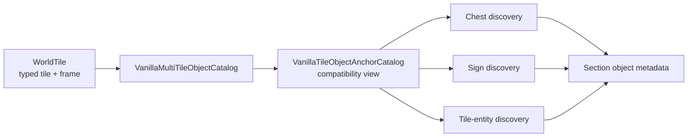

# Multi-tile object catalog

TerraRuntime now owns the source-backed frame-anchor rules used to discover chests, signs and supported tile entities in section metadata. The goal is narrow but important: vanilla frame arithmetic belongs to a tile-object definition boundary, not to whichever packet/persistence encoder happens to need it.

## Ownership

`VanillaMultiTileObjectDefinition` records a typed `TileTypeId`, base-style width and height, placement origin, metadata family, horizontal frame period, vertical frame period and whether the metadata anchor requires `FrameY == 0`. `VanillaTileObjectAnchorDefinition` is the compatibility view consumed by the section encoder. Its `Matches` method also requires an active tile. Callers therefore consume semantic geometry and anchor predicates instead of repeating `% 18`, `% 36`, `% 54` or `% 72` arithmetic.

The current catalog covers only the object families already emitted by `WorldSectionObjectMetadataEncoder`: vanilla chest/container anchors, sign-text anchors, training dummy, item frame, Dead Cells display jar, food platter, weapons rack, display doll, hat rack and teleportation pylon.

## Compatibility rule

These definitions are pinned to TerrariaServer 1.4.5.8 `TileObjectData.Initialize` and the behavior already present in the section-object path. A dedicated source-contract workflow verifies the seven inherited base styles and their association with the 15 supported object types. The refactor does not change section ordering or payload bytes; it moves existing verified recognition facts behind one typed owner.

A tile is an anchor only when its content identity, active state and frame alignment all match. The catalog intentionally preserves Terraria's frame modulo semantics, including the exact distinction between ordinary containers (`36 x 36` frame periods) and dressers (`54 x 36`). The teleportation-pylon anchor uses `54 x 72`; tile entities whose existing rule requires the top frame use explicit `FrameY == 0` semantics.

## Scope boundary

The catalog covers the complete geometry needed by the currently supported section-metadata families, not every vanilla furniture type. Alternate placement origins, support rules, style/substyle mapping, liquid placement constraints and mutation hooks remain outside this definition slice. Placement, break and framing operations are tracked separately in D5; this catalog does not claim complete `TileObjectData` parity.
