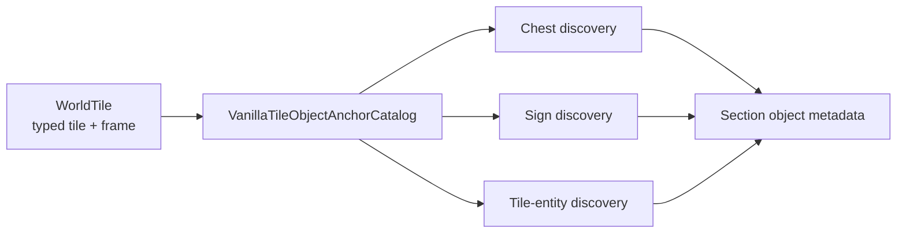

# Tile object anchor catalog

TerraRuntime now owns the source-backed frame-anchor rules used to discover chests, signs and supported tile entities in section metadata. The goal is narrow but important: vanilla frame arithmetic belongs to a tile-object definition boundary, not to whichever packet/persistence encoder happens to need it.

## Ownership

`VanillaTileObjectAnchorDefinition` records a typed `TileTypeId`, horizontal frame period, vertical frame period and whether the anchor requires `FrameY == 0`. Its `Matches` method also requires an active tile. Callers therefore consume a semantic anchor predicate instead of repeating `% 18`, `% 36`, `% 54` or `% 72` arithmetic.

The current catalog covers only the object families already emitted by `WorldSectionObjectMetadataEncoder`: vanilla chest/container anchors, sign-text anchors, training dummy, item frame, Dead Cells display jar, food platter, weapons rack, display doll, hat rack and teleportation pylon.

## Compatibility rule

These definitions are pinned to TerrariaServer 1.4.5.8 behavior already present in the section-object path. The refactor does not change section ordering or payload bytes; it moves existing verified recognition facts behind one typed owner.

A tile is an anchor only when its content identity, active state and frame alignment all match. The catalog intentionally preserves Terraria's frame modulo semantics, including the exact distinction between ordinary containers (`36 x 36` frame periods) and dressers (`54 x 36`). The teleportation-pylon anchor uses `54 x 72`; tile entities whose existing rule requires the top frame use explicit `FrameY == 0` semantics.

## Deliberate scope boundary

This is **not** yet the complete D5 multi-tile object-definition milestone. Full object definitions still need independently verified dimensions, origin, support/anchor rules, style mapping, placement/break/framing behavior and associated mutation semantics. Keeping that distinction explicit avoids turning a useful section-anchor catalog into a false claim of complete `TileObjectData` parity.
