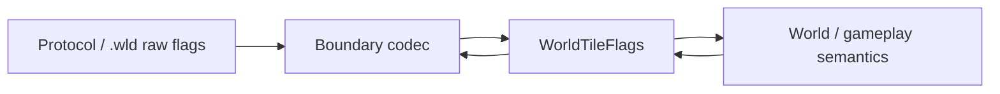

# Tile state flags

TerraRuntime keeps normalized tile state separate from Terraria packet and `.wld` bit layouts. `WorldTile` is the packed runtime/snapshot representation; protocol and persistence codecs translate their raw masks at the boundary rather than leaking those masks into gameplay code.

## Runtime ownership

`WorldTile.Flags` uses the named `WorldTileFlags` enum. The field remains a `ushort`-backed enum so the frozen `WorldTile` snapshot ABI stays exactly

$$
S_{\mathrm{WorldTile}}=16\,\mathrm{B}.
$$

The current runtime-owned bits are:

| Bit | Flag | Meaning |
|---:|---|---|
| 0 | `Active` | tile content is active |
| 1 | `WireRed` | red wire present |
| 2 | `WireBlue` | blue wire present |
| 3 | `WireGreen` | green wire present |
| 4 | `WireYellow` | yellow wire present |
| 5 | `Actuator` | actuator present |
| 6 | `Inactive` | actuated/inactive tile state |
| 7 | `InvisibleBlock` | block invisibility state |
| 8 | `InvisibleWall` | wall invisibility state |
| 9 | `FullbrightBlock` | block fullbright state |
| 10 | `FullbrightWall` | wall fullbright state |

`WorldTileFlagMasks` groups these named bits into `Wires`, `Actuation`, `Visibility`, `Fullbright` and `Known`. Gameplay code should use those groups or semantic accessors such as `HasAnyWire`, `HasActuator`, `IsActuated`, `IsBlockInvisible` and `IsWallFullbright` instead of copying numeric masks.

## Mutation rule

`WorldTile.TrySetFlags(...)` changes only known runtime bits and rejects undefined bits. This prevents an unrelated gameplay path from silently inventing a new persisted bit in the snapshot ABI. Adding a real new flag therefore requires an explicit `WorldTileFlags` member, ABI review, codec mapping where applicable, tests and bilingual documentation.

`Inactive` is deliberately exposed as the semantic `IsActuated` accessor. It is not the inverse of `Active`: an active tile can be actuated into Terraria's inactive collision/visibility state.

## Boundary rule

The numeric bit positions above are the TerraRuntime normalized snapshot ABI. They are not a claim that Terraria protocol or `.wld` files use the same bit positions. `WorldFileTileDecoder`, `WorldFileTileEncoder`, section encoders and protocol adapters remain responsible for converting external representations into named runtime state.

Tile and wall content identity follows the same boundary rule: packed `ushort` storage remains for the snapshot ABI, while gameplay reads `TileTypeId` and `WallTypeId` through typed accessors.
