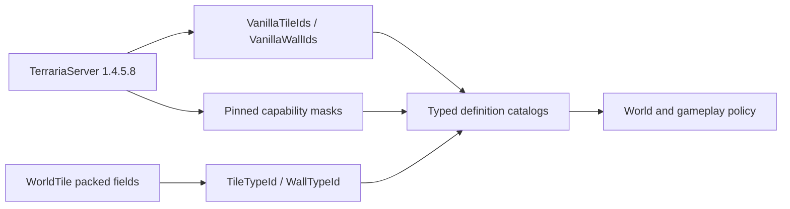

# Vanilla tile and wall definitions

TerraRuntime exposes Terraria `1.4.5.8` tile and wall content through typed, version-pinned definition catalogs. Packed `ushort` fields remain the world snapshot ABI, while gameplay resolves their meaning through `TileTypeId`, `WallTypeId`, `VanillaTileDefinitionCatalog` and `VanillaWallDefinitionCatalog`.

## Definition flow

`VanillaTileDefinitionCatalog` covers exactly `754` vanilla tile identities. Each definition combines the existing source-backed solid, solid-top and format-`326` frame-important tables and identifies tiles whose section snapshots carry container or sign side-table metadata.

`VanillaWallDefinitionCatalog` covers exactly `367` vanilla wall identities. Its packed definition image mirrors `Main.wallHouse`, `Main.wallDungeon` and `Main.wallLight` after `Main.Initialize_TileAndNPCData2`. `WallTypeId(0)` is a valid catalog identity for no wall; `VanillaWallDefinition.IsPresent` distinguishes it from an occupied wall cell.

## Boundary rules

- Unknown IDs fail `TryGet`; absence is not interpreted as guessed vanilla defaults.
- World-file decoders may preserve storage values under their own compatibility policy, but authoritative gameplay must request a typed version-pinned definition before using content capabilities.
- Tile object size, origin, anchors and placement rules are deliberately outside these base definitions and belong to the multi-tile object catalog.
- Collision and frame masks remain independently source-backed; the tile catalog composes them rather than copying another unverified table.

The `Tile Wall Definition Source Contract` workflow downloads the SHA-256-pinned official server, decompiles only `Main`, `TileID` and `WallID`, and verifies identity counts plus the wall capability images without committing decompiled source.
