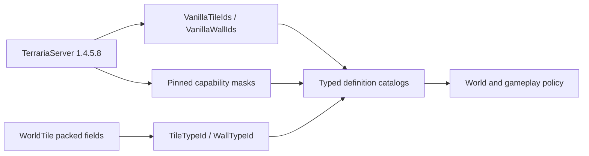

# Vanilla tile and wall definitions

Live falling blocks use the shared `VanillaWorldTileMutationService.ClearTile` operation, distinct from mining `KillTile`: Terraria `Tile.ClearTile` clears active/inActive/slope but preserves source-cell paint, coatings, actuator, wire, wall, liquid and dormant type/frame fields. It is admitted only after falling-projectile provenance/capacity has been reserved, never as a client permission shortcut. Landing uses normal PlaceTile/SetShape or reserved world-item materialization. See [falling-block scope and limits](gameplay.md#live-falling-blocks-2026-09-09) and [autonomous Mining](runtime-bot-architecture.md#operator-modes). The shovel paragraph below describes the earlier, separate tool fix.

Gravedigger's Shovel (`4711`) is a special mining tool, not an ordinary pick: `Item.SetDefaults` leaves `pick=0`; `Player.UseShovel` visits a 3-by-3 area and `DamageTileWithShovel` uses power `30` only for `TileID.Sets.CanBeDugByShovel`. Packet-17 admission now checks that exact source set before using the existing failed-pick transformation, mutation, drop and replication paths. The ordinary per-player edit ceiling remains $8\,\text{events/tick}$; a verified shovel/target pair can use up to $18\,\text{events/tick}$ for nine cells with two grass-stripping/pick events each. Both share the same counter: switching tools cannot reset it. Unknown tile definitions, structures and unsupported break paths remain closed. This does not implement falling-block physics or broaden bot mining.

TerraRuntime exposes Terraria `1.4.5.8` tile and wall content through typed, version-pinned definition catalogs. Packed `ushort` fields remain the world snapshot ABI, while gameplay resolves their meaning through `TileTypeId`, `WallTypeId`, `VanillaTileDefinitionCatalog` and `VanillaWallDefinitionCatalog`.

## Definition flow

`VanillaTileDefinitionCatalog` covers exactly `754` vanilla tile identities. It is a flyweight table: mutable `WorldTile` cells keep only per-cell state, while one immutable `VanillaTileDefinition` per type carries collision/frame facts, mutation path, mining profile, source-pinned drop rule, contextual simple-cell strategy and failed-pick transform target. This avoids duplicating invariant behavior across millions of world cells and prevents runtime authority from growing parallel raw-TileID allow-lists.

The simple-cell drop image is pinned to TerrariaServer 1.4.5.8 `WorldGen.KillTile_GetItemDrops`. `Fixed`, `None`, `Contextual` and `Object` are behavior categories rather than a `CanDrop` boolean: vines depend on the nearest player's functional Cordage equipment, Mushroom Vines use their vanilla RNG branch, Hive can produce honey and Bee/SmallBee spawns, and frame-important contextual identities remain on their frame/object path.

`VanillaWallDefinitionCatalog` covers exactly `367` vanilla wall identities. Its packed definition image mirrors `Main.wallHouse`, `Main.wallDungeon` and `Main.wallLight` after `Main.Initialize_TileAndNPCData2`. `WallTypeId(0)` is a valid catalog identity for no wall; `VanillaWallDefinition.IsPresent` distinguishes it from an occupied wall cell.

## Named progression identities

The named ID surface grows only when production gameplay or world generation needs an identity and the source contract can verify it. The Skyblock progression slice adds the following typed names:

| Tile | ID |
|---|---:|
| DemonAltar | 26 |
| Cobweb | 51 |
| MushroomGrass | 70 |
| Hellforge | 77 |
| Hive | 225 |
| LihzahrdBrick | 226 |
| LihzahrdAltar | 237 |
| Marble | 367 |
| Granite | 368 |

| Wall | ID |
|---|---:|
| SpiderUnsafe | 62 |
| HiveUnsafe | 86 |
| LihzahrdBrickUnsafe | 87 |

These names are catalog conveniences over the existing complete numeric range; they do not change the snapshot ABI or vanilla counts.

## Boundary rules

- Unknown IDs fail `TryGet`; absence is not interpreted as guessed vanilla defaults.
- World-file decoders may preserve storage values under their own compatibility policy, but authoritative gameplay must request a typed version-pinned definition before using content capabilities.
- Tile object size, origin, anchors and placement rules are deliberately outside these base definitions and belong to object/worldgen contracts.
- Collision and frame masks remain independently source-backed; the tile catalog composes them rather than copying another unverified table.

The `Tile Wall Definition Source Contract` workflow downloads the SHA-256-pinned official server, decompiles only `Main`, `TileID` and `WallID`, and verifies identity counts, the named progression constants and the wall capability images without committing decompiled source.
