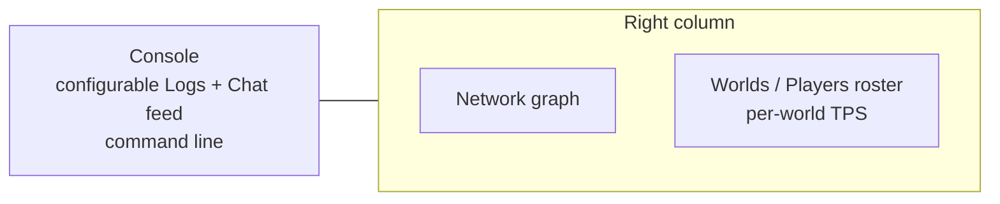

# TUI dashboard interaction

[Русский](../ru/tui-dashboard-interaction.md) · [Operations and TUI](operations-tui.md)

## Purpose

The built-in TerraRuntime System Dashboard keeps presentation state detached from authoritative runtime state. UI actions submit typed operations; the Terminal.Gui thread never mutates a world directly.

## Layout



Console occupies roughly two thirds of the workspace. The right column keeps the compact Network graph at the top and gives the remaining height to Worlds / Players. The former process-wide TPS graph is intentionally removed because Level 1 runtimes have independent authoritative game loops and therefore independent tick rates.

## Per-world TPS and roster

Each live `WorldRuntime` publishes both target TPS and an observed TPS sample from its own game-loop tick counter. The roster renders that value on the world row:

```text
▼ Main   [primary]            TPS 60.0/60
  └─ #0 Alice
▼ arena  [sandbox · running]  TPS 119.8/120
  └─ #1 Bob
```

A sandbox that is still being materialized has no live game loop and is rendered as `TPS --` instead of borrowing the primary runtime metric.

The roster is a `ListView`: focus/selection highlights a complete item row rather than selecting text inside the row. Player drag-and-drop still submits the typed Level 1 move operation.

Right-click opens a context menu for the selected semantic row. A live sandbox world exposes `Destroy`; a player exposes `Kick`. Primary world destruction is deliberately not offered. `Kick` requests process-owned connection shutdown through the connection route/outbound queue; it does not delete a UI row or directly mutate runtime player state.

A `+` control at the top of the roster opens the sandbox creation window. The form covers the currently implemented `sb1`/`sb2` creation surface:

- sandbox name;
- in-process (`sb1`) or dedicated-process (`sb2`) isolation;
- generated world or existing `.wld` source;
- generator ID and numeric/random seed;
- primary-size or explicit width/height;
- classic/expert/master/journey mode;
- corruption/crimson evil.

The form builds the same typed `SandboxCreateRequest` used by command handling. It does not round-trip through a generated command string.

## Maximize and focus

Double-clicking a tile title expands that tile to the complete dashboard workspace and hides the other tiles. A second double-click restores the tiled layout. Keyboard or mouse focus applies the Accent scheme and prefixes the active title with `▶`.

## Configurable Console feed

Console is one chronological bounded feed rather than separate Log and Chat panes. Controls at the top select structured log visibility/minimum level and Chat visibility. The detached TUI cache captures a bounded Debug-level overview superset, so changing filters does not synchronously query logging state from the Terminal.Gui thread.

The same settings are available through the command line:

```text
feed
feed all
feed logs on|off
feed chat on|off
feed level debug|info|warn|error
```

## Network graph

Network uses Terminal.Gui `GraphView` with inbound and outbound packet-rate histories. The legend also shows current packet rate and throughput in `KiB/s`. Rates are calculated from process-lifetime message-counter deltas across detached network snapshots. Invalid intervals/counter rollback reset the local sample instead of emitting a synthetic spike.

## Console command line

The Console tile contains an always-visible accented `>` input frame. `Ctrl+P` focuses it. Sandbox commands and UI actions ultimately use the same runtime-owned operation layer; unknown input is reported locally and is never interpreted as arbitrary runtime mutation.

## Text selection

Console and the Details screens remain read-only selectable text surfaces for copying diagnostics. Worlds / Players intentionally differs: it is an item list, so selection highlights a row and does not create a text selection.

## Responsiveness

Authoritative operations capture remains outside the Terminal.Gui thread. The UI reads the last atomically published cache snapshot, so input processing, row selection, context menus and the sandbox creation window do not wait for world/network/log snapshot acquisition. Snapshot freshness remains approximately 500 ms while the lightweight UI publication check is approximately 25 ms.
