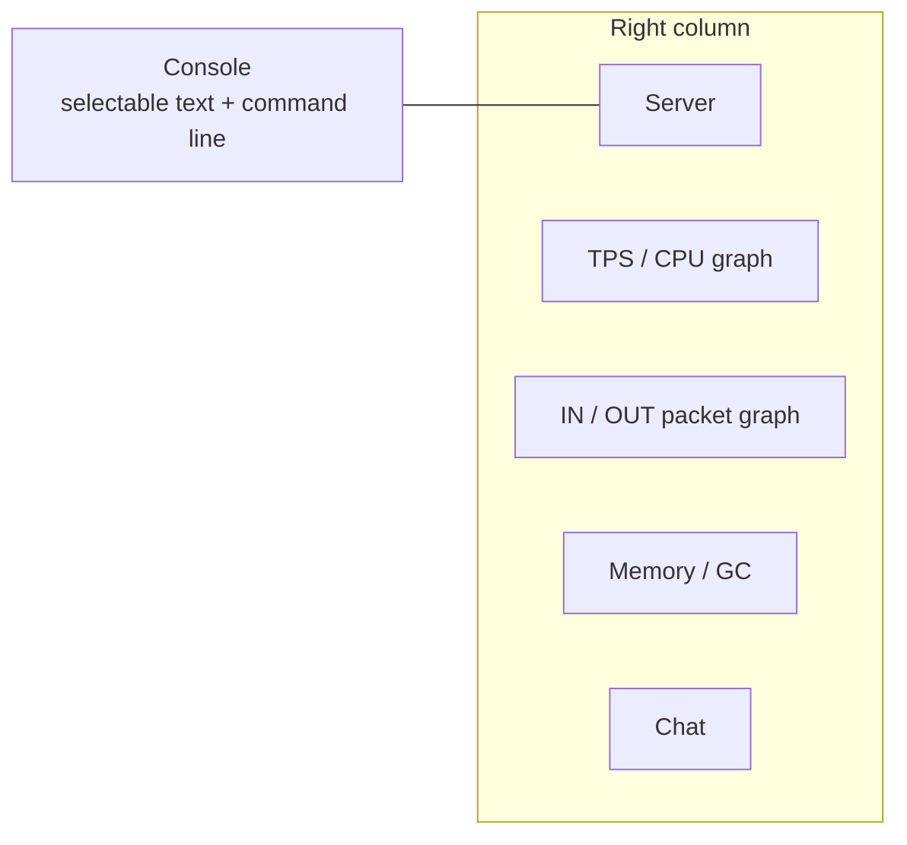

# TUI dashboard interaction

[Русский](../ru/tui-dashboard-interaction.md) · [Operations and TUI](operations-tui.md)

## Purpose

The built-in TerraRuntime System Dashboard follows the interaction model proven by Vega while keeping all data and mutation boundaries runtime-owned.

## Layout



Console occupies the left side. Server, TPS/CPU, Network, Memory/GC and Chat are stacked on the right.

## Maximize and focus

Double-clicking a tile title uses the title/border view binding rather than the content view. The selected tile expands to the complete dashboard workspace and hides the other tiles. A second double-click on its title restores the tiled layout.

Keyboard or mouse focus applies the Accent scheme and prefixes the active title with `▶`, so focus remains visible even on terminals that reduce the configured color range.

## Graphs

TPS/CPU uses Terminal.Gui `GraphView`, matching the Vega dashboard model:

- current TPS history;
- process CPU history;
- target TPS reference line.

Network has its own `GraphView` with separate inbound and outbound packet-rate histories. The legend also shows current packet rate and throughput in `KiB/s`. When message-traffic window counters are available they are used directly; the older inbound one-second counters are retained only as a fallback for inbound traffic.

The histories are UI-local bounded presentation state. They do not become authoritative telemetry and they do not add counters to packet hot paths.

## Console command line

The Console tile contains an always-visible `>` input line. `Ctrl+P` focuses it. Current runtime-owned commands are:

```text
help
save
interest on
interest off
system
players
npcs
projectiles
items
network
world
logs
```

`save` and `interest on|off` delegate to the existing bounded operations ingress. Navigation commands only switch the current workspace screen. Unknown input is reported locally and is never interpreted as arbitrary runtime mutation.

## Text selection

Console, Server, Memory/GC and Chat use read-only selectable text surfaces. Mouse or keyboard selection and `Ctrl+C` are supported. Snapshot refresh does not replace the displayed text while an active non-empty selection exists, preventing the normal telemetry refresh from destroying a selection while the operator is copying it.

## Responsiveness

Authoritative operations capture remains outside the Terminal.Gui thread. The UI reads the last atomically published cache snapshot, so input processing, selection, menu navigation and window interaction do not wait for world/network snapshot acquisition.

Runtime snapshots target approximately

$$
T_{\mathrm{snapshot}}\approx500\,\mathrm{ms},
$$

while the lightweight UI publication check is approximately

$$
T_{\mathrm{ui\ pump}}\approx25\,\mathrm{ms}.
$$

These periods control data freshness, not keyboard or mouse processing latency.
