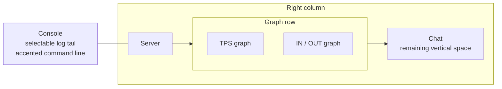

# TUI dashboard interaction

[Русский](../ru/tui-dashboard-interaction.md) · [Operations and TUI](operations-tui.md)

## Purpose

The built-in TerraRuntime System Dashboard follows the interaction model proven by Vega while keeping all data and mutation boundaries runtime-owned.

## Layout



Console occupies the left side. The right side keeps the compact Server tile at the top, places TPS and Network side by side on one row, and gives Chat all remaining vertical space. CPU and Memory/GC are intentionally not overview tiles; the System Dashboard is reserved for the operator signals that need permanent screen space.

The layout is deliberately asymmetric: Console receives about half the workspace, while the graph row uses two equal compact tiles. Fixed compact heights for Server and the graph row allow Chat to grow automatically as terminal height increases.

## Maximize and focus

Double-clicking a tile title uses the title/border view binding rather than the content view. The selected tile expands to the complete dashboard workspace and hides the other tiles. A second double-click on its title restores the tiled layout.

Keyboard or mouse focus applies the Accent scheme and prefixes the active title with `▶`, so focus remains visible even on terminals that reduce the configured color range.

## Graphs

TPS uses Terminal.Gui `GraphView` with:

- bounded current TPS history;
- a target TPS reference line;
- a scale derived from the configured target TPS.

CPU history is not plotted on the overview graph.

Network has its own `GraphView` with separate inbound and outbound packet-rate histories. Its compact legend shows current packet rates and throughput. Rates are calculated from deltas of the subsystem-owned process-lifetime inbound/outbound Terraria message counters across consecutive detached network snapshots. The elapsed time comes from the snapshot capture timestamps, so the graph reflects traffic observed during the UI sampling interval instead of incorrectly dividing lifetime totals by the telemetry rolling-window length. Counter rollback or an invalid/long sampling interval resets the local rate sample rather than emitting a spike.

The histories and previous-counter sample are UI-local bounded presentation state. They do not become authoritative telemetry and they do not add counters to packet hot paths.

## Console command line

The Console tile ends with a dedicated bordered command area using the Accent scheme. The input remains visually distinct from log output instead of looking like another log line. `Ctrl+P` focuses it.

Current runtime-owned commands are:

```text
help
save
interest on
interest off
system
players
npcs
projectiles
items
network
world
logs
```

`save` and `interest on|off` delegate to the existing bounded operations ingress. Navigation commands only switch the current workspace screen. Unknown input is reported locally and is never interpreted as arbitrary runtime mutation.

## Log and chat tails

Console and Chat render bounded tails of their detached snapshots. The overview keeps at most 64 formatted entries per surface, while the underlying runtime log/chat stores remain independently bounded. Both surfaces follow the newest entry while the operator is already at the tail. Manual history scrolling disables forced tail-follow until the operator returns to the bottom.

## Text selection

Console, Server and Chat use read-only selectable text surfaces. Mouse or keyboard selection and `Ctrl+C` are supported. Snapshot refresh does not replace displayed text while an active non-empty selection exists, preventing normal telemetry refresh from destroying a selection while the operator is copying it.

All built-in Details screens (Players, NPCs, Projectiles, Items, Network, World and Logs) use the same read-only selectable projection. Their existing bounded `rows[]` render model remains internal for formatting and smoke assertions, while one scrollable `TextView` presents those rows to the operator. Automatic refresh preserves an active selection; explicit navigation to another Details screen clears the previous selection before rendering the new screen.

## Responsiveness

Authoritative operations capture remains outside the Terminal.Gui thread. The UI reads the last atomically published cache snapshot, so input processing, selection, menu navigation and window interaction do not wait for world/network snapshot acquisition.

Runtime snapshots target approximately

$$
T_{\mathrm{snapshot}}\approx500\,\mathrm{ms},
$$

while the lightweight UI publication check is approximately

$$
T_{\mathrm{ui\ pump}}\approx25\,\mathrm{ms}.
$$

These periods control data freshness, not keyboard or mouse processing latency.
