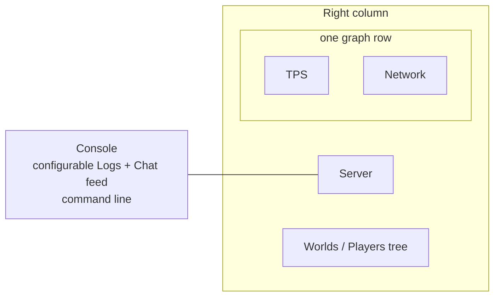

# TUI dashboard interaction

[Русский](../ru/tui-dashboard-interaction.md) · [Operations and TUI](operations-tui.md)

## Purpose

The built-in TerraRuntime System Dashboard follows the interaction model proven by Vega while keeping all data and mutation boundaries runtime-owned.

## Layout



Console occupies the left side. The right side keeps the compact Server tile, TPS and Network graphs on one row, and gives all remaining height to the Worlds / Players tree. CPU and Memory/GC are intentionally absent from the overview dashboard; detailed system diagnostics remain available through the Details screens instead of competing with operator-facing state.

## Maximize and focus

Double-clicking a tile title uses the title/border view binding rather than the content view. The selected tile expands to the complete dashboard workspace and hides the other tiles. A second double-click on its title restores the tiled layout.

Keyboard or mouse focus applies the Accent scheme and prefixes the active title with `▶`, so focus remains visible even on terminals that reduce the configured color range.

## Configurable Console feed

Console is one chronological bounded feed rather than separate Log and Chat panes. Three controls at the top change only the UI projection:

- `Logs ON/OFF` includes or excludes structured runtime log entries;
- `Chat ON/OFF` includes or excludes public chat entries;
- `Level DEBUG+/INFO+/WARN+/ERROR+` selects the minimum level for structured logs. Chat is independent from the log threshold.

When both sources are enabled, entries are merged by timestamp and rendered in one stream. The UI keeps at most the newest 64 projected entries. This is presentation state only; the authoritative recent-log and chat stores remain separately bounded by their own operations backends.

The detached TUI cache captures a bounded Debug-level overview superset so changing filters does not synchronously query logging state from the Terminal.Gui thread. Manual scrolling and active text selection remain stable while snapshots refresh.

The same settings are available through the command line:

```text
feed
feed all
feed logs on|off
feed chat on|off
feed level debug|info|warn|error
```

## Graphs

TPS uses Terminal.Gui `GraphView` with current TPS history and the target-TPS reference line. Network has a separate `GraphView` with inbound and outbound packet-rate histories. The legend also shows current packet rate and throughput in `KiB/s`.

Rates are calculated from deltas of subsystem-owned process-lifetime inbound/outbound Terraria message counters across consecutive detached network snapshots. The elapsed time comes from snapshot capture timestamps. Counter rollback or an invalid/long sampling interval resets the local rate sample rather than emitting a synthetic spike.

The histories and previous-counter sample are UI-local bounded presentation state. They do not become authoritative telemetry and they do not add counters to packet hot paths.

## Worlds / Players tree

The overview now reserves the large lower-right tile for the runtime roster. In the current single-world runtime it projects the active world as the primary root and players as child rows:

```text
▼ Main  [primary]
  ├─ #0 Alice
  └─ #1 Bob
```

This shape is intentionally compatible with the sandbox roadmap where several live `WorldRuntime` roots will be visible at once and players can be transferred between runtime sessions.

Actual drag-and-drop transfer is not claimed as implemented yet. The authoritative multi-world registry and client-transfer ingress are still S1/S2 sandbox work. The TUI must call that future bounded transfer operation; it must never mutate player/world ownership directly merely because both objects are visible in one process.

## Console command line

The Console tile contains an always-visible accented `>` input frame. `Ctrl+P` focuses it. Current runtime-owned commands are:

```text
help
feed ...
save
interest on
interest off
system
players
npcs
projectiles
items
network
world
logs
```

`save` and `interest on|off` delegate to the existing bounded operations ingress. Navigation commands only switch the current workspace screen. Unknown input is reported locally and is never interpreted as arbitrary runtime mutation.

## Text selection

Console, Server and Worlds / Players use read-only selectable text surfaces. Mouse or keyboard selection and `Ctrl+C` are supported. Snapshot refresh does not replace displayed text while an active non-empty selection exists, preventing normal telemetry refresh from destroying a selection while the operator is copying it.

All built-in Details screens (Players, NPCs, Projectiles, Items, Network, World and Logs) use the same read-only selectable projection. Their bounded `rows[]` render model remains internal for formatting and smoke assertions, while one scrollable `TextView` presents those rows to the operator.

## Responsiveness

Authoritative operations capture remains outside the Terminal.Gui thread. The UI reads the last atomically published cache snapshot, so input processing, selection, menu navigation and window interaction do not wait for world/network/log snapshot acquisition.

Runtime snapshots target approximately

$$
T_{\mathrm{snapshot}}\approx500\,\mathrm{ms},
$$

while the lightweight UI publication check is approximately

$$
T_{\mathrm{ui\ pump}}\approx25\,\mathrm{ms}.
$$

These periods control data freshness, not keyboard or mouse processing latency.
