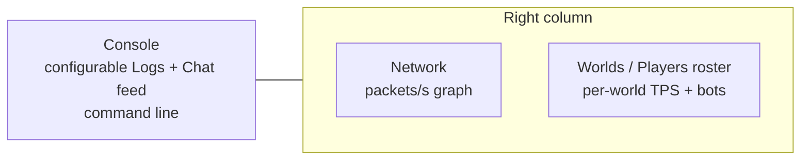

# TUI dashboard interaction

[Русский](../ru/tui-dashboard-interaction.md) · [Operations and TUI](operations-tui.md)

## Purpose

The built-in TerraRuntime System Dashboard keeps presentation state detached from authoritative runtime state. UI actions submit typed operations; the Terminal.Gui thread never mutates a world directly.

## Layout



Console occupies roughly two thirds of the workspace. The right column keeps the compact Network graph at the top and gives the remaining height to Worlds / Players. The former process-wide TPS graph is intentionally removed because Level 1 runtimes have independent authoritative game loops and therefore independent tick rates.

## Per-world TPS and roster

Each live `WorldRuntime` publishes both target TPS and an observed TPS sample from its own game-loop tick counter. The roster renders that value on the world row:

```text
▼ Main   [primary]            TPS 60.0/60
  └─ #0 Alice
▼ arena  [sandbox]            TPS 119.8/120
  └─ #1 Bob
```

A running sandbox omits the redundant `running` lifecycle word and renders simply as `[sandbox]`; non-running states remain explicit, for example `[sandbox · stopping]`. A sandbox that is still being materialized has no live game loop and is rendered as `TPS --` instead of borrowing the primary runtime metric.

The roster is a `ListView`: focus/selection highlights a complete item row rather than selecting text inside the row. Player drag-and-drop submits the typed Level 1 move operation with the exact `PlayerHandle` (`slot + generation`) captured when the drag begins. That captured source remains immutable until button release, so neither a background refresh/reorder nor repeated held-button mouse events over another player row can silently substitute another player. The complete destination-world branch is a drop surface: the world header, any player row in that branch, and its `<no players>` placeholder all resolve to the same semantic target.

Actionable sandbox-world, player and bot rows render an explicit `[X]` action at the right edge. Selecting it routes through typed operations: sandbox rows confirm `Destroy`, player rows confirm `Kick`, and bot rows request typed despawn. Primary world destruction is deliberately not offered. `Kick` requests process-owned connection shutdown through the connection route/outbound queue; the UI never deletes authoritative state directly.

The roster action row is exactly **`+ Sandbox`** followed by **`+ Bot`**. `+ Sandbox` opens the sandbox creation window. The form maps directly to the typed sandbox creation surface:

- sandbox name;
- one isolation dropdown with `In-process sandbox isolation` and `Dedicated-process sandbox isolation`;
- generated world or existing `.wld` source;
- generator ID and numeric/random seed;
- primary-size or explicit width/height;
- a game-mode drop-down with Classic, Expert, Master and Journey;
- an evil drop-down with Corruption and Crimson.

The form builds the same typed `SandboxCreateRequest` used by command handling. It does not round-trip through a generated command string.

`+ Bot` creates a primary-world PlayerBot by default through the primary runtime's real typed bot operations; the shipping composition does not leave the control disabled. Bot rows display the body kind, and double-clicking a bot row opens a typed settings window. PlayerBot fields include clothing/armor, automatic/bow/gun/melee weapon policy, flight, target, Idle/Follow/Guard mode, pickup and consumable toggles. NpcBot shows only its applicable source-verified NPC preset, target and movement mode; player-only loadout/flight/inventory controls are hidden.

PlayerBot reuses the normal server-player/projectile/world-item authorities. Its automatic loadout visibly selects between Copper Broadsword, Wooden Bow and Musket and publishes the selected slot plus use-item control. Ranged aim uses the admitted projectile's source-backed ammo speed and motion, predicts a moving target, and rejects attacks whose tile-aware line or simulated trajectory is blocked by tiles or liquid. Movement publishes vanilla direction controls, auto-jumps low obstacles and can hold source-backed wing flight to ascend past an airborne forward obstruction.

NpcBot is a real authoritative hostile-NPC presentation/motion actor; presets are restricted to verified ground-fighter, AI_002 flying-eye, AI_005 flyer and ordinary pre-wander AI_014 bat motion families. Follow/Guard coordinates remain private actor intent while replicated vanilla NPC target stays `255`, so selecting a player does not make the NPC body attack that player. The bot body is zero-contact and invulnerable until bot-specific death/drop semantics exist; unsupported NPC combat semantics stay fail-closed.

The dashboard has **no duplicate visible Settings button**. Runtime listener/settings controls remain under **Settings → Runtime settings**.

## Player details and GodMode

Double-clicking a player row opens a generation-safe window for that exact player session. `God mode` is presented as a `Disabled` / `Enabled` drop-down and committed with `Apply`. Periodic dashboard refreshes do not overwrite an operator selection that is still awaiting Apply; the committed value crosses the typed trusted-host administration boundary and authoritative game loop. Liveness and command routing use the process-level world route for the selected player, so the same control applies to primary and sandbox players instead of treating primary telemetry as the gate.

## World-scoped detail inspection

The Players, NPCs, Projectiles, Items and World detail screens expose a `World:` drop-down. The selection is keyed by stable `WorldRuntimeId`, not by the current session ID, so regenerating/restarting a sandbox can rotate its session without silently moving the operator to a different logical world.

The selector talks to a process-owned detached inspection directory/cache. The Terminal.Gui thread never retains `WorldRuntime` references and never captures heavy entity state directly. NPC/projectile/item/player snapshots are refreshed only for the selected world and only after the corresponding detail screen requests that category. Network and Logs intentionally have no world selector because those diagnostics are process-scoped.

Sandbox entity telemetry is enabled when the terminal UI is enabled, allowing the same bounded NPC/projectile/item diagnostics as the primary world without paying that capture cost in a headless process. The primary World screen keeps the richer startup/cache/persistence diagnostics; a sandbox World screen reports its own lifecycle, source, persistence policy, TPS and entity counts.

## Maximize and focus

Double-clicking a tile title expands that tile to the complete dashboard workspace and hides the other tiles. A second double-click restores the tiled layout. Keyboard or mouse focus applies the Accent scheme and prefixes the active title with `▶`.

## Configurable Console feed

Console is one chronological bounded feed rather than separate Log and Chat panes. Two drop-downs at the top select structured log visibility/minimum level and Chat visibility. The old runtime/tick status row is intentionally absent because world lifecycle and TPS now belong to the per-world roster and world-scoped detail screens. The detached TUI cache captures a bounded Debug-level overview superset, so changing filters does not synchronously query logging state from the Terminal.Gui thread.

The same settings are available through the command line:

```text
feed
feed all
feed logs on|off
feed chat on|off
feed level debug|info|warn|error
```

## Network graph

Network uses a bounded custom block-column view over inbound/outbound **packet-rate** history. IN is drawn against the left vertical scale, OUT against an independent right vertical scale, and both histories share the same time axis. The two directions use distinct attributes and `█` / `▓` columns; `▒` marks overlap. Because IN and OUT packet rates are normalized independently, a quiet direction remains visible beside a busy one instead of collapsing against a shared maximum. The numeric legend reports both the current packet rate (`p/s`) and byte throughput (`KiB/s` or `MiB/s`). Rates are calculated from process-lifetime message-counter and byte-counter deltas across detached network snapshots. Invalid intervals/counter rollback reset the local sample instead of emitting a synthetic spike.

The Network detail screen also renders the heaviest Terraria message IDs from the rolling message-traffic window: direction, numeric ID, known enum name, frames/s, KiB/s and lifetime frame count. This makes it possible to distinguish normal entity replication from a specific packet family producing abnormal outbound traffic without enabling a global packet dump.

The same detail view reports exact duplicate updates suppressed before peer fanout for movement, appearance, equipment, health packet 16, NPC packet 23 and projectile packet 27. Vitals counters also expose relayed health plus health/mana spawn baselines. These counters are process-lifetime diagnostics; the rolling message table remains the source for actual on-wire packet rates.

## Console command line

The Console tile contains an always-visible accented `>` input frame. `Ctrl+P` focuses it. Sandbox commands and UI actions ultimately use the same runtime-owned operation layer; unknown input is reported locally and is never interpreted as arbitrary runtime mutation.

## Text selection

Console and the Details screens remain read-only selectable text surfaces for copying diagnostics. Worlds / Players intentionally differs: it is an item list, so selection highlights a row and does not create a text selection.

## Responsiveness

Authoritative operations capture remains outside the Terminal.Gui thread. The UI reads the last atomically published cache snapshot, so input processing, row selection, explicit row actions and the sandbox creation window do not wait for world/network/log snapshot acquisition. The detached snapshot worker is scheduled approximately every 100 ms while the lightweight UI publication/input pump runs approximately every 16 ms.
