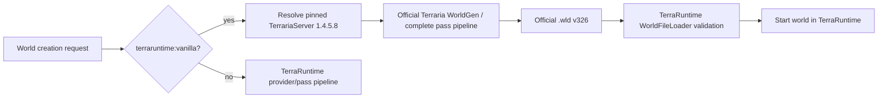

# Built-in vanilla world generation

[Русский](../ru/vanilla-world-generation.md) · [World generation](world-generation.md) · [Roadmap](../roadmap/gameplay-worldgen-extensibility.md)

`terraruntime:vanilla` now means **actual Terraria 1.4.5.8 world generation** at the executable startup surface. It no longer uses TerraRuntime's provisional seven-pass compatibility generator when a user creates a vanilla world.

## Execution model

For `terraruntime:vanilla`, TerraRuntime invokes the official dedicated server package for Terraria 1.4.5.8 and lets Terraria itself run the complete world-generation pipeline. The produced `.wld` is not accepted merely because the process created a file: TerraRuntime loads and validates the complete world first, including the header, tile section, chests, signs, NPC persistence, tile entities, pressure plates, town rooms, bestiary, creative powers and footer.

This is deliberately different from pretending that a small compatibility generator is vanilla. The clean-room pass implementation remains useful development scaffolding, but it is not the user-facing vanilla creation backend.

## Pinned official backend

On first exact-vanilla creation, TerraRuntime resolves TerrariaServer 1.4.5.8 in this order:

1. `TERRARUNTIME_TERRARIA_SERVER_1458` when the operator explicitly supplies a server executable;
2. the runtime cache under `data/official-terraria/1.4.5.8/server`;
3. otherwise the official dedicated-server archive is downloaded from `terraria.org`, extracted into that cache and the contained `TerrariaServer.exe` is checked against the pinned SHA-256 before use.

Windows x64 uses `TerrariaServer.exe`; Linux x64 uses `TerrariaServer.bin.x86_64` from the same verified package. TerraRuntime does not redistribute or embed TerrariaServer in its own binaries.

## World size, mode, evil and seed

Exact vanilla creation accepts the three canonical Terraria sizes only:

- Small: `4200x1200`;
- Medium: `6400x1800`;
- Large: `8400x2400`.

For ordinary seed text, TerraRuntime prefixes the seed with the selected size, difficulty and evil in Terraria's own seed format before handing it to the official generator. A complete prefixed Terraria seed supplied by the user is preserved verbatim.

Seed input is text for `terraruntime:vanilla`, so ordinary numeric seeds, special seeds and secret-seed text are handed to Terraria rather than approximated by TerraRuntime. Custom providers retain the existing unsigned 64-bit seed contract.

## Failure behavior

Exact vanilla generation is fail-closed. TerraRuntime refuses to overwrite an existing `.wld`, rejects non-canonical sizes, fails if the pinned official backend cannot be resolved, and refuses to start a generated world until `WorldFileLoader` accepts the complete file.

The dedicated-server generation process is temporary. Once the generated world is complete and validated, the official process is terminated and the normal TerraRuntime host starts the resulting world.

## Clean-room parity boundary

The repository still contains source-pinned pass catalogs, vanilla RNG semantics and clean-room world-generation work. The long-term goal remains a complete source-exact TerraRuntime-owned implementation of the Terraria 1.4.5.8 pipeline.

Until that 109-pass/reference-world parity is actually complete, the name `terraruntime:vanilla` is reserved for the exact official backend. This prevents a partially compatible generator from being presented to operators as a vanilla world.
