# Built-in vanilla world generation

[Русский](../ru/vanilla-world-generation.md) · [World generation](world-generation.md) · [Roadmap](../roadmap/gameplay-worldgen-extensibility.md)

TerraRuntime exposes two runtime-owned world generators through the normal world-generation provider contract:

- `terraruntime:flat` remains the small deterministic baseline used for contract and persistence testing;
- `terraruntime:vanilla` is the clean-room TerrariaServer 1.4.5.8 compatibility generator being migrated pass-by-pass toward source-backed behavior.

The generator identity does not change as migration advances. Hosts therefore select `terraruntime:vanilla`, while the runtime owns the exact pass composition behind it.

## Current ordinary-world pipeline

For canonical Terraria dimensions (`4200x1200`, `6400x1800`, `8400x2400`) and an ordinary seed, the production provider now owns a source-backed/source-shaped pipeline from Reset through Slush. The current generated plan has 40 entries because temporary compatibility barriers remain after the source-backed frontier.

```mermaid
flowchart LR
    Reset["Reset"] --> Terrain["Terrain"]
    Terrain --> Early["Dunes → caves → ice → grass → Jungle"]
    Early --> Mid["Mud Caves To Grass → Full Desert → micro-biomes"]
    Mid --> Resources["Dirt To Mud → Silt → Shinies → Webs"]
    Resources --> Deep["Underworld → Corruption/Crimson → Lakes → Slush"]
    Deep --> Ocean["compatibility ocean residual"]
    Ocean --> Compat["remaining cave/dungeon/secret compatibility frontier"]
    Compat --> Metadata["Metadata + fresh .wld v326"]
```

The second source-backed block contains these 14 passes in the pinned TerrariaServer 1.4.5.8 registration order:

`Mud Caves To Grass`, `Full Desert`, `Mushroom Patches`, `Marble`, `Granite`, `Floating Islands`, `Dirt To Mud`, `Silt`, `Shinies`, `Webs`, `Underworld`, `Corruption`, `Lakes`, `Slush`.

All 14 run with `WorldGenerationRngMode.VanillaSharedRng`; the same `VanillaUnifiedRandom1458` instance is advanced across the source-backed sequence. Reordering or independently reseeding these passes is therefore a compatibility bug, not a harmless implementation choice.

## Ownership transitions

### Ore generation

`Shinies` now owns pre-hardmode ore placement for ordinary canonical worlds. It consumes the ore variants selected by the Reset bootstrap (`CopperOre`, `IronOre`, `SilverOre`, `GoldOre`) and uses the source-shaped depth-band densities for those tiers plus Demonite/Crimtane. The old aggregate `terraria:1.4.5.8/Ores` node remains temporarily in the dependency graph as a no-op barrier so later compatibility dependencies do not need to be rewritten prematurely.

### Biomes

The old aggregate compatibility `Biomes` pass no longer owns the world interior after the new block. It is filtered to a temporary ocean-edge residual using the Reset-derived left/right beach bounds. Interior biome writes and underworld writes are discarded, preventing compatibility code from repainting source-backed Jungle, Desert, evil-biome and Underworld state.

### Direct candidate writes

Large generation passes operate directly on the unpublished contiguous `WorldTileStore` through the internal generation workspace. This avoids manufacturing dirty network/save work and avoids millions of interface-level copy/write round trips while the candidate is still private to generation.

## What the block currently generates

The new block provides deterministic, source-shaped implementations for jungle-grass spread, a full desert shell with underground chambers, mushroom patches, marble/granite micro-biomes, floating islands and sky lakes, deep jungle mud conversion, silt, Reset-selected pre-hardmode ores, cave webs, an ash/lava/hellstone underworld, Corruption or Crimson terrain/chasm conversion, underground lakes and slush deposits in the snow region.

These implementations intentionally preserve the official pass boundary and shared-RNG ownership even where an individual algorithm is not yet a method-for-method parity port. This is preferable to hiding unrelated approximations inside a single `Biomes` method, because later source probes can replace each pass independently without changing the public generator contract.

## Reset and Terrain

`terraria:1.4.5.8/Reset` owns the ordinary-world pre-Terrain RNG/bootstrap state: beach bounds, dungeon side/location, jungle and snow origins, pre-hardmode ore variants, tree/cave/background styles and other persisted initial values. `Terrain` consumes that state and publishes world-surface and rock-layer metadata. Later source-backed passes consume those values rather than reconstructing approximate copies.

## Special and secret seeds

`VanillaWorldSeedResolver1458` recognizes the Terraria 1.4.5.8 special-world families and the retained secret-seed phrases. The source-backed Reset/Terrain/early/mid path is currently gated to the ordinary seed profile. Special/secret worlds and noncanonical synthetic dimensions deliberately retain the compatibility plan until the corresponding branches have been source-ported. They must not silently consume ordinary-world RNG as a substitute.

## Verification

`terraria-vanilla-generated-world-acceptance.yml` is the production gate for this work. It builds TerraRuntime, runs the focused world-generation contracts, generates a real canonical small `terraruntime:vanilla` world, validates the `.wld` with the TerraRuntime loader, then boots the pinned official TerrariaServer 1.4.5.8 with that generated file and requires the server listener to open.

The separate `terraruntime:flat` acceptance path remains unchanged.

## Parity boundary

`terraruntime:vanilla` is not yet a reference-world or byte-identical clone of Terraria generation. The current source-backed frontier ends at `Slush`.

Known remaining differences inside the new block include exact Underground Desert internals, floating-island structures, Underworld houses, exact Corruption/Crimson orb/heart/altar topology, and exact per-method RNG consumption inside several source-shaped passes. After `Slush`, dungeon, later cave/ocean passes, structures, liquids, chests, vegetation, decoration, cleanup, and special-seed branches still require migration against the pinned 109-pass 1.4.5.8 catalog.

The next natural migration boundary starts with the Dungeon-era segment after `Slush`, rather than adding more behavior back into the compatibility aggregates.
