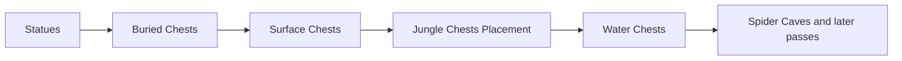

# Vanilla world generation: persistent chest placement

[Русский](../ru/vanilla-worldgen-chest-placement.md) · [Post-settle stage](vanilla-worldgen-post-settle.md)

`terraruntime:vanilla` now continues the ordinary Terraria 1.4.5.8 migration through the four chest placement passes immediately after `Statues`.

## Chest metadata is part of generation

Fresh world generation previously encoded an empty chest section unconditionally. That was safe only while no generator emitted chest tiles. The generation workspace now owns a dense `WorldChest` registry alongside its unpublished `WorldTileStore`.

A chest is registered only after its top-left tile is a valid chest anchor. Slot ids are assigned densely in generation order because Terraria does not persist a chest slot id: `.wld` file order becomes the runtime/network slot identity after load. Duplicate coordinates, invalid item states and oversized item arrays fail closed.

`RuntimeWorldCreationPersistencePipeline` captures that detached chest snapshot and passes it to `WorldFileFreshComposer326`. The composer uses the normal `WorldFileChestEncoder` and validates the complete image by loading it back through `WorldFileLoader`. Tile frames and the chest side table therefore cross persistence as one candidate transaction.

## Implemented passes

- `Buried Chests` places Gold Chest style `1` in underground/cavern openings.
- `Surface Chests` places Wooden Chest style `0` on eligible surface floors outside tight spawn/dungeon exclusions.
- `Jungle Chests Placement` places Ivy Chest style `10` in underground jungle material.
- `Water Chests` places Water Chest style `17` in submerged chambers with a solid floor.

All four use `Containers` tile `21`, the existing source-backed 2 × 2 chest object geometry, complete frame coordinates, spacing from other frame-important objects, and matching `WorldChest` records.

The Ivy Chest and Water Chest style identities were cross-checked against the official Terraria Wiki: `Containers` style `10` is Ivy Chest and style `17` is Water Chest.

## Loot boundary

This block deliberately starts generated chests with zero persisted item slots. The important invariant being established here is structural ownership: every generated chest tile object has exactly one matching `.wld` chest record. Vanilla chest loot tables, stack rolls, prefixes and progression-dependent uniqueness are the next loot-parity layer and must not be approximated by stuffing arbitrary items into otherwise-correct chests.

## Acceptance

Production acceptance still requires:

1. the exact source-order graph contract;
2. generated chest registry invariants;
3. full `.wld` encode/decode through `TerraRuntime.WorldVerify`;
4. successful boot by the pinned official TerrariaServer 1.4.5.8 executable.

This proves persistent chest topology and file validity. It does not yet claim exact vanilla chest counts, coordinates, RNG consumption or loot parity.
