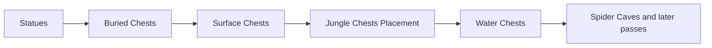

# Vanilla world generation: persistent chest placement

[Русский](../ru/vanilla-worldgen-chest-placement.md) · [Post-settle stage](vanilla-worldgen-post-settle.md)

`terraruntime:vanilla` now continues the ordinary Terraria 1.4.5.8 migration through the four chest placement passes immediately after `Statues`.

## Chest metadata is part of generation

Fresh world generation previously encoded an empty chest section unconditionally. That was safe only while no generator emitted chest tiles. The generation workspace now owns a dense `WorldChest` registry alongside its unpublished `WorldTileStore`.

A chest is registered only after its top-left tile is a valid chest anchor. Slot ids are assigned densely in generation order because Terraria does not persist a chest slot id: `.wld` file order becomes the runtime/network slot identity after load. Duplicate coordinates, invalid item states and oversized item arrays fail closed.

`RuntimeWorldCreationPersistencePipeline` captures that detached chest snapshot and passes it to `WorldFileFreshComposer326`. The composer uses the normal `WorldFileChestEncoder` and validates the complete image by loading it back through `WorldFileLoader`. Tile frames and the chest side table therefore cross persistence as one candidate transaction.

## Implemented passes

- `Buried Chests` places Gold Chest style `1` in underground/cavern openings, then runs the ordinary-seed structural `Underground Houses and Buried Chests` slice. The latter draws the Terraria 1.4.5.8 area-scaled `35..40` cave-house budget and the area-scaled fixed `2` additional-desert-house budget in source order. It discovers one-to-three rooms, scores the Wood/Ice/Desert/Jungle/Mushroom/Granite/Marble palette from surrounding tiles, protects accepted rooms from overlap, and emits palette shells, unsafe interior walls, stairs/platform exits, doors, support beams and the source-guaranteed persistent chest.
- `Surface Chests` places Wooden Chest style `0` on eligible surface floors outside tight spawn/dungeon exclusions.
- `Jungle Chests Placement` places Ivy Chest style `10` in underground jungle material.
- `Water Chests` places Water Chest style `17` in submerged chambers with a solid floor.

All four use `Containers` tile `21`, the existing source-backed 2 × 2 chest object geometry, complete frame coordinates, spacing from other frame-important objects, and matching `WorldChest` records.

Cave-house decorative furniture and aging are still unported. They remain absent instead of being emitted as unframed single tiles. The additional desert-house path uses the underground-desert region recorded by the existing source-backed desert pass; a missing region is fail-closed and cannot redirect those houses into an arbitrary biome.

The Ivy Chest and Water Chest style identities were cross-checked against the official Terraria Wiki: `Containers` style `10` is Ivy Chest and style `17` is Water Chest.

## Loot ownership

Ordinary generated chests now receive source-backed default-world loot at placement time, in the same generation phase that still knows the chest family and depth branch. This matters because `WorldGen.AddBuriedChest` consumes the shared `genRand` stream while placing and filling the container; a later cleanup pass cannot reconstruct that ordering without changing downstream world generation.

The current clean-room port covers the default-world surface, underground, cavern, Underworld/Shadow, jungle and water branches used by these four passes, including their primary-item families, stack ranges and the stateful hell/jungle/water cycles. The previous late `FinalCleanup` chest filler has been removed rather than kept as a fallback. Prefix generation remains outside this slice because Terraria routes `Prefix(-1)` through item-prefix RNG rather than the world-generation `genRand` surface.

## Acceptance

Production acceptance still requires:

1. the exact source-order graph contract;
2. generated chest registry invariants;
3. full `.wld` encode/decode through `TerraRuntime.WorldVerify`;
4. successful boot by the pinned official TerrariaServer 1.4.5.8 executable.

Acceptance additionally verifies that canonical Small worlds contain non-empty loot for every generated chest, valid vanilla item ids, the expected primary families for Wooden/Gold/Shadow/Ivy/Water chest styles, and a non-trivial secondary-loot volume. This still does not claim bit-identical chest coordinates or complete parity for chest families owned by world-generation passes outside this four-pass slice.
