# Vanilla 1.4.5.8 dungeon-stage world generation

Whole-Dungeon verification (2026-09-09): all24 complete ordinary Dungeon-pass comparisons against the unmodified TerrariaServer1.4.5.8 executable match every normalized cell, ordered chest contents/prefixes, Old Man anchor and next shared RNG value. This covers Legacy, Dome and Tower, both sides and three generation seeds on an independently specified flat Small input. Sixteen retained same-real-prefix cases also match across all canonical sizes, entrance types and both evils;14 extra Small seeds pass too. This independently verifies the Dungeon pass on those inputs, not generation of the preceding prefix or every retained global field.

The existing pipeline now includes furniture, ordinary early pits, dart traps, paintings, banners and late Gothic doors. Source comparisons also cover 504 pit-protection interactions, 108 dart-trap fixtures (including cracked anchors), 72 late-door passes and 144 chandelier framing/destruction cases. Ordinary entrance stairs are enabled in all three buildings. Corrected official fixture bootstrap retains real crawler bounds and generation-time cracked-brick solidity; 540 building/platform goldens were recaptured from the original executable.

Whole-pass comparison exposed discarded entrance-settings RNG, missing stairs, cracked-brick wall-fill/LOS/chest-support rules, post-trap neighbor framing and mutable late-door bounds. Chandelier destruction during subsequent banner framing must also consume the source dust RNG even though generation suppresses dust presentation. These are isolated candidate-generation changes, not alternate live authorities. `VanillaWorldCanHit.HasLineOfSight` now accepts `crackedBricksSolid` (default `true`); Dungeon lighting explicitly passes `false`, leaving normal live queries unchanged. Loading-liquid chair handling validates the source 40-pixel atlas and rejects incoherent objects before mutation.

Local acceptance: Release8048/8048, zero build warnings/errors, WindowsNativeAOT and all six smokes passed. A fresh Small/Classic/Corruption1458 world loaded in both servers, which were then stopped. Same-reference budgets pass unchanged: tile L1 `0.125242`, wall L1 `0.388221`, Dungeon anchor delta `(0,0)`; nonzero world differences remain. Unknown base-wall profiles reject before RNG/mutation; all3 old-path regressions fail and the restored27 whole-pass/admission tests pass. Final full suite took $197.974\,\mathrm{s}$; details are in agent memory. Stage36 is bounded `R16`: **40P + 32C = 72 unfinished rows**, while **31 E9 / 279 independent multi-stage checkpoints** is unchanged. LinuxNativeAOT, real-client playthrough, special seeds and complete-world equality remain unverified. Earlier acceptance below is historical.

Final layout-origin gates: **Release 5586/5586**, zero warnings/errors, Windows NativeAOT plus six smokes, fresh dual-server loading and documentation/source checks pass. Whole-world equality remains open; the evidence and remaining boundaries below are intentionally narrower.

Fresh-map acceptance for the layout-origin batch: Windows NativeAOT and all six smokes pass. A new Small/Classic/Corruption `1458` candidate loads in TerraRuntime and the official server. Dungeon anchor delta is now `(0,0)`, previously `(-3,-3)`; unchanged comparison budgets pass, but tile L1 `0.134359` / wall L1 `0.433354` still prove that the world is not equal. This seed checks ordinary Legacy, not complete Dome/Tower integration. The source-contract CI now checks the real graph, room and hall owners; missing RNG handoffs fail its regression. Linux NativeAOT and real-client playthrough remain unverified.

Layout-origin update (2026-09-09): the existing graph now runs its layout loop through `GenerateLayout`. For a precalculated entrance it starts at `(entranceX - 10 + Next(20), entranceY + 30)`, after crawler strength/step draws and before component-settings seeds. Ordinary layouts consume no extra draw. Generated rooms retain source `InnerBounds`, including the ten-tile metadata clamp; painting bounds remain separate. The connection starts at the center/top of the room with the smallest interior top, retaining the first room on ties. Missing room metadata is an invariant failure, never an outer-shell fallback.

Eighteen independent calls to the official `LegacyDungeonLayoutProvider.LegacyDungeonLayout` match every normalized cell, next shared RNG, final cursor/direction and ordered room geometry for ordinary and precalculated origins, three palettes/seeds and zero/20/35 layout steps. Sixty-three existing official room fixtures also match interior metadata; nine edge/interior goldens are retained. All 574 Dungeon checks pass; restoring the old layout origin and shell-based connection fails 20 of the 22 new layout tests. Final integration gates are recorded in agent memory.

This supersedes the layout-origin debt in historical paragraphs below, not complete Dungeon parity: Dome/Tower **buildings**, remaining crawler/setup/feature ordering, and real full-prefix equality still need verification. Dungeon stays `C`; the world ledger remains **40P + 33C = 73 unfinished rows, 31 E9 / 279 checkpoints**.

Final connection-batch gates: Release **5501/5501** ($188.865\,\mathrm{s}$), zero build warnings/errors, Windows NativeAOT and all six smokes pass. A fresh Small/Classic/Corruption1458 world loads in both servers and is byte-identical to the prior Legacy-building candidate; comparison budgets pass unchanged. That seed exercises ordinary Legacy, not Dome/Tower integration. Linux NativeAOT, real-client playthrough and complete-world equality remain unverified.

Precalculated connection update (2026-09-09): the existing graph now uses `DungeonEntranceRoute1458` and the same `DungeonLegacyEntranceHall1458` brush for Dome/Tower entrance connections. The source countdown, double-precision interpolation, endpoint-derived brush length, shared seed draws and 99-attempt ceiling replace the invented short straight segments and final catch-up segment. Ordered hallway-platform records retain `InAHallway` and `PlacePotsChance`; the existing feature owner consumes their positions before the building and room candidates. Its placement rules do not yet consume all source metadata.

Fifty-four complete-route comparisons against the actual official `MakeDungeon_GenerateNextEntranceHall_Precalculated` match every normalized cell, each step's cursor/bounds/countdown, ordered platform metadata and next shared RNG. Fractional, horizontal and source-margin cases are included. All 59 retained tests and 631 affected tests pass; forcing the brush to use `OverrideSteps` instead of endpoint distance fails 54 tests. This is component evidence, not complete Dungeon parity. Dome/Tower **buildings**, the precalculated layout's initial position/RNG draw, top-room selection from `InnerBounds`, decoration and real-prefix equality remain open. Audit counts are unchanged. Earlier paragraphs describe historical batches; current final gates are recorded in agent memory.

Final local acceptance for the Legacy building batch: Release **5442/5442** ($182.143\,\mathrm{s}$), zero build warnings/errors; Windows NativeAOT, all six smokes and fresh Small/Classic/Corruption1458 loading in both TerraRuntime and the official server pass. Same-reference structural budgets pass unchanged: tile L1 `0.134182`, wall L1 `0.426197`, dungeon delta `(-3,-3)` instead of `(-41,-3)`. This is not whole-world equality; Linux NativeAOT and real-client playthrough remain unverified.

Legacy surface-building update (2026-09-09): the graph's existing entrance renderer now calls `DungeonLegacyEntrance1458` for ordinary Legacy settings. The two chambers, buttresses, turrets, battlements, window-wall pillars and connecting style-13 door replace the rectangular approximation. The source Old Man point becomes the existing graph/metadata/NPC anchor; the entrance platform candidate is retained before later room/hall candidates. The Corruption and entrance callers share the same `GenerationWallPlacement1458` retained framing effects. No live tile/NPC authority or generation plan is replaced.

Independent `LegacyDungeonEntrance.GenerateEntrance` calls in the official executable (including `CurrentDungeon=0` NPC creation) match 108 fixtures: six inputs, three palettes, three seeds and both world sides. Tests compare every normalized cell field, next shared RNG, Old Man point, component bounds and platform candidate. The old rectangle fails 111 of 112 initial retained checks; the extra check covers candidate order/deduplication. A further test rejects unknown entrance kinds. Whole-Dungeon parity is still open: Dome/Tower buildings, precalculated connections, layout and decoration remain unverified. The audit row remains `C`, not `E9`; global counts do not change. Final acceptance for this batch is recorded in agent memory.

The generated Old Man persistence record now converts the source bottom-center into top-left position, using the source `NPC.SetDefaults(37)` hitbox of $18\times40\,\mathrm{px}$. `WorldFile` saves position, not the `NPC.NewNPC` input anchor. The full-world regression fails with the old record and passes with this correction. Home tile coordinates and existing NPC lifecycle ownership remain unchanged. The separate Guide pass still needs its own complete source-floor/naming/RNG audit; this is not a claim of all starting-NPC parity.

Surface-material batch (2026-09-09): `Gems`, `Gravitating Sand` and `Clean Up Dirt` match 54 independent ordinary official-delegate fixtures: two widths, three inputs and three RNG seeds. All normalized cell fields and the next shared RNG value are checked, including fractional gem counts, actuation/slopes, liquids, walls and desert-boundary columns. The old implementation fails 51 of 58 retained checks; the replacement passes all 58 and the affected 473-test set. Final Release **5329/5329**, zero build warnings/errors, Windows NativeAOT, six smokes and fresh Small/Classic/Corruption1458 loading in both servers pass. Same-reference budgets remain unchanged: tile L1 `0.138047`, wall L1 `0.415631`. Whole-prefix equality through Dungeon, final-world equality, Linux NativeAOT and client playthrough remain unproven; these three audit rows are `C`, not `E9`. Earlier acceptance paragraphs below are historical.

Entrance update (2026-09-09, supersedes the entrance status in the historical room/hall paragraph below): the existing renderer now uses `DungeonLegacyEntranceHall1458` and the shared, narrowly admitted `SmallTerrainRunner1458` air opening. Ninety official component fixtures match all normalized cells, cursor, surface flag and remaining shared RNG. Retained tests include a surface-crossing fixture that detects removal of velocity damping (six failures under the negative control). Full Release is **5261/5262**, with only the previously observed empty-tick allocation test failing at 7960 bytes; no collections occurred during that measurement. No new NativeAOT/fresh-world acceptance or whole-Dungeon parity is claimed. Dungeon remains P and the global stage count is unchanged.

Room/hall component validation (2026-09-09): the existing graph now uses `DungeonLegacyRoom1458` / `DungeonLegacyHall1458`, sharing its unchanged component RNG and catalog-backed cell operations. Independent official fixtures match all normalized fields:63 rooms and135 halls across three palettes, including existing walls/rooms, flags, direction retries and depth stops; hall endpoints/directions match too. Negative checks fail84 cavity-reset and6 final-brush cases. Full-world startup exposed a missing tileSolidTop exclusion in smoothing and a loading platform/book cascade; both were fixed through their existing owners (negative smoothing7, focused345/345). Standard Release5164/5164 passes183.459s, build0/0, Windows NativeAOT30353920bytes, six smokes and fresh Small/Classic/Corruption1458 loading in both servers pass. Same-reference budgets pass at tile L1 .186698 / wall L1 .415579. Earlier empty-tick allocation failures remain unexplained; this green run is not proof their instability is fixed. Whole Dungeon remains P: entrance geometry, layout setup and feature parity are still open.18 official entrance kernels are prepared; production entrance remains unchanged. No full-world equality, Linux NativeAOT or client playthrough claimed.

`terraruntime:vanilla` now advances the source-backed ordinary-world pipeline through the pinned TerrariaServer 1.4.5.8 `Pyramids` pass. The flat generator remains a separate `terraruntime:flat` profile.

## Covered source-order segment

For Terraria's canonical world dimensions $4200 \times 1200$, $6400 \times 1800$, and $8400 \times 2400$, ordinary seeds now register the next ten pinned passes after `Slush`:

1. `Dual Dungeons Dither Snake`
2. `Dungeon`
3. `Mountain Caves`
4. `Beaches`
5. `Gems`
6. `Gravitating Sand`
7. `Create Ocean Caves`
8. `Shimmer`
9. `Clean Up Dirt`
10. `Pyramids`

The production plan now contains 49 runtime entries. That count includes runtime migration identities such as `Reset`, `TerrainLayers`, and compatibility barriers; it is not a claim that Terraria itself has 49 passes.

```mermaid
graph LR
    S[Slush] --> B[compat Biomes barrier]
    B --> C[compat Caves barrier]
    C --> O[Shinies-owned Ores barrier]
    O --> D0[Dual Dungeons Dither Snake]
    D0 --> D1[Dungeon]
    D1 --> MC[Mountain Caves]
    MC --> BE[Beaches]
    BE --> G[Gems]
    G --> GS[Gravitating Sand]
    GS --> OC[Create Ocean Caves]
    OC --> SH[Shimmer]
    SH --> CD[Clean Up Dirt]
    CD --> P[Pyramids]
    P --> SS[ordinary SecretSeeds barrier]
    SS --> M[compat Metadata]
```

The compatibility residual/barrier entries do not consume Terraria's shared `UnifiedRandom` stream. The ten newly registered source-order passes do use `VanillaSharedRng`, except where the corresponding operation is deterministic and therefore consumes no values.

## Dungeon graph and RNG ownership

The source-backed dungeon stage no longer invokes the old aggregate compatibility dungeon generator for canonical ordinary worlds. Dungeon placement starts from `WorldGen.Reset` state already captured in `VanillaWorldGenerationBootstrapState1458`:

- `DungeonSide` determines the side chosen during Reset;
- `DungeonLocation` supplies the horizontal anchor;
- the entrance search uses the source countdown, the strict 380-tile beach boundary, downward surface exit, and exact cloud-set rejection instead of choosing an already generated sky island;
- the generated dungeon publishes the accepted anchor into world metadata and registers Old Man NPC 37 at the source bottom-center position with that home;
- dungeon brick/wall/cracked-brick palettes are selected during `Dunes`, where Terraria initializes dungeon generation;
- the `Dungeon` pass consumes the pinned unique shelf/lantern selections, entrance-hall mode, start-depth adjustment,
  entrance strengths and width-scaled layout-step count;
- `LegacyDungeonLayoutProvider` topology is represented as typed starting-room, room, hall, entrance-hall and entrance
  components instead of a coordinate-driven vertical shaft;
- the shared `UnifiedRandom` owns graph decisions and component seeds, including the source's unconditional
  `Next(3)` room roll caused by its bitwise `&`; every room and hall owns an isolated
  `UnifiedRandom(RandomSeed)` stream for its geometry;
- dungeon brick variants use the verified vanilla tile identities 41, 43, and 44 and their matching unsafe walls.

This closes the former shaft/periodic-room approximation. It is still a clean-room structural graph port, not a claim
of byte-for-byte dungeon equality. Exact collision/protection interactions between overlapping rooms, cracked-brick
distribution, doors/platforms, furniture, locked and biome chests, traps, paintings, banners, and every global dungeon
feature remain future parity work.

## Mountain Caves and existing world objects

For ordinary seeds, `MountainCaves` now follows the pinned `WorldGen.Mountinater` behavior: it raises dirt mounds in inactive cells, preserving every existing active tile. The previous downward tunnel approximation could erase dungeon chests and made Small seed `42` fail finalization. Candidate selection now uses the central half of the world, the source spawn and mountain spacing exclusions, and the source sand-family exclusion. Brush strength, step count and movement consume the shared RNG in the source order.

Solid placement immediately clears displaced liquid through the existing tile placement helper; the runtime liquid compactor does not process liquid trapped in solid cells. This is a representation normalization, not a claim of identical intermediate liquid states. A regression checks registered chest anchors after every generation pass and fails on the old carving implementation. Exact terrain equality and secret-seed mountain variants remain outside this verified scope.

Local Windows NativeAOT verification covers generation and reload for Small, Medium and Large with seeds `1`, `42` and `8675309`. The pinned official server also loads all three sizes for `8675309`. Small passes the existing reference-world structural budgets, but contains `104` chests versus the reference's `178`; this evidence does not establish full vanilla parity. Linux NativeAOT execution remains a CI check and was not exercised in this Windows workspace.

## Beaches and ocean caves

`Beaches` uses the Reset-owned `LeftBeachEnd` and `RightBeachStart` boundaries instead of inventing new edge widths. It shapes sand and the waterline at both world edges. `Create Ocean Caves` then carves cave entrances from those same beach regions.

The older aggregate `Biomes` identity remains only as a no-write compatibility barrier. `Beaches` owns the ocean body at the pinned pass position; the barrier cannot advance shared vanilla RNG or repaint any biome.

## Gems, gravity, Shimmer, and pyramids

`Gems` runs six ordered gem series (`63` through `68`) on the existing shared `SmallTerrainRunner1458`. Each candidate gets three attempts to find active stone; active non-stone cannot be replaced by gems. Its two subsequent sand-edge scans preserve metadata/liquids, skip columns strictly inside the retained underground desert, and move only activity/type. Missing desert bounds fail before mutation or RNG use.

`Gravitating Sand` is a generation-only bottom-up **gap fill**, not downward block movement. Below a surface falling-material cell it fills up to the previously encountered solid/sloped cell, using the complete eleven-type `TileID.Sets.Falling` set. It excludes actuated cells, platforms, cracked dungeon bricks and rolling cactus under inherited generation solidity. `Tile.ResetToType` clears headers, paint, slopes, frames and liquid but preserves wall identity. It consumes no RNG and does **not** implement live falling-block physics.

`Clean Up Dirt` changes background walls only. Its forward/reverse scans preserve the source's asymmetric wall/sand gates, neighbor order and conditional RNG draws; reopening requires a verified empty corridor. Ground tiles are never converted or deleted.

`Shimmer` creates an Aether-style underground cavity on the same side of the world as the Reset-selected Jungle and fills its pool using runtime liquid kind `Shimmer`. This is source-shaped placement; exact Aether geometry and all decorative blocks are still pending.

`Pyramids` first discovers an actual generated desert band from tile state. It may then place zero, one, or two sandstone-brick structures depending on world width and the shared RNG stream. Pyramid furniture and loot are intentionally not fabricated before the corresponding world-object/chest passes are ported.

## Compatibility barriers

Two old aggregates are now explicitly prevented from corrupting parity:

- `Caves` is a no-op `IsolatedDeterministic` barrier because the early source-backed pipeline already owns the cave families before the second Jungle pass;
- ordinary `SecretSeeds` is a no-op isolated barrier and is re-anchored after `Pyramids`.

`Ores` was already a no-op barrier after `Shinies` became the owner of pre-hardmode ore generation.

## Acceptance

The Dungeon graph source workflow follows the current `TerraRuntime.WorldGeneration/Generation/Vanilla/DungeonGraphGenerator1458.cs` owner and `DungeonGenerationCatalog1458` names. Its source reader accepts UTF-8 and BOM-marked UTF-16 decompiler output; source/RNG checks remain mandatory. A workflow-path regression checks that the referenced production files exist. This repairs verification after the ownership move; it does not add new Dungeon geometry.

The vanilla acceptance workflow builds TerraRuntime, runs only the focused world-generation contract classes, generates a canonical small `terraruntime:vanilla` world, validates it with `TerraRuntime.WorldVerify`, and boots pinned TerrariaServer 1.4.5.8 against the resulting `.wld`.

A green official-server acceptance proves that the generated world file is structurally loadable by the pinned server. It does not claim reference-seed terrain identity or complete vanilla world-generation parity.

The large `4200x1200` seed-`1458` differential was rerun after the entrance fix. Against the pinned official 1.4.5.8 world it passes all structural budgets: spawn delta `(1,0)`, dungeon delta `(69,6)`, surface and rock-layer deltas `0`, silhouette NMAE `0.021349` / p95 `0.13` / correlation `0.606524`, and `181 -> 98` chests. Those remaining differences are explicit evidence that this is not byte parity or complete vanilla worldgen.

The canonical generated-world contract additionally requires at least three rooms, a width-scaled hall count,
horizontal and vertical halls, a non-shaft graph span, and a connected surface entrance. The fail-closed finalizer
repeats those checks before accepting a candidate. `tools/ci/probe_worldgen_dungeon_graph.py` independently verifies
the layout decisions, component seed handoff, room/hall strength and step ranges, and isolated RNG construction against
the pinned 1.4.5.8 decompile. It also checks production handoff order from candidate discovery through spikes,
doors, wall variants and platforms, including the unpadded early sampling area. Full-cell/RNG fixture evidence and
the remaining complete-crawler parity limits are tracked in the [current pass audit](vanilla-worldgen-pass-audit.md).

## Next source boundary

The next pinned segment begins after `Pyramids` with `Dirt Rock Wall Runner`, then continues through `Living Trees`, `Wood Tree Walls`, `Altars`, `Wet Jungle`, `Jungle Temple`, `Hives`, `Jungle Chests`, and the first liquid-settling phase.
