# Vanilla 1.4.5.8 dungeon-stage world generation

`terraruntime:vanilla` now advances the source-backed ordinary-world pipeline through the pinned TerrariaServer 1.4.5.8 `Pyramids` pass. The flat generator remains a separate `terraruntime:flat` profile.

## Covered source-order segment

For Terraria's canonical world dimensions $4200 \times 1200$, $6400 \times 1800$, and $8400 \times 2400$, ordinary seeds now register the next ten pinned passes after `Slush`:

1. `Dual Dungeons Dither Snake`
2. `Dungeon`
3. `Mountain Caves`
4. `Beaches`
5. `Gems`
6. `Gravitating Sand`
7. `Create Ocean Caves`
8. `Shimmer`
9. `Clean Up Dirt`
10. `Pyramids`

The production plan now contains 49 runtime entries. That count includes runtime migration identities such as `Reset`, `TerrainLayers`, and compatibility barriers; it is not a claim that Terraria itself has 49 passes.

```mermaid
graph LR
    S[Slush] --> B[compat Biomes barrier]
    B --> C[compat Caves barrier]
    C --> O[Shinies-owned Ores barrier]
    O --> D0[Dual Dungeons Dither Snake]
    D0 --> D1[Dungeon]
    D1 --> MC[Mountain Caves]
    MC --> BE[Beaches]
    BE --> G[Gems]
    G --> GS[Gravitating Sand]
    GS --> OC[Create Ocean Caves]
    OC --> SH[Shimmer]
    SH --> CD[Clean Up Dirt]
    CD --> P[Pyramids]
    P --> SS[ordinary SecretSeeds barrier]
    SS --> M[compat Metadata]
```

The compatibility residual/barrier entries do not consume Terraria's shared `UnifiedRandom` stream. The ten newly registered source-order passes do use `VanillaSharedRng`, except where the corresponding operation is deterministic and therefore consumes no values.

## Dungeon ownership

The source-backed dungeon stage no longer invokes the old aggregate compatibility dungeon generator for canonical ordinary worlds. Dungeon placement starts from `WorldGen.Reset` state already captured in `VanillaWorldGenerationBootstrapState1458`:

- `DungeonSide` determines the side chosen during Reset;
- `DungeonLocation` supplies the horizontal anchor;
- the generated dungeon publishes that anchor into world metadata;
- dungeon brick variants use the verified vanilla tile identities 41, 43, and 44.

This is still a clean-room source-shaped implementation, not byte-for-byte `WorldGen.Dungeon` parity. Room topology, furniture, locked chests, biome keys, traps, and dungeon wall-family variation remain future parity work.

## Beaches and ocean caves

`Beaches` uses the Reset-owned `LeftBeachEnd` and `RightBeachStart` boundaries instead of inventing new edge widths. It shapes sand and the waterline at both world edges. `Create Ocean Caves` then carves cave entrances from those same beach regions.

The older aggregate `Biomes` identity remains only as a no-write compatibility barrier. `Beaches` owns the ocean body at the pinned pass position; the barrier cannot advance shared vanilla RNG or repaint any biome.

## Gems, gravity, Shimmer, and pyramids

`Gems` places the vanilla gem tile family 63 through 68 in deep natural stone regions. `Gravitating Sand` settles sand, evil sand, silt, and slush without consuming random values.

`Shimmer` creates an Aether-style underground cavity on the same side of the world as the Reset-selected Jungle and fills its pool using runtime liquid kind `Shimmer`. This is source-shaped placement; exact Aether geometry and all decorative blocks are still pending.

`Pyramids` first discovers an actual generated desert band from tile state. It may then place zero, one, or two sandstone-brick structures depending on world width and the shared RNG stream. Pyramid furniture and loot are intentionally not fabricated before the corresponding world-object/chest passes are ported.

## Compatibility barriers

Two old aggregates are now explicitly prevented from corrupting parity:

- `Caves` is a no-op `IsolatedDeterministic` barrier because the early source-backed pipeline already owns the cave families before the second Jungle pass;
- ordinary `SecretSeeds` is a no-op isolated barrier and is re-anchored after `Pyramids`.

`Ores` was already a no-op barrier after `Shinies` became the owner of pre-hardmode ore generation.

## Acceptance

The vanilla acceptance workflow builds TerraRuntime, runs only the focused world-generation contract classes, generates a canonical small `terraruntime:vanilla` world, validates it with `TerraRuntime.WorldVerify`, and boots pinned TerrariaServer 1.4.5.8 against the resulting `.wld`.

A green official-server acceptance proves that the generated world file is structurally loadable by the pinned server. It does not claim reference-seed terrain identity or complete vanilla world-generation parity.

## Next source boundary

The next pinned segment begins after `Pyramids` with `Dirt Rock Wall Runner`, then continues through `Living Trees`, `Wood Tree Walls`, `Altars`, `Wet Jungle`, `Jungle Temple`, `Hives`, `Jungle Chests`, and the first liquid-settling phase.
