# Vanilla world generation: jungle structures and first liquid settle

[Русский](../ru/vanilla-worldgen-jungle-structures.md) · [Dungeon stage](vanilla-worldgen-dungeon-stage.md)

`terraruntime:vanilla` now continues the ordinary Terraria 1.4.5.8 migration from `Pyramids` through the first `Settle Liquids` pass. The built-in `terraruntime:flat` generator is unchanged.

## Production order

```mermaid
graph LR
    P[Pyramids] --> D[Dirt Rock Wall Runner]
    D --> LT[Living Trees]
    LT --> W[Wood Tree Walls]
    W --> A[Altars]
    A --> J[Wet Jungle]
    J --> T[Jungle Temple]
    T --> H[Hives]
    H --> C[Jungle Chests]
    C --> S[Settle Liquids]
    S --> N[remaining vanilla migration]
```

The nine pass names and their order are pinned by `VanillaWorldGenerationPassCatalog1458` from the verified TerrariaServer 1.4.5.8 pass registration sequence.

## Implemented behavior

### Dirt Rock Wall Runner

The pass populates empty underground cave cells adjacent to natural terrain with dirt/rock unsafe background walls. It is intentionally bounded and uses the shared vanilla RNG stream.

### Living Trees and Wood Tree Walls

Canonical worlds receive a size-scaled number of living trees outside spawn, jungle, snow and dungeon exclusion bands. Trees use vanilla tile identities `Living Wood = 191` and `Leaf Block = 192`. The follow-up wall pass fills natural living-wood background state without consuming additional RNG.

### Altars

The pass places framed 3 × 2 Demon/Crimson Altar objects using tile identity `26`. Crimson worlds use the alternate frame strip. Placement requires a clear object volume and a solid floor so the generator does not manufacture floating frame-important content.

### Wet Jungle

Deep jungle space receives bounded water and honey basins. Carved cells get natural jungle walls, while the basin perimeter is converted to mud. This stage is intentionally before temple/hive placement so later structures can reject overlapping locations.

### Jungle Temple

A source-shaped temple shell is generated around the Reset-provided jungle origin using Lihzahrd Brick tile `226` and unsafe Lihzahrd Brick wall `87`. The current port provides the structure envelope, internal floors and a connected vertical corridor. Later passes still own detailed temple decoration, traps and the Lihzahrd Altar.

### Hives

Hives use tile `225`, unsafe Hive wall `86`, and honey liquid. Candidate hives reject the generated temple bounds.

### Jungle Chests

This early pass reserves separated chest candidate positions and prepares their floor pedestal. It deliberately does **not** place orphan chest tiles: Terraria has a later `Jungle Chests Placement` pass, and TerraRuntime must not create frame-important chest tiles without matching object/chest metadata.

### First Settle Liquids

The pass performs bounded downward settling sweeps over generated liquid cells. It preserves liquid kind, refuses to mix unlike liquids in one cell, and stops early when a sweep moves no material. This is generation-time settling, not the runtime liquid simulation subsystem.

## Compatibility barriers

Source-backed `Beaches` already owns beach/ocean geometry, so the old aggregate compatibility `Biomes` pass is now an isolated no-op dependency barrier. It performs no tile writes and does not consume the shared vanilla RNG stream. The existing `Caves`, `Ores` and ordinary `SecretSeeds` compatibility barriers remain isolated for the same reason.

## Current parity boundary

The generated `.wld` remains required to pass three acceptance layers:

1. focused world-generation graph/contracts;
2. `TerraRuntime.WorldVerify` parsing and metadata validation;
3. boot by the pinned official TerrariaServer 1.4.5.8 executable.

Passing those gates proves that the generated world is structurally valid and loadable. It does not claim byte-identical vanilla generation. Exact RNG consumption and geometry for several passes in this segment remain migration targets, especially Living Tree branching, temple layout, hive shaping and the liquid settling algorithm.

The next source-order block starts at `Remove Water From Sand` and proceeds through the post-settle oasis/shell/smoothing/content placement stages.
