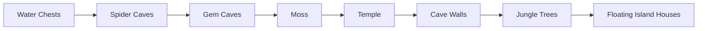

# Vanilla world generation: late structures

[Русский](../ru/vanilla-worldgen-late-structures.md) · [Chest placement](vanilla-worldgen-chest-placement.md)

`terraruntime:vanilla` now advances the ordinary TerrariaServer 1.4.5.8 migration through the seven source-order passes after `Water Chests`.

The production canonical plan therefore grows from 71 to 78 entries while keeping the same `terraruntime:vanilla` generator identity and one shared vanilla RNG stream.

## Material identities

This stage uses version-pinned vanilla identities instead of synthetic replacement blocks:

- Spider Caves: Cobweb tile `51`, unsafe Spider Wall `62`;
- Gem Caves: gemstone stone tiles `63` through `68`;
- Moss: natural stone moss tiles `179` through `183`;
- Temple refinement: Lihzahrd Brick `226`, unsafe Lihzahrd Brick Wall `87`;
- Cave Walls: natural unsafe cave wall families, including `54` through `58`, `170`, and `171`;
- Jungle Trees: Living Mahogany `383` and Living Mahogany Leaf `384` blocks;
- Floating Island Houses: Sunplate Block `202`, Disc Wall `82`, and Skyware Chest `Containers` style `13`.

The source identities above were cross-checked against the official Terraria Wiki. Geometry and counts remain an incremental source-parity migration and are not advertised as byte-identical vanilla output yet.

## Persistent Skyware Chests

`Floating Island Houses` is the first pass in this stage that creates frame-important object metadata. A Skyware Chest is written only through the same generation-owned chest registry introduced by the previous block. The 2 × 2 `Containers` footprint and its `WorldChest` record are therefore persisted together rather than leaving an orphan tile object.

Loot remains deliberately separate. Unique Floating Island item ordering, secondary loot rolls, prefixes, and exact vanilla RNG consumption are not fabricated here.

## Pass responsibilities

`Spider Caves` carves bounded cavern pockets, assigns unsafe spider walls, and seeds cobwebs without cutting through temple, hive, granite, or marble structures. `Gem Caves` converts exposed cavern stone into the six vanilla gem-stone identities. `Moss` decorates exposed stone rather than replacing arbitrary biome material.

`Temple` is a refinement pass over the Lihzahrd structure created earlier. It discovers the existing brick bounds and fills missing unsafe interior wall cells adjacent to temple brick. `Cave Walls` adds bounded natural wall patches only to ordinary cave backgrounds.

`Jungle Trees` uses Living Mahogany block geometry so this intermediate implementation does not invent incomplete frame-important tree sprites. `Floating Island Houses` discovers cloud-supported sky islands, adds Sunplate/Disc-wall rooms, and couples each successfully placed Skyware Chest to persistent chest metadata.

## Acceptance boundary

The acceptance workflow requires the exact 78-entry source-order contract, the pinned catalog segment, a complete canonical small-world generation, round-trip validation through `WorldVerify`, and successful boot by the pinned official TerrariaServer 1.4.5.8 executable.

This proves ordering, persistence integrity, and a server-loadable `.wld`. Exact source counts, coordinates, room templates, tree sprite framing, and loot remain later parity work.
