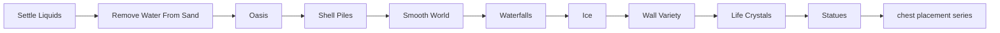

# Vanilla world generation: post-settle terrain and objects

[Русский](../ru/vanilla-worldgen-post-settle.md) · [Jungle structures](vanilla-worldgen-jungle-structures.md)

`terraruntime:vanilla` now continues the ordinary Terraria 1.4.5.8 migration from the first `Settle Liquids` pass through `Statues`. The separate `terraruntime:flat` generator is unchanged.

## Production order

The nine names and their order are pinned by `VanillaWorldGenerationPassCatalog1458` from the verified TerrariaServer 1.4.5.8 registration sequence.

## Implemented slice

- `Remove Water From Sand` clears liquid embedded in active Sand, Hardened Sand and Sandstone cells after the first settling stage.
- `Oasis` searches valid inland sand surfaces outside spawn, jungle, snow and dungeon exclusion bands, carves a water basin and reshapes its banks.
- `Shell Piles` places vanilla Shell Pile tile `495` on dry beach sand near both oceans.
- `Smooth World` applies bounded slope/half-block shaping only to exposed natural terrain.
- `Waterfalls` finds existing liquid sources with an adjacent vertical drop and materializes a bounded falling-liquid column.
- `Ice` extends the snow biome into underground stone/water pockets and applies unsafe ice walls.
- `Wall Variety` replaces ordinary cave backgrounds with natural unsafe cave-wall variants instead of one repeated dirt/rock wall style.
- `Life Crystals` places the vanilla 2 × 2 Heart tile `12` with complete frame coordinates and solid-floor validation.
- `Statues` places ordinary vanilla 2 × 3 statue tile `105` with complete frame coordinates and spacing from other frame-important objects.

Life Crystal, Statue and Shell Pile identities/dimensions were cross-checked against the official Terraria Wiki while the executable acceptance remains pinned to TerrariaServer 1.4.5.8.

## Why the block stops at Statues

The next source passes are `Buried Chests`, `Surface Chests`, `Jungle Chests Placement` and `Water Chests`. Those are not just tile decoration: generated chest frames must agree with the `.wld` chest side table and runtime object metadata. TerraRuntime therefore treats the chest series as its own migration block rather than emitting visually plausible orphan chest tiles.

## Parity boundary

This remains a source-shaped migration, not a byte-identical clone. Several passes still need exact helper/RNG consumption parity, especially smoothing, waterfall selection, wall weathering and placement attempt schedules. Every production update must still pass focused graph contracts, `TerraRuntime.WorldVerify`, and an actual boot of the generated world by the pinned official TerrariaServer 1.4.5.8 executable.
