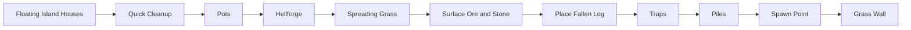

# Vanilla world generation: surface finish

[Русский](../ru/vanilla-worldgen-surface-finish.md) · [Late structures](vanilla-worldgen-late-structures.md)

`terraruntime:vanilla` now advances the ordinary TerrariaServer 1.4.5.8 source-order migration from `Quick Cleanup` through `Grass Wall`.

The canonical production plan grows from 78 to 88 entries. The generator identity remains `terraruntime:vanilla`, and all ten inserted source-order passes stay on the shared Terraria-compatible RNG stream.

## World-specific ore tiers

`Surface Ore and Stone` does not assume the classic Copper/Iron/Silver/Gold set. The Reset bootstrap already owns Terraria's pre-Terrain ore choices, so this pass uses `CopperOre`, `IronOre`, `SilverOre`, and `GoldOre` from that state. Tin, Lead, Tungsten, and Platinum worlds therefore retain their selected alternatives instead of silently reverting to classic ores.

## Frame-important objects

The pass group materializes several vanilla frame-important objects that do not require separate `.wld` side tables:

- Pot: tile `28`, 2 × 2;
- Hellforge: tile `77`, 3 × 2;
- Fallen Log: tile `488`, 3 × 2;
- pressure plate / dart-trap pair: tiles `135` and `137`;
- ambient small piles: tile `185`.

Trap placement also writes a continuous red-wire path between the trigger and trap rather than emitting disconnected decorative mechanisms.

## Spawn ownership

`Spawn Point` now owns a source-order spawn decision near the world center. It rejects excessive liquid and frame-important obstructions, clears ordinary non-frame-important material from the player clearance volume, and publishes the resulting semantic spawn through `IWorldGenerationMetadataWorkspace`.

The legacy compatibility Metadata pass still runs later because it owns unrelated header anchors. A narrow `SpawnPreservingMetadataPass1458` wrapper restores the source-backed spawn after that fallback executes, matching the same preservation pattern already used for source-backed terrain layers.

## Cleanup, grass, and walls

`Quick Cleanup` normalizes stale shape/frame state without destroying frame-important objects. `Spreading Grass` converts exposed Dirt and Mud to Grass and Jungle Grass. `Grass Wall` places unsafe natural Grass Wall (`63`) only into empty surface cavities adjacent to surface soil.

`Pots`, `Hellforge`, `Fallen Log`, `Traps`, and `Piles` use bounded deterministic placement attempts. This is still incremental source parity: exact vanilla counts, style distributions, trap templates, and RNG consumption for every failed source placement are not yet claimed byte-identical.

## Next architectural boundary

The next pinned source-order pass is `Guide`. Unlike the passes in this document, it is not a tile-only operation. Correct implementation requires a generation-owned NPC persistence surface and a fresh-world composer path that serializes generated NPC records rather than writing an always-empty NPC section. That bridge is intentionally kept out of this block instead of fabricating a Guide that disappears on first load.

## Acceptance

The vanilla generated-world workflow now gates the 88-entry graph, pinned source-order segment, spawn-preservation wrapper, full canonical small-world generation, TerraRuntime loader round-trip, and boot by the pinned official TerrariaServer 1.4.5.8 executable.
