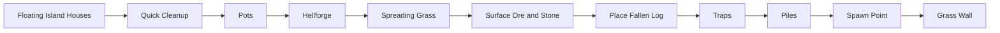

# Vanilla world generation: surface finish

[Русский](../ru/vanilla-worldgen-surface-finish.md) · [Late structures](vanilla-worldgen-late-structures.md)

`terraruntime:vanilla` now advances the ordinary TerrariaServer 1.4.5.8 source-order migration from `Quick Cleanup` through `Grass Wall`.

The canonical production plan grows from 78 to 88 entries. The generator identity remains `terraruntime:vanilla`, and all ten inserted source-order passes stay on the shared Terraria-compatible RNG stream.

## World-specific ore tiers

`Surface Ore and Stone` does not assume the classic Copper/Iron/Silver/Gold set. The Reset bootstrap already owns Terraria's pre-Terrain ore choices, so this pass uses `CopperOre`, `IronOre`, `SilverOre`, and `GoldOre` from that state. Tin, Lead, Tungsten, and Platinum worlds therefore retain their selected alternatives instead of silently reverting to classic ores.

## Frame-important objects

The pass group materializes several vanilla frame-important objects that do not require separate `.wld` side tables:

- Pot: tile `28`, 2 × 2;
- Hellforge: tile `77`, 3 × 2;
- Fallen Log: tile `488`, 3 × 2;
- pressure plate / dart-trap pair: tiles `135` and `137`;
- ambient small piles: tile `185`.

Trap placement also writes a continuous red-wire path between the trigger and trap rather than emitting disconnected decorative mechanisms.

## Spawn ownership

`Spawn Point` now owns a source-order spawn decision near the world center. It rejects excessive liquid and frame-important obstructions, clears ordinary non-frame-important material from the player clearance volume, and publishes the resulting semantic spawn through `IWorldGenerationMetadataWorkspace`.

The legacy compatibility Metadata pass still runs later because it owns unrelated header anchors. A narrow `SpawnPreservingMetadataPass1458` wrapper restores the source-backed spawn after that fallback executes, matching the same preservation pattern already used for source-backed terrain layers.

## Cleanup, grass, and walls

`Quick Cleanup` normalizes stale shape/frame state without destroying frame-important objects. `Spreading Grass` converts exposed Dirt and Mud to Grass and Jungle Grass. `Grass Wall` places unsafe natural Grass Wall (`63`) only into empty surface cavities adjacent to surface soil.

`Pots`, `Fallen Log`, `Traps`, and `Piles` use bounded deterministic placement attempts. This is still incremental source parity: exact vanilla counts, style distributions, trap templates, and RNG consumption for every failed source placement are not yet claimed byte-identical.

## Underworld settlements and Hellforges

The 2026-09-07 tester report of sparse/low forts and cut-away ash/lava remains open. Source-backed fort anchors are evaluated against still-approximate terrain: the current base stage constructs a continuous floor and periodic `x % 19` puddles, not the source roof/basin/runner/QuickWater sequence. Fix that base before changing verified fort placement rules. Final-world geometry, Dungeon/pyramid descents and biome visuals need independent fixtures; successful official `.wld` loading alone does not prove them.

The ordinary `Underworld` pass now invokes the verified `AddHellHouses` placement slice, previously missing entirely. Anchors are searched in the central half of the world from `height - 40` upward through active or wet cells, accepting only a dry cell immediately above an active foundation. The source brick/wall pairs are `75/14` and `76/13`; source palette and spacing draws remain on the shared RNG.

`HellFort` uses five potential columns and ten floors, source room-width/height draws, optional side wings, center-tower expansion, existing-wall exclusion and Underworld vertical limits. It creates rooms, source-selected door links (Obsidian door style `19`), floor/roof platform spans (style `13`), dry exterior doors and crumbled exterior walls. Overwritten RNG draws and the source wing's non-decrementing zero/nonzero draw are preserved. Rejection searches are bounded and abort generation on exhaustion, never substitute a fabricated layout.

`Hellforges` now uses the source `width / 200` attempt budget, samples `x` in `[1,width)` and `y` in `[height-250,height-30)`, requires sampled house wall `13/14`, then scans down to an active cell. The source stops each requested placement after 10000 failed house placements; samples without house walls do not count toward that counter. A separate one-million-sample safety guard prevents an infinite search in malformed geometry. `Place3x2(77)` checks every support cell with `SolidTile2`, admits full platforms but not table-only surfaces, and atomically writes all six frames. It does not invent a dry-only restriction or erase existing liquid, paint, walls or wires.

The outer `PlaceTile` wrapper clears stale tile identity, frames, slope and block paint/coating on its inactive anchor before attempting `Place3x2`, including a rejected placement. Other object cells keep their paint. Door/platform placement preserves the same anchor-cleanup distinction; it does not clear walls, liquid, wires or actuator state.

After all forts, the ordinary `AddHellHouses` torch phase requests `200 * (width / 4200)` placements: source integer division gives Small/Medium/Large budgets of 200/200/400. Each request samples at most 1001 brick candidates. A left background wall wins over a right one even if the chosen side is blocked; both target and cell below must be inactive, and the half-open torch-exclusion square is centered on the sampled brick. Hell torch style `7` rejects liquid before anchor cleanup; that rejection still finishes the request. Frame-important `CheckTorch` runs during generation and resolves left/right/wall attachment to `FrameX` values `22/44/0` with `FrameY=154`, respecting slope and source attachment sets. Unknown attachment identities fail closed.

Ordinary edge ash grass and trees now run before the forts on the same RNG; their separate settings-tree rules are documented in [vegetation](vanilla-worldgen-vegetation.md#underworld-ash-vegetation).

The following ground-furniture phase now admits all 13 ordinary `AddHellHouses` arrangements: table/chairs/candle, workbench/chair/candle, statue, bookcase, chair, bed, piano, dresser, bench, grandfather clock, sofa, lamp and candelabra. Its source inverse-width request budget is `ceil(4200000 / width)` (1000/657/500 for canonical sizes). Initial house-air selection plus at most 100001 retries precedes the `SolidTile` floor scan, contiguous floor midpoint, source clearance rectangle and `span >= halfWidth * 1.75` gate. Platforms do not stop this floor scan. Shared RNG owns the 13-way choice, candle offsets and chair/bed/sofa direction; rejected arrangements do not consume their secondary draws.

Placement owns the source Obsidian styles and complete frames, including the chair's 40-pixel style period and separate horizontal/vertical furniture atlases. `PlaceTile` cleans only its inactive anchor; direct `Place4x2` bed/sofa placement does not. Lamps reject liquid throughout their footprint, while ordinary furniture preserves liquid. This is the cleared-room generation slice, not general player placement: only solid floor supports and the arrangement's own table/workbench candle supports are admitted; unsupported support contexts fail closed.

Dressers use tile `88`, a complete 3x2 footprint and the existing dense generated-chest side table, with an empty name and 40 empty slots. They are not loot chests. Refused placement/registration cannot publish a partial dresser or phantom new metadata; unlike vanilla's possible failed-placement orphan, the isolated candidate retains coherent object/metadata state. Both generated-world validators now share a catalog-sized container check instead of assuming every container is 2x2. It checks every cell and one consistent frame style; malformed third columns and mixed-style ordinary chests reject.

The following painting and ceiling-decoration phases each use `ceil(420000 / width)` requests (100/66/50). Paintings recenter the house-air room twice, then measure three-cell empty strips without requiring walls. Room spans must exceed 7 horizontally and 5 vertically. `nearPicture2` excludes only active tiles `240/241/242` within the inclusive source rectangle; small paintings `245/246` intentionally do not count. `RandHellPicture` redraws family `1` once, then selects only the verified hell styles. This draw happens before the tighter asymmetric all-active-tile exclusion. Placement checks every background wall and writes complete 3x3, 6x4, 2x3 or 3x2 frames, preserving liquid and non-anchor paint.

Ceiling decorations select three distinct banner styles from `[16,22)` after making all three initial draws. Their upward `SolidTile` scan passes through platforms. The source's apparent clearance rectangle repeatedly reads only the anchor cell; it is not an extra surrounding-object exclusion. Actual placement checks the full footprint and center ceiling support for banner `91`, chandelier `34` style `32`, or lantern `42` style `32`. Unknown styles fail closed. Source house-sampling limits, cancellation and a fail-closed palette-search safety bound prevent malformed generation from hanging; no replacement decoration is fabricated.

Scripted helper tests and full canonical Small/Medium/Large seed `42` tests cover forts, retained torches, edge forests, furniture, registered empty dressers, complete painting/ceiling-decoration footprints and Hellforges. Disabling lighting, ash vegetation, furniture or decorations independently fails all three canonical regressions; skipping the dresser's third column fails two corruption regressions. This does **not** close full Underworld parity: the terrain/lava/ore runner is still approximate, special-seed vegetation remains unported, and whole-pass RNG/seed equality is not claimed. Nor does this prove all dungeon/biome content or end-to-end gameplay.

The existing ordinary Underworld terrain stage now also restores lava in inactive cells at `height-145` and `height-144`, immediately before Hellstone, as the pinned source does after carving. Both world edges participate; active tiles (even actuated ones) and non-liquid metadata are preserved, and the step consumes no RNG. Eleven helper/real-pass tests cover all canonical heights and Small/Medium/Large invocation; removing that invocation fails all three maps. Initial basin geometry, QuickWater, terrain/ore runners and whole-pass RNG equality remain open. Later liquid compaction may move this lava downward; the test observes the actual Underworld boundary, not an invented final horizontal layer.

## Next architectural boundary

The next pinned source-order pass is `Guide`. Unlike the passes in this document, it is not a tile-only operation. Correct implementation requires a generation-owned NPC persistence surface and a fresh-world composer path that serializes generated NPC records rather than writing an always-empty NPC section. That bridge is intentionally kept out of this block instead of fabricating a Guide that disappears on first load.

## Acceptance

The vanilla generated-world workflow now gates the 88-entry graph, pinned source-order segment, spawn-preservation wrapper, full canonical small-world generation, TerraRuntime loader round-trip, and boot by the pinned official TerrariaServer 1.4.5.8 executable.
