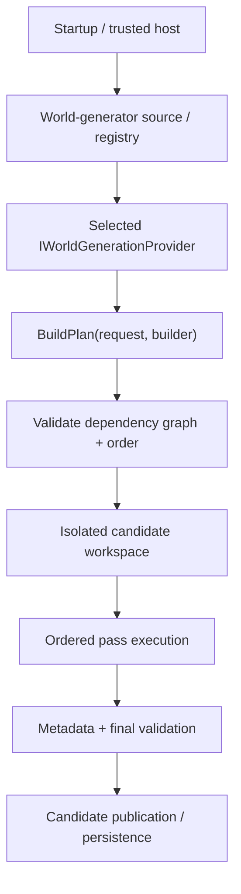
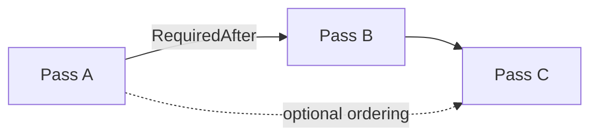
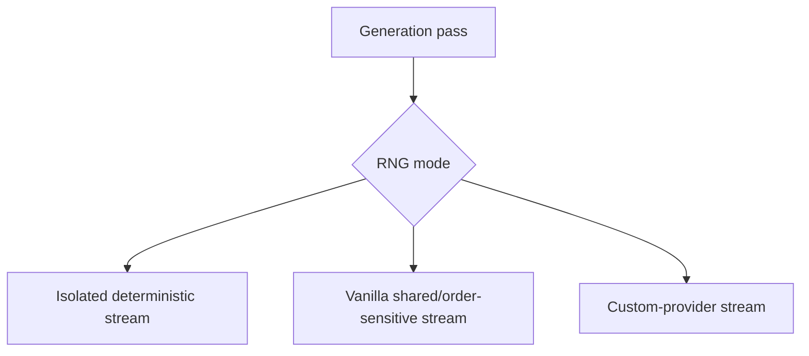
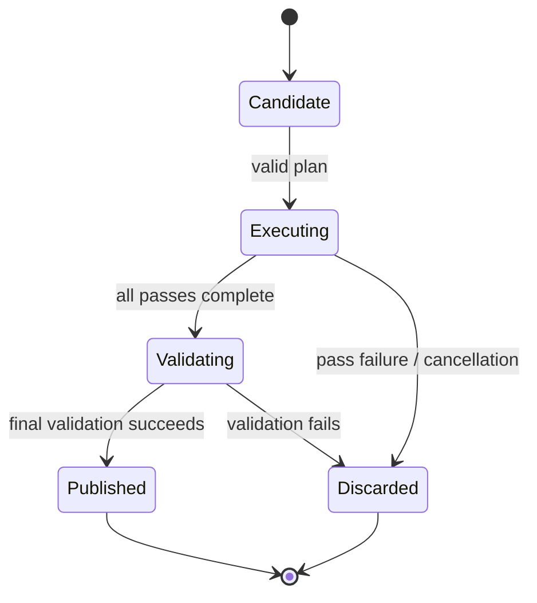

# World generation

[Русский](../ru/world-generation.md) · [Documentation](README.md) · [Host interfaces](host-interfaces.md) · [Worldgen roadmap](../roadmap/gameplay-worldgen-extensibility.md)

## 1. Current status

TerraRuntime has a real world-generation **framework**, but not vanilla Terraria WorldGen parity. The built-in generator is a deterministic flat dirt/stone baseline intended to exercise contracts and publication, not approximate vanilla biomes, structures or RNG ordering.

| Capability | Status |
|---|---|
| Worldgen framework | substantial |
| Trusted custom-provider surface | implemented |
| Vanilla Terraria WorldGen | incomplete |

## 2. Architecture



A generator never receives the live authoritative world while building/executing its candidate.

## 3. Generator identity and request

`WorldGeneratorId` is a stable namespaced identity. It must be non-empty, contain no whitespace/control characters and is bounded to `$128$` characters. Prefer names such as `myhost:survival` or `myplugin:skyblock`.

`WorldGenerationRequest` is immutable and carries `GeneratorId`, `WorldName`, `Seed`, `WidthTiles` and `HeightTiles`. Dimensions are positive and tile-count arithmetic is checked.

## 4. Provider contract

```csharp
public interface IWorldGenerationProvider
{
    WorldGeneratorId Id { get; }
    void BuildPlan(in WorldGenerationRequest request, IWorldGenerationPlanBuilder builder);
}
```

`BuildPlan` declares passes/order. It does not perform the expensive generation directly and does not mutate a live world.

## 5. Pass graph and ordering

Each pass has a stable `WorldGenerationPassId` and descriptor. Dependencies can express `RequiredAfter`, `OptionalAfter`, `OptionalBefore` and RNG mode.



The planner rejects missing hard dependencies, duplicate pass IDs and cycles before host-supplied pass execution begins. Dependency arrays are defensively copied.

## 6. Pass execution and cancellation

```csharp
public interface IWorldGenerationPass
{
    void Execute(IWorldGenerationContext context);
}
```

Execution is synchronous against an isolated candidate workspace. Long-running loops must observe the supplied cancellation token at useful intervals. Progress can be reported through `context.ReportProgress(...)` but remains observability rather than mutation authority.

## 7. Candidate workspace

`IWorldGenerationWorkspace` exposes normalized candidate tile reads/writes rather than `WorldTileStore` or live runtime memory.

```csharp
int WidthTiles { get; }
int HeightTiles { get; }
bool TryGetTile(int x, int y, out WorldGenerationTile tile);
bool TrySetTile(int x, int y, in WorldGenerationTile tile);
```

This prevents host code from depending on internal storage layout or publishing half-generated state after an exception.

## 8. Tile and metadata surfaces

`WorldGenerationTile` carries normalized tile/wall types, frame coordinates, wire/actuator/visibility/fullbright flags, liquid state, colors and shape.

`IWorldGenerationMetadataWorkspace` exposes semantic world anchors such as spawn, dungeon anchor, world surface and rock layer instead of raw `.wld` offsets.

Writing a numeric tile ID does not automatically make a multi-tile object arrangement legal vanilla state.

## 9. RNG modes

Current RNG-mode identities are `IsolatedDeterministic`, `VanillaSharedRng` and `CustomProviderRng`.



Future vanilla parity must preserve official shared RNG consumption/order. Passes must not be parallelized or reordered merely because they look computationally independent.

Pass code consumes `IWorldGenerationRandom`, not process-global `Random`.

## 10. Progress

`WorldGenerationProgress` contains `PassId`, `PassIndex`, `PassCount`, `Fraction` and `Message`. Progress sinks are optional; generation correctness does not depend on a UI consuming them.

## 11. Trusted-host registration

Trusted CoreCLR modules register providers explicitly through `ITerraRuntimeWorldGeneratorRegistry`. Registration returns a lifetime handle that must be retired/disposed before unloading the module owning the provider.

The runtime does not reflection-scan arbitrary assemblies for generators. This keeps registration compatible with AOT/static-discovery constraints.

Generator listing remains literal CLI:

```text
TerraRuntime.Server --list-world-generators
```

## 12. Built-in flat generator

The built-in ID is `terraruntime:flat`. Its plan runs a terrain pass and then a metadata pass. It deliberately uses simple deterministic dirt/stone, frame-free tiles and required world anchors.

It is an infrastructure baseline, **not** a vanilla WorldGen approximation.

## 13. Isolation and publication



The running authoritative world is never incrementally replaced by partial pass output.

## 14. NativeAOT and CoreCLR boundary

Generation contracts/planner/executor remain compatible with the NativeAOT-first core. Dynamic arbitrary DLL discovery is not required.

CoreCLR can load trusted modules and explicitly register providers. NativeAOT uses statically known/built-in providers unless another deliberate AOT-compatible registration path is introduced.

## 15. Adding a custom generator

```csharp
public sealed class MyGenerator : IWorldGenerationProvider
{
    public WorldGeneratorId Id => new("example:flat-plus");

    public void BuildPlan(
        in WorldGenerationRequest request,
        IWorldGenerationPlanBuilder builder)
    {
        builder.Add(
            new WorldGenerationPassDescriptor(new("example:terrain")),
            new TerrainPass());

        builder.Add(
            new WorldGenerationPassDescriptor(
                new("example:metadata"),
                requiredAfter: [new("example:terrain")]),
            new MetadataPass());
    }
}
```

Register during trusted-host bootstrap and retain/dispose the returned registration before unload.

## 16. Provider rules

A provider/pass must not mutate the running world, retain candidate workspace references after execution, assume `WorldTileStore` memory layout, hide reflection-based discovery, ignore cancellation in large loops, depend on TUI availability, or claim vanilla parity for guessed structures/RNG behavior.

## 17. Vanilla WorldGen work

Actual vanilla WorldGen remains large late-stage parity work: official pass order/shared RNG sequence, terrain/biomes, caves/ores/liquids, structures/dungeons, chests/objects/tile entities, progression metadata, framing/support rules and deterministic/reference-seed validation against TerrariaServer 1.4.5.8.

## 18. Evidence and limitations

Current evidence covers planner validation/order, executor behavior, RNG, workspace/finalization, registry lifetime, startup world-creation parsing and trusted-host generation integration.

The built-in generator remains flat only; vanilla structures/biomes/progression are incomplete; the semantic metadata surface is intentionally narrow; canonical fresh `.wld` writer support continues to evolve.

## 19. Change checklist

A worldgen change is incomplete unless dependencies are validated, candidate mutation remains isolated, RNG ordering is explicit, long work is cancellable, metadata stays semantic, provider lifetime is safe across unload, failure cannot publish a partial world, diagrams use Mermaid, dimensional values use LaTeX where applicable, and this page changes together with `docs/ru/world-generation.md`.
