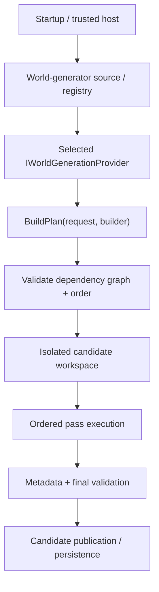
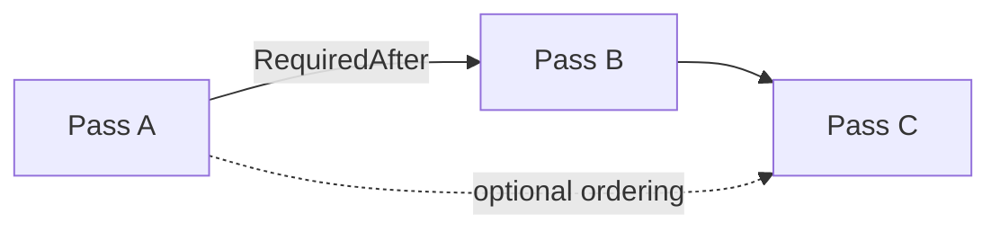
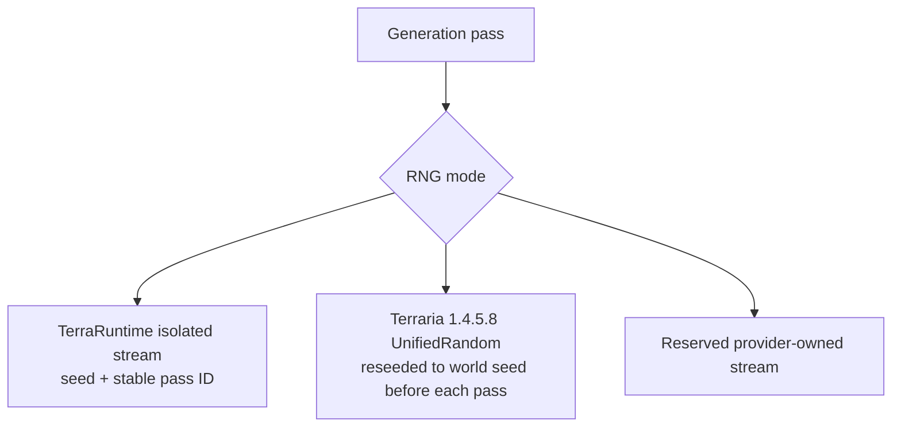
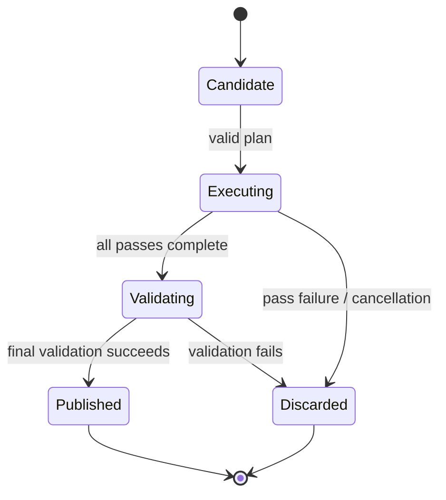
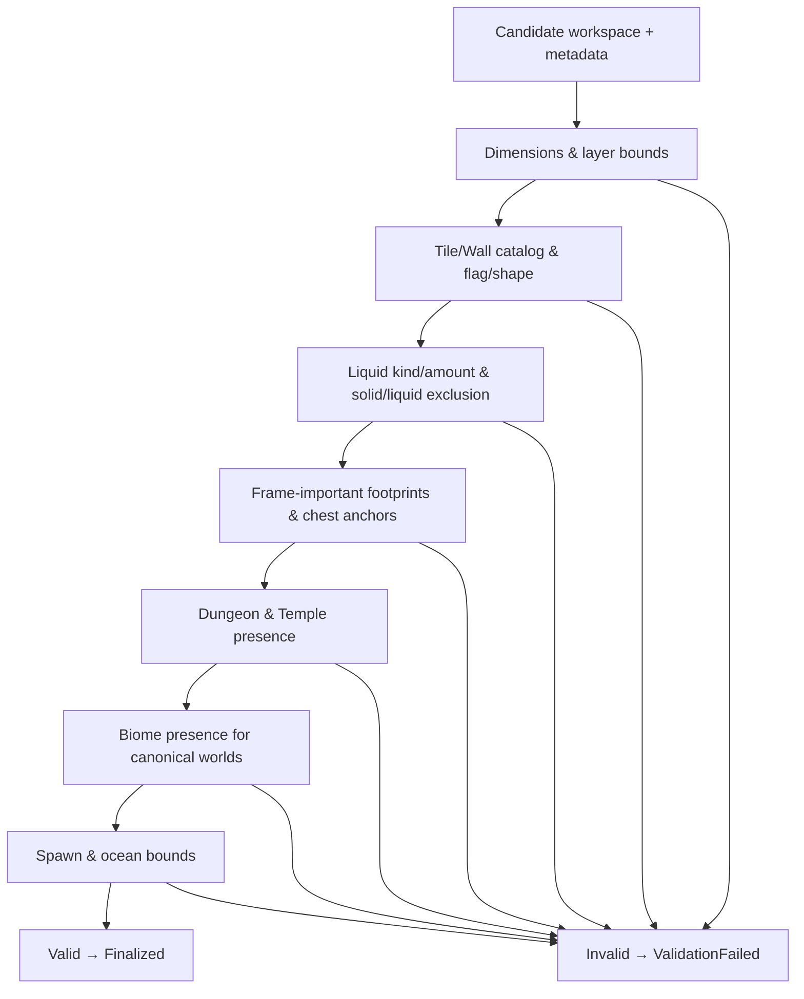

# World generation

[Русский](../ru/world-generation.md) · [Documentation](README.md) · [Host interfaces](host-interfaces.md) · [Vanilla generator](vanilla-world-generation.md) · [Worldgen roadmap](../roadmap/gameplay-worldgen-extensibility.md)

## 1. Current status

TerraRuntime has both a general world-generation framework and two built-in generator identities with deliberately different purposes:

| Capability | Status |
|---|---|
| Worldgen framework | substantial |
| Trusted custom-provider surface | implemented |
| `terraruntime:flat` infrastructure baseline | implemented |
| `terraruntime:vanilla` ordinary canonical pass coverage | all 109 pinned pass identities reached through `Final Cleanup` |
| Vanilla reference-world parity | incomplete |
| Special/secret-seed parity | incomplete |

`terraruntime:flat` remains a tiny deterministic dirt/stone generator for infrastructure tests. `terraruntime:vanilla` is the clean-room TerrariaServer 1.4.5.8 generator and now has source-backed/source-shaped overlays spanning the complete ordinary canonical registration sequence. Pass coverage is not the same claim as exact world parity: fixed official seeds still require differential evidence for RNG-sensitive geometry/content and several source-shaped algorithms remain deeper-parity work.

## 2. Architecture



A generator never receives the live authoritative world while building/executing its candidate.

## 3. Generator identity and request

`WorldGeneratorId` is a stable namespaced identity. It must be non-empty, contain no whitespace/control characters and is bounded to `$128$` characters. Prefer names such as `myhost:survival` or `myplugin:skyblock`.

`WorldGenerationRequest` is immutable and carries `GeneratorId`, `WorldName`, `Seed`, `WidthTiles` and `HeightTiles`. Dimensions are positive and tile-count arithmetic is checked. The request also carries normalized seed text where a generator needs Terraria-compatible textual seed resolution.

## 4. Provider contract

```csharp
public interface IWorldGenerationProvider
{
    WorldGeneratorId Id { get; }
    void BuildPlan(in WorldGenerationRequest request, IWorldGenerationPlanBuilder builder);
}
```

`BuildPlan` declares passes/order. It does not perform the expensive generation directly and does not mutate a live world.

## 5. Pass graph and ordering

Each pass has a stable `WorldGenerationPassId` and descriptor. Dependencies can express `RequiredAfter`, `OptionalAfter`, `OptionalBefore` and RNG mode.



The planner rejects missing hard dependencies, duplicate pass IDs and cycles before host-supplied pass execution begins. Dependency arrays are defensively copied.

## 6. Pass execution and cancellation

```csharp
public interface IWorldGenerationPass
{
    void Execute(IWorldGenerationContext context);
}
```

Execution is synchronous against an isolated candidate workspace. Long-running loops must observe the supplied cancellation token at useful intervals. Progress can be reported through `context.ReportProgress(...)` but remains observability rather than mutation authority.

## 7. Candidate workspace

`IWorldGenerationWorkspace` exposes normalized candidate tile reads/writes rather than `WorldTileStore` or live runtime memory.

```csharp
int WidthTiles { get; }
int HeightTiles { get; }
bool TryGetTile(int x, int y, out WorldGenerationTile tile);
bool TrySetTile(int x, int y, in WorldGenerationTile tile);
```

This prevents host code from depending on internal storage layout or publishing half-generated state after an exception.

## 8. Tile and metadata surfaces

`WorldGenerationTile` carries normalized tile/wall types, frame coordinates, wire/actuator/visibility/fullbright flags, liquid state, colors and shape.

`IWorldGenerationMetadataWorkspace` exposes semantic world anchors such as spawn, dungeon anchor, world surface and rock layer instead of raw `.wld` offsets. Runtime-owned generation workspaces additionally retain generated chests/NPC persistence and vanilla bootstrap state needed by the built-in generator without exposing the live server world.

Writing a numeric tile ID does not automatically make a multi-tile object arrangement legal vanilla state.

## 9. RNG modes

Current RNG-mode identities are `IsolatedDeterministic`, `VanillaSharedRng` and `CustomProviderRng`.



`IsolatedDeterministic` is the executable custom-provider mode. Each pass receives its own TerraRuntime stream derived from the world seed and stable pass ID, so adding an unrelated custom pass does not shift another pass's random sequence.

The name `VanillaSharedRng` must not be interpreted as one continuous stream across the whole vanilla plan. Pinned TerrariaServer 1.4.5.8 evidence shows that `GenBase._random` aliases `WorldGen.genRand`, which aliases global `Main.rand`, while `WorldGenerator.RunPass` replaces `Main.rand` with `new UnifiedRandom(_seed)` immediately before every enabled generation pass. The RNG is therefore shared by vanilla code **inside one pass**, but every registered pass starts again from the same resolved world seed.

TerraRuntime implements this with the source-pinned `VanillaUnifiedRandom1458` and a dedicated vanilla RNG context. The executor resolves the Terraria seed text to the pinned integer seed and creates a fresh vanilla RNG adapter for each `VanillaSharedRng` pass. The permanent source-contract probe also asserts that the official `RunPass` reseed still exists before pass application, so a runtime-only round trip cannot redefine the lifetime accidentally.

Passes must not be parallelized or reordered merely because their RNG stream is reseeded. Vanilla passes still read and mutate ordered world state, metadata and bootstrap state. Custom pass code consumes `IWorldGenerationRandom`, not process-global `Random`.

## 10. Progress

`WorldGenerationProgress` contains `PassId`, `PassIndex`, `PassCount`, `Fraction` and `Message`. Progress sinks are optional; generation correctness does not depend on a UI consuming them.

## 11. Trusted-host registration

Trusted CoreCLR modules register providers explicitly through `ITerraRuntimeWorldGeneratorRegistry`. Registration returns a lifetime handle that must be retired/disposed before unloading the module owning the provider.

The runtime does not reflection-scan arbitrary assemblies for generators. This keeps registration compatible with AOT/static-discovery constraints.

Generator listing remains literal CLI:

```text
TerraRuntime.Server --list-world-generators
```

## 12. Built-in generators

`terraruntime:flat` runs a minimal terrain pass and metadata pass. It deliberately uses simple deterministic dirt/stone and required world anchors. It is an infrastructure baseline, **not** a vanilla WorldGen approximation.

`terraruntime:vanilla` is the production clean-room vanilla identity. For ordinary seeds at the canonical Terraria dimensions, the final provider composes the pinned pass identity sequence through `Final Cleanup`; special/secret seeds and noncanonical synthetic dimensions currently retain explicit compatibility fallbacks. See [Built-in vanilla world generation](vanilla-world-generation.md) for the exact parity boundary.

## 13. Isolation and publication



The running authoritative world is never incrementally replaced by partial pass output.

## 14. NativeAOT and CoreCLR boundary

Generation contracts/planner/executor remain compatible with the NativeAOT-first core. Dynamic arbitrary DLL discovery is not required.

CoreCLR can load trusted modules and explicitly register providers. NativeAOT uses statically known/built-in providers unless another deliberate AOT-compatible registration path is introduced.

## 15. Adding a custom generator

```csharp
public sealed class MyGenerator : IWorldGenerationProvider
{
    public WorldGeneratorId Id => new("example:flat-plus");

    public void BuildPlan(
        in WorldGenerationRequest request,
        IWorldGenerationPlanBuilder builder)
    {
        builder.Add(
            new WorldGenerationPassDescriptor(new("example:terrain")),
            new TerrainPass());

        builder.Add(
            new WorldGenerationPassDescriptor(
                new("example:metadata"),
                requiredAfter: [new("example:terrain")]),
            new MetadataPass());
    }
}
```

Register during trusted-host bootstrap and retain/dispose the returned registration before unload.

## 16. Provider rules

A provider/pass must not mutate the running world, retain candidate workspace references after execution, assume `WorldTileStore` memory layout, hide reflection-based discovery, ignore cancellation in large loops, depend on TUI availability, or claim vanilla parity for guessed structures/RNG behavior.

## 17. Vanilla WorldGen work

The pinned TerrariaServer 1.4.5.8 source contract resolves all `$109$` `WorldGen.AddPasses()` registrations to exact pass names with zero unresolved entries. The ordered-name sequence is fingerprinted, and special-seed filtering is fingerprinted separately so conditional behavior is not confused with base registration order.

The built-in ordinary canonical provider now reaches that full sequence using a chain of source-backed and source-shaped clean-room implementations, including Terrain, biome/structure/object stages, micro-biomes, late cleanup passes and starting-NPC/fresh-world metadata integration. The current end-to-end integration test exercises a canonical `$4200\times1200$` world, validates generated content bounds/chests/Guide metadata, composes a fresh protocol-326 `.wld`, and reloads it through the runtime loader.

What remains is **deeper parity, not pass-name plumbing**: fixed-seed differential geometry/content checks against the official server, exact behavior/RNG consumption inside source-shaped passes, special/secret seed branches, and any remaining world-object/framing/content divergences discovered by reference worlds.

## 18. Post-generation validation

Every validated world now passes the fail-closed `VanillaWorldGenerationValidator1458`:



For canonical `$4200\times1200$`, `$6400\times1800$` and `$8400\times2400$` ordinary worlds the validator checks active-tile density, `$147$`/`$161$` snow, `$59$`/`$60$` jungle, `$53$` desert, `$70$` mushroom, `$41$` dungeon, `$226$` temple, `$58$` hellstone, $2\times2$ `21`-chest footprints (modulo `$36$` style), chest-anchor uniqueness, duplicate chests, out-of-bounds objects, solid/liquid exclusion, spawn ground, and ocean sand/water (`$30$` water, `$50$` sand per beach). Non-canonical and custom-generator worlds are validated only for tile/wall catalog, liquid, chest-anchor and metadata bounds so that fixture generators and small synthetic worlds are not spuriously rejected.

Validation is enforced inside `RuntimeWorldGenerationFinalizer`: `Finalized` is returned only when `Validate` is `Valid`; otherwise `ValidationFailed` is returned and the candidate is discarded before persistence. The new `VanillaWorldGenerationValidator1458Tests` exercise valid canonical generation, invalid tile/wall types, orphan chest anchors, duplicate chests, spawn outside world and ocean-bounds violations.

## 19. Evidence and limitations

Current evidence covers planner validation/order, executor behavior, custom RNG isolation, pinned per-pass vanilla RNG reseeding, the exact Terraria 1.4.5.8 `UnifiedRandom` algorithm, the `$109$`-pass registration catalog, source contracts for multiple vanilla stages, canonical world creation/file reload, post-generation structural validation, registry lifetime, startup world-creation parsing and trusted-host generation integration.

The strongest current claim is **complete ordinary canonical pass-identity coverage with a valid generated `.wld` and fail-closed structural validation**, not reference-world equality. The dedicated vanilla document and roadmap intentionally keep reference-world parity and special/secret-seed parity open until independent differential evidence closes them.

## 20. Change checklist

A worldgen change is incomplete unless dependencies are validated, candidate mutation remains isolated, RNG lifetime/order is pinned to official evidence, long work is cancellable, metadata stays semantic, provider lifetime is safe across unload, failure cannot publish a partial world, post-generation validation is green, parity claims match independent evidence, diagrams use Mermaid, dimensional values use LaTeX where applicable, and this page changes together with `docs/ru/world-generation.md`.
