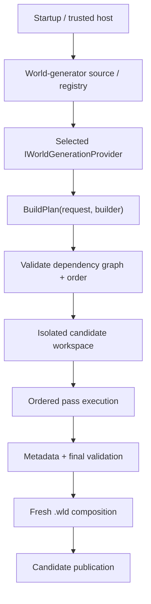
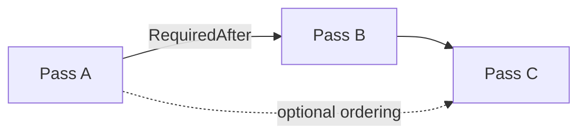
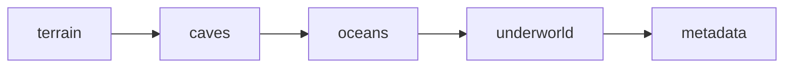
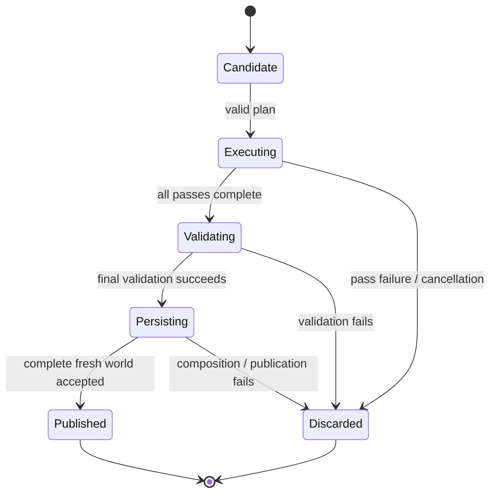

# World generation

[Русский](../ru/world-generation.md) · [Documentation](README.md) · [Host interfaces](host-interfaces.md) · [Worldgen roadmap](../roadmap/gameplay-worldgen-extensibility.md)

## 1. Current status

TerraRuntime has a real world-generation framework and now exposes two built-in generators:

- `terraruntime:vanilla` is the runtime-owned Terraria 1.4.5.8 vanilla-generation track;
- `terraruntime:flat` remains the tiny deterministic dirt/stone infrastructure baseline.

The vanilla generator is **not yet pass-complete Terraria WorldGen parity**. The first selectable slice owns seed interpretation, vanilla pass RNG execution, terrain variation, caves, ocean water, an underworld cavity/lava layer and semantic world anchors. Exact jungle/desert/ore/structure/chest/object/tile-entity generation and the remainder of the source-pinned `$109$` pass catalog remain open.

| Capability | Status |
|---|---|
| Worldgen framework | substantial |
| Trusted custom-provider surface | implemented |
| Built-in selectable vanilla profile | implemented, partial pass coverage |
| Full Terraria 1.4.5.8 WorldGen parity | incomplete |

## 2. Architecture



A generator never receives the live authoritative world while building or executing its candidate.

## 3. Generator identity and request

`WorldGeneratorId` is a stable namespaced identity. It is non-empty, contains no whitespace/control characters and is bounded to `$128$` characters.

`WorldGenerationRequest` carries `GeneratorId`, `WorldName`, numeric `Seed`, exact optional `SeedText`, dimensions and `WorldGenerationOptions`. `SeedText` is significant for vanilla generation: text that is not an `Int32` is converted through the Terraria-compatible CRC-32 seed boundary rather than being normalized through the host's numeric fallback.

Startup world creation therefore accepts textual seed values:

```text
TerraRuntime.Server \
  --create-world Example \
  --world-generator terraruntime:vanilla \
  --world-seed "get fixed boi" \
  --world-width 4200 \
  --world-height 1200
```

The host still derives a stable numeric fallback for custom generators, but `terraruntime:vanilla` uses the exact `SeedText` path.

## 4. Provider contract

```csharp
public interface IWorldGenerationProvider
{
    WorldGeneratorId Id { get; }
    void BuildPlan(in WorldGenerationRequest request, IWorldGenerationPlanBuilder builder);
}
```

`BuildPlan` declares passes and ordering. It does not mutate the live world.

## 5. Pass graph and ordering

Each pass has a stable `WorldGenerationPassId` and descriptor. Dependencies can express `RequiredAfter`, `OptionalAfter`, `OptionalBefore` and RNG mode.



The planner rejects missing hard dependencies, duplicate pass IDs and cycles before host-supplied pass execution begins. Dependency arrays are defensively copied.

## 6. Pass execution and cancellation

`IWorldGenerationPass.Execute` runs synchronously against an isolated candidate workspace. Long loops must observe the supplied cancellation token at useful intervals. Progress is bounded observability and cannot publish state.

Failure or cancellation discards the candidate rather than partially changing the authoritative world.

## 7. Candidate workspace

`IWorldGenerationWorkspace` exposes normalized candidate tile reads/writes instead of the live `WorldTileStore`.

```csharp
int WidthTiles { get; }
int HeightTiles { get; }
bool TryGetTile(int x, int y, out WorldGenerationTile tile);
bool TrySetTile(int x, int y, in WorldGenerationTile tile);
```

The runtime validates candidate bounds, known vanilla tile/wall ID ranges, tile flags, liquid kind and shape before accepting a write.

## 8. Tile and metadata surfaces

`WorldGenerationTile` carries normalized tile/wall IDs, frames, wires/actuator/visibility/fullbright flags, liquid state, colors and shape.

`IWorldGenerationMetadataWorkspace` exposes semantic anchors: spawn, dungeon anchor, world surface and rock layer. The vanilla candidate also carries an internal source-versioned seed profile so generation decisions and fresh `.wld` metadata cannot silently disagree about special-seed state.

## 9. RNG modes

RNG identities are `IsolatedDeterministic`, `VanillaSharedRng` and `CustomProviderRng`.


`IsolatedDeterministic` gives every custom pass an independent TerraRuntime stream derived from world seed plus stable pass ID.

`VanillaSharedRng` is now executable. Pinned TerrariaServer 1.4.5.8 evidence shows that `WorldGenerator.RunPass` replaces global `Main.rand` with `new UnifiedRandom(_seed)` before each enabled generation pass. TerraRuntime mirrors that boundary: each `VanillaSharedRng` pass receives a fresh `VanillaUnifiedRandom1458` seeded from the exact vanilla seed-text conversion. The RNG is shared by vanilla logic inside that pass, not carried continuously across the entire plan.

`CustomProviderRng` remains reserved and fails closed until an explicit provider-owned RNG contract exists.

## 10. Built-in vanilla generator

The built-in ID is `terraruntime:vanilla`. Its current first coherent slice runs:



The implementation is clean-room and intentionally uses only content IDs already admitted by the runtime where exact broader vanilla placement has not yet been source-verified. The current terrain surface is non-flat and deterministic; caves carve deterministic tunnel cavities; edge ocean regions contain water; the lower world receives an underworld cavity/lava layer; the final pass records spawn, dungeon and layer anchors.

This is the runtime path onto which the source-pinned `$109$` vanilla pass catalog is being implemented. It is not a claim that five coarse passes already reproduce every official Terraria world.

`skyblock` already has a dedicated special-world path: the ordinary terrain/ocean/underworld layout is replaced with a sparse central island candidate and the `SkyblockWorld` `.wld` flag is preserved.

## 11. Special world seeds and secret seed modifiers

Terraria 1.4.5.x distinguishes special world seeds from combinable secret seed modifiers. TerraRuntime normalizes seed-code matching case-insensitively by removing non-alphanumeric characters and supports pipe-separated combinations used by current seed syntax.

Supported special-seed identities include Drunk (`5162020`), For the Worthy, Celebration Mk 10 (`5162011`, `5162021`, `celebrationmk10`), The Constant, Not the Bees, Remix, No Traps, Zenith (`get fixed boi`) and Skyblock. Zenith projects the independent legacy special-world attributes into fresh `.wld` metadata instead of treating `ZenithWorld` as the only flag.

The source-versioned secret catalog recognizes all `$37$` current modifier codes and combinations. Direct `SaveWorldFlags` state is persisted for the current dedicated booleans:

- Vampirism / `VampireSeed`;
- Purify this / `InfectedSeed`;
- Royale with cheese / `TeamBasedSpawnsSeed`;
- Double daring dangers / `DualDungeonsSeed`;
- Electric Boogaloo / `MoreLightningSeed`;
- Calm before the storm / `NoLightningSeed`.

`Hocus pocus` and `Jingle all the way` also project to the existing forever-Halloween and forever-Xmas fields.

Recognition is broader than completed gameplay generation. Modifiers whose canonical semantics depend on not-yet-implemented passes or serialized `WorldManifest` state are retained as deterministic generation policy but are **not falsely emitted as complete persisted support**. `WorldManifest` stays empty until its exact 1.4.5.8 serialization and corresponding passes are implemented together.

## 12. Built-in flat generator

`terraruntime:flat` remains a two-pass terrain/metadata baseline with simple dirt/stone layers. It exists for infrastructure and extension tests and is not a vanilla approximation.

## 13. Isolation and publication



## 14. NativeAOT and CoreCLR boundary

Generation contracts, planner, executor, built-in providers and vanilla RNG remain in the statically known runtime graph and do not require reflection discovery. Trusted CoreCLR modules may explicitly register additional providers through the host contract; NativeAOT keeps built-in/static registration.

## 15. Trusted-host registration

Trusted CoreCLR modules register providers through `ITerraRuntimeWorldGeneratorRegistry`. Registration returns a lifetime handle that must be retired before unloading the owning module. The runtime does not reflection-scan arbitrary assemblies.

Generator listing remains:

```text
TerraRuntime.Server --list-world-generators
```

## 16. Provider rules

A provider/pass must not mutate the running world, retain candidate workspace references after execution, assume internal tile storage layout, hide reflection-based discovery, ignore cancellation in large loops, depend on TUI availability, or claim vanilla parity for guessed structures/RNG behavior.

## 17. Remaining vanilla WorldGen work

The pinned TerrariaServer 1.4.5.8 source contract resolves all `$109$` `WorldGen.AddPasses()` registrations to exact pass names with zero unresolved entries. Ordered pass names and special-seed filtering are fingerprinted independently.

The new selectable vanilla profile closes the previous gap between that source catalog and executable generation, but exact pass parity remains substantial. Major open groups include exact terrain feature sequencing, jungle/desert/snow shaping, ores and decorations, complete liquid settling, floating islands and micro-biomes, dungeon/temple/structure generation, traps, chests/loot, objects and tile entities, town NPC bootstrap/progression metadata, every special/secret seed pass alteration, `WorldManifest` persistence and reference-seed differential validation.

Do not mark full vanilla WorldGen complete until generated worlds pass official TerrariaServer/client acceptance and source/reference-seed comparisons for the implemented pass set.

## 18. Evidence and limitations

Current evidence includes planner validation, isolated workspace/finalization, exact `VanillaUnifiedRandom1458`, executable per-pass vanilla reseeding, exact text-seed CRC boundary tests, the `$109$` source-pinned pass catalog, selectable built-in vanilla generation tests, all-`$37$` secret-modifier combination parsing and fresh metadata round-trips for dedicated special/secret flags.

The current generator is a **large foundation slice, not full vanilla parity**. Exact structure/biome/object output and many modifier-specific mechanics remain deliberately open instead of being approximated and mislabeled as vanilla.

## 19. Change checklist

A worldgen change is incomplete unless dependencies are validated, candidate mutation remains isolated, RNG ordering is explicit, long work is cancellable, metadata stays semantic, persistence flags agree with generation policy, provider lifetime is safe across unload, failure cannot publish a partial world, diagrams use Mermaid, dimensional values use LaTeX where applicable, and this page changes together with `docs/ru/world-generation.md`.
