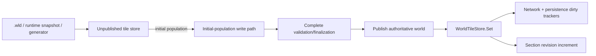

# Initial world population and dirty tracking

[Русский](../ru/world-initialization-dirty-tracking.md) · [Performance](performance-runtime.md) · [Roadmap](../roadmap.md)

TerraRuntime treats initial world construction differently from authoritative runtime mutation. Loading a canonical `.wld`, restoring a trusted runtime snapshot and executing world generation may write nearly every tile before any connection can observe the world. Feeding those writes through live dirty-section tracking would manufacture a full-world invalidation backlog that contains no useful information.

## Ownership boundary

Initial population has these invariants:

- no network dirty-section entries are produced;
- no persistence dirty-section entries are produced;
- section revisions remain zero while the store is unpublished;
- partially decoded or generated state is never published as authoritative state;
- after publication, ordinary `WorldTileStore.Set` immediately restores normal revision and dirty-tracking behavior.

## Canonical `.wld` load

`WorldFileCoreLoader` allocates tile storage through `WorldTileStore.CreateForSnapshotLoad`. The backing array is uninitialized because a successful tile-section decode overwrites every tile before the store can be published. `WorldFileTileDecoder` writes the private backing span directly rather than routing every decoded tile through live `Set`.

This removes two forms of startup work with no semantic value:

1. redundant managed zero-fill before a complete tile decode;
2. dirty/revision bookkeeping for initial data that no client has observed yet.

Failure remains transactional. If tile decoding fails, the candidate store is discarded and never becomes authoritative.

## Runtime snapshots and generation

Runtime snapshot restore uses the same unpublished-store principle. `Workspace` routes generation writes through the explicit `SetInitialPopulationTile` path so generation code no longer reaches into backing storage directly while still avoiding live dirty/revision bookkeeping.

The optimization is intentionally scoped to unpublished construction. It is not a global switch that can disable dirty tracking for live mutations.

## Regression contract

`InitialWorldPopulationDirtyTrackingTests` verifies canonical `.wld` load, `.runtime-world` restore and full generation population. All three must publish with empty network/persistence dirty queues and zero section revisions. The same suite then performs the first authoritative `WorldTileStore.Set` and verifies that both dirty consumers and section revision tracking resume immediately.
