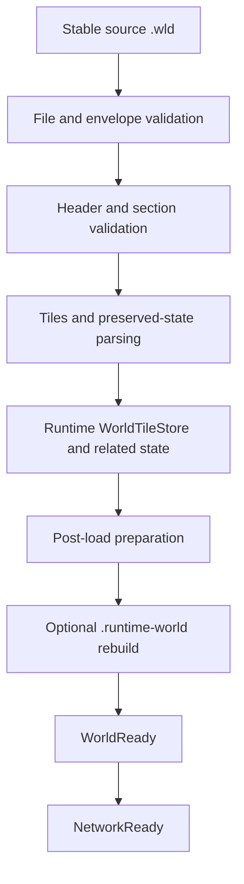
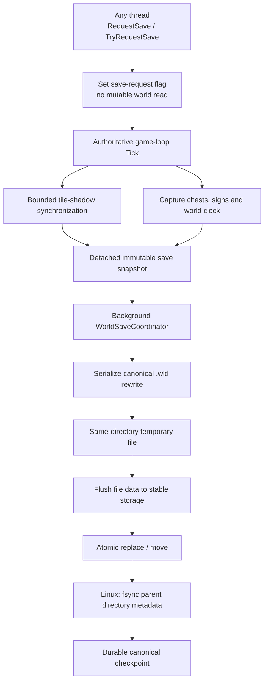

# World loading, persistence and runtime snapshots

[Русский](../ru/world-persistence.md) · [Documentation](README.md) · [Architecture](architecture.md) · [Roadmap](../roadmap.md)

## 1. Persistence model

TerraRuntime deliberately separates the canonical Terraria-compatible world from its optimized runtime startup image:

```text
world.wld            canonical Terraria checkpoint / recovery source
world.runtime-world  disposable TerraRuntime startup snapshot
```

The `.wld` remains the compatibility boundary. A `.runtime-world` file is an optimization and may be discarded whenever its layout or validation rules change.

A cache failure must never become world corruption.

## 2. World-loading path

Cold startup uses the canonical `.wld` loader:



TerraRuntime is version-pinned to the verified Terraria 1.4.5.8 world behavior currently supported by the implementation. Structural readability of an unknown/newer world version does not automatically mean it is safe to rewrite.

## 3. Stable source reads

World loading treats external file replacement as a real possibility. The loader and runtime-snapshot path use source metadata and validation so a world cannot be silently assembled from inconsistent halves of two different checkpoints.

If a source changes while a derived snapshot is being validated, the derived snapshot is rejected rather than published as authoritative state.

## 4. Runtime world snapshot

A valid warm startup can run from `world.runtime-world` without reading the source `.wld` contents. The runtime still reads cheap filesystem metadata for the source so an externally newer canonical checkpoint invalidates the snapshot.

The current snapshot is self-contained for startup and stores:

- an embedded validated canonical `.wld` checkpoint;
- normalized runtime tiles split into integrity-checked shards;
- world dimensions/version metadata;
- liquid contents through the normalized tile records;
- pending liquid scheduler state;
- source file length and `LastWriteTimeUtc` stamp;
- integrity metadata for embedded payloads.

The snapshot is not a migration format. An incompatible header/layout is a normal cache miss and triggers canonical `.wld` fallback.

## 5. Snapshot layout

The current runtime snapshot uses a fixed header of \(128\ \mathrm{B}\), an embedded canonical `.wld` checkpoint, tile shards, a shard-integrity table, a `LIQSTATE` trailer, and active/buffered liquid entries.

Important properties:

- normalized `WorldTile` disk records have a frozen \(16\ \mathrm{B}\) layout;
- tile shards target \(16\ \mathrm{MiB}\);
- shard reads use bounded positional `RandomAccess` I/O;
- the conservative default is up to four simultaneous tile-shard reads;
- embedded canonical data, tile shards and liquid payload are integrity-checked before publication.

These are implementation facts, not public compatibility promises for the `.runtime-world` file format.

## 6. Warm-start validity

A cheap source stamp currently includes source `.wld` byte length and source `.wld` `LastWriteTimeUtc`.

A runtime snapshot is accepted only when its source stamp is still compatible and all internal integrity/layout checks pass.

The original `.wld` SHA-256 is intentionally not recomputed on every warm start because doing so would force a complete source-file read and defeat the fast-start design. Integrity hashes are used for the data embedded inside `.runtime-world`.

The source is re-statted after snapshot loading to catch concurrent external replacement during validation.

## 7. Fallback behavior

Any of the following is a cache miss rather than a partial world load:

- missing runtime snapshot;
- stale source stamp;
- incompatible snapshot header/layout;
- truncation;
- embedded canonical checkpoint hash failure;
- tile shard hash failure;
- invalid liquid-state trailer or hash;
- invalid/duplicate liquid queue entries;
- source `.wld` replacement detected during load.

Fallback reads and validates the canonical `.wld`, constructs authoritative runtime state, and only then may rebuild the derived snapshot.

A partially reconstructed runtime snapshot is never published as the world.

## 8. Liquid persistence

Tile liquid state and pending liquid work are separate concepts.

`WorldTile.LiquidAmount` and `WorldTile.LiquidKind` persist the actual material at each tile. `WorldLiquidUpdateQueue` persists work that still needs simulation.

The runtime snapshot preserves:

- active liquid cells in FIFO order;
- active-entry `delay` and `kill` state;
- buffered/deferred liquid cells;
- deduplicated membership.

This allows a warm start to restore the scheduler directly rather than scanning the entire map merely to rediscover pending liquid work.

## 9. Runtime save architecture

Live world persistence is owned by the runtime. Mutable state is captured only at the authoritative boundary; serialization and disk I/O are detached from the game loop.



A caller requesting a save from another thread does not capture mutable world state itself. It requests that the authoritative owner produce the snapshot at a safe commit point.

## 10. Tile shadow

Copying the entire tile array on one save tick would create an avoidable large-world pause. The current save service maintains a save shadow in bounded section increments.

The default synchronization budget is \(4\ \text{sections/tick}\).

The save state distinguishes:

- initial shadow bootstrap still in progress;
- dirty tile sections waiting to be synchronized;
- a save requested but waiting for shadow consistency;
- a detached snapshot queued to the background writer.

A failed section snapshot is requeued. Save readiness is based on the persistence tracker's actual pending dirty work, not on optimistic assumptions about how many sections were attempted this tick.

## 11. What the live save currently rewrites

The current authoritative save path has explicit production support for runtime-owned:

- tile state;
- chest state;
- sign state;
- world clock fields handled by the header patcher.

Other canonical world sections are deliberately preserved from the validated source checkpoint instead of being regenerated by guessed code.

This is safer than pretending TerraRuntime already has a complete implementation of Terraria's full `WorldFileWriter`.

As new authoritative persistent state is implemented, it must make an explicit load/save decision and receive independent round-trip evidence before being included in the writer.

## 12. Coalescing saves

Only one background serialization/write is active at a time. Redundant save requests are coalesced rather than allowed to build an unbounded disk-work backlog.

The runtime exposes scheduler/save status such as:

- accepted snapshots;
- started writes;
- completed writes;
- coalesced requests;
- failed writes;
- whether a write is active;
- whether another detached snapshot is pending;
- tile-shadow bootstrap and dirty-section counts.

This state is also suitable for the TUI/operations surface because it is captured without handing mutable world collections to the UI.

## 13. Atomic and crash-durable publication

`AtomicSaveFileWriter` writes every replacement to a same-directory temporary file. The temporary file is fully serialized, asynchronously flushed, and then synchronously flushed with `Flush(flushToDisk: true)` before the destination namespace is changed.

For an existing world, publication uses `File.Replace`; for a first save it uses `File.Move`. Both consume the same-directory temporary file only after the complete payload exists.

On Linux, successful publication additionally opens the parent directory and calls `fsync` after the replace/move. This matters because flushing the file alone does not make the directory entry change durable against sudden power loss. Therefore a successful Linux save has two durability barriers:

1. file contents are flushed before publication;
2. parent-directory metadata is flushed after publication.

`WorldFileAtomicPublisher`, used for first publication of a newly generated canonical world, follows the same file-flush plus Linux parent-directory `fsync` rule.

The publication invariant is: the canonical path exposes either the previous complete checkpoint or the newly complete checkpoint, never a partially serialized destination.

A process killed before publication can leave an orphaned random-name `.tmp` file, but it does not replace the canonical world. Orphan cleanup is a separate housekeeping concern and is not required to identify the canonical checkpoint.

## 14. Shutdown and termination save

`Ctrl+C` and POSIX `SIGTERM` both enter the graceful shutdown path. On non-Windows systems the host registers `PosixSignal.SIGTERM`, cancels the runtime shutdown token, drains accepted connection/game-loop work, stops the authoritative owner, captures the final save image, and waits for the save coordinator to finish.

This is the path expected for normal service managers and container runtimes. `SIGKILL` cannot be handled by application code and is therefore covered by the atomic-save crash invariant instead of by shutdown hooks.

The ordering contract is that an older background save must not overwrite newer final authoritative state.

## 15. `--save-wld`

The offline compatibility command:

```text
TerraRuntime.Server --save-wld path/to/world.wld
```

operates on the canonical checkpoint embedded in the runtime snapshot and atomically exports/restores it, then refreshes the runtime snapshot source stamp.

Do not confuse this command with the live authoritative save service described above.

The offline command is still a checkpoint export path, not a complete generic serializer for every possible future runtime-only state. A complete vanilla-equivalent `WorldFileWriter` remains unfinished.

## 16. Save compatibility rule

TerraRuntime must fail conservatively when it cannot prove that a world layout can be rewritten safely.

Rules:

- unknown/newer layout is not writable merely because some sections parse;
- never patch fields at assumed offsets;
- preserve unowned state byte-for-byte where the current targeted rewriter permits it;
- newly authoritative persistent state needs explicit writer support;
- truncation or section failure must not silently delete unrelated valid state.

Silent data loss is considered worse than refusing a save.

## 17. Startup profiling

The runtime emits machine-readable startup profile data including relevant stages such as:

- source metadata/stat;
- canonical `.wld` file read;
- runtime-snapshot load;
- canonical loader stages on fallback;
- runtime snapshot rebuild/write;
- bootstrap preparation;
- `WorldReady` and `NetworkReady` wall time;
- startup allocation delta.

On a genuine warm snapshot hit, the canonical `.wld` file-read stage remains zero because the file contents are not read.

The official-world workflow verifies this by running cold and warm startup against the same generated world and includes a warm path where the source `.wld` contents are unreadable while filesystem metadata remains available.

## 18. Evidence and tests

Persistence behavior is guarded by unit/integration tests and dedicated workflows including, as applicable:

- world loader/parser tests;
- runtime snapshot/cache tests;
- liquid snapshot tests;
- preserved-section tests;
- save coordinator/coalescing tests;
- authoritative tile/chest/sign/clock save-service tests;
- world patch round-trip checks;
- official Terraria world generation/load workflows;
- live chest persistence probes;
- atomic writer tests and a process-level `SIGKILL` crash probe.

The live persistence proof covers a world generated by official TerrariaServer 1.4.5.8, a live packet-32 chest mutation, graceful TerraRuntime termination, exact `.wld` verification, TerraRuntime restart, official TerrariaServer reload/save, and a final exact verification.

`Authoritative World Save` run `33266509632` additionally killed the writer process with `SIGKILL` while it was stalled before publication. The exact CI result was:

```text
atomic_save_sigkill_ok existing_preserved=true first_save_hidden=true subsequent_save=true
```

That proves the pre-publication process-crash contract: an existing canonical destination remains byte-for-byte unchanged, a first save is not exposed partially, and a later normal save can still commit successfully.

World-format changes require independent evidence from real Terraria 1.4.5.8 worlds or the official server layout. A self-generated round trip is not sufficient evidence for compatibility.

## 19. Current limitations

Current persistence must not be overstated:

- TerraRuntime does not yet implement every field/section of a complete fresh vanilla `WorldFileWriter`;
- future gameplay systems such as full progression/events/housing/tile entities need explicit persistence integration as they become authoritative;
- runtime snapshot layout is intentionally disposable and not a stable external storage API;
- automatic backup rotation/rollback policy is not yet the same thing as the atomic-save guarantee and remains separate work;
- orphaned temporary files from an uncatchable process death are harmless to canonical selection but do not yet have a dedicated startup cleanup policy;
- power-loss durability is explicitly strengthened on Linux by parent-directory `fsync`; equivalent filesystem semantics remain platform-dependent outside that path;
- `.wld` remains the canonical recovery boundary.

## 20. Change checklist

A world/persistence change is incomplete until, where relevant:

- ownership of the captured state is explicit;
- game-thread snapshot work is bounded;
- background I/O never reads mutable authoritative collections directly;
- temporary-file and atomic-publication behavior is tested;
- process termination behavior is tested at the correct layer (`SIGTERM` for graceful shutdown, `SIGKILL` for pre-publication crash safety);
- durable publication includes the required filesystem metadata barrier on supported platforms;
- real `.wld` evidence exists for format-sensitive changes;
- runtime-cache corruption falls back safely;
- this page and `docs/ru/world-persistence.md` are updated together.
