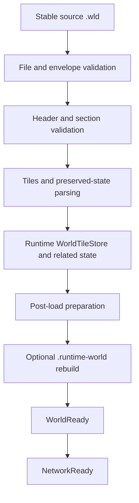
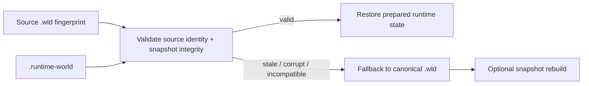
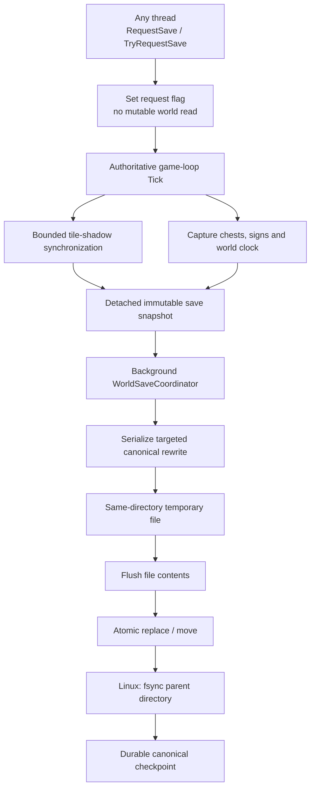
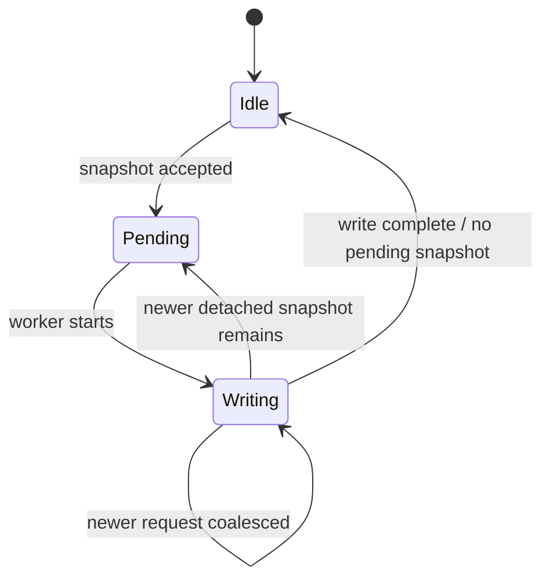
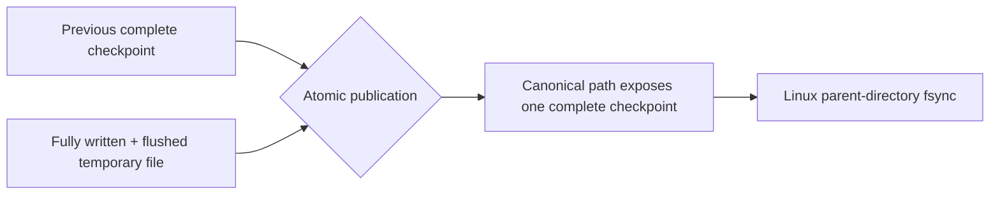

# World loading, persistence and runtime snapshots

[Русский](../ru/world-persistence.md) · [Documentation](README.md) · [Architecture](architecture.md) · [Roadmap](../roadmap.md)

## 1. Persistence model

TerraRuntime deliberately separates the canonical Terraria-compatible world from its optimized runtime startup image:

```text
world.wld            canonical Terraria checkpoint / recovery source
world.runtime-world  disposable TerraRuntime startup snapshot
```

The `.wld` remains the compatibility boundary. A `.runtime-world` file is an optimization and may be discarded whenever its layout or validation rules change. A cache failure must never become world corruption.

## 2. World-loading path

Cold startup uses the canonical `.wld` loader:



TerraRuntime is version-pinned to the verified Terraria 1.4.5.8 world behavior currently supported by the implementation. Structural readability of an unknown/newer world version does not automatically mean it is safe to rewrite.

## 3. Stable source reads

World loading treats external file replacement as a real possibility. The loader and runtime-snapshot path use source metadata and validation so a world cannot be silently assembled from inconsistent halves of two different checkpoints.

If a source changes while a derived snapshot is being validated, the derived snapshot is rejected rather than published as authoritative state.

## 4. Runtime world snapshot

A warm startup restores prepared state from `world.runtime-world` after verifying the current `.wld` content fingerprint. File metadata alone cannot authorize a cache hit.



The current snapshot is self-contained for startup and stores an embedded validated canonical `.wld` checkpoint, normalized runtime tiles split into integrity-checked shards, dimensions/version metadata, tile liquid contents, pending liquid scheduler state, source file length/`LastWriteTimeUtc`, and integrity metadata for embedded payloads.

Runtime layout `3` additionally means the tile image and liquid scheduler have already passed the supported TerrariaServer 1.4.5.8 post-load liquid preparation. The writer refuses raw canonical state; canonical fallback and post-save rebuild both run that initializer before cache publication. A warm-cache decode restores the prepared marker only after full cache validation.

The snapshot is not a migration format. An incompatible header/layout is a normal cache miss and triggers canonical `.wld` fallback.

## 5. Snapshot layout

The current runtime snapshot has a fixed header of `$128\,\mathrm{B}$`, normalized `WorldTile` records with a frozen `$16\,\mathrm{B}$` disk layout, and tile shards targeting `$16\,\mathrm{MiB}$`.

Shard reads use bounded positional `RandomAccess` I/O. The conservative default allows up to `$4$` simultaneous tile-shard reads. Embedded canonical data, tile shards and liquid payload are integrity-checked before publication.

The remaining on-disk sections include the embedded canonical checkpoint, shard-integrity metadata, a `LIQSTATE` trailer and active/buffered liquid entries. These are implementation facts, not public compatibility promises for `.runtime-world`.

## 6. Warm-start validity

A cheap source stamp currently includes source `.wld` byte length and `LastWriteTimeUtc`.

A runtime snapshot is accepted only when its source fingerprint matches and all internal integrity/layout checks pass. Warm startup reads the canonical `.wld` to compute its SHA-256-derived fingerprint, without repeating canonical parsing and preparation. Integrity hashes separately protect the embedded cache data.

The source is re-statted after snapshot loading to catch concurrent external replacement during validation.

## 7. Fallback behavior

Missing, stale, truncated, incompatible or integrity-invalid snapshots are cache misses rather than partial world loads. Invalid/duplicate liquid queue state and source replacement detected during load also force canonical fallback.

Fallback reads and validates the canonical `.wld`, constructs authoritative runtime state, and only then may rebuild the derived snapshot. A partially reconstructed runtime snapshot is never published as the world. The immutable world-operations/TUI snapshot retains the exact `RuntimeWorldSnapshotLoadResult` plus its `DetailCode`, cache hit/miss state, and separate file-read, cache-load, canonical-load and cache-build durations so a stale or invalid cache remains diagnosable after startup.

## 8. Liquid persistence

Tile liquid state and pending liquid work are separate concepts. `WorldTile.LiquidAmount`/`WorldTile.LiquidKind` persist material state, while `WorldLiquidUpdateQueue` persists scheduler work.

The runtime snapshot preserves active liquid cells in FIFO order, active-entry `delay`/`kill` state, buffered/deferred cells and deduplicated membership. Warm startup can therefore restore scheduler state directly rather than scan the full map merely to rediscover pending liquid work.

### 8.1 Objects a liquid destroys as a world loads

A world that generates cleanly can still hold an object standing in lava, because generation places objects and
floods caves in separate passes. The source resolves that as it loads: `WorldGen.WaterCheck` calls a plain
`KillTile` on the one cell it found, and the object's own validator removes the rest through the
`SquareTileFrame` that follows. The cells that disappear are exactly the object's own.

Which rectangle each identity loses is measured rather than listed by hand. The probe at `.cache/watercheck-probe`
stands one object of every identity that has a rectangular `TileObjectData` footprint inside the pinned official
build, runs the real pass dry - to prove the object survives on its own - and then flooded, and compares the whole
world. Every death case clears the object's own cells and leaves every other cell's identity untouched, and none
of them throws. `tools/ci/generate_loading_object_footprints.py` turns that sweep into
`VanillaLoadingObjectFootprint1458`: 237 identities with a width, a height and the frame strides their styles are
laid out with.

The strides are why the table is not simply a width and a height. A style does not always advance the frame by
the object's own size: a chair is one cell wide and two tall but its styles step 40 pixels down, and a workbench
is two wide and one tall but its styles step 20. A cell's place inside its object is its frame modulo the stride,
and a remainder that lands outside the object's own rectangle is a frame no style produces, so it rejects.

Three things stay refused. An identity whose footprint changes with the style, because no single rectangle
describes it - plant detritus is the one the loader still names itself, reading the frame row to tell its
three-wide form from its two-wide one. An identity that carries a chest, a sign or a tile entity, because
removing one means removing a second object this path has no authority over. And an incoherent footprint: every
cell must carry exactly the frame the derived origin implies, or nothing is touched at all.

One refusal was removed rather than kept. A platform whose support below was frame-important used to reject, on
the theory that a cascade might follow. It does not: what stands UNDER a platform never depends on it, measured
against stone, a granite column, another platform, a chest, a table and a bookcase, each built at its own
footprint. In all six the source removes the platform and leaves the support exactly as it found it. Only what
sits ON a platform can lose its anchor, and that case is unchanged.

Result: sixteen Large worlds - eight seeds across both evils - now generate and start. Before the table, two of
every nine or so refused to load with `UnsupportedLiquidDeathTile`, on identities the hand-written list had never
been extended to cover.

## 9. Runtime save architecture

Live world persistence is owned by the runtime. Mutable state is captured only at the authoritative boundary; serialization and disk I/O are detached from the game loop.



A caller requesting a save from another thread does not capture mutable world state itself. It requests that the authoritative owner produce the snapshot at a safe commit point.

## 10. Tile shadow

Copying the entire tile array on one save tick would create an avoidable large-world pause. The save service maintains a shadow in bounded section increments.

The default synchronization budget is `$4\,\text{sections/tick}$`.

The save state distinguishes initial shadow bootstrap, dirty sections awaiting synchronization, a save request waiting for shadow consistency, and a detached snapshot queued to the background writer. Failed section snapshots are requeued. Readiness is based on actual pending dirty work.

## 11. What the live save currently rewrites

Late-boss progression now writes the official `downedFishron`, `downedAncientCultist`, `downedEmpressOfLight` and `downedMoonlord` header flags. Previously these runtime milestones caused an unsupported-mutation save rejection. Updates are monotonic and preserve every unrelated byte, including the five lunar-event flags. All 256 baseline/mutation combinations match independently emitted official 1.4.5.8 headers; repeated saves are idempotent and truncated headers are rejected. The fixture writer fixes only signed 64-bit timestamps for reproducible comparisons. Reverting support makes 241 of 257 regressions fail.

The authoritative production save path explicitly supports runtime-owned tile state, chest state, sign state and world-clock fields handled by the header patcher. The clock snapshot writes time, day state, moon phase, Slime Rain time and the source `windSpeedTarget`; loading the patched world restores that target as the initial current wind, as TerrariaServer 1.4.5.8 does. Each tick applies the source rain multiplier from persisted `maxRaining` only while easing the current wind; packet and persistence target values remain the unscaled `windSpeedTarget`.

Authoritative sign persistence rewrites the sign section from `RuntimeSignStore`. The current encoder bounds one sign text at `$64\,\mathrm{KiB}$` of UTF-8 data and total sign text in one save snapshot at `$64\,\mathrm{MiB}$`. Exceeding the accepted contract fails the save instead of silently truncating or corrupting unrelated world data.

Runtime sign slot identity follows TerrariaServer 1.4.5.8 while the process is running. Packet `47` may replace any valid runtime slot; if its submitted coordinates do not resolve to an active sign tile, vanilla `TextSign` semantics clear that slot. A later packet `46` read of an active sign tile uses `ReadSign(CreateIfMissing: true)` behavior and may allocate the first free runtime slot again.

Persistence intentionally compacts this runtime identity. Vanilla `SaveSigns` serializes non-null slots in ascending runtime-slot order but does not serialize slot IDs, so `RuntimeSignStore` captures sparse runtime slots as contiguous file-order IDs `$0,1,\ldots,N-1$`. Duplicate sign coordinates are also written, matching vanilla save behavior. On load, the first coordinate occurrence wins and later duplicates are discarded; surviving signs retain the slot IDs implied by their original file order. Duplicate coordinates are therefore not an encoder error.

Other canonical sections are deliberately preserved from the validated source checkpoint instead of being regenerated by guessed code. TerraRuntime does not yet pretend to implement Terraria's complete `WorldFileWriter`.

## 12. Coalescing saves

Only one background serialization/write is active at a time. Redundant save requests are coalesced rather than allowed to build an unbounded disk-work backlog.



Operations/TUI telemetry exposes accepted, started, completed, coalesced and failed writes plus active/pending state, shadow bootstrap progress and dirty-section counts without exposing mutable world collections. It also exposes the latest snapshot-capture, serializer-callback and full atomic-write durations; their nested semantics are documented in [Save pipeline timing telemetry](save-pipeline-telemetry.md).

## 13. Atomic and crash-durable publication

`AtomicSaveFileWriter` writes every replacement to a same-directory temporary file. The temporary file is fully serialized, asynchronously flushed, then synchronously flushed with `Flush(flushToDisk: true)` before the destination namespace changes.

For an existing world, publication uses `File.Replace`; for a first save it uses `File.Move`. On Linux, successful publication additionally opens the parent directory and calls `fsync` after the replace/move. A successful Linux save therefore has two durability barriers:

1. file contents are flushed before publication;
2. parent-directory metadata is flushed after publication.

`WorldFileAtomicPublisher`, used for first publication of a newly generated canonical world, follows the same file-flush plus Linux parent-directory `fsync` rule.



A process killed before publication can leave an orphaned random-name `.tmp` file, but it does not replace the canonical world. `AtomicSaveFileWriter` now pairs every managed temporary with a sibling `.tmp.lease` file held open with `FileShare.None` for the complete write/flush/validation/backup/publication transaction. Before a later save starts, it scans only correctly named leased temporaries for the same target and reaps one only when it can acquire that lease exclusively. A live writer therefore keeps its temporary protected across processes. A legacy `.tmp` that has no TerraRuntime lease is deliberately left untouched because ownership cannot be proven safely.

Host startup applies the same lease-safe cleanup to both the canonical world target and its checkpoint-backup target before cache/stat/load processing. This means an abandoned managed transaction is reclaimed even when no later save occurs. A live lease still wins and an unleased legacy temporary is still left untouched. `Authoritative World Save` run `33270924996` independently executed `AtomicSaveFileWriterCleanupTests` (`5/5`) and a real `TerrariaServerHost.RunAsync` startup-order test (`1/1`) before the rest of the save pipeline.

Successful validated replacement of an existing canonical checkpoint also keeps the previous canonical generation at `<world>.wld.bak`. On startup, if the canonical `.wld` fails structural/content validation, TerraRuntime may validate that backup with the complete supported world loader and atomically restore it. An invalid backup fails closed and leaves the canonical file untouched; the broken canonical is never rotated over the known-good backup during recovery.

Automatic recovery is deliberately suppressed for explicit format incompatibility. A structurally readable world whose header reports an unsupported version such as `327` is a compatibility decision, not corruption: startup fails instead of replacing that future-world file with an older `326` backup. The canonical and backup bytes remain unchanged in this case.

## 14. Shutdown and termination save

`Ctrl+C` and POSIX `SIGTERM` enter the graceful shutdown path. On non-Windows systems the host registers `PosixSignal.SIGTERM`, cancels runtime shutdown, drains accepted connection/game-loop work, stops the authoritative owner, captures the final save image, and waits for the save coordinator.

`SIGKILL` cannot be handled by application code and is covered by the atomic-publication crash invariant rather than shutdown hooks.

The ordering contract is that an older background save must not overwrite newer final authoritative state.

## 15. `--save-wld`

The offline compatibility command remains literal CLI syntax:

```text
TerraRuntime.Server --save-wld path/to/world.wld
```

It operates on the canonical checkpoint embedded in the runtime snapshot, atomically exports/restores it and refreshes the runtime snapshot source stamp. It is not the live save service and is not a complete generic serializer for every future runtime-only state.

## 16. Save compatibility rule

TerraRuntime fails conservatively when it cannot prove that a world layout can be rewritten safely.

Unknown/newer layouts are not writable merely because some sections parse; fields are not patched at guessed offsets; unowned state is preserved where targeted rewrite permits; newly authoritative persistent state requires explicit writer support; truncation or section failure must not silently delete unrelated valid state.

Silent data loss is considered worse than refusing a save.

## 17. Startup profiling

The runtime emits machine-readable startup profile data for source metadata/stat, canonical `.wld` read, runtime-snapshot load, fallback loader stages, snapshot rebuild/write, bootstrap preparation, `WorldReady`/`NetworkReady` wall time and startup allocation delta.

On a genuine warm hit, canonical `.wld` file-read time remains zero because file contents are not read. The official-world workflow verifies cold/warm startup and includes a warm path where source `.wld` contents are unreadable while filesystem metadata remains available.

## 18. Evidence and tests

`RuntimeWorldProgressionMutations` retains the loaded `LunarApocalypseIsUp` baseline. Its authoritative-thread `SetLunarApocalypseIsUp` records explicit true/false changes; captured snapshots remain unchanged by later updates. The save patcher writes only that event byte when an override is present, preserving all four tower-active flags. Moon Lord departure clears the event without marking a victory. This uses the existing checkpoint path and requires no cache-layout change.

World-chest ownership is released on the authoritative thread when player membership is removed, before a world-transfer detach completes. Live transport shutdown uses that same detach transaction. A replacement session can reopen the chest; stale disconnects cannot release its ownership. This follows official `RemoteClient.Reset` replacing the departed player with a fresh `Player` whose chest index is `-1`. The live chest lifecycle probe exercises abrupt disconnect and replacement, in addition to item/name restoration and observer routing.

The sign fixture may add two stone supports in empty dry cells near spawn when generated terrain has no suitable flat floor. It preserves existing active objects and places the physical sign and text together.

Live sign persistence fixtures include a supported physical two-by-two sign above solid ground as well as its text record. A text-only orphan is not a valid packet-46 read target. World-load probes explicitly disable TUI and enable debug console profiles; warm-cache verification keeps canonical bytes readable for fingerprint validation and proves bootstrap reuse before a new checkpoint invalidates that generation.

Persistence evidence includes world loader/parser tests, runtime snapshot/cache tests, liquid snapshots, preserved-section tests, save coordinator/coalescing tests, authoritative tile/chest/sign/clock save-service tests, sign persistence round trips, world patch checks, official-world load workflows, live chest/sign persistence probes, atomic writer tests and process-level crash/recovery probes.

The live persistence proof uses a world generated by official TerrariaServer 1.4.5.8, performs a live `packet 32` chest mutation, gracefully terminates TerraRuntime, verifies the exact `.wld`, restarts TerraRuntime, reloads/saves through the official server, and verifies again.

`Authoritative World Save` run `33270005299` killed writers with `SIGKILL` while they were stalled before publication for both an existing destination and a first save, then reported:

```text
atomic_save_sigkill_ok existing_preserved=true first_save_hidden=true subsequent_save=true orphan_cleanup=true live_lease=true
```

That proves the pre-publication process-crash contract plus cross-process orphan cleanup: an existing canonical destination remains byte-for-byte unchanged, a first save is not exposed partially, the killed process leaves a matching `.tmp`/`.tmp.lease` pair, and the next successful save reaps that abandoned pair before committing without touching a live leased temporary.

`World Checkpoint Recovery` run `33269875235` used an official TerrariaServer 1.4.5.8 world and proved previous-generation backup rotation, exact recovery from a structurally corrupted canonical checkpoint, fail-closed behavior for an invalid backup, official-server reload after recovery, and suppression of rollback for an otherwise intact world whose only change was the little-endian format version field from `326` to `327`. The future-version canonical and its valid `326` backup both remained byte-for-byte unchanged.

World-format changes require independent evidence from real Terraria 1.4.5.8 worlds or official layout. A self-generated round trip alone is insufficient compatibility proof.

## 19. Current limitations

TerraRuntime still does not implement every field/section of a complete fresh vanilla `WorldFileWriter`. Future progression/events/housing/tile-entity systems require explicit persistence integration as they become authoritative.

Runtime snapshot layout remains disposable rather than a stable external storage API. Validated previous-generation backup rotation and automatic corruption recovery are implemented, but there is no multi-generation retention/history policy. Managed orphan `.tmp` files are reclaimed on host startup and before later saves only when their TerraRuntime lease can be acquired exclusively; unknown legacy temporaries without a lease are intentionally not deleted automatically. Linux parent-directory `fsync` strengthens power-loss durability; equivalent filesystem semantics remain platform-dependent outside that path. `.wld` remains the canonical recovery boundary.

## 20. Change checklist

A world/persistence change is incomplete until, where relevant:

- ownership of captured state is explicit;
- game-thread snapshot work is bounded;
- background I/O never reads mutable authoritative collections directly;
- temporary-file and atomic-publication behavior is tested;
- backup recovery validates the candidate and never treats explicit format incompatibility as corruption;
- `SIGTERM` graceful shutdown and `SIGKILL` pre-publication crash safety are tested at the correct layer;
- durable publication includes required filesystem metadata barriers on supported platforms;
- real `.wld` evidence exists for format-sensitive changes;
- runtime-cache corruption falls back safely;
- diagrams use Mermaid rather than pseudographics;
- dimensional measurements use LaTeX with explicit units;
- this page and `docs/ru/world-persistence.md` are updated together.
