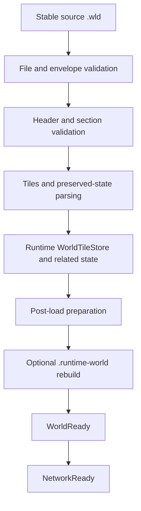
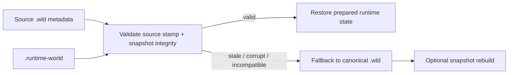
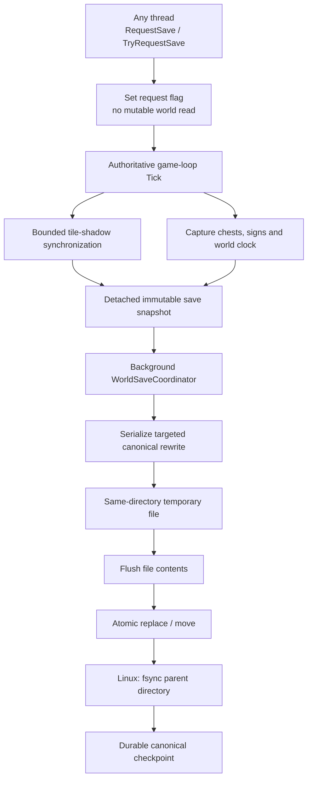
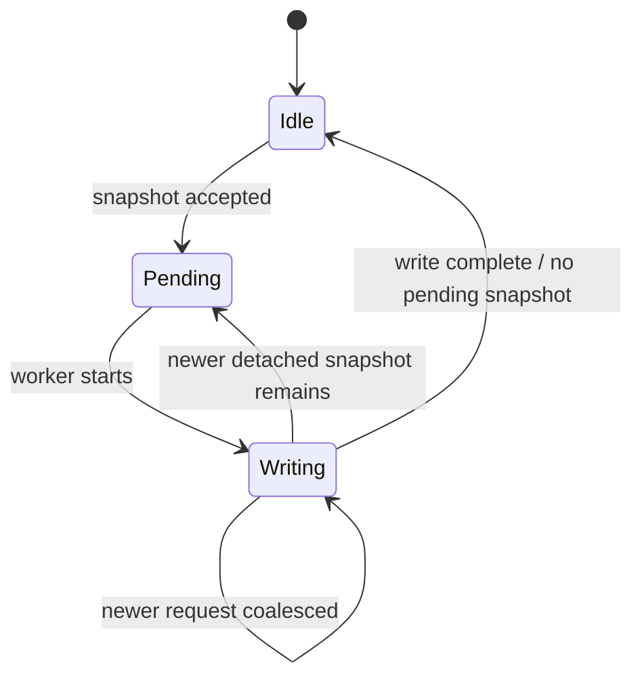
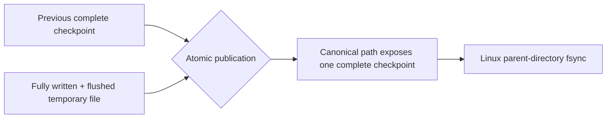

# World loading, persistence and runtime snapshots

[Русский](../ru/world-persistence.md) · [Documentation](README.md) · [Architecture](architecture.md) · [Roadmap](../roadmap.md)

## 1. Persistence model

TerraRuntime deliberately separates the canonical Terraria-compatible world from its optimized runtime startup image:

```text
world.wld            canonical Terraria checkpoint / recovery source
world.runtime-world  disposable TerraRuntime startup snapshot
```

The `.wld` remains the compatibility boundary. A `.runtime-world` file is an optimization and may be discarded whenever its layout or validation rules change. A cache failure must never become world corruption.

## 2. World-loading path

Cold startup uses the canonical `.wld` loader:



TerraRuntime is version-pinned to the verified Terraria 1.4.5.8 world behavior currently supported by the implementation. Structural readability of an unknown/newer world version does not automatically mean it is safe to rewrite.

## 3. Stable source reads

World loading treats external file replacement as a real possibility. The loader and runtime-snapshot path use source metadata and validation so a world cannot be silently assembled from inconsistent halves of two different checkpoints.

If a source changes while a derived snapshot is being validated, the derived snapshot is rejected rather than published as authoritative state.

## 4. Runtime world snapshot

A valid warm startup can run from `world.runtime-world` without reading the source `.wld` contents. The runtime still reads cheap filesystem metadata for the source so an externally newer canonical checkpoint invalidates the snapshot.



The current snapshot is self-contained for startup and stores an embedded validated canonical `.wld` checkpoint, normalized runtime tiles split into integrity-checked shards, dimensions/version metadata, tile liquid contents, pending liquid scheduler state, source file length/`LastWriteTimeUtc`, and integrity metadata for embedded payloads.

The snapshot is not a migration format. An incompatible header/layout is a normal cache miss and triggers canonical `.wld` fallback.

## 5. Snapshot layout

The current runtime snapshot has a fixed header of `$128\,\mathrm{B}$`, normalized `WorldTile` records with a frozen `$16\,\mathrm{B}$` disk layout, and tile shards targeting `$16\,\mathrm{MiB}$`.

Shard reads use bounded positional `RandomAccess` I/O. The conservative default allows up to `$4$` simultaneous tile-shard reads. Embedded canonical data, tile shards and liquid payload are integrity-checked before publication.

The remaining on-disk sections include the embedded canonical checkpoint, shard-integrity metadata, a `LIQSTATE` trailer and active/buffered liquid entries. These are implementation facts, not public compatibility promises for `.runtime-world`.

## 6. Warm-start validity

A cheap source stamp currently includes source `.wld` byte length and `LastWriteTimeUtc`.

A runtime snapshot is accepted only when its source stamp remains compatible and all internal integrity/layout checks pass. The original `.wld` SHA-256 is intentionally not recomputed on every warm start because that would force a complete source-file read and defeat the fast-start design. Integrity hashes protect the data embedded inside `.runtime-world`.

The source is re-statted after snapshot loading to catch concurrent external replacement during validation.

## 7. Fallback behavior

Missing, stale, truncated, incompatible or integrity-invalid snapshots are cache misses rather than partial world loads. Invalid/duplicate liquid queue state and source replacement detected during load also force canonical fallback.

Fallback reads and validates the canonical `.wld`, constructs authoritative runtime state, and only then may rebuild the derived snapshot. A partially reconstructed runtime snapshot is never published as the world.

## 8. Liquid persistence

Tile liquid state and pending liquid work are separate concepts. `WorldTile.LiquidAmount`/`WorldTile.LiquidKind` persist material state, while `WorldLiquidUpdateQueue` persists scheduler work.

The runtime snapshot preserves active liquid cells in FIFO order, active-entry `delay`/`kill` state, buffered/deferred cells and deduplicated membership. Warm startup can therefore restore scheduler state directly rather than scan the full map merely to rediscover pending liquid work.

## 9. Runtime save architecture

Live world persistence is owned by the runtime. Mutable state is captured only at the authoritative boundary; serialization and disk I/O are detached from the game loop.



A caller requesting a save from another thread does not capture mutable world state itself. It requests that the authoritative owner produce the snapshot at a safe commit point.

## 10. Tile shadow

Copying the entire tile array on one save tick would create an avoidable large-world pause. The save service maintains a shadow in bounded section increments.

The default synchronization budget is `$4\,\text{sections/tick}$`.

The save state distinguishes initial shadow bootstrap, dirty sections awaiting synchronization, a save request waiting for shadow consistency, and a detached snapshot queued to the background writer. Failed section snapshots are requeued. Readiness is based on actual pending dirty work.

## 11. What the live save currently rewrites

The authoritative production save path explicitly supports runtime-owned tile state, chest state, sign state and world-clock fields handled by the header patcher.

Authoritative sign persistence rewrites the sign section from `RuntimeSignStore`. The current encoder bounds one sign text at `$64\,\mathrm{KiB}$` of UTF-8 data and total sign text in one save snapshot at `$64\,\mathrm{MiB}$`. Exceeding the accepted contract fails the save instead of silently truncating or corrupting unrelated world data.

Other canonical sections are deliberately preserved from the validated source checkpoint instead of being regenerated by guessed code. TerraRuntime does not yet pretend to implement Terraria's complete `WorldFileWriter`.

## 12. Coalescing saves

Only one background serialization/write is active at a time. Redundant save requests are coalesced rather than allowed to build an unbounded disk-work backlog.



Operations/TUI telemetry exposes accepted, started, completed, coalesced and failed writes plus active/pending state, shadow bootstrap progress and dirty-section counts without exposing mutable world collections.

## 13. Atomic and crash-durable publication

`AtomicSaveFileWriter` writes every replacement to a same-directory temporary file. The temporary file is fully serialized, asynchronously flushed, then synchronously flushed with `Flush(flushToDisk: true)` before the destination namespace changes.

For an existing world, publication uses `File.Replace`; for a first save it uses `File.Move`. On Linux, successful publication additionally opens the parent directory and calls `fsync` after the replace/move. A successful Linux save therefore has two durability barriers:

1. file contents are flushed before publication;
2. parent-directory metadata is flushed after publication.

`WorldFileAtomicPublisher`, used for first publication of a newly generated canonical world, follows the same file-flush plus Linux parent-directory `fsync` rule.



A process killed before publication can leave an orphaned random-name `.tmp` file, but it does not replace the canonical world. Orphan cleanup is a housekeeping concern, not a canonical-selection ambiguity.

## 14. Shutdown and termination save

`Ctrl+C` and POSIX `SIGTERM` enter the graceful shutdown path. On non-Windows systems the host registers `PosixSignal.SIGTERM`, cancels runtime shutdown, drains accepted connection/game-loop work, stops the authoritative owner, captures the final save image, and waits for the save coordinator.

`SIGKILL` cannot be handled by application code and is covered by the atomic-publication crash invariant rather than shutdown hooks.

The ordering contract is that an older background save must not overwrite newer final authoritative state.

## 15. `--save-wld`

The offline compatibility command remains literal CLI syntax:

```text
TerraRuntime.Server --save-wld path/to/world.wld
```

It operates on the canonical checkpoint embedded in the runtime snapshot, atomically exports/restores it and refreshes the runtime snapshot source stamp. It is not the live save service and is not a complete generic serializer for every future runtime-only state.

## 16. Save compatibility rule

TerraRuntime fails conservatively when it cannot prove that a world layout can be rewritten safely.

Unknown/newer layouts are not writable merely because some sections parse; fields are not patched at guessed offsets; unowned state is preserved where targeted rewrite permits; newly authoritative persistent state requires explicit writer support; truncation or section failure must not silently delete unrelated valid state.

Silent data loss is considered worse than refusing a save.

## 17. Startup profiling

The runtime emits machine-readable startup profile data for source metadata/stat, canonical `.wld` read, runtime-snapshot load, fallback loader stages, snapshot rebuild/write, bootstrap preparation, `WorldReady`/`NetworkReady` wall time and startup allocation delta.

On a genuine warm hit, canonical `.wld` file-read time remains zero because file contents are not read. The official-world workflow verifies cold/warm startup and includes a warm path where source `.wld` contents are unreadable while filesystem metadata remains available.

## 18. Evidence and tests

Persistence evidence includes world loader/parser tests, runtime snapshot/cache tests, liquid snapshots, preserved-section tests, save coordinator/coalescing tests, authoritative tile/chest/sign/clock save-service tests, sign persistence round trips, world patch checks, official-world load workflows, live chest/sign persistence probes, atomic writer tests and a process-level `SIGKILL` crash probe.

The live persistence proof uses a world generated by official TerrariaServer 1.4.5.8, performs a live `packet 32` chest mutation, gracefully terminates TerraRuntime, verifies the exact `.wld`, restarts TerraRuntime, reloads/saves through the official server, and verifies again.

`Authoritative World Save` run `33266509632` killed the writer process with `SIGKILL` while it was stalled before publication and reported:

```text
atomic_save_sigkill_ok existing_preserved=true first_save_hidden=true subsequent_save=true
```

That proves the pre-publication process-crash contract: an existing canonical destination remains byte-for-byte unchanged, a first save is not exposed partially, and a later normal save can still commit successfully.

World-format changes require independent evidence from real Terraria 1.4.5.8 worlds or official layout. A self-generated round trip alone is insufficient compatibility proof.

## 19. Current limitations

TerraRuntime still does not implement every field/section of a complete fresh vanilla `WorldFileWriter`. Future progression/events/housing/tile-entity systems require explicit persistence integration as they become authoritative.

Runtime snapshot layout remains disposable rather than a stable external storage API. Automatic backup rotation/rollback remains separate from the atomic-save guarantee. Orphan `.tmp` cleanup after uncatchable process death has no dedicated startup policy yet. Linux parent-directory `fsync` strengthens power-loss durability; equivalent filesystem semantics remain platform-dependent outside that path. `.wld` remains the canonical recovery boundary.

## 20. Change checklist

A world/persistence change is incomplete until, where relevant:

- ownership of captured state is explicit;
- game-thread snapshot work is bounded;
- background I/O never reads mutable authoritative collections directly;
- temporary-file and atomic-publication behavior is tested;
- `SIGTERM` graceful shutdown and `SIGKILL` pre-publication crash safety are tested at the correct layer;
- durable publication includes required filesystem metadata barriers on supported platforms;
- real `.wld` evidence exists for format-sensitive changes;
- runtime-cache corruption falls back safely;
- diagrams use Mermaid rather than pseudographics;
- dimensional measurements use LaTeX with explicit units;
- this page and `docs/ru/world-persistence.md` are updated together.
