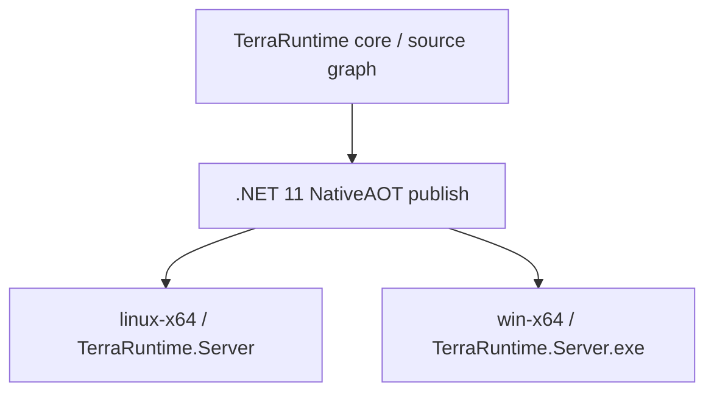
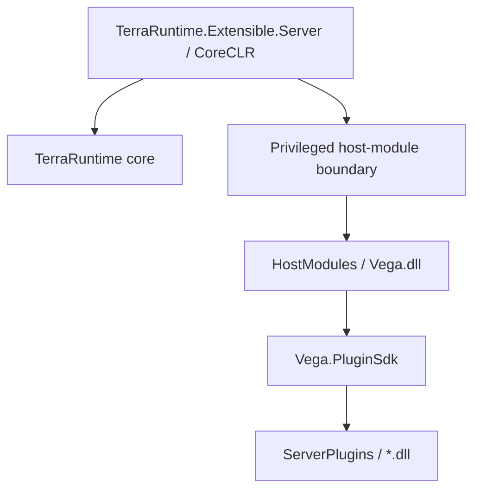
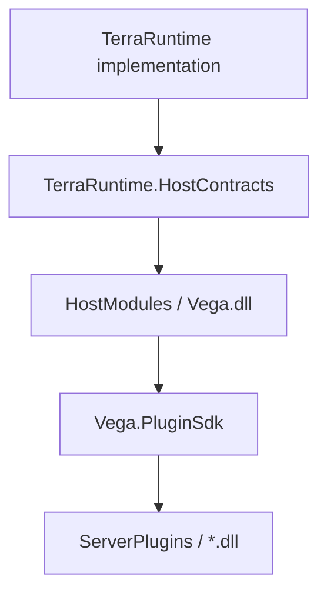

# NativeAOT and CoreCLR hosting baseline

TerraRuntime targets **.NET 11** and deliberately supports two different shipping profiles because the requirements for a pure NativeAOT runtime and a drop-in managed DLL plugin host are not the same.

NativeAOT remains a first-class production capability and CI contract for the TerraRuntime core. The Vega-enabled extensible server uses CoreCLR so it can load ordinary managed DLL plugins, use collectible `AssemblyLoadContext` and retain hot replacement.

This is an architectural split, not a temporary workaround.

See [`roadmap/runtime-host-plugin-architecture.md`](roadmap/runtime-host-plugin-architecture.md) for the complete host/plugin trust model.

## Shipping profiles

### NativeAOT standalone profile

TerraRuntime must continue to publish as a native executable:



This profile has no arbitrary managed plugin loading. It is intended for runtime-only deployments, native smoke testing, benchmarking and environments that do not require the Vega managed plugin ecosystem.

The current NativeAOT publish and runnable-artifact mechanism remains valid and must not be removed merely because an extensible CoreCLR host is introduced.

### Extensible Vega profile

The normal plugin-enabled topology is a .NET 11 CoreCLR host:



Vega is a trusted host module, not an ordinary plugin. Ordinary plugins compile against `Vega.PluginSdk` and do not receive TerraRuntime implementation objects or mutable authoritative state.

The CoreCLR production baseline is:

```xml
<ServerGarbageCollection>true</ServerGarbageCollection>
<TieredCompilation>true</TieredCompilation>
<TieredPGO>true</TieredPGO>
<PublishReadyToRun>true</PublishReadyToRun>
```

These defaults are benchmarkable policy. They may change only when production-like measurements demonstrate a better configuration.

ReadyToRun reduces cold-start JIT work while Tiered Compilation and Dynamic PGO remain free to optimize hot methods from real process behavior. Server GC is the default GC policy for the long-lived server workload.

## Contract and trust boundaries



`TerraRuntime.HostContracts` is privileged and narrow. It may expose snapshots, lifecycle notifications, command ingress and controlled operations required by Vega, but it must not expose mutable runtime collections or implementation classes simply for convenience.

`Vega.PluginSdk` remains the normal public plugin surface. Plugin mutations must cross Vega policy/validation and then enter TerraRuntime through authoritative game-loop commands.

The SDK boundary protects invariants, compatibility and accidental misuse. Same-process managed plugins are not a hostile-code security sandbox; true hostile-code isolation requires a separate process/sandbox and is a different feature.

## Clean deployment layouts

### NativeAOT standalone

The intended standalone NativeAOT deployment root remains a literal filesystem layout:

```text
TerraRuntime.Server[.exe]
Worlds/
config/
data/
logs/
```

A NativeAOT `dotnet publish` writes directly to the runnable artifact root selected by `PublishDir`. The repository/CI convention is `artifacts/native-aot/<RuntimeIdentifier>/`.

That directory is the deployment directory, not an SDK staging tree. Release `*.pdb`/`*.dbg` symbols are excluded, runtime-owned directories are created during publish, and CI rejects unexpected root entries. If the native server accidentally starts depending on a loose managed sidecar, the smoke gate must fail.

### Extensible CoreCLR host

The managed profile keeps a clean human-facing root:

```text
TerraRuntime/
├── TerraRuntime.Extensible.Server.exe
├── runtime/              # reserved for deliberately external sidecar dependencies
├── HostModules/
│   └── Vega.dll
├── ServerPlugins/
│   └── *.dll
├── Worlds/
├── config/
├── data/
└── logs/
```

The current production publish is self-contained and single-file, so framework/runtime assemblies required for startup are bundled into the executable rather than copied as loose DLLs. `runtime/` is still created as the explicit location for any future dependency that must remain external. Loose framework/runtime libraries must not flood the root directory.

The repository/CI convention is `artifacts/coreclr/<RuntimeIdentifier>/`.

Release debug symbols and developer-only files are excluded from that runnable artifact. CI copies a host-module fixture into `HostModules/` and starts the executable from the artifact root, proving that the directory can be deployed and launched directly.

## AOT-safe core design rules

The TerraRuntime core and NativeAOT shipping graph must not depend on runtime features that require a JIT or arbitrary managed assembly loading.

Do not introduce these into the AOT/core graph:

- `Assembly.Load*` or arbitrary managed DLL loading;
- collectible/dynamic plugin `AssemblyLoadContext` use;
- `Reflection.Emit`;
- `DynamicMethod`;
- runtime code generation;
- expression-tree compilation that requires generated IL;
- reflection-based serializers without an explicit trimming/AOT contract;
- runtime assembly scanning as a registration mechanism.

Prefer explicit/static registration, compile-time generated registries, source generators, `System.Text.Json` source generation, typed protocol codecs, `Span<T>`/`ReadOnlySpan<T>`/`IBufferWriter<T>` and bounded buffers, and BCL functionality over unnecessary dependencies.

The deliberate exceptions for managed DLL discovery/loading and collectible `AssemblyLoadContext` belong only to the CoreCLR host/plugin layer. They must not leak into TerraRuntime simulation, networking, protocol, world or other core projects.

## Dependency admission gate

Every dependency that enters the NativeAOT/core shipping graph must pass:

1. .NET 11 build with AOT/trimming analyzers enabled;
2. NativeAOT publish for every supported native RID;
3. zero unexplained trim/AOT warnings;
4. startup of the produced native executable;
5. an exercised smoke path through the dependency, not merely successful linking;
6. repeat validation on package upgrades.

CoreCLR-only plugin-host dependencies are evaluated separately and must remain outside the NativeAOT graph.

The current dependency audit is recorded in [`aot-dependency-audit.md`](aot-dependency-audit.md).

## CI contract

The expected CI matrix is a literal list of gates rather than a process diagram:

```text
build + tests
NativeAOT linux-x64 + native smoke from artifacts/native-aot/linux-x64
NativeAOT win-x64 + native smoke from artifacts/native-aot/win-x64
CoreCLR linux-x64 + host-module smoke from artifacts/coreclr/linux-x64
CoreCLR win-x64 + host-module smoke from artifacts/coreclr/win-x64
```

The extensible host adds its own CoreCLR build, plugin-load and hot-reload tests rather than replacing the native jobs.

A change to TerraRuntime core that cannot satisfy NativeAOT is an architectural regression unless the core architecture itself is deliberately changed.

## Project policy

AOT/trimming analyzers remain mandatory for TerraRuntime core projects and the NativeAOT host graph.

When the CoreCLR plugin host is introduced, its dynamic loading code must be isolated in explicitly CoreCLR-only host projects. Do not weaken AOT analysis across the entire source tree merely to make `AssemblyLoadContext` warnings disappear.

The current standalone NativeAOT host may continue to set `PublishAot=true` and `IlcTreatWarningsAsErrors=true`. The extensible CoreCLR host instead uses the production JIT baseline documented above.

## Performance comparison

NativeAOT and CoreCLR are both measured, not treated as religions.

Compare at least startup to `NetworkReady`, idle CPU/RSS, mean and $p_{95}/p_{99}$ tick latency, allocation rate/GC pauses, packet throughput, $24$-player realistic load, high-connection stress and CoreCLR plugin-dispatch overhead.

For Vega-enabled deployments, sustained game-server performance plus drop-in DLL extensibility is the governing target. For runtime-only deployments, NativeAOT remains a first-class production option and architectural quality gate.

## Process boundaries

Neither NativeAOT nor CoreCLR requires TerraRuntime simulation to be split across processes. The authoritative game loop remains in-process with the host unless a real isolation or operational requirement justifies another process.

Optional transport/sandbox processes may exist for isolation, tooling or operations, but IPC is not introduced into the normal gameplay hot path merely to satisfy a runtime-label preference.
