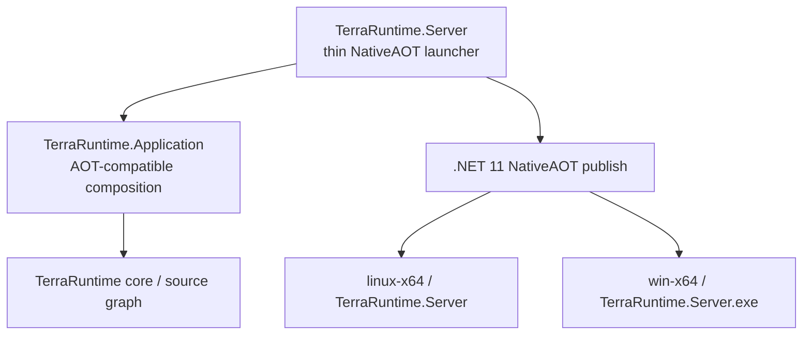
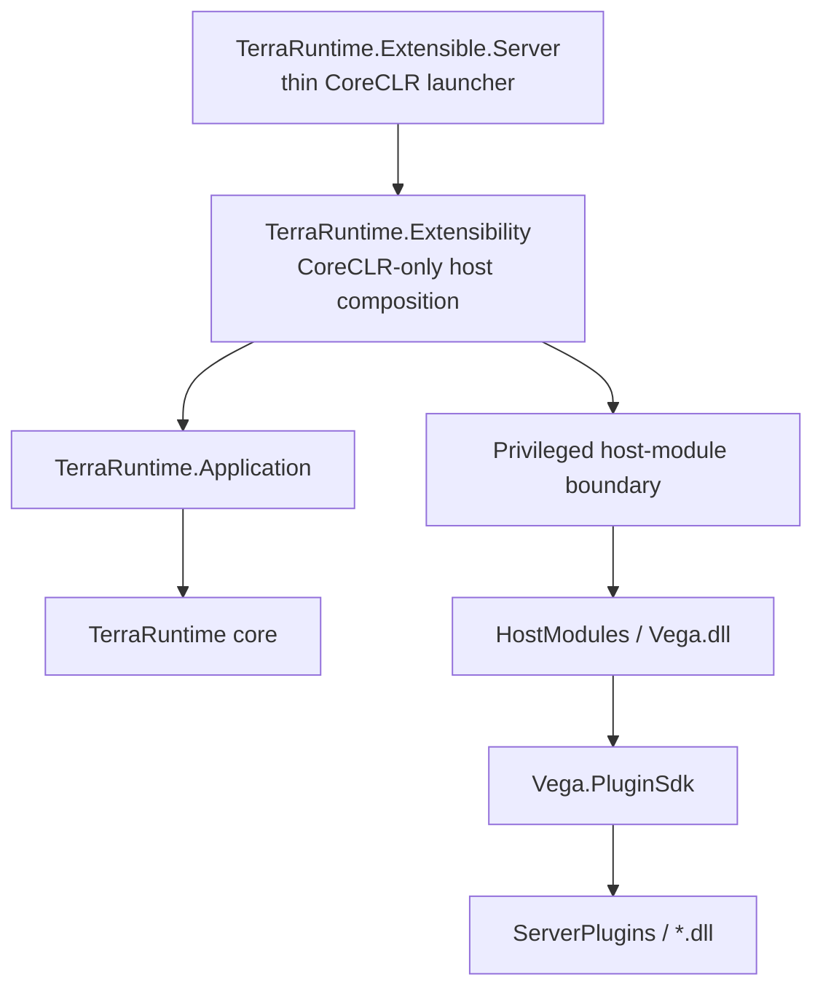
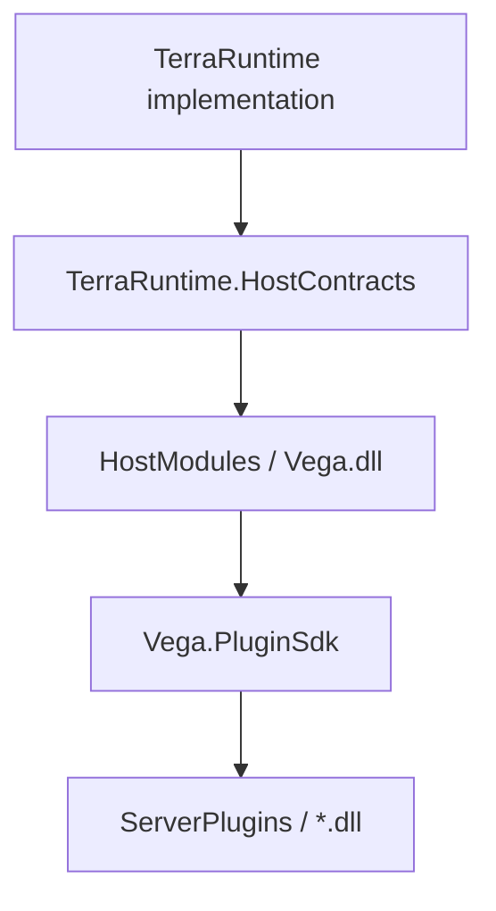

# NativeAOT and CoreCLR hosting baseline

2026-10-06 fourteenth NPC checkpoint is locally accepted on baseline `44890f09`: all registered town-specific reward tables now use the common lethal-strike and ordered Doll-batch pipeline, including exact resident names, source Hardmode gates, Party Girl stack bounds and interleaved item/prefix/velocity RNG. Standard server composition explicitly owns the original default English loot-name profile; unknown custom locale/nonempty names remain fenced. Travelling Merchant368 remains pure-table-only, without actor/AI/lifecycle admission. The shared death-owner guard now completes external dependency reads before its final direct NPC/prelude/progression checks; an unchanged name callback can no longer admit a stale Hardmode/world reward plan. Full **1562791/1562792** checks pass in **553.030 s**, zero failures/errors and the one pre-existing canonical liquid skip. Focused **8794/8794** pass. Release rebuild has zero warnings/errors; Windows NativeAOT/five smokes, 49 CI-tool regressions and documentation/domain/graph/diff gates pass. Immutable source/test SHA256 `e13c4ebdd6ecfb1d1541d3690f582e75b2b74d169ed1d8d3f4f466be1216c4cc` stayed unchanged. Evidence `.cache/npc-town-rewards-fourteenth-v3-final-status.json`. Independent original evidence: 3060 ordered tables across two reference cultures,12 drop defaults/natural and valid prefixes,1620 admitted whole lethal strikes,280 whole Doll batches,14 independently captured migrations of previously fenced victims and31 actual packet21/22 rows. Copied controls detect incorrect rule order, names, unknown locale, Hardmode, stack range and stale dependencies; restored copies pass. The first focused snapshot8791/8792 is rejected and preserved: its only failure was an obsolete exact callback-read count; the guard still rejects at the second-read mutation, while the corrected assertion admits the necessary final recapture. The v2 full snapshot1562790/1562792 is rejected and preserved losslessly: its single failure exposed an existing King Slime test fixture with missing player-health packet16. Seed7 reproduces the refusal on both checkpoint13 and14; all128 seeds accept with the real pending health command. The v3 fixture supplies that command and fixes seed7 without weakening any production guard or loot/wire/lease assertion. Windows NativeAOT evidence is retained from v2 only after all13 shipping assemblies were verified byte-identical; the production executable SHA256 is recorded in the acceptance status. No new production dependency or project edge;15 projects/29 edges. FullVanillaAiParity remains false; broad N1-N5, remaining actor families, wider status/environment/scheduling/wire phases, unowned locale/imported-name contexts and genuine Linux NativeAOT stay open. Commit/push follows local acceptance without waiting for GitHub CI.

2026-10-06 thirteenth NPC checkpoint is locally accepted on baseline `2d71e8d8`: ordered multi-Guide Doll batches with Wall continuation and additional town victims, shared dedicated town death HitEffect RNG, bound Torch/Blue/Lava status and fatal debuff prepass, source cobweb frame-bank ownership and bounded recursive liquid destruction. Full **1557700/1557701** checks pass in **599.709 s**, with zero failures/errors and the one pre-existing canonical liquid skip. Focused checks **7585/7585** pass. Release rebuild has zero warnings/errors; Windows NativeAOT and all five smokes, 49 CI-tool regressions and documentation/graph/domain/diff gates pass. Immutable production/test SHA256 `fe4142f06e42e34463e19d757c7c0649652434b26786922a2c7f81b9b01bc014` stayed unchanged throughout acceptance. Evidence `.cache/npc-batch-status-web-thirteenth-final-status.json`. Source evidence includes 960 whole Doll batches, 40 town loot registries, 400 town HitEffect calls and 72 whole town-victim burns, 14 status sequences/346 phases, 24 fatal debuff updates and 102 web profiles (70 exact matches, 32 atomic refusals). Independent 761-row numeric SetDefaults manifest covers all 696 positive and 65 signed identities; 394 positive definitions and 36 signed variants are admitted, with 297 valid positive and 29 signed definitions absent. Definition admission is not full behavioral parity. Graph remains 15 projects/29 edges, with no new production dependency. FullVanillaAiParity remains false and broad N1-N5 remain open. Named/nonempty town rewards, unsupported locale/name contexts, generic tile/shape/Echo framing, unowned frame banks/protection history, broader status/contact/scheduling/wire contexts and genuine Linux NativeAOT remain open. Commit/push follows local acceptance without waiting for GitHub CI.

2026-10-05 twelfth NPC checkpoint is locally accepted on baseline `f3506ad6`: bounded continuous NPC-facing player life, atomic one-Guide Doll removal/death/Wall continuation, shared town-strike AI/RNG reaction, generation-owned Guide-name/GreenCap loot and physical Herb/Web Slime producers. Full **1554566/1554567** checks pass in **582.637 s**, with zero failures/errors and the one pre-existing canonical world-generation liquid skip. Release rebuild has zero warnings/errors; Windows NativeAOT and all five smokes pass. CI-tool, documentation, graph, domain and diff gates pass. Immutable production/test SHA256 `d0ccb7dc948d00f028e00b9563ff0b32c5b3d990e93abc4792077d15d839de83`; evidence `.cache/npc-health-burn-producers-twelfth-v3-final-status.json`. Original evidence: 16 continuous player sequences/18080 phases, 24 Spawn and 176 paired DropHeals;936 complete burns including416 preserved multi-victim outcomes;240 town strikes;86 slime producer,22 herb placement and10 source recipient cases. Copied regressions fail the former mistakes and restored copies pass. Two diagnostics were rejected for missing tracked fixture registrations and an obsolete always-invalidated player-life expectation; their artifacts are preserved. Graph remains15 projects/29 edges with no new production dependency. FullVanillaAiParity remains false; multi-Guide/additional-town-victim batches, unknown Guide identity, Torch status/DoT, wider web framing, unsupported player-health contexts and broader N1-N5 remain open. Genuine Linux NativeAOT is not locally accepted. Commit/push follows local acceptance without waiting for GitHub CI. Details: [owned health and producers](en/npc-owned-health-and-producers-1458.md).

2026-10-05 eleventh gameplay/NPC checkpoint is locally accepted on baseline `2e1985f6`: 43 Zombie/Skeleton loot tables (32 existing actors, 11 pure-table-only identities), source-ordered dedicated HitEffect RNG, loaded Hardmode/Skeletron and effective GoodWorld/ExtraGel loot context, current-life provenance at the NPC phase, raw-player AI002 targeting and distinct Bee AI005 including the actual ascending Hive-child NPC pass. Full **1553881/1553882** tests pass in $537.539\,\mathrm{s}$, with zero failures/errors and 1 pre-existing canonical world-generation liquid skip. Release rebuild has zero warnings/errors; Windows NativeAOT/five smokes and documentation/domain/graph/diff gates pass. Immutable production/test SHA256 `2f87739d3ef28db23bc039976a88a2d34af3647d7abe94f8aa84108323d357d4`. Evidence `.cache/undead-raw-flight-eleventh-final-status.json` and `.cache/undead-raw-flight-eleventh-accepted-tests-20261005.xml`. Original source captures and copied regression controls cover table/RNG ordering, loaded-world gates, stale player-life reports, raw None/255 targeting, peer ownership and child phase ordering. Graph remains 15 projects/29 edges; no production dependency or world-file format changed. FullVanillaAiParity remains false. Broad N1-N5, remaining individual loot/encounters, dynamic Skyblock lowTiles, incomplete open Void Bag storage, continuous remote current-life simulation, unowned aggro/history/peer/environment contexts, town lethal/wet/special contexts and complete NPC wire cadence remain open. Genuine Linux NativeAOT is not locally accepted. Commit/push follows local acceptance without waiting for GitHub CI, as explicitly requested. Preserve earlier accepted artifacts. Next cache-only plan: `.cache/gameplay-npc-next-checkpoint-plan.md` prioritizes genuine remote NPC-facing current-life production and whole Guide Doll burn/death/summon admission, alongside remaining AI001 producers and AI003 families. It is planning, not acceptance.

TerraRuntime targets **.NET 11** and deliberately supports two different shipping profiles because the requirements for a pure NativeAOT runtime and a drop-in managed DLL plugin host are not the same.

NativeAOT remains a first-class production capability and CI contract for the TerraRuntime core. The Vega-enabled extensible server uses CoreCLR so it can load ordinary managed DLL plugins, use collectible `AssemblyLoadContext` and retain hot replacement.

This is an architectural split, not a temporary workaround.

See [`roadmap/runtime-host-plugin-architecture.md`](roadmap/runtime-host-plugin-architecture.md) for the complete host/plugin trust model.

## Shipping profiles

### NativeAOT standalone profile

TerraRuntime must continue to publish as a native executable:


```mermaid
flowchart TD
    Launcher["TerraRuntime.Server
thin NativeAOT launcher"] --> App["TerraRuntime.Application
AOT-compatible composition"]
    App --> Core["TerraRuntime core / source graph"]
    Launcher --> Publish[".NET 11 NativeAOT publish"]
    Publish --> Linux["linux-x64 / TerraRuntime.Server"]
    Publish --> Windows["win-x64 / TerraRuntime.Server.exe"]
```

This profile has no arbitrary managed plugin loading. It is intended for runtime-only deployments, native smoke testing, benchmarking and environments that do not require the Vega managed plugin ecosystem.

The current NativeAOT publish and runnable-artifact mechanism remains valid and must not be removed merely because an extensible CoreCLR host is introduced.

### Extensible Vega profile

The normal plugin-enabled topology is a .NET 11 CoreCLR host:


```mermaid
flowchart TD
    Server["TerraRuntime.Extensible.Server
thin CoreCLR launcher"] --> Ext["TerraRuntime.Extensibility
CoreCLR-only host composition"]
    Ext --> App["TerraRuntime.Application"]
    App --> Core["TerraRuntime core"]
    Ext --> Boundary["Privileged host-module boundary"]
    Boundary --> Vega["HostModules / Vega.dll"]
    Vega --> Sdk["Vega.PluginSdk"]
    Sdk --> Plugins["ServerPlugins / *.dll"]
```

Vega is a trusted host module, not an ordinary plugin. Ordinary plugins compile against `Vega.PluginSdk` and do not receive TerraRuntime implementation objects or mutable authoritative state.

The CoreCLR production baseline is:

```xml
<ServerGarbageCollection>true</ServerGarbageCollection>
<TieredCompilation>true</TieredCompilation>
<TieredPGO>true</TieredPGO>
<PublishReadyToRun>true</PublishReadyToRun>
```

These defaults are benchmarkable policy. They may change only when production-like measurements demonstrate a better configuration.

ReadyToRun reduces cold-start JIT work while Tiered Compilation and Dynamic PGO remain free to optimize hot methods from real process behavior. Server GC is the default GC policy for the long-lived server workload.

## Contract and trust boundaries


```mermaid
flowchart TD
    Impl["TerraRuntime implementation"] --> Contracts["TerraRuntime.HostContracts"]
    Contracts --> Vega["HostModules / Vega.dll"]
    Vega --> Sdk["Vega.PluginSdk"]
    Sdk --> Plugins["ServerPlugins / *.dll"]
```

`TerraRuntime.HostContracts` is privileged and narrow. It may expose snapshots, lifecycle notifications, command ingress and controlled operations required by Vega, but it must not expose mutable runtime collections or implementation classes simply for convenience.

`Vega.PluginSdk` remains the normal public plugin surface. Plugin mutations must cross Vega policy/validation and then enter TerraRuntime through authoritative game-loop commands.

The SDK boundary protects invariants, compatibility and accidental misuse. Same-process managed plugins are not a hostile-code security sandbox; true hostile-code isolation requires a separate process/sandbox and is a different feature.

## Clean deployment layouts

### NativeAOT standalone

The intended standalone NativeAOT deployment root remains a literal filesystem layout:

```text
TerraRuntime.Server[.exe]
Worlds/
config/
data/
logs/
```

A NativeAOT `dotnet publish` writes directly to the runnable artifact root selected by `PublishDir`. The repository/CI convention is `artifacts/native-aot/<RuntimeIdentifier>/`.

That directory is the deployment directory, not an SDK staging tree. Release `*.pdb`/`*.dbg` symbols are excluded, runtime-owned directories are created during publish, and CI rejects unexpected root entries. If the native server accidentally starts depending on a loose managed sidecar, the smoke gate must fail.

### Extensible CoreCLR host

The managed profile keeps a clean human-facing root:

```text
TerraRuntime/
├── TerraRuntime.Extensible.Server.exe
├── runtime/              # reserved for deliberately external sidecar dependencies
├── HostModules/
│   └── Vega.dll
├── ServerPlugins/
│   └── *.dll
├── Worlds/
├── config/
├── data/
└── logs/
```

The current production publish is self-contained and single-file, so framework/runtime assemblies required for startup are bundled into the executable rather than copied as loose DLLs. `runtime/` is still created as the explicit location for any future dependency that must remain external. Loose framework/runtime libraries must not flood the root directory.

The repository/CI convention is `artifacts/coreclr/<RuntimeIdentifier>/`.

Release debug symbols and developer-only files are excluded from that runnable artifact. CI copies a host-module fixture into `HostModules/` and starts the executable from the artifact root, proving that the directory can be deployed and launched directly.

## AOT-safe core design rules

The TerraRuntime core and NativeAOT shipping graph must not depend on runtime features that require a JIT or arbitrary managed assembly loading.

Do not introduce these into the AOT/core graph:

- `Assembly.Load*` or arbitrary managed DLL loading;
- collectible/dynamic plugin `AssemblyLoadContext` use;
- `Reflection.Emit`;
- `DynamicMethod`;
- runtime code generation;
- expression-tree compilation that requires generated IL;
- reflection-based serializers without an explicit trimming/AOT contract;
- runtime assembly scanning as a registration mechanism.

Prefer explicit/static registration, compile-time generated registries, source generators, `System.Text.Json` source generation, typed protocol codecs, `Span<T>`/`ReadOnlySpan<T>`/`IBufferWriter<T>` and bounded buffers, and BCL functionality over unnecessary dependencies.

The deliberate exceptions for managed DLL discovery/loading and collectible `AssemblyLoadContext` belong only to the CoreCLR host/plugin layer. They must not leak into TerraRuntime simulation, networking, protocol, world or other core projects.

`TerraRuntime.Application` is the shared AOT-compatible server composition assembly used by both shipping profiles. `TerraRuntime.Server` delegates to it directly. `TerraRuntime.Extensible.Server` delegates only to CoreCLR-specific `TerraRuntime.Extensibility`, which layers trusted module loading over `TerraRuntime.Application`. Neither reusable composition layer references a shipping executable, and the NativeAOT graph never references `TerraRuntime.Extensibility`.

## Dependency admission gate

Every dependency that enters the NativeAOT/core shipping graph must pass:

1. .NET 11 build with AOT/trimming analyzers enabled;
2. NativeAOT publish for every supported native RID;
3. zero unexplained trim/AOT warnings;
4. startup of the produced native executable;
5. an exercised smoke path through the dependency, not merely successful linking;
6. repeat validation on package upgrades.

CoreCLR-only plugin-host dependencies are evaluated separately and must remain outside the NativeAOT graph.

The current dependency audit is recorded in [`aot-dependency-audit.md`](aot-dependency-audit.md).

## CI contract

The expected CI matrix is a literal list of gates rather than a process diagram:

```text
build + tests
NativeAOT linux-x64 + native smoke from artifacts/native-aot/linux-x64
NativeAOT win-x64 + native smoke from artifacts/native-aot/win-x64
CoreCLR linux-x64 + host-module smoke from artifacts/coreclr/linux-x64
CoreCLR win-x64 + host-module smoke from artifacts/coreclr/win-x64
```

The extensible host adds its own CoreCLR build, plugin-load and hot-reload tests rather than replacing the native jobs.

A change to TerraRuntime core that cannot satisfy NativeAOT is an architectural regression unless the core architecture itself is deliberately changed.

## Project policy

AOT/trimming analyzers remain mandatory for TerraRuntime core projects and the NativeAOT host graph.

When the CoreCLR plugin host is introduced, its dynamic loading code must be isolated in explicitly CoreCLR-only host projects. Do not weaken AOT analysis across the entire source tree merely to make `AssemblyLoadContext` warnings disappear.

The current standalone NativeAOT host may continue to set `PublishAot=true` and `IlcTreatWarningsAsErrors=true`. The extensible CoreCLR host instead uses the production JIT baseline documented above.

## Performance comparison

NativeAOT and CoreCLR are both measured, not treated as religions.

Compare at least startup to `NetworkReady`, idle CPU/RSS, mean and $p_{95}/p_{99}$ tick latency, allocation rate/GC pauses, packet throughput, $24$-player realistic load, high-connection stress and CoreCLR plugin-dispatch overhead.

For Vega-enabled deployments, sustained game-server performance plus drop-in DLL extensibility is the governing target. For runtime-only deployments, NativeAOT remains a first-class production option and architectural quality gate.

## Process boundaries

Neither NativeAOT nor CoreCLR requires TerraRuntime simulation to be split across processes. The authoritative game loop remains in-process with the host unless a real isolation or operational requirement justifies another process.

Optional transport/sandbox processes may exist for isolation, tooling or operations, but IPC is not introduced into the normal gameplay hot path merely to satisfy a runtime-label preference.
