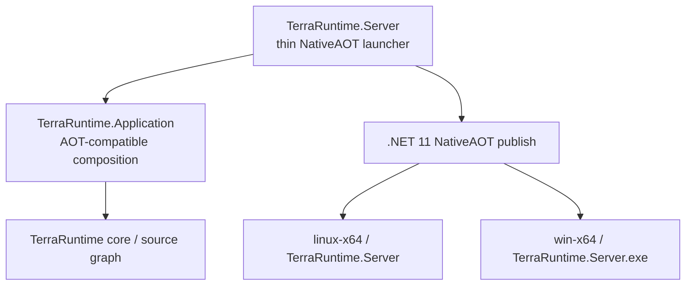
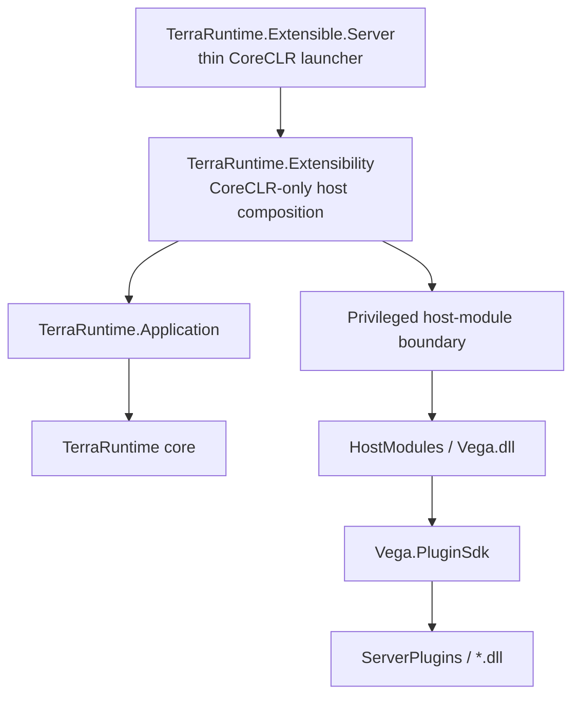
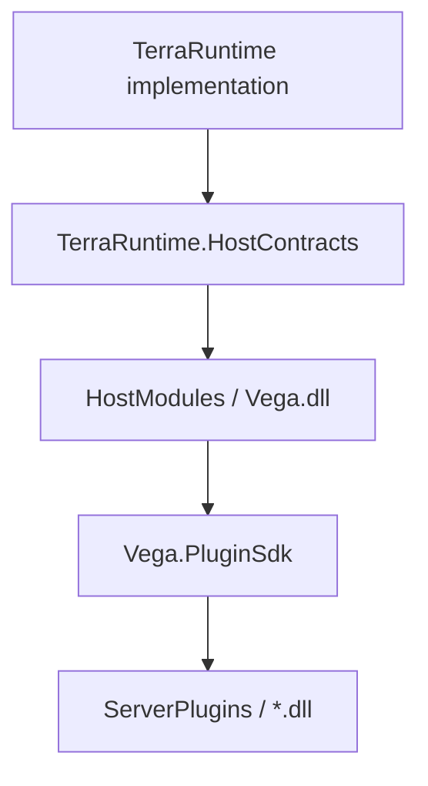

# NativeAOT and CoreCLR hosting baseline

## Current Bot ranged-use custody and Arcane mana — 2026-10-10, accepted local checkpoint

Trusted Bot ranged attacks prepare ammo, held-item controls, animation, one projectile birth, combat provenance and replication baselines before publication. The existing prepared player-item owner and count-one projectile birth journal retain exact actor, inventory and allocator guards. Provider calls finish before target and predictive terrain revalidation and the final pure guards. Rejected allocation changes no ammo, player revision, presentation or attack clock. Accepted owners adopt without callbacks; existing generation-aware item-use cadence and Bot clocks are accepted before observers. Returning the explicit accepted result prevents automatic fallback or a rewound callback clock from producing a second shot. At the scoped attack boundary the producer recaptures the same exact known-living actor, so preceding same-tick navigation, hostility and self-care revisions feed the actual aim and strict preparation snapshot. Current actor/death/health guards remain; the prepared whole-state guard is not relaxed.

Notifications attempt held movement and presentation, projectile birth, then the accepted ammo component. Independent content/generation guards preserve newer callback state; remaining current notifications are attempted after an observer throws, then the first exception propagates. Projectile combat trust exists before the birth observer. The existing birth journal seals exact endpoint and playing-occupation recipients after external providers and before owner writes. A provider-time newcomer receives one birth; an observer-time newcomer receives the adopted baseline once. Replaced endpoints or disconnected/restarted occupations cannot receive the stale offer. The existing endpoint owner uses one immutable occupation reference with compare/exchange clearing; no separate connection registry is introduced. Administrative/default trusted spawn behavior remains unchanged. The Bot policy still consumes one ammo item per predictive projectile; original Minishark conservation, spread RNG and complete source Shoot geometry are separate work. Six repeated configured original Shoot/explicit-sync records establish component ammo-at-birth and publication ordering, not natural client or whole Main acceptance.

Arcane prefix66 contributes20 mana per effective supported accessory through the existing common equipment selection loop. The bounded remote player phase admits it on156/3212; known PrefixNone156/3212 in vanity13..19 can block corresponding inherited favorites. Locked slots, source inheritance and early dead/ghost/outside branches retain their existing owners. Living mana maximum derives from retained base plus the effective bonus, capped at400 before regeneration. Base packet42 state and regeneration count/delay are not reset. A long intermediate preserves the previous400 clamp for manually imported extreme base values; this is a runtime safety contract, not original packet42 parity for intMax.

Independent original evidence contains25 profiles plus28 additive matched vanity blocker/control profiles, each32 phases on Linux original and genuine Windows CLR4, independently repeated. The five grouped durable Facts cover Bot custody and remote Arcane phases. The existing defensive integration Fact now compares both unchanged original Arcane rows through all24 phases, retaining the two Ankh refusals (672 compared phases, two refusals). The first combined focused run stopped at18480/18482 with these two integration mismatches; no unfiltered full ran. Original failures remain preserved; corrected candidate acceptance uses a fresh v2 snapshot. Numeric source fixtures retain their configured-component scope: direct armor setup is not captured packet5/42 transport, and broader accessories/prefixes, full human inventory/ammo authority and whole Main remain open.

Release Rebuild has zero warnings/errors; focused18482/18482 passes. ONE unfiltered full passes1563131/1563132, zero failures/errors, one known canonical-liquid skip; runner552.573 seconds. Fresh shipping WindowsNativeAOT and five smokes pass. Exact typed managed/fresh WindowsNative Bot custody executes both promoted Fact methods/assertions and six embedded chronology references:5786 checks each. Sixteen copied omissions cause assertion failures without runner errors; restored two Facts pass. Arcane durable managed three Facts retain actual State.Tick, direct full56/cursor and full44 indexed buff comparison every actor phase;3392 source phases and eight detected omissions. Its separate typed managed/fresh WindowsNative direct PlayerAuthority.TickRemotePlayerPhase verification passes956618 checks each over3392 source phases, public HasSameState offer checks and final full44 actor detach snapshots; this does not claim State.Tick or direct original56 introspection in Native. Both fresh AMD64 typed executables have zero CLR directory and verify all32 accepted shipping references before/after. Release/Native live82/49 pass:15 sections/client,312 frames before49,129/relay/chat82 and clean process stop. CI-tools/docs/graph/domain/diff pass. LinuxNativeAOT remains locally unverified; GitHub CI is not awaited. Source/test SHA256 `7d44762f24d2e541a311d585411c24d222544b8dad8b3d66c863b5331989e36a`; production SHA256 `c17412b796a6dad29251050839b253993cdbfa19f42d89dc9c1749ae1a9cc030`. No new project edge, RNG owner or performance improvement is claimed.

Evidence: `.cache/bot-ammo-arcane-block-v2-status.json`, `.cache/bot-ammo-arcane-block-v2-full-tests/result.json`, `.cache/bot-ammo-arcane-shipping-bin-v2/shipping-freeze.json`, `.cache/bot-ammo-arcane-shipping-native-v2/freeze-manifest.json`, `.cache/arcane-derived-mana-native-preparation/freeze-manifest.json`, `.cache/bot-ammo-arcane-block-live-v2/results.json`, `.cache/bot-ammo-independent-tests/final-freeze-v6-manifest.json`, `.cache/bot-ammo-atomic-prototype-v1/CacheV6/regression-proof.json`, `.cache/bot-ammo-birth-order-next-proof/manifest.json`, `.cache/arcane-derived-mana-prototype-v1/final-freeze-manifest.json`, `.cache/arcane-derived-mana-prototype-v1/root-eof-normalization.json`, `.cache/arcane-vanity-blockers-next-proof/manifest.json`, `.cache/arcane-defensive-adjacent-migration/freeze-manifest.json`.

Resume: next block validates actual selected held-weapon identity/prefix and ammo against configured Bot intent using the existing inventory census. Original outer ItemCheck evidence is frozen in `.cache/bot-held-outer-itemcheck-next-proof/manifest.json`; its14 cases/platform, first/repeat56 calls, establish selected-slot behavior separately from the private Shoot chronology. Human Archery/Wrath phase and launch preparation remains cache-only. Broader human inventory/ammo, combat/buffs, events/progression and full NPC AI remain open.

## Current trusted Bot partial pickup — 2026-10-10, accepted local checkpoint

The connected pickup block accepts the useful portion of a world stack and distributes it over a bounded unique-slot journal. Required ammo visits54..57 then1..49; other useful items visit1..49. Matching stacks precede empty slots; held slot0 remains protected. These are existing restricted Bot policies, not complete original GetItem ordering/favorite semantics. Existing useful-item, prefix, ownership, delay, shimmer, intersection and lease admission remains; malformed incoming stacks above9999 refuse before adoption.

The existing prepared player-item owner validates every old/normalized next tuple, stages one complete dictionary and independent accepted-content census, then adopts all slots in one player revision. The generic journal retains the existing990-slot bound; the Bot producer uses at most53 storage slots. Existing single-item consumable behavior remains. The existing world allocation preview stages the accepted amount: full take keeps ordinary removal semantics; partial take preserves generation/body and advances revision through the existing Drop owner. Saturated partial revision refuses while detached. Provider callbacks finish before final player/world/Bot/lease guards; world and player adoption finish without callbacks before the first observer.

The ordered notification journal is consumed before callbacks. Each slot checks concrete actor identity and accepted tuple; a newer later slot suppresses only its stale offer. Remaining valid notifications are attempted after an observer throws, then the first exception is propagated. World residual/removal publication runs independently in finally and uses the existing exact final-world-slot guard. It cannot overwrite callback changes or publish an obsolete world body/generation.

Independent configured original GetItem evidence covers28 catalog identities across168 repeated calls, including capacity9/residual11 and two capacities9+7/residual4. It establishes storage-component arithmetic, not PickupItemFromWorld, SSC, full Main or exact Bot/source ordering. Two grouped durable Facts cover59 actual pickup cases and direct bounded batch contracts, including capacity/fanout, maximum53 journal, protected0, explicit matching-before-empty policy, malformed10000 refusal, first-observer all-owner adoption, newer slot/actor/world state, throws/reentry and provider/lease/Bot currentness. Exact typed positive/restored runs pass2/2. Nine copied typed omissions cause2/2/1/1/1/1/1/1/1 assertion failures, zero runner errors. A separate cache-only managed private-state diagnostic passes1/1; accepted-content alias and world-saturation omissions each cause one assertion failure, zero runner errors. Private reflection is absent from the durable two Facts and Native. Initial fixture/scaffold and unreachable-code duplicate-control compilation failures are retained as diagnostics, excluded from meaningful omission results. Final source copies are restored. Original168 numeric rows preserve full56/public-Next as source-reference equality; they do not establish full runtime GetItem or human pickup authority.

Release Rebuild has zero warnings/errors; focused 18477/18477 passes. ONE unfiltered full passes 1563126/1563127, zero failures/errors, one known canonical-liquid skip; runner $552.801\,\mathrm{s}$. Fresh shipping WindowsNativeAOT and five smokes pass. Typed managed/fresh WindowsNative each pass5039 checks against exact32 references, executing both exact promoted Fact methods/assertions and embedded fixture with no exclusions; source168 capacity references and59 pickup cases remain scoped as above. AMD64 PE has zero CLR directory. Release/Native live82/49 pass:15 sections/client,312 frames before49,129/relay/chat82 and clean stop. CI-tools/docs/graph/domain/diff pass. No dependency/project edge or performance improvement is claimed. LinuxNativeAOT remains locally unverified; GitHub CI is not awaited. Source/test SHA256 `3bc74a252d640676b87be51d0fde2c0c52d28fc342f405e29f0339fe7ddab0cf`; production SHA256 `17d95adf456518b66e9d87657a058300b6aed1a37a907343b5b79ead41d383d1`.

Evidence: `.cache/bot-partial-pickup-block-v1-status.json`, `.cache/bot-partial-pickup-block-v1-full-tests/result.json`, `.cache/bot-partial-pickup-shipping-bin-v1/shipping-freeze.json`, `.cache/bot-partial-pickup-native-preparation/freeze-manifest.json`, `.cache/bot-partial-pickup-block-live-v1/results.json`, `.cache/getitem-storage-next-proof/manifest.json`, `.cache/bot-partial-pickup-next-witness/manifest.json`, `.cache/bot-partial-pickup-prototype-v1/final-candidate-freeze-v3.json`, `.cache/bot-partial-pickup-independent-tests/freeze-manifest.json`, `.cache/bot-partial-pickup-independent-tests/promotion-manifest.json`, `.cache/bot-partial-pickup-independent-review/freeze-manifest.json`.

Resume: next combined block is trusted Bot ranged ammo/held/trusted-projectile/cadence custody plus Arcane derived mana on existing156/3212 effective equipment. Actual current Attack rollback overwrites newer ammo or a replacement actor after rejected spawn; `.cache/bot-ammo-callback-next-witness/manifest.json` pins both failures. Six repeated original Shoot/birth/explicit-sync calls in `.cache/bot-ammo-birth-order-next-proof/manifest.json` establish ammo-at-birth ordering, while Minishark RNG/conservation differs from existing Bot policy. Arcane preparation `.cache/arcane-derived-mana-next-proof/manifest.json` captures25profiles32passes on both original platforms, first/repeat3200calls0errors. Both next prototypes remain cache-only preparation, not accepted shipping support. Human inventory/ammo custody, broader equipment, combat/buffs, events/progression and full NPC AI remain open.

## Current trusted Bot consumable custody — 2026-10-10, accepted local checkpoint

The connected producer block reuses the existing prepared player-item owner with optional normalized vitals. One player revision adopts the staged inventory dictionary and life/mana together. Healing delay and the bounded Archery/Wrath expiry dictionary are staged and adopted before the first item observer. Preparation requires a known living actor, exact actor/generation/revision/items and Bot configuration/goal/observation/tick/delay/effect contents. Expiry overflow refuses before consumption. The optional-vitals path refuses a normalized death transition; it does not own the separate death/buff-reset lifecycle.

Accepted item and vitals notifications have independent component-content and concrete actor guards. An inventory-only callback cannot strand valid vitals publication; newer vitals or a replacement actor suppress stale publication. Offers are consumed before callbacks, including throws/reentry. No rollback can overwrite a callback's newer HP/MP or buff expiry. The outer command refreshes player state and refuses further mana/buff-slot consumption after a callback changes actor generation or Bot command scope. Existing pickup keeps its strict whole-owner publication guard.

Three real old producer witnesses show callback HP/MP or Wrath expiry overwritten. Independent42 repeated direct original QuickHeal/QuickMana/QuickBuff profiles and seven additive clamp calls cover14 catalog potion identities. These are configured source components, not natural client/whole Main captures. Existing runtime admission is three healing/four mana/two combat buff families; the other five source buff identities remain metadata/reference evidence. Bot conservation differs explicitly from original ManaV2=true full-mana consumption. Source Potion Sickness21 and Mana Sickness94 do not become complete runtime buff-owner support through this custody fix. Human client-reported inventory, void/animation/source scheduling, full player buff slots and projectile-ammo producer custody remain open.

Two grouped durable Facts cover callback custody, component publication, continuation mutations and independent source numeric evidence. Exact promoted gzip positive/restored runs pass both Facts; six production omissions cause 2/1/1/2/1/1 assertion failures with zero runner errors. The first five detect producer regressions; the sixth checks the new internal known-health preparation contract. The public observation scope already rejected unknown health. An initial byte-identical old-producer control and initial public-only unknown-health control are preserved as diagnostics, excluded from meaningful omission results. Independent original evidence comprises 42 repeated configured Quick* profiles and seven additive clamp calls, covering 14 catalog identities. These configured component calls do not establish natural client, whole Main or inventory-wire chronology. Existing three healing/four mana/two combat buff admissions and conservation policy remain unchanged; ManaV2 full-mana consumption is an explicit source-policy difference.

Release Rebuild has zero warnings/errors; focused 18475/18475 passes. ONE unfiltered full passes 1563124/1563125, zero failures/errors, one known canonical-liquid skip; runner $534.048\,\mathrm{s}$. Fresh shipping WindowsNativeAOT and five smokes pass. Typed managed/fresh WindowsNative each pass 1224 checks against exact32 references, including the two exact promoted Facts, 14 catalog rows, seven policy-compatible actual Bot clamp cases, four source ordering references and one full-mana policy reference. AMD64 PE has zero CLR directory. Release/Native live82/49 pass:15 sections/client,312 frames before49,129/relay/chat82 and clean stop. CI-tools/docs/graph/domain/diff pass. No dependency/project edge or performance improvement is claimed. LinuxNativeAOT remains locally unverified; GitHub CI is not awaited. Source/test SHA256 `5f1826fa04cba376765bf464c3b3a97135b58d4e621a60c119b5ec3fc1efd9ed`; production SHA256 `b082573a13a384b7f3ed332d8924e03098365e191e82d590ef78a59d26738416`.

Evidence: `.cache/bot-consumable-block-v1-status.json`, `.cache/bot-consumable-block-v1-full-tests/result.json`, `.cache/bot-consumable-shipping-bin-v1/shipping-freeze.json`, `.cache/bot-consumable-native-preparation/freeze-manifest.json`, `.cache/bot-consumable-block-live-v1/results.json`, `.cache/bot-consumable-callback-next-proof/manifest.json`, `.cache/bot-quick-consumable-original-next-proof-v3/manifest.json`, `.cache/bot-quick-consumable-smallmax-next-proof/manifest.json`, `.cache/bot-consumable-atomic-next-prototype/promoted-final-freeze.json`, `.cache/bot-consumable-independent-durable-v2/promotion-manifest.json`, `.cache/bot-consumable-independent-durable-v2/promoted-gzip-controls-final.json`.

Resume: next connected block is trusted Bot partial pickup/fanout with atomic player-slot batch and same-generation world residual. The actual current whole-stack-only producer refuses capacity9 on stack20; independent original storage references accept9 and retain11. Cache preparation preserves protected slot0 and existing Bot ordering explicitly; original168 ordering/favorite references do not establish runtime parity. Human inventory/ammo causality, equipment, combat/buffs, events/progression and full NPC AI remain open.

## Current retained item identity and trusted Bot pickup — 2026-10-10, accepted local checkpoint

The connected inventory block resolves canonical requested Item.SetDefaults identities before packet5 prefix acceptance: six positive replacements and28 deprecated identities that retain Air. A single protocol-neutral Game query owns positive identities; existing signed net-id aliases, ingress stack/prefix clipping and unbound component policy stay with their existing owners. Prefix acceptance uses the retained identity and the existing owned world context/RNG. Server relay canonicalizes deprecated Air; this does not claim the distinct no-relay client path or complete ItemDefaults.

Trusted Bot pickup prepares the next bounded item dictionary and the existing world-item allocation preview before mutation. Both owners are adopted without callbacks before the first inventory observer. Concrete actor/generation/revision, full item state, world item generation and bot configuration/goal/observation/tick guards reject stale preparation. Inventory callback mutations survive; a valid world removal publishes independently even if the inventory callback throws, while a replacement world generation suppresses stale removal. Leases release on every exit. This reuses the existing world publication owner rather than introducing a second world removal implementation.

Independent official source evidence contains all6196 requested identities and328 actual packet5 captures. The admitted server slice is152 rows;12 negative-stack policy references and164 no-relay client rows are separate evidence. Original human pickup emits151/21 before later client inventory reports5/138; default human151 does not grant inventory again. Bot useful-item/slot/full-stack policy remains a conservative host producer, not complete vanilla GetItem parity. Production dictionary preparation/allocation-preview cost is unmeasured; no performance improvement is claimed.

Independent original SetDefaults evidence covers6196 requested identities;328 original GetData5 calls repeat identically. The server slice admits152 literal peer-frame/canonical tuple/full56/public-Next rows;12 negative-stack prior-policy and164 no-relay client rows remain separate references. Game positive/restored19534 checks and omissions yield96/364/10 assertion failures, zero runner errors. App positive/restored39159 checks preserve old168/194/2800 references; both omissions yield one assertion failure with zero runner errors. One grouped durable Fact additionally checks all6196 independent numeric identities/idempotence/bounds and profile/currentness/unbound behavior; no extra theory matrix was added. Two grouped Bot Facts detect old notification order, player ABA, bot configuration and provider lease-owner replacement: omission failures2/1/1/1, zero runner errors. All positive/restored runs pass. Initial Native harness scaffolding failures (missing implicit imports and an anonymous JSON AOT contract) are preserved; corrected typed scaffolding retains assertions. Human pickup chronology is six repeated original calls: full151 or partial21 precedes later5/138, without server inventory mutation from151/21. This does not establish full human inventory custody or source GetItem parity.

Release Rebuild has zero warnings/errors; focused 18473/18473 passes. ONE unfiltered full passes 1563122/1563123, zero failures/errors and one known canonical-liquid skip, runner $625.014\,\mathrm{s}$. Fresh shipping WindowsNativeAOT/five smokes and typed managed/fresh Native31267 checks each pass against exact32 references; AMD64 PE has zero CLR directory. Native covers typed canonical inventory/public seeded-next and five Bot custody scenarios; private full56/literal source relay comparisons and lease/null-dictionary extras remain managed evidence. Release/Native live82/49 pass:15 sections/client,312 frames before49,129/relay/chat82 and clean stop. CI-tools/docs/graph/domain/diff pass. No dependency/project edge added. Genuine LinuxNativeAOT remains locally unverified; GitHub CI is not awaited. Source/test SHA256 `531e486fe015fc20573854707df3233f3bb6cdfbb7f30f8e6fa11eeb0ee2ba10`; production SHA256 `798b571ed3835fe48648170a92f2f3f37e01ed7333a7ec9a3f8a127cc2b7b048`.

Evidence: `.cache/identity-bot-block-v1-status.json`, `.cache/identity-bot-block-v1-full-tests/result.json`, `.cache/identity-bot-shipping-bin-v1/shipping-freeze.json`, `.cache/packet5-identity-bot-native-preparation/freeze-manifest.json`, `.cache/identity-bot-block-live-v1/results.json`, `.cache/packet5-retained-identity-game-work/freeze-manifest.json`, `.cache/packet5-retained-identity-game-work/promotion/promotion-manifest.json`, `.cache/packet5-retained-identity-app-next-work/freeze-manifest-v2.json`, `.cache/bot-pickup-atomic-lease-v4/promoted-final-freeze.json`, `.cache/packet5-retained-identity-next-proof/manifest.json`, `.cache/inventory-stack-metadata-next-proof/manifest.json`, `.cache/world-item-pickup-chronology-next-proof/manifest.json`.

Resume: next connected block is trusted Bot healing/mana/buff item-and-effect atomic adoption. Actual current producer callbacks overwrite newer HP/MP or buff expiry; three cache witnesses are in `.cache/bot-consumable-callback-next-proof/manifest.json`. Independent42 repeated configured original Quick producer profiles in `.cache/bot-quick-consumable-original-next-proof-v3/manifest.json` are preparation only, not shipping support. Whole human inventory producers/ammo causality, equipment effects, combat/buffs, events/progression and full NPC AI remain open.

## Current packet5 world-context prefixes — 2026-10-10, accepted local checkpoint

Known world context extends received prefix normalization to the25 official ItemVariants identities. WorldRuntime supplies the exact immutable RemixWorld/GetGoodWorld/SkyblockWorld metadata through State/Composition to the first binding of the existing gameplay RNG. Unknown context is distinct from a known normal world. Unknown/custom compositions preserve the nonzero variant fence and868 invariant prefix-capable records; known context resolves all886 prefix-capable records and the seven known nonprefixable variants. Requested zero remains context-independent.

The contextual appendix changes only the numeric inputs needed by Item.Prefix acceptance, reusing the normal family and zero-knockback classification. Mechdusa requires Remix AND GetGood. Neither effective difficulty nor evaluated Skyblock low-tiles conditions stand in for raw world flags. The context is captured in preparation and publication guards; another context cannot replace the first binding. Transfer attaches inventory without rewriting its prefix or consuming either cursor. Subsequent incoming packet5 is normalized using the destination authority's existing context and RNG.

The independent1400 LinuxGetData and1400 genuine Windows CLR4 Prefix references cover all eight contexts and200 source-default cells. Both original captures repeated identically. Game positive/restored44720 checks and five omissions yield11447/24/82/56/1377 assertion failures, zero runner errors. App positive/restored38085 checks and three omissions fail independently. Three grouped durable Facts compare2800 configured item/cursor rows, all1400 realState receipts and eight actualWorldRuntime raw metadata bindings, nullable first-bind/currentness, transfer destination ownership and known-context pending cancellation. On Windows,1368 peer frames match literal LinuxGetData and32 arithmetic differences use WindowsPrefix-only typed/full56 references; no original WindowsGetData frame oracle is invented. Async durable omission controls each yield one assertion failure, zero runner errors; restored3/3 passes. A minimal optional context parameter in the existing pending fixture preserves all old Fact bodies/assertions/goldens. Initial combined v1 stopped at two xUnit1031 analyzer errors before focused/full; replacing blocking transfer waits with await retains the exact checks. The generated appendix reproduces independent200 numeric cells with canonical UTF-8/LF hashing; three small tool tests include six malformed-input and two line-ending controls.

Release Rebuild has zero warnings/errors; focused 711/711 passes. ONE unfiltered full passes 1563119/1563120 with zero failures/errors and one known canonical-liquid skip, runner $566.598\,\mathrm{s}$. Fresh shipping WindowsNativeAOT/five smokes and typed managed/fresh Native36158 checks each pass against exact32 references; AMD64 PE has zero CLR directory. Native checks use typed canonical inventory and independently captured public Next, not private full56 or literal WindowsGetData. Release/Native live82/49 pass with15 sections/client,312 frames before49,129/relay/chat82 and clean process stop. CI-tools/docs/graph/domain/diff pass. No new dependency/project edge. Genuine LinuxNativeAOT remains locally unverified; GitHub CI is not awaited. Source/test SHA256 `183eb25a227e09b1948568844cdf35cbc81a6c6d4702f1732d6af43bd1803e0c`; production SHA256 `b3b9781b6767e1d87729749d813059a0b4903ad7fd13936db766c043ef7a537a`.

Evidence: `.cache/packet5-world-context-block-v2-status.json`, `.cache/packet5-world-context-block-v2-full-tests/result.json`, `.cache/packet5-world-context-shipping-bin-v2/shipping-freeze.json`, `.cache/packet5-world-context-shipping-native-v1/freeze-manifest.json` (exact v2 shipping snapshot), `.cache/packet5-world-context-block-live-v2/results.json`, `.cache/packet5-worldvariant-eight-context-proof/manifest.json`, `.cache/packet5-contextual-prefix-game-work-v4/freeze-manifest-v4.json`, `.cache/packet5-app-context-prototype/freeze-manifest-v1.json` and `.cache/packet5-context-durable-preparation/promoted-freeze-manifest.json`.

Resume: next inventory block reviews trusted Bot pickup atomic adoption and requested-versus-retained Item.SetDefaults identities. Source metadata tables are already complete; source client-reported151 removal does not authorize an extra server inventory grant. Those next investigations are cache-only. Whole human inventory producers/ammo causality, full ItemDefaults, combat/buffs and full Main/NPC AI remain open.

## Current packet5 prefix normalization — 2026-10-10, accepted local checkpoint

The connected inventory receive block normalizes supported canonical packet5 prefixes using the existing source-backed numeric acceptance table and the composition's existing gameplay RNG owner. An explicitly requested prefix is tested against item statistics; the family selects a replacement only after rejection. Natural-roll reduced-chance offers do not belong to this positive-request caller. Prefix, inventory/profile, member/input revision, accounting and the cloned cursor are adopted before observers; stale delayed publication is suppressed without rewinding accepted or newer state.

Conservative admission excludes nonzero requests on the25 official ItemVariants identities. The invariant table retains868 prefix-capable records; known canonical nonprefixable items resolve to zero without random offers. Requested zero needs no variant defaults. Unsupported variants and unbound custom owners retain their preceding component policy, with no source-cursor recovery claim. Source Item.Prefix has no finite retry cap; the runtime's256-attempt budget is a selective safety refusal. Exhaustion after admission rejects before live adoption and never falls back to the old normalization policy.

Existing ingress clipping of global prefixes>=98 remains an explicit runtime policy: original GetData/Prefix may retain98/255. Pre-spawn reports, duplicate accepted input revisions and matching packet5 pending-volley cancellation are preserved. Default inventory is still ClientReported with SSCfalse; this block does not establish pickup/crafting producer custody, ammo-report causality, a debt ledger or an effective own5 correction contract. Complete item value/rarity/scale/reuseDelay and retained combat defaults are outside the prefix-byte/cursor boundary. A shared configured cursor is not a whole Main/UpdatePlayers scheduling parity claim.

Independent source168 actual LinuxGetData rows and genuine Windows CLR4 x86 Prefix266 subcalls are frozen separately. Aligned same-seed105 rows/platform expose42 arithmetic differences across21 identities. Of210 aligned references,194 are admitted and16 nonzero variant cases stay reference/early-refusal evidence. Three compact durable Facts cover all59 canonical inventory slots/full56/original public-next, actual bootstrap claimed31 to bound0/literal154 server relays, currentness/prejoin/reentry and same-value5 pending cancellation. Game positive/restored3750 checks and six omissions yield427/250/66/152/2/434 assertion failures with zero runner errors. App positive/restored21276 checks and four copied omissions fail independently; all three durable Facts detect each of those omissions with one assertion failure/zero errors. Initial focused v1 preserves704/708 with four old consumer-negative fixture failures and no full run. Three minimal fixture migrations seed deliberately malformed retained prefix directly in its existing owner, preserving every assertion/source golden. Removing migrations reproduces two Mining/one Metal/one Style1 assertion failures; corrected classes and restored runs pass. This isolates source ItemSpace/phase consumer checks from the newly corrected receive producer.

Release Rebuild has zero warnings/errors; focused 708/708 passes. ONE full suite passes 1563116/1563117 with zero failures/errors and one known canonical-liquid skip, runner $685.374\,\mathrm{s}$. Fresh shipping WindowsNativeAOT/five smokes and typed managed/fresh Native22156 checks each pass against exact32 references; AMD64 PE has zero CLR directory. Native proof uses typed canonical inventory, independent public seeded-next, platform arithmetic and adoption/currentness observers; full56/private guards and literal154 relay bytes remain managed evidence. Release/Native live82/49 pass with15 sections/client,312 frames before49,129/relay/chat82 and clean stop. CI-tools/docs/graph/domain/diff pass. No new dependency/project edge. Genuine LinuxNativeAOT remains locally unverified; GitHub CI is not awaited. Source/test SHA256 `2b70da7cc28b37fe81389a43b7a8b4b4db6a491e024a058cac87bada44c974a7`; production SHA256 `1d4e03c7c410a7f28b68e00c852248893c41d94def27ec4214f0f3e2a2bc46ed`.

Evidence: `.cache/packet5-normalization-block-v2-status.json`, `.cache/packet5-normalization-block-v2-full-tests/result.json`, `.cache/packet5-normalization-shipping-bin-v2/shipping-freeze.json`, `.cache/packet5-normalization-shipping-native-v2/freeze-manifest.json`, `.cache/packet5-normalization-block-live-v2/results.json`, `.cache/packet5-prefix-game-api-work/freeze-manifest.json`, `.cache/packet5-app-promoted-work/freeze-manifest.json` and `.cache/packet5-durable-tests-v2-work/final-freeze-manifest.json`.

Resume: next connected inventory block is world-selected prefix metadata for25 variant identities, using exact owned immutable Remix/GetGood/Skyblock facts. `.cache/packet5-worldvariant-next-proof/manifest.json` and `.cache/packet5-variant-world-context-next-plan.md` are cache preparation only; the accepted nonzero variant fence remains. Whole inventory producers/ammo causality, complete ItemDefaults, combat/buffs and full Main/NPC AI remain open.

## Current retained arrow subupdates — 2026-10-10, accepted local checkpoint

The connected production block stages trusted human Unholy/Jester projectiles4/5 inside their physical-slot subupdates, instead of applying every hit after final movement. The supported source slice uses known plain terrain, raw AI2 bits0/3, neutral retained owner effects and reachable nonlethal canonical Zombie3 targets with known-empty indexed status. Original configured18 contact rows, two no-contact rows and two same-owner second-arrow rows match the real ProjectileAuthority route for mapped projectile/lifecycle state, NPC HP, full56 RNG and literal ordered28/27. Generation1 is explicitly configured in the original source keys, not an allocator claim. Types1/2 remain reference/control rows on their preceding path.

Preparation projects source dust/crit/variation/hit-point offers, stored damage attenuation, AI flags and shared immunity before the next target/subupdate. All projectile/NPC/RNG/status/immunity/interaction owners are adopted before callbacks. Final join baseline is pinned before the first observer; historical27 cannot rewind it, and no-hit motion consumes its source offers without inventing a packet. Binding-only replacement, concrete player/store/RNG identity and exact generation markers protect publication and the following outer combat pass. Existing guarded NPC23 observer policy is separate from the filtered source28/27 comparison; original28 observes pre-Strike HP while runtime observers see all adopted final state.

Deterministic initial penetration/count/lifetime exclusions return early NotApplicable and preserve the preceding compatibility path. A late owned refusal does not fall through to legacy motion or duplicate hits. Subsequent ticks age and retire both arrows; the abandoned late-terminal design is detected by three durable assertion failures, and its evidence is preserved. Legacy human expiry clears its key/baseline using Remove, differing from original terminal29/visual RNG. Semantic Kill/tile collisions/lethal or other intersecting NPCs/PvP, persistent NumHits/oldPosition, complete NPC post-strike body, complete inventory/equipment custody and whole Main/client scheduling remain open. Original Linux components configured local0/my0/net2 headless on Windows are not natural remote-human, original Windows CLR4 or Native captures.

Two compact durable Facts cover the source route and grouped preparation/driver currentness, observer, reentry and expiry guards. Independent v2 positive/restored267 checks and six omissions yield1/21/7/2/2/6 assertion failures with zero runner errors. Earlier Game/Core helper and56 unchanged legacy prepared-hit transitions remain preserved evidence. Whole v5 Prepare+Dispose diagnostic allocates10664 bytes/actor, about$10.7\,\mathrm{kB}$;100 warm actors take about$7.4–7.5\,\mathrm{ms}$. The40-byte NPC lease figure excludes the rest of actor preparation and its once-allocated backing stores; the whole diagnostic excludes driver/baseline publication and is not shipping throughput.

Release Rebuild and focused705/705 pass with zero warnings/errors. ONE unfiltered full passes1563113/1563114, zero failures/errors and one known canonical-liquid skip, runner506.421s. Fresh shipping WindowsNativeAOT and five server smokes pass. Typed managed/fresh WindowsNative pass383 checks each against18 configured source rows: HP/projectile/lifecycle/raw AI bits/public seeded-next, first-observer final state/credits, queue/join counts, replacement/reentry/expiry. All32 references match the shipping freeze; AMD64 PE has zero CLR directory. Managed literal28/27/full56/final-baseline-byte comparisons remain separate from these typed Native checks. Release/Native live82/49 pass with15 sections/client,312 frames before49,129/relay/chat82 and clean process stop. CI-tools/docs/graph/domain/diff pass; no new dependencies/project edges. Genuine LinuxNativeAOT remains locally unverified and GitHub CI is not awaited. Source/test SHA256 `fc6931a3c8451766bc9f2557312b419a5d1cc1c381782caa8fdd8667e403eed6`; production SHA256 `5bde2c4c7b9fae91691a6d2739b4de6d370f21c7bd3bf8d1102b878b303ff02d`.

Evidence: `.cache/arrow-continuation-block-v1-status.json`, `.cache/arrow-continuation-block-v1-full-tests/result.json`, `.cache/arrow-continuation-shipping-bin-v1/shipping-freeze.json`, `.cache/arrow-continuation-shipping-native-v1/freeze-manifest.json`, `.cache/arrow-continuation-block-live-v1/results.json`, `.cache/arrow-real-driver-durable-tests-v2/final-freeze-manifest.json` and `.cache/arrow-real-driver-review-controls-work-v2/freeze-manifest.json`.

Resume: next item/inventory block is packet5 prefix normalization. The actual original168-row family corpus and12 unknown-global-prefix witnesses are cache-only; existing numeric prefix helpers reproduce168 cases with3864 checks and410/36 omission failures. Positive requested prefixes use source numeric survivability; family selection is used only on reroll. Preserve pre-spawn reports, duplicate revision/serial and pending volley cancellation. Existing default clipping of global prefixes>=98 remains an explicit runtime policy. Bind a genuinely owned default receive cursor from the existing composition before claiming normalized adoption; unsupported/fallback contexts cannot claim recovered whole Main cursor. Default ClientReported/SSCfalse/full5 producer custody remains partial; no silent ammo correction or debt ledger.

## Current additional arrows and scoped NPC hits — 2026-10-10, accepted local checkpoint

Accepted ordinary-bow checkpoint bf1d1a0d is pushed: focused547, one full1563108 passes/zero failures/errors/one known skip, shipping and typed WindowsNative plus Release/Native live82/49. The accepted connected block extends the same complete source launch profiles to ammo41/47/51/3103, preserving raw Jester velocity and existing Endless non-consumption. Other non-neutral modifier contexts keep their prior generic component boundary. Independent2800 repeated original launches cover175 prefixes ×4 ammo ×2 directions ×2 platforms with zero capture errors and unchanged other57 slots/full56; the rejected Linux metadata-label attempt is preserved separately.

The NPC-hit change reuses the retained prepared transaction for ordinary1/4/5 no-intrinsic-status hits on bounded NPC1/3/59. Source hit-point selection contributes two NextDouble offers after crit/variation; rejected hits must not consume them. Original32 private-kernel rows plus three positive fire rows are scoped evidence: local0/my0 with configured net2 headless semantics is not a natural dedicated remote-player caller. Source private penetration0 remains active until outer Update, so these rows do not prove runtime removal29/whole lifecycle equivalence. Old omission fails independently after source HP/status/literal28 matched.

Cache evidence: `.cache/ordinary-bow-prefixed-arrow-next-proof/manifest.json`, `.cache/ordinary-bow-arrow-game-next-work/manifest.json`, `.cache/arrow-hit-kernel-next-proof/manifest.json`, `.cache/arrow-fire-proc-next-proof/manifest.json`, `.cache/arrow-update-kill-next-proof/manifest.json`, `.cache/ordinary-extra-arrow-launch-draft/manifest.json` and `.cache/arrow-kernel-replay-draft/manifest.json`. Release Rebuild has zero warnings/errors; focused550/550 passes. ONE unfiltered full passes1563111/1563112, zero failures/errors and one previously known canonical-liquid skip, runner645.229s. Fresh shipping WindowsNativeAOT and five smokes pass. Typed managed/fresh WindowsNative execute171489 checks each:3566 source launch uses,3566 incorrect-origin refusals, unchanged Endless stock/conservative cadence and27 scoped NPC kernels with public seeded RNG checkpoints/status observers. All32 shipping references match; Native executables are AMD64 with zero CLR directory. Managed full56/literal28 comparisons are not private reflection/full56/raw28 Native claims. Original Linux NPC kernels executed on Windows are not original Windows CLR4 or Native captures. Release/Native live82/49 pass with15 sections/client,312 frames before49,129/relay/chat82 and clean process stop. CI-tools/docs/graph/domain/diff pass. No new dependencies/project edges. Genuine LinuxNativeAOT remains locally unverified; GitHub CI is not awaited. Source/test SHA256 `e165ff46943ffd12037065031b0b6fafeb0d2ded7486319b37cb27f7f6d6be15`; production SHA256 `c03241c187cb6745313c93c57960db1e87bdb8bfa0fd78cf38d78234210b211d`. Game positive/restored81914 checks and four omission controls pass. App NPC hit positive/restored2/2 and three omissions fail when removed; extra-arrow launch positive/restored1/1 and normalization/Endless/wood-only omissions each fail independently with zero runner errors. Corrected77/77 adjacent tests pass; copied old legacy inputs reproduce8 assertion failures. Every previous Assert/source golden remains unchanged. Only three Endless39/3103 cadence fixtures gain known world tiles/surface/seed; other bow inputs use exact source pose/origin, including translated PvP owner115/84 that preserves source spawn/target120/100. The rejected Linux declared-ammo metadata and new draft Endless observer expectation errors remain preserved; actual accepted inventory observers publish an unchanged Endless slot without debiting it. Evidence: `.cache/extra-arrow-block-v1-status.json`, `.cache/extra-arrow-block-v1-full-tests/result.json`, `.cache/extra-arrow-shipping-bin-v1/shipping-freeze.json`, `.cache/extra-arrow-native-smoke/final-v1-manifest.json`, `.cache/extra-arrow-block-live-v1/results.json`, `.cache/ordinary-bow-arrow-game-next-work/final-freeze-manifest.json`, `.cache/arrow-bow-coherent-app-work/hit-freeze-manifest.json`, `.cache/arrow-prepared-hit-controls/status.json`, `.cache/ordinary-extra-arrow-launch-draft/tracked-freeze-manifest.json` and `.cache/ordinary-extra-arrow-launch-draft/final-controls-addendum.json`. Source Update/Kill offers for Unholy/Jester, tile impact, post-hit damage attenuation/AI2 flags/numHits and atomic lifecycle composition remain a following block, along with whole shared Main/client RNG, broader NPC status targets and inventory receive custody. Current kernel comparisons cover HP/status/penetration/RNG/literal28, not the complete post-hit projectile body. Genuine original36 target-bearing Update calls in `.cache/arrow-subupdate-combat-next-proof/manifest-v2.json` prove Jester hit ordering inside each subupdate: separated and overlapping targets can end at the same cursor10 with different second HP. Unholy stored damage40→38→36 and Jester40→36→32 require staged future-body adoption. Cache-only continuation ownership/preview/offer prototypes are preparation, not accepted runtime support; see `.cache/arrow-subupdate-continuation-next-work/continuation-plan.md` and `.cache/arrow-subupdate-reference-tests/replay-plan.md`. No new source evidence alone changes their admission.

## Current ordinary bow launch boundaries — 2026-10-10, accepted local checkpoint

This block tightens the existing generic bow component for nine ordinary bows using wooden arrows40: source plain-body-center origin, preserved rounded incoming Single velocity components, bow-only captured unmounted normal-gravity physics currentness and complete source launch/cadence profiles. Other ammo and non-neutral launch modifiers retain their existing catalog component scope. This is not a newly implemented complete ItemCheck/Main/client Shoot caller.

Independent original captures provide36 neutral and30 arbitrary-aim launches, plus700 prefixed Shoot calls covering175 valid identities on both platforms. Prefix/Shoot use the same source RNG stream without resetting it. Windows Tungsten3486 prefixes25/58/40/60 produce damage16 where Linux produces17; the old generic path miscalculates supported25 and omits122 valid identities/platform. Identical body3480/46 has source period24 Linux/23 Windows; matching complete profiles selects the shorter proven period23. Logical-owner6 publications establish committed stock before13/41/27/13 and later explicit5/138. Owned inventory, RNG, trust, cadence and accounting precede runtime observers.

V1 focused evidence preserves545/547 passes, two obsolete AmmoBuff bow-input failures and zero runner errors; full was never started. Test-only source-valid pose/origin repairs preserve every existing Assert and source golden; removing the AmmoBuff repair reproduces exactlytwo failures. Corrected9/9 and74/74 adjacent tests pass. Game8018 source checks and five omission controls pass; App source tests plus normalization/physics/prefix/origin/debit/cadence/publication omission controls fail when removed and pass after restoration. Rejected narrow prototype reference-resolution/build attempts remain preserved; final typed projects disable default items to prevent stale cache DLL resolution.

Release rebuild has zero warnings/errors; corrected focused547/547 passes. One unfiltered full passes1563108/1563109, zero failures/errors and one previously known canonical-liquid skip, runner610.231s. Fresh shipping WindowsNativeAOT and five smokes pass. Typed ordinary-bow managed and fresh WindowsNative compare766 original source uses,766 incorrect-origin refusals, all700 prefixed platform calls, first-observer adoption and conservative source cadence:36769 checks each. All32 shipping DLLs match the exercised freeze. Full56/private RNG comparisons remain managed-only; original platform corpora executed on Windows are not fresh Native original captures. Release/Native live82/49 pass with15 sections/client,312 frames before49,129 confirmation/relay/chat82 and clean process stop. CI-tools/docs/graph/domain/diff pass. No new dependency/project edge; genuine LinuxNativeAOT remains locally unverified, and GitHub CI is not awaited.

Evidence: `.cache/ordinary-bow-block-v2-status.json`, `.cache/ordinary-bow-block-v2-full-tests/result.json`, `.cache/ordinary-bow-shipping-bin-v2/shipping-freeze.json`, `.cache/ordinary-bow-native-smoke/final-v2-manifest.json`, `.cache/ordinary-bow-block-live-v2/results.json`, `.cache/ordinary-bow-launch-next-proof/manifest.json`, `.cache/ordinary-bow-geometry-next-proof/manifest.json`, `.cache/ordinary-bow-prefix-launch-next-proof/manifest.json`, `.cache/ordinary-bow-game-v2-work/final-freeze-manifest.json`, `.cache/ordinary-bow-app-v2-work/final-freeze-manifest.json`, `.cache/ordinary-bow-app-v2-controls/status.json`, `.cache/ordinary-bow-authority-tests/final-controls-addendum.json` and `.cache/ordinary-bow-authority-tests/ammo-fixture-freeze-addendum.json`.

Source/test SHA256 `aebb79715025ac3b1ce8acf88dbf9490d92ad6601879dbf74ee9585f0953138f`; production SHA256 `7e100718bd4455972a0fb5bd43f5201d3308042b0a48caaa7043196a4a815db0`. Next connected block: four additional ordinary-arrow launch families, source prefix arithmetic/Jester rounded components/Endless stock, then arrow NPC hit/status/penetration and shared combat RNG. Cache-only original `.cache/ordinary-bow-arrow-launch-next-proof/manifest.json` and `.cache/arrow-hit-kernel-next-proof/manifest.json` are preparation evidence, not accepted new runtime behavior. Own5 correction, complete inventory/ammo producers, transformed/mounted origins and whole Main/client RNG remain open. Default5 remains client-reported and SSC remains false. Earlier checkpoints remain dated history.

## Current selected placeables and atomic inventory publication — 2026-10-10, accepted local checkpoint

The accepted block adds2803 selected placeable identities: passive total4782, including1418 inert and3364 placeable, with71 manual placeables. It repairs TempleKey partial first-event adoption and chest post-publication rollback/accounting. Captured inventory preparation verifies exact occupation/member/ItemPhase/input/full slot and reserves a usable post-adoption serial. All owned geometry, inventory, metadata and accounting are adopted before observers. Late publication checks stock, full footprint and occupation; chest metadata additionally requires the same concrete instance, preventing delete/recreate ABA. Generic metadata without that proof suppresses late79. Throwing/reentrant observers preserve accepted or newer state. Default17 remains source non-debit; later5 replaces a complete slot, including coalesced consumption. SSC remains false; ordinary own5 is not an effective unlocked-client correction contract.

Independent repeated original selected-phase captures cover44444 updates; Game268056 comparisons and six omission controls pass. App compares44444 actual State.Tick updates/full56 RNG/all20 combat with three compact Facts and two omissions. The earlier passive fixture and three Facts remain intact apart from helper accessibility. Temple four Facts/eight omissions, eight older tests, chest three Facts/five omissions and default17/5 one Fact/one omission all pass after restoration. Held capability does not add world placement, material debit, Shoot or equipped effects. Unsupported-census retirement and prefix/range/Mechdusa exclusions remain. Source component captures do not prove complete Main/client scheduling or whole inventory authority.

Release rebuild has zero warnings/errors; focused500/500 pass. One unfiltered full passes1563104/1563105, zero failures/errors and one previously known canonical-liquid skip, runner515.476s. Fresh shipping WindowsNativeAOT and five smokes pass. Typed Temple/chest managed and fresh WindowsNative execute451 checks each, including complete first-observer adoption, reentry, metadata ABA and throwing observers. Typed placeable managed and fresh WindowsNative execute1011066 checks each:5765 profiles,27784 actual State.Tick updates,5777 final all20-combat comparisons and all4782 admission queries. All32 shipping references match the exercised freeze. Full56/private RNG checks remain managed-only; original Linux carried references executed on Windows are not an original Windows carried capture. Release/Native live82/49 pass with15 sections/client,312 frames before49,129 confirmation/relay/chat82 and clean process stop. CI-tools/docs/graph/domain/diff pass. No new dependency/project edge. Genuine LinuxNativeAOT remains locally unverified; GitHub CI is not awaited.

Evidence: `.cache/temple-chest-block-v1-status.json`, `.cache/temple-chest-block-v1-full-tests/result.json`, `.cache/temple-chest-shipping-bin-v1/shipping-freeze.json`, `.cache/temple-chest-native-smoke/manifest.json`, `.cache/remote-placeable-native-smoke/manifest.json`, `.cache/temple-chest-block-live-v1/results.json`, `.cache/remote-furniture-phase-expanded-proof/manifest.json`, `.cache/remote-furniture-game-work/final-freeze-manifest.json`, `.cache/remote-placeable-player-phase-tests/freeze-manifest.json`, `.cache/temple-inventory-atomic-tests/freeze-manifest.json`, `.cache/chest-publication-controls/status.json` and `.cache/client-placement-causality-tests/controls-status.json`.

Source/test SHA256 `cf3097c775c5a090910ec41609f166714d7fbb18a69e629484d32ecc6484594a`; production SHA256 `ddbd82657c6e95c72aa4ffc9899c0d29b4003ccf99c81abc5d0cda9adaa78e0e`. Next connected block: ordinary bow launch/ammo custody and inventory receive normalization. Cache-only original evidence `.cache/ordinary-bow-launch-next-proof/manifest.json`, `.cache/own-packet5-receive-next-proof/manifest.json`, `.cache/packet5-prefix-normalization-next-proof/manifest.json` and `.cache/ammo-report-custody-audit/next-plan.md` does not itself admit new producers or strict inventory policy. Earlier checkpoints remain dated history.

## Current owned HP and passive selected items — 2026-10-10, accepted local checkpoint

PhaseOwned incoming human damage now debits current owned NpcHealth.Life after potion/regen/Spawn, not an older report. Exact health/current/base/derived maxima, full member snapshot/ItemPhase/inventory/GodMode and source lifecycle are checked before offers and at commit. Unknown or unrepresentable HP refuses before draws. Accepted damage adopts owned/report HP, HasHealth, base MaxLife, bounded death/immunity/impulse before publication; nullable RegenCount remains nullable and RegenTime becomes0. Base400/derived480 remain separate. SourceProfileKnown=false does not itself invalidate known HP; it still cannot authorize regeneration or Spawn. Component/server-owned policies remain separate; GodMode never mints a phase.

Whole remote selected-item admission adds1979 unprefixed passive identities:1418 inert selected items and561 structural blocks/walls. Gear held in hand is not equipped-gear admission. Mechdusa-sensitive5334 stays excluded; int IDs cannot wrap into ushort aliases. Structural clocks share the existing melee/tool engine. Non-shooting rotation resets at the attempt gate before failed success/Cursed/potion-delay checks; inert items and ranged Shoot items preserve it. The common staged writer covers structural/melee/tool/consumable siblings. Placement, consumption and Shoot are not added.

Independent repeated originals cover27164 whole source updates: fresh7924 Linux/CoreCLR and7924 genuine WindowsCLR4/x86, carried7924 Linux, orthogonal2880 and Ash-selected variant512 Linux. Candidate1980 evidence remains intact; source empty Item0 stack1 is compared as semantic empty only. App compares26832 actual phases/full56 RNG/all20combat/pose/clocks/buffs/positive inventory; private buffered,5334 and variantNone references are explicit exclusions. Windows has no wire-frame collector; Linux has no emitted phase frames. Original43-profile/129-call rotation evidence includes9 failed starts and actual41. Incoming source24 Linux caller rows provide18 local positives and6 dedicated255 negatives, with8 two-platform literalHurt components and27 actual phase comparisons. Neither local callers nor logical components prove complete Main/client RNG scheduling.

Game159007 checks and10 meaningful omissions; HP6414 adjacent checks and8 omissions; passive3 Facts/two App omissions; rotation1 Fact/old-Began-only omission all restore with zero runner errors. Root added public-ID range assertions before the single immutable acceptance freeze. Complete KillMe effects, environmental/client117 damage producers, equipment/inventory breadth and global unsupported-census retirement remain open. An unsupported actor can still retire shared custody; reports cannot reseed it.

Release rebuild has zero warnings/errors; focused407/407 pass. One unfiltered full passes 1563093/1563094, zero failures/errors, one known canonical-liquid skip, runner $949.722\,\mathrm{s}$. No second exhaustive run. Fresh shipping WindowsNativeAOT/five smokes pass. Typed HP managed/Native1917 checks each include real State.Tick potion100/report50→25, regen51/report50→41 and post-health observer actual16 reentry. Typed passive managed/Native695810 checks each cover4005 profiles/18720 actual State.Tick updates/4011 final20-combat comparisons/all1979 identities. All32 DLL references match the exercised snapshot; both typed Native executables are AMD64 with zero CLR directory. Release/Native live82/49 pass:15 sections/client,312 frames before49,129/relay/chat82 and clean stop. CI-tools/docs/graph/domain/diff pass. No new dependency/project edge. Genuine LinuxNativeAOT remains locally unverified; GitHub CI is not awaited.

Evidence: `.cache/vitals-passive-block-v1-status.json`, `.cache/vitals-passive-block-v1-full-tests/result.json`, `.cache/vitals-passive-shipping-bin-v1/shipping-freeze.json`, `.cache/passive-item-phase-frozen-proof/manifest.json`, `.cache/passive-game-work/final-freeze-manifest.json`, `.cache/incoming-phase-vitals-tests/final-freeze-manifest.json`, `.cache/remote-passive-player-phase-tests/freeze-manifest.json`, `.cache/remote-passive-player-phase-tests/final-root-addendum.json`, `.cache/rotation-source-tests/manifest.json`, `.cache/remote-passive-native-smoke/manifest.json`, `.cache/incoming-human-vitals-native-smoke/manifest.json` and `.cache/vitals-passive-block-live-v1/results.json`.

Source/test SHA256 `174341962267f20aa38047073f88657816b43fc64c3e606a5c6d386a842edc9b`; production SHA256 `f0874a6de055564894532e4ba5785c2da657df06d3bfe827f6c8ccc328499c1d`. Resume with client-local placement/inventory causality and ordered17/5 echoes, then bounded other selected-placeable capabilities; cache plans `.cache/remote-item-next-connected-plan.md`, `.cache/placement-inventory-authority-next-plan.md` and `.cache/local-placement-inventory-next-proof/manifest.json`. Additional2803 placeable IDs remain candidates only: `.cache/remote-furniture-phase-next-proof/manifest.json`. Do not infer server17 inventory debit from vanilla; it is a separate authority policy. Earlier checkpoints remain dated history.

## Current ordinary bows and retained incoming mitigation — 2026-10-10, accepted local checkpoint

The single RemoteRangedItemCheck owner now covers eight guns and nine ordinary bows (39/99/3480/3486/3492/3498/3504/3510/3516). Bow manual-release clocks, source-valid prefixes, selected raw crit and inventory0..57 arrow existence remain inside the whole ascending player census. It does not Shoot, place blocks or debit arrows. Independent original Linux/CoreCLR and Windows CLR4/x86 comparisons cover3456 whole updates and666 prefix requests;175 identities/platform includeNone. Stronger bows retaining nonrollable43 do not gain admission. Explicit arithmetic preserves source3480/46 animation24 Linux versus23 Windows.

Standard world human incoming mitigation consumes retained ItemPhase combat fields. NPC contact, hostile/PvP ordinary/explosion projectiles and client melee capture the exact member/player/ItemPhase/inventory stamp/GodMode before hit draws and directly recheck target/source currentness before mutation. Unknown/saturated custody refuses before sampling; arbitrary callback-induced refusal does not promise RNG rewind. Callback-born/reconnected humans wait until the next bounded physical-slot pass. GodMode avoidance does not fabricate derived state. Standalone EquipmentComponent and server-owned actor policies remain separate. Thirteen repeated original Linux caller references prove12 local mitigation/impulse contexts plus one dedicated255 no-hit control; source Hurt cosmetics/full caller RNG and Main scheduling are not implemented by this slice.

Release warnings-as-errors/focused391 pass. One completed unfiltered full executes1563086:1563082 pass, three obsolete no-world ingress fixtures fail, zero runner errors and one known canonical-liquid skip, runner $574.955\,\mathrm{s}$. This rejected full is preserved; an earlier pre-GodMode-fix full was interrupted and is not acceptance. Test-only repair selects explicit component policy in exactly three legacy usages, retains all222 original assertions and reproduces all three failures when removed. Correctedclass39/source-neighbors49 pass. Final mandatory fast passes24792/24793, zero failures/errors, one known skip, runner $80.925\,\mathrm{s}$. All32 shipping DLLs, the other1021 test-PDB source documents and all323 embedded resources match the completed full-run snapshot; no second exhaustive run.

Fresh shipping WindowsNativeAOT/five smokes pass. Typed managed/Native Bow checks15662 each cover26 actual State.Tick profiles/1664 ticks/520 final combat scalars plus666 metadata requests; configuredOUTSIDE is managed-source-only because valid transfer/packet13 rejects that pose. Typed incoming managed/Native checks1500 each cover six scenarios, actual owned PlayerAuthority phase and12 source mitigation/impulse contexts. No private Native full56/reflection or wholeStateTick incoming claim. Both typed harnesses match the exact32 shipping references. Release/Native live82/49 pass:15 sections and312 frames/client before49,129/relay/chat82 and clean stop. The rejected prior Release live run is preserved; an independent raw capture proves the old probe's immutable WorldInfo Time assumption fails on7732→7736 while all remaining bytes/order match. The tools-only fix permits just the source firstInt32 Time change; CI-tools58 and old-strict omission control pass/fail as expected.

Incoming damage still debits reported combat HP; retained potion/regen HP reconciliation is next. Unsupported actors still retire the whole shared human phase and cannot reseed it. Full inventory/ammo/equipment, combat/buffs, events/progression and remaining NPC parity remain open. No new production dependency/project edge. Genuine LinuxNativeAOT remains locally unverified; GitHub CI is not awaited.

Evidence: `.cache/bow-incoming-combat-final-v3-status.json`, `.cache/bow-incoming-combat-block-v2-full-tests/result.json`, `.cache/bow-incoming-combat-final-test-binary-evidence-v3.json`, `.cache/bow-incoming-legacy-policy-repair/freeze-manifest.json`, `.cache/bow-incoming-combat-shipping-bin-v2/shipping-freeze.json`, `.cache/remote-bow-incoming-native-smoke-v2/final-freeze-manifest.json`, `.cache/incoming-human-phase-native-smoke-v2/manifest.json`, `.cache/bow-incoming-combat-block-live-v3/results.json`, `.cache/live-worldinfo-equality-diagnostic/manifest.json` and `.cache/live-worldinfo-probe-controls/manifest.json`.

Final source/test SHA256 `3c80ef8153e17c5cd2a328d2948e00c3facb8a59d19c4738a19e3669789384f0`; production SHA256 `0e58cda641b7f8bed007b947b4937e7728b07afd3604ed54892d44f718d8b657`. Resume proofs: `.cache/incoming-phase-vitals-next-plan.md`, `.cache/phase-vitals-local-callers-next-proof/manifest.json`, `.cache/remote-selected-family-next-plan.md` and `.cache/remote-selected-family-phase-proof/manifest.json`. These cache-only plans do not admit next-block behavior. Prior checkpoints remain dated history.

## Current retained combat projection and defensive accessories — 2026-10-09, accepted local checkpoint

The retained ItemPhase now owns one nullable existing VanillaPlayerCombatSnapshot; DerivedCrit is its computed projection, not a second independent value. Constructor/Ghost reset all represented fields from independently observed source values; dead/outside preserve the prior whole snapshot. Living updates use common equipment selection plus selected raw crit and the source final magic-damage heat/Mana Sickness writer. Actual packet5/13 does not recompute derived values; outgoing NPC projectile combat consumes the retained snapshot instead of splicing late gear into old crit/armor penetration. Unknown imports stay unknown. Finite/nonnegative scalar/compound damage, divisor and armor-penetration-sum validation refuses malformed transfers before inventory/profile/member writes.

The whole remote phase admits the prior neutral metal family plus Cobalt Shield156/Shark Tooth Necklace3212, prefixes0,62–65,67–68. The existing common equipment calculator owns difficulty/Heart slot locks, source-local255 vanity and first-favorite/incompatible inheritance. Arcane66/Ankh1613 and unrepresented effects remain fenced;94 durations yielding negative magic damage (over1200 in this slice) refuse the full plan. Source23 gun profiles intentionally have lastItemUseAttemptSuccess=false and clocks0; previous independent active-use proofs remain separate. Fresh mana potion110 writes94300 after the current magic derivation and first changes MagicDamage on the following phase.

Independent repeated originals:58 platform rows/696 whole updates, with648 admitted runtime comparisons and48 excluded reference updates. All20 combat fields, full56 RNG entries/cursor,44 ordered buff slots, life/mana/motion/use clocks are compared. Constructor fields match both source platforms; old23 source projections are unchanged. Four new compact Facts cover actual equipment reports, next-phase refresh, unknown/transfer/malformed states, late provider mutation and actual retirement. Eight meaningful copied omissions fail assertions with zero runner errors and pass after restoration; old16/coherent20 and broader92 checks pass.

Release warnings-as-errors/focused357 pass. The one unfiltered full passes 1563075/1563076, zero failures/errors and one known canonical-liquid skip in $472.563\,\mathrm{s}$; it includes the mandatory fast tier and all affected matrices. Fresh shipping WindowsNativeAOT/five smokes and a separate typed Native648 actual State.Tick updates/four exclusions/25,802 checks pass. Native checks whole fields and typed refusal-cursor equality; private full56/cursor differential remains managed-only. All32 references match the exact exercised shipping snapshot. Fresh Release/Native live82/49 pass with15 sections/client,312 frames before49, confirmed129/relay/chat82 and clean stop. CI-tool/documentation/graph/domain/diff gates pass; no new dependency/project edge. Genuine LinuxNativeAOT remains locally unverified; GitHub CI is not awaited.

Incoming player mitigation, direct melee and PvP still use their existing equipment projections; this checkpoint owns retained fields and outgoing NPC armor-penetration/crit use, not those consumers’ phase parity. Unsupported actors still retire the shared UpdatePlayers cursor and entire human phase custody. Next combine ordinary bow whole-phase admission (first Wooden Bow39) with source-owned incoming mitigation; avoid a partially fabricated branch/crit owner or reseeding the stream. Earlier cache probes used item5 (Mushroom), mislabeled as Bow5; their scalar observations do not prove ordinary bow behavior. Actual original packet5→optionalUpdatePlayers→packet117/Hurt/literalrelay evidence has72 repeated Linux/Windows rows and108 player updates, remains cache-only at `.cache/incoming-hurt-phase-next-proof/manifest.json`. The independent branch audit proves neutral normal/Ghost Borders clamps, not an invented boundary crossing: `.cache/independent-derived-combat-owner-audit.md`. Wider inventory/client RNG/combat/buffs, events/progression and remaining NPC parity remain open.

Exact artifact identifiers: [work state](agent-memory/work-state.md). Previous checkpoints remain history.

## Current authoritative bullet prefixes and retained crit — 2026-10-09, accepted local checkpoint

All 256 source-valid prefix identities across eight bullet weapons now use explicit Linux/CoreCLR and Windows CLR4/x86 item/launch arithmetic. Packet27 retains at most two complete candidates from the same cursor; children cannot mix their fields. One surviving candidate supplies the full birth batch, ammunition decision and RNG adoption. Equivalent surviving profiles choose the shorter represented source period without identifying a client platform. The cadence tracker preserves the last accepted weapon period across later selection.

The owned remote phase retains nullable three-class crit through constructor, transfer and represented early returns; living updates derive selected raw crit, Ghost resets4, dead/outside preserve prior values. NPC projectile hits consume that retained value with callback currentness guards. Direct melee and PvP keep their separate equipment projections. Unknown values remain untrusted; unsupported whole-census phase retirement still clears every human’s crit custody.

Release warnings-as-errors/focused353 pass. The one unfiltered full executed1,563,072 tests:1,563,070 passed, one obsolete physical-sentinel fixture failed, zero runner errors and one known canonical-liquid skip, runner $579.385\,\mathrm{s}$. The rejected run is preserved. Test-only repair supplies a separately owned neutral player phase and accepted interior movement/collision poses; the attached-world bounds had rejected the old100/100 reports. Original physical999/1000 expectations remain. Corrected sentinel2/2 and adjacent positive/restored5/5 pass; the copied old-pose control fails one assertion with zero errors. Final mandatory fast passes 24778/24779, zero failures/errors, one known skip. No second exhaustive run: all32 production DLLs, the other1,018 test PDB source documents and all318 embedded resources match the binaries exercised by the original full run.

Fresh shipping WindowsNativeAOT/five smokes, separate typed Native512 launch profiles/1,880 children/29,501 checks plus crit/hit/guard scenarios, and fresh Release/Native live82/49 pass. Each live client receives15 sections/312 frames before49; packet129, relay and chat82 are confirmed and processes stop cleanly. No new production dependency or project edge. Genuine LinuxNativeAOT remains locally unverified; GitHub CI is not awaited. Configured source components do not establish complete Main scheduling or arbitrary client RNG ownership.

Resume with retained whole derived combat-field custody and the bounded defensive accessories156/3212 with prefixes0,62–65,67–68. Armor penetration, defense and NoKnockback must not be read from a later changed loadout. Arcane66 and Ankh1613 with active23 remain excluded. Separate deterministic combat derivation requires its own source input/branch/currentness proof; global UpdatePlayers cursor retirement cannot be reseeded. Complete inventory/client RNG, wider combat/buffs, events/progression and remaining NPC AI parity remain open.

Exact artifacts and exclusions: [work state](agent-memory/work-state.md). Earlier accepted checkpoints remain history.

## Current remote style1 clocks and all valid gun prefixes — 2026-10-09, accepted local results

The accepted combined block adds 101 remote tool/broadsword clocks and all 256 source-valid roll-family gun/prefix clocks, with nullable ToolTime/AttackCD custody and exact retained ItemPhase capture/watermarks. Independent original comparisons cover 49,252 runtime phases; 16 meaningful omission controls pass after restoration. Release warnings-as-errors/focused 335, one unfiltered full 1,563,054/1,563,055 (zero failures/errors, one known skip), shipping Windows Native/five smokes, separate typed Native 555 scenarios/26,766 actual ticks and fresh Release/Native 82/49 live checks pass. All 32 shipping DLLs match; no new dependency or graph edge. Genuine Linux NativeAOT remains locally unverified; GitHub CI is not awaited. Next: remaining 172 authoritative launch-prefix identities and retained selected-item crit, then wider inventory/combat/buffs/events and NPC parity. See [accepted evidence and resume state](agent-memory/work-state.md). Prior accepted checkpoints remain history below.

## Current neutral metal equipment and prefixed remote phase — 2026-10-09, accepted local results

The accepted prefix/metal phase uses the existing shipping graph with no new production dependency/reflection dispatch/project edge. Source-platform arithmetic is typed and bound once in standard composition. Fresh shipping Windows NativeAOT/five smokes and a separate typed changed-lane Native harness 237 scenarios/7524 actual State.Tick calls pass; all 14 referenced DLLs match the final shipping snapshot and all 32 shipping DLLs match combined acceptance binaries. Release/focused 327, unfiltered full 1,563,046/1,563,047 (one known skip) and fresh Release/Native82/49 live gates pass. Genuine Linux NativeAOT remains locally unverified. See [current work state](agent-memory/work-state.md).

## Current remote bullet phase — 2026-10-09, accepted local results

Eight remote bullet clock/presentation families, neutral93/112/PendingItemReuse and strict verified-phase pending delivery use the existing shipping graph without new dependencies/reflection dispatch/project edges. Independent2752 State.Tick phases and compact ammo/classification evidence pass; new4/adjacent11, meaningful omission controls and coherent272/werror pass. Fresh shipping NativeAOT, changed typed Native harness and combined full acceptance pass; prior66ca811b results remain dated history. Proof `.cache/remote-bullet-item-phase-tests/final-freeze-manifest.json`, `.cache/pending-bullet-phase-tests/status.json`. LinuxNativeAOT and full player/client RNG compatibility remain locally unverified.

Release warnings-as-errors and coherent focused 272/272 pass. The unfiltered full suite passes 1,563,040/1,563,041 with zero failures/runner errors and one known skip in $538.669\,\mathrm{s}$. Fresh shipping Windows NativeAOT/five smokes, typed Native 26 cases/680 actual State.Tick calls and Release/Native packet82/49 live checks pass. The typed Native harness excludes outside, slot255 and raw player-cursor comparisons; genuine Linux NativeAOT remains locally unverified. CI tools/documentation/production graph/domain/diff gates and source-unchanged checks pass. Results: `.cache/remote-bullet-phase-v1-status.json`, `.cache/remote-bullet-phase-native-smoke/manifest.json` and `.cache/remote-bullet-phase-live-v1/results.json`. Source/test SHA256 `240b972893dc2a128034333d937244bbcb490344b828992d5bc4b91586169f35`; shipping Native SHA256 `4ed00c44319b04893f6e0bba2d83f698ae7e50a822d2c216e455b542868e6224`.

Next source work is bounded neutral armor admission (26 metal pieces and 10 full-set arrangements, including two ancient helmets) and prefixed eight-gun clock effects. Existing combat facts alone do not admit those whole player phases. Full Main scheduling, complete equipment/consumable behavior and arbitrary client RNG ownership remain open. Earlier accepted checkpoints remain dated history below.

## Accepted remote phase history — 2026-10-09, 66ca811b

The shipping graph wires the bounded typed remote phase into actual State.Tick without new dependencies/serializer/reflection dispatch/project edges. Release warnings-as-errors/focused2579 pass. Initial full1563033/1563035 had1obsolete vitals assertion+1existing skip,0runnererrors in $579.954\,\mathrm{s}$; test-only correction passes11 vitals/ownership and finalfast24741/24742,0failures/errors,1skip. All17 shipping DLLs match initialfull/Native/live binaries, so no second exhaustive run. Fresh shipping WindowsNative5smokes and Release/Native82/49 sockets pass; typedNative14cases/38ticks passes0errors, excluding outside/slot255/rawcursor. NativeexeSHA50e88d9d7059a84edc70449868ef9102a5d668e57429b25774b23d62f9d1c1ec. Evidence `.cache/remote-player-phase-final-status.json`, `.cache/remote-player-phase-final-fast-tests/result.json`, `.cache/remote-player-phase-final-shipping-comparison.json`, `.cache/remote-player-phase-native-smoke/manifest.json`, `.cache/remote-player-phase-live-v1/results.json`. Genuine LinuxNativeAOT remains locally unverified; no CI wait/full player-parity claim. Historical foundation results follow separately.

2026-10-08 consumable foundation checkpoint: Local acceptance: Release warnings-as-errors, focused772/772, unfiltered full1563025/1563026 (zero failures/errors, one existing canonical liquid skip; runner $774.565\,\mathrm{s}$), fresh WindowsNativeAOT/five smokes, Release+Native source82/49 two-client socket checks, CI-tool/documentation/domain/graph/diff gates pass. LinuxNativeAOT remains locally unverified; no GitHub CI wait. Source/test SHA256 `f4c9ee70919c45cdb0a19cdb855d79dfc93ae15fa95906b35782135f65ca1662`; shipping Nativeexe SHA256 `ee1da8b983550affad23972cfcbfacdb8316f24f0624d03627709dad5147f2dc`. Evidence `.cache/consumable-foundation-v4-status.json` and `.cache/consumable-foundation-live-v4/results.json`. Rejected v3 focused evidence retains three actual combat/ammo trust regressions: a copied transfer with BuffTypes=null inherited its old full buff state. Full slots now restore only when their compact projection matches a present import; explicit unknown/edited compact payloads retain the existing trust boundary. The new regression also verifies changed compact types cannot restore stale full slots. Existing tests fail on the omitted production repair and final restored checks pass. No new production dependency or project edge. Unverified combined planner is losslessly preserved in `.cache/remote-item-phase-unverified-20261008/manifest.json`, with the optional health-helper patch in `.cache/consumable-health-planner-wip.patch`. Dormant unverified physics transfer state is excluded: future integration must follow source Spawn contact resets while preserving actual jump state. Existing ItemPhase clocks are stored/reported, not continuously simulated; tick animation/death synchronization remains part of the next atomic phase work.

## Inherited equipment checkpoint — 2026-10-08

The 2026-10-08 ready-work merge owns source-order favorited inactive-loadout equipment, actual local255 vanity ownership, locked/vanity compatibility blockers and common human/server-player combat projection. Focused364/364, full 1563004/1563005 with0failures/errors and1existing skip, WindowsNativeAOT/five smokes and Release/Native source82/49 checks pass. Unfinished consumable/mana code is preserved outside shipping source; actual client-RNG reconciliation and broader player/gameplay/NPC parity remain open. LinuxNativeAOT is locally unverified. See [current work state](agent-memory/work-state.md) for exact acceptance and resume evidence.

## Bullet launch checkpoint — 2026-10-08

The 2026-10-08 bullet-launch checkpoint owns bounded source-ordered uses for8 bullet weapons, exact-key atomic volleys and physical1000 lifecycle/join exclusion. Local full/focused, shipping WindowsNativeAOT/five smokes, changed-use Native92/278 and Release/Native source82/49 socket checks pass. Strict server-RNG acceptance does not establish complete client Main.rand reconciliation; full player/inventory/animation and wider gameplay/NPC parity remain open. LinuxNativeAOT is locally unverified. See [current work state](agent-memory/work-state.md) for exact evidence and resume scope.

## Accessory and combat-owner checkpoint — 2026-10-08

The 2026-10-08 checkpoint owns functional accessory slots67/68 under the destination world mode and the generation-owned Demon Heart flag, and rejects stale combat owners after damage-roll callbacks. Selected inactive-loadout sharing and genuine ranged launch spread remain open. See [current work state](agent-memory/work-state.md) for exact local acceptance and the next launch block.

## Pirate foundation checkpoint — 2026-10-06

The 2026-10-06 Pirate foundation checkpoint admits ordinary212–215/252 natural spawning and source-backed loot/defaults. Captain216 and ship491 selected births remain refused; Ghost662 remains DefinitionOnly while its pureAI122/platform defaults are verified. Unfinished death/prepass integration is retained as WIP, not marked complete. Local full/focused, WindowsNativeAOT and source82/49 process checks passed; genuine LinuxNativeAOT was not locally verified. See [current work state](agent-memory/work-state.md).

2026-10-06 Goblin-first ordinary invasion checkpoint is locally accepted on baseline dab428fd. One retained scalar owner now handles trusted negative61 starts, source base-life census including dead players, coast RNG, movement/warnings, source completion98->82->7->remaining warnings, milestones and pending Lantern preservation. Goblin natural selection uses detached source RNG/birth ownership and explicit unsupported-selection refusal; canonical and loaded residents carry the exact town flag, including inactive retained slots. Source NewNPC zero casterAI and Archer111 BaseHeight38 are corrected. Seven ordered loot tables/43 sparse drop defaults share the existing interleaved engine; only verified Pirate212 widens its source rule bound34. Accepted terminal credit follows loot and removes the exact dead generation before78 then23. Socket case6 reads one immutable snapshot7->optional78, case8 emits7 only before sections, and transfers capture fresh destination state. Join zero-start maximum1 is distinct from death maximum0. Source five invasion fields, three milestones and owned pending Lantern flag persist through detached checkpoint patching; prepared cache layout5 invalidates old layout4. Focused 98371/98371; complete full 1562956/1562957 passes in 659.833s runner, zero failures/errors and one unchanged canonical liquid skip. Release zero warnings/errors; WindowsNativeAOT/five smokes and Release/Native two-client source82/49 process checks pass. All15 shipping assemblies are byte-identical to the exercised v1 native/live binaries after the sole test-only legacy rate fixture repair; no redundant Native publish was run. Source/testSHA256 0b2d1c78759ab985ec3cb680c822c900b95eac372680389d26f7a092be865844; NativeexeSHA256 ed89e1e03b5f08559ea41a9126c4ac1b554e7b3d05c06067c361e6bbacb8d10c. Evidence .cache/invasion-v2-status.json plus losslessly retained rejectedv1. Original source proof includes lifecycle50, checkDead24 (16 exact Goblin/Pirate and8 Martian381 atomic fences) plus1 zero-start, headers9 plus2 pending Lantern, spawn predicate/selection68 plus8 day context/8 raw births/696 town facts, loot302 callbacks/731 natural prefixes, wire23 plus3 completion98. Compact copied controls detect source offers/order, stale owners, field preservation, loaded town producer and join sequencing; the repaired underworld class33/33 detects rate20->360. Documentation,56 CI-tool tests, domain/graph/diff gates pass;15projects/29edges/no new dependencies. FullVanillaAiParity remains false; full Main.Update/SwapRandom/floor priorities, Summoner471, Pirate/Martian selectors/full encounters, unsupported Frost semantics, later Lantern-night consumer and genuine LinuxNativeAOT stay open. Commit/push without CI wait, then continue next coherent Pirate cohort/Captain->Ghost block from .cache/invasion-priority-next-plan.md and .cache/invasion-pirate-natural-next-evidence.md, using Pirate19 and Ghost44 genuine source cache profiles. No next actor admission is claimed.

2026-10-06 combat/status checkpoint is locally accepted on baseline0268b414: retained trusted-human projectile2/34/54 hits against canonical Zombie3/BlueSlime1/LavaSlime59 now consume source crit/variation, two hit-point draws and intrinsic status before shared/local immunity, penetration/reset and death publication. Captured inventory/equipment/buffs/projectile/NPC/status/RNG owners are checked before HP; accepted status, projectile and lethal item/RNG/prelude ownership is adopted before first outward callback. Publication skips superseded generations without late state rewinds. Canonical Zombie continuous OnFire/Poisoned life-regeneration, expiry and DOT death share the retained phase; source constructor shimmer0 is owned, imported null/nonzero and shimmer-contact contexts remain fenced. AI003 preserves raw target255 Graveyard constructor ownership before target selection, source ambient RNG and grounded facing. Source dead LavaHitEffect40Next8 and nonlethal damage-dependent draws precede loot. The rejectedv1 full1719 failures remain retained: independent composed dedicatedHitEffect->single-player loot-evaluator references replace ONLY integration Lava rows, preserving old standalone NPCLoot goldens; raw255 bug and legacy snapshot-schema SHA drift are corrected with copied controls. Original full checkDead/dedicated ownership transport/Main.SwapRandom scheduler parity is not claimed; trusted-human interaction credit is an explicit runtime policy. Focused17128/17128, full1562905/1562906 pass in501.930s runner, zero failures/errors and one known canonical liquid skip. Release zero warnings/errors; fresh Windows NativeAOT/five smokes and CI-tool/docs/graph/domain/diff gates pass. Source/test SHA256`a07dbc9f0cbd71982f6eb0f913f361315254b67b464b7ea7397b40ad173eddb9`; Nativeexe SHA256`a47b1d6f013843b9cd773375f704240b7c87de8742336d3cd995722e527ac12f`. Evidence `.cache/combat-status-v2-status.json`, independent actual72 status/private-hit,837 NPC phases,10 whole projectile updates,10 coupled updates and9 LavaHitEffect rows;53 original compact Facts plus one raw255 guard Fact, no new Cartesian expansion. Meaningful copied controls cover RNG offers, accepted owner reentry, atomic refusal, local/shared immunity, constructor shimmer, death publication and raw target255. No new production dependency/graph edge (15 projects/29 edges). Genuine Linux NativeAOT remains locally unverified; FullVanillaAiParity remains false. Commit/push without GitHub CI wait, then continue priority5 events/invasion/progression via cache lifecycle/persistence/context packages and `.cache/combat-status-next-invasion-integration-root-plan.md`. Paused fifteenth fullAI prototypes stay deferred. Post-acceptance staged whitespace check found terminal blank lines in three newly added files. Only those terminal bytes were removed; reconstructing them reproduces the full-suite source SHA exactly. Final source/test SHA256`0b2d9429d10835503230f8361913687408405befe032db4e9ae8da600549c50b`; final Windows NativeAOTexe SHA256`1965a6df3f82395a9b9ef8360a5aac6caa6cc22d6194b1bdd24eca4bb509dcea`. Release rebuild and78/78 targeted owner/status checks plus five fresh NativeAOT smokes pass; the full suite is reused under this exact EOF-only proof, not rerun. Evidence `.cache/combat-status-v2-eof-normalization.json`.

2026-10-06 ammo conservation checkpoint is locally accepted on baseline `731ec84c`: strict source-owned ranged item use now admits known Ammo Box93 and Ammo Reservation112 slots, with original Celebration3930/Next(2), Quiver/Next(5), Box/Next(5), Potion/Next(5), Minishark/Next(3) ordering. Every selected offer executes even after conservation or for endless ammo; duplicate slots project one flag/draw. Missing imported buff ownership stays unknown. Packet50 remote durations remain60 without invented local aging; same-generation transfer, death clearing, reconnect generations and pre-callback currentness preserve the existing atomic use boundary. Tungsten Bullet4915 uses existing projectile14 with damage9/knockback4/speed4.5, closing the selected neutral bullet family97/278/4915/3104. Independent actual original evidence has32 PickAmmo rows and4 lifecycle snapshots, zero capture errors; 12 compact new Facts exercise original consumption/launch math/cursor, actual50->27, refusal and reentrant publication. The rejected preflight is retained: its sole obsolete assertion expected no presentation on no matching ammo; the corrected test requires unchanged ammo/RNG and no combat trust or promoted shot on the existing presentation path. Six source controls and six command controls all fail meaningfully with zero runner errors, restored copies4/4 and9/9 pass. Focused 110/110, fast 24558/24559 and full 1562851/1562852 pass in 449.190s (full runner), zero failures/errors and the one pre-existing canonical liquid skip. Release build has zero warnings/errors; fresh Windows NativeAOT/five smoke paths, CI-tool and documentation/graph/domain/diff gates pass. Source/test SHA256 `7b227dfd0c0e4f4c2521755be59cc9fcfd41cf5d53000038db5710448ef0eec2`; Native executable SHA256 `546a0004b426599164b1e29c0aca7229438f3969bb6869b8c29db843c8a815b6`. Evidence `.cache/ammo-buffs-v1-status.json` and its recorded independent proof manifests. No production dependency or graph edge changed;15 projects/29 edges. Genuine Linux NativeAOT remains locally unverified. Commit/push follows local acceptance without waiting for GitHub CI. Broader item-use/ammo/equipment and full NPC AI remain open. Continue immediately with the source-ordered projectile/NPC status transaction for FireArrow2, Flamelash34 and PoisonedKnife54: two omitted hit-point RNG draws, intrinsic status before strike/death, shared owner immunity and ordinary hostile status/DOT lifecycle. Prepared actual72-row evidence and plan `.cache/projectile-npc-status-next-plan.md` remain cache-only until whole-path acceptance. Priorities events/invasion/progression follow; paused fifteenth AI3/AI7 remains deferred. FullVanillaAiParity stays false.

2026-10-06 player item-use checkpoint is locally accepted on baseline `d6f8370c`: all 26 ordinary metal/ancient helmet pieces and ten complete-set combinations use the common PvE/PvP/server-player equipment snapshot. Already admitted ranged, standalone thrown and channeled magic projectile use now captures player/inventory/equipment/buffs before callbacks, plans conservation on a clone of the existing shared UnifiedRandom and validates currentness, source-selected allocation, RNG and cadence/volley. The callback-free adoption commits projectile, item/mana, trust, RNG and cadence before publication; reentrant changes are never overwritten afterward. Explicit source-born empty buff ownership is admitted; missing imported buffs and active unowned conservation buffs 93/112 remain outside strict ranged trust. Celebration Mk2 is original 3930/Next(2), not Terraformer 5134; only the first volley child owns ammo. Original armor capture 26 defaults/grants plus 10 complete sets; actual PickAmmo 52 captures with 29 represented comparisons and next RNG. The rejected wrong 5134 identity/no-ammo capture is preserved; it did not justify changing the already correct catalog. Focused 98/98, fast 24546/24547 and full 1562839/1562840 pass in $592.370\,\mathrm{s}$ (full runner), zero failures/errors and the one pre-existing canonical liquid skip. Only 24 compact Facts were added, with no new Cartesian case expansion. Release build has zero warnings/errors; fresh Windows NativeAOT and all five smoke paths, 56 CI-tool regressions and documentation/graph/domain/diff gates pass. Immutable source/test SHA256 `743c1a6445f9698da110b60f820a4c8a7d994bb464bdb7cd0b538d0b3cf958aa`; NativeAOT executable SHA256 `27647309f27b5d5edd5d64fbcb0e2ade4f3d33f743af2aeac2444ecd805c98aa`. Evidence `.cache/player-item-use-v1-status.json` and the armor, ownership, command-atomic and source-conservation proof manifests. Copied controls detect missing armor/set rules, stale serial/generation/allocation, early/repeated publication, capture-after-callback, missing RNG adoption, premature cadence publication, child double consumption, skipped endless draws, wrong conservation bound and old Random.Shared. No production dependencies or graph edges changed; 15 projects/29 edges. Public ordinary projectile allocation/replacement/overflow remains unchanged. Complete item use, broader gear/ammo/status/animation/cycling and player-update RNG phases remain open; FullVanillaAiParity remains false. Genuine Linux NativeAOT is not locally verified. Commit/push follows local acceptance without waiting for GitHub CI. Continue priority 3 via `.cache/player-item-use-next-slice.md`; priorities 4 combat/buffs and 5 events/progression follow, then remaining full NPC AI. Paused fifteenth AI3/AI7 and desert proofs stay cache-only.

2026-10-06 fourteenth NPC checkpoint is locally accepted on baseline `44890f09`: all registered town-specific reward tables now use the common lethal-strike and ordered Doll-batch pipeline, including exact resident names, source Hardmode gates, Party Girl stack bounds and interleaved item/prefix/velocity RNG. Standard server composition explicitly owns the original default English loot-name profile; unknown custom locale/nonempty names remain fenced. Travelling Merchant368 remains pure-table-only, without actor/AI/lifecycle admission. The shared death-owner guard now completes external dependency reads before its final direct NPC/prelude/progression checks; an unchanged name callback can no longer admit a stale Hardmode/world reward plan. Full **1562791/1562792** checks pass in **553.030 s**, zero failures/errors and the one pre-existing canonical liquid skip. Focused **8794/8794** pass. Release rebuild has zero warnings/errors; Windows NativeAOT/five smokes, 49 CI-tool regressions and documentation/domain/graph/diff gates pass. Immutable source/test SHA256 `e13c4ebdd6ecfb1d1541d3690f582e75b2b74d169ed1d8d3f4f466be1216c4cc` stayed unchanged. Evidence `.cache/npc-town-rewards-fourteenth-v3-final-status.json`. Independent original evidence: 3060 ordered tables across two reference cultures,12 drop defaults/natural and valid prefixes,1620 admitted whole lethal strikes,280 whole Doll batches,14 independently captured migrations of previously fenced victims and31 actual packet21/22 rows. Copied controls detect incorrect rule order, names, unknown locale, Hardmode, stack range and stale dependencies; restored copies pass. The first focused snapshot8791/8792 is rejected and preserved: its only failure was an obsolete exact callback-read count; the guard still rejects at the second-read mutation, while the corrected assertion admits the necessary final recapture. The v2 full snapshot1562790/1562792 is rejected and preserved losslessly: its single failure exposed an existing King Slime test fixture with missing player-health packet16. Seed7 reproduces the refusal on both checkpoint13 and14; all128 seeds accept with the real pending health command. The v3 fixture supplies that command and fixes seed7 without weakening any production guard or loot/wire/lease assertion. Windows NativeAOT evidence is retained from v2 only after all13 shipping assemblies were verified byte-identical; the production executable SHA256 is recorded in the acceptance status. No new production dependency or project edge;15 projects/29 edges. FullVanillaAiParity remains false; broad N1-N5, remaining actor families, wider status/environment/scheduling/wire phases, unowned locale/imported-name contexts and genuine Linux NativeAOT stay open. Commit/push follows local acceptance without waiting for GitHub CI.

2026-10-06 thirteenth NPC checkpoint is locally accepted on baseline `2d71e8d8`: ordered multi-Guide Doll batches with Wall continuation and additional town victims, shared dedicated town death HitEffect RNG, bound Torch/Blue/Lava status and fatal debuff prepass, source cobweb frame-bank ownership and bounded recursive liquid destruction. Full **1557700/1557701** checks pass in **599.709 s**, with zero failures/errors and the one pre-existing canonical liquid skip. Focused checks **7585/7585** pass. Release rebuild has zero warnings/errors; Windows NativeAOT and all five smokes, 49 CI-tool regressions and documentation/graph/domain/diff gates pass. Immutable production/test SHA256 `fe4142f06e42e34463e19d757c7c0649652434b26786922a2c7f81b9b01bc014` stayed unchanged throughout acceptance. Evidence `.cache/npc-batch-status-web-thirteenth-final-status.json`. Source evidence includes 960 whole Doll batches, 40 town loot registries, 400 town HitEffect calls and 72 whole town-victim burns, 14 status sequences/346 phases, 24 fatal debuff updates and 102 web profiles (70 exact matches, 32 atomic refusals). Independent 761-row numeric SetDefaults manifest covers all 696 positive and 65 signed identities; 394 positive definitions and 36 signed variants are admitted, with 297 valid positive and 29 signed definitions absent. Definition admission is not full behavioral parity. Graph remains 15 projects/29 edges, with no new production dependency. FullVanillaAiParity remains false and broad N1-N5 remain open. Named/nonempty town rewards, unsupported locale/name contexts, generic tile/shape/Echo framing, unowned frame banks/protection history, broader status/contact/scheduling/wire contexts and genuine Linux NativeAOT remain open. Commit/push follows local acceptance without waiting for GitHub CI.

2026-10-05 twelfth NPC checkpoint is locally accepted on baseline `f3506ad6`: bounded continuous NPC-facing player life, atomic one-Guide Doll removal/death/Wall continuation, shared town-strike AI/RNG reaction, generation-owned Guide-name/GreenCap loot and physical Herb/Web Slime producers. Full **1554566/1554567** checks pass in **582.637 s**, with zero failures/errors and the one pre-existing canonical world-generation liquid skip. Release rebuild has zero warnings/errors; Windows NativeAOT and all five smokes pass. CI-tool, documentation, graph, domain and diff gates pass. Immutable production/test SHA256 `d0ccb7dc948d00f028e00b9563ff0b32c5b3d990e93abc4792077d15d839de83`; evidence `.cache/npc-health-burn-producers-twelfth-v3-final-status.json`. Original evidence: 16 continuous player sequences/18080 phases, 24 Spawn and 176 paired DropHeals;936 complete burns including416 preserved multi-victim outcomes;240 town strikes;86 slime producer,22 herb placement and10 source recipient cases. Copied regressions fail the former mistakes and restored copies pass. Two diagnostics were rejected for missing tracked fixture registrations and an obsolete always-invalidated player-life expectation; their artifacts are preserved. Graph remains15 projects/29 edges with no new production dependency. FullVanillaAiParity remains false; multi-Guide/additional-town-victim batches, unknown Guide identity, Torch status/DoT, wider web framing, unsupported player-health contexts and broader N1-N5 remain open. Genuine Linux NativeAOT is not locally accepted. Commit/push follows local acceptance without waiting for GitHub CI. Details: [owned health and producers](en/npc-owned-health-and-producers-1458.md).

2026-10-05 eleventh gameplay/NPC checkpoint is locally accepted on baseline `2e1985f6`: 43 Zombie/Skeleton loot tables (32 existing actors, 11 pure-table-only identities), source-ordered dedicated HitEffect RNG, loaded Hardmode/Skeletron and effective GoodWorld/ExtraGel loot context, current-life provenance at the NPC phase, raw-player AI002 targeting and distinct Bee AI005 including the actual ascending Hive-child NPC pass. Full **1553881/1553882** tests pass in $537.539\,\mathrm{s}$, with zero failures/errors and 1 pre-existing canonical world-generation liquid skip. Release rebuild has zero warnings/errors; Windows NativeAOT/five smokes and documentation/domain/graph/diff gates pass. Immutable production/test SHA256 `2f87739d3ef28db23bc039976a88a2d34af3647d7abe94f8aa84108323d357d4`. Evidence `.cache/undead-raw-flight-eleventh-final-status.json` and `.cache/undead-raw-flight-eleventh-accepted-tests-20261005.xml`. Original source captures and copied regression controls cover table/RNG ordering, loaded-world gates, stale player-life reports, raw None/255 targeting, peer ownership and child phase ordering. Graph remains 15 projects/29 edges; no production dependency or world-file format changed. FullVanillaAiParity remains false. Broad N1-N5, remaining individual loot/encounters, dynamic Skyblock lowTiles, incomplete open Void Bag storage, continuous remote current-life simulation, unowned aggro/history/peer/environment contexts, town lethal/wet/special contexts and complete NPC wire cadence remain open. Genuine Linux NativeAOT is not locally accepted. Commit/push follows local acceptance without waiting for GitHub CI, as explicitly requested. Preserve earlier accepted artifacts. Next cache-only plan: `.cache/gameplay-npc-next-checkpoint-plan.md` prioritizes genuine remote NPC-facing current-life production and whole Guide Doll burn/death/summon admission, alongside remaining AI001 producers and AI003 families. It is planning, not acceptance.

TerraRuntime targets **.NET 11** and deliberately supports two different shipping profiles because the requirements for a pure NativeAOT runtime and a drop-in managed DLL plugin host are not the same.

NativeAOT remains a first-class production capability and CI contract for the TerraRuntime core. The Vega-enabled extensible server uses CoreCLR so it can load ordinary managed DLL plugins, use collectible `AssemblyLoadContext` and retain hot replacement.

This is an architectural split, not a temporary workaround.

See [`roadmap/runtime-host-plugin-architecture.md`](roadmap/runtime-host-plugin-architecture.md) for the complete host/plugin trust model.

## Shipping profiles

### NativeAOT standalone profile

TerraRuntime must continue to publish as a native executable:


```mermaid
flowchart TD
    Launcher["TerraRuntime.Server
thin NativeAOT launcher"] --> App["TerraRuntime.Application
AOT-compatible composition"]
    App --> Core["TerraRuntime core / source graph"]
    Launcher --> Publish[".NET 11 NativeAOT publish"]
    Publish --> Linux["linux-x64 / TerraRuntime.Server"]
    Publish --> Windows["win-x64 / TerraRuntime.Server.exe"]
```

This profile has no arbitrary managed plugin loading. It is intended for runtime-only deployments, native smoke testing, benchmarking and environments that do not require the Vega managed plugin ecosystem.

The current NativeAOT publish and runnable-artifact mechanism remains valid and must not be removed merely because an extensible CoreCLR host is introduced.

### Extensible Vega profile

The normal plugin-enabled topology is a .NET 11 CoreCLR host:


```mermaid
flowchart TD
    Server["TerraRuntime.Extensible.Server
thin CoreCLR launcher"] --> Ext["TerraRuntime.Extensibility
CoreCLR-only host composition"]
    Ext --> App["TerraRuntime.Application"]
    App --> Core["TerraRuntime core"]
    Ext --> Boundary["Privileged host-module boundary"]
    Boundary --> Vega["HostModules / Vega.dll"]
    Vega --> Sdk["Vega.PluginSdk"]
    Sdk --> Plugins["ServerPlugins / *.dll"]
```

Vega is a trusted host module, not an ordinary plugin. Ordinary plugins compile against `Vega.PluginSdk` and do not receive TerraRuntime implementation objects or mutable authoritative state.

The CoreCLR production baseline is:

```xml
<ServerGarbageCollection>true</ServerGarbageCollection>
<TieredCompilation>true</TieredCompilation>
<TieredPGO>true</TieredPGO>
<PublishReadyToRun>true</PublishReadyToRun>
```

These defaults are benchmarkable policy. They may change only when production-like measurements demonstrate a better configuration.

ReadyToRun reduces cold-start JIT work while Tiered Compilation and Dynamic PGO remain free to optimize hot methods from real process behavior. Server GC is the default GC policy for the long-lived server workload.

## Contract and trust boundaries


```mermaid
flowchart TD
    Impl["TerraRuntime implementation"] --> Contracts["TerraRuntime.HostContracts"]
    Contracts --> Vega["HostModules / Vega.dll"]
    Vega --> Sdk["Vega.PluginSdk"]
    Sdk --> Plugins["ServerPlugins / *.dll"]
```

`TerraRuntime.HostContracts` is privileged and narrow. It may expose snapshots, lifecycle notifications, command ingress and controlled operations required by Vega, but it must not expose mutable runtime collections or implementation classes simply for convenience.

`Vega.PluginSdk` remains the normal public plugin surface. Plugin mutations must cross Vega policy/validation and then enter TerraRuntime through authoritative game-loop commands.

The SDK boundary protects invariants, compatibility and accidental misuse. Same-process managed plugins are not a hostile-code security sandbox; true hostile-code isolation requires a separate process/sandbox and is a different feature.

## Clean deployment layouts

### NativeAOT standalone

The intended standalone NativeAOT deployment root remains a literal filesystem layout:

```text
TerraRuntime.Server[.exe]
Worlds/
config/
data/
logs/
```

A NativeAOT `dotnet publish` writes directly to the runnable artifact root selected by `PublishDir`. The repository/CI convention is `artifacts/native-aot/<RuntimeIdentifier>/`.

That directory is the deployment directory, not an SDK staging tree. Release `*.pdb`/`*.dbg` symbols are excluded, runtime-owned directories are created during publish, and CI rejects unexpected root entries. If the native server accidentally starts depending on a loose managed sidecar, the smoke gate must fail.

### Extensible CoreCLR host

The managed profile keeps a clean human-facing root:

```text
TerraRuntime/
├── TerraRuntime.Extensible.Server.exe
├── runtime/              # reserved for deliberately external sidecar dependencies
├── HostModules/
│   └── Vega.dll
├── ServerPlugins/
│   └── *.dll
├── Worlds/
├── config/
├── data/
└── logs/
```

The current production publish is self-contained and single-file, so framework/runtime assemblies required for startup are bundled into the executable rather than copied as loose DLLs. `runtime/` is still created as the explicit location for any future dependency that must remain external. Loose framework/runtime libraries must not flood the root directory.

The repository/CI convention is `artifacts/coreclr/<RuntimeIdentifier>/`.

Release debug symbols and developer-only files are excluded from that runnable artifact. CI copies a host-module fixture into `HostModules/` and starts the executable from the artifact root, proving that the directory can be deployed and launched directly.

## AOT-safe core design rules

The TerraRuntime core and NativeAOT shipping graph must not depend on runtime features that require a JIT or arbitrary managed assembly loading.

Do not introduce these into the AOT/core graph:

- `Assembly.Load*` or arbitrary managed DLL loading;
- collectible/dynamic plugin `AssemblyLoadContext` use;
- `Reflection.Emit`;
- `DynamicMethod`;
- runtime code generation;
- expression-tree compilation that requires generated IL;
- reflection-based serializers without an explicit trimming/AOT contract;
- runtime assembly scanning as a registration mechanism.

Prefer explicit/static registration, compile-time generated registries, source generators, `System.Text.Json` source generation, typed protocol codecs, `Span<T>`/`ReadOnlySpan<T>`/`IBufferWriter<T>` and bounded buffers, and BCL functionality over unnecessary dependencies.

The deliberate exceptions for managed DLL discovery/loading and collectible `AssemblyLoadContext` belong only to the CoreCLR host/plugin layer. They must not leak into TerraRuntime simulation, networking, protocol, world or other core projects.

`TerraRuntime.Application` is the shared AOT-compatible server composition assembly used by both shipping profiles. `TerraRuntime.Server` delegates to it directly. `TerraRuntime.Extensible.Server` delegates only to CoreCLR-specific `TerraRuntime.Extensibility`, which layers trusted module loading over `TerraRuntime.Application`. Neither reusable composition layer references a shipping executable, and the NativeAOT graph never references `TerraRuntime.Extensibility`.

## Dependency admission gate

Every dependency that enters the NativeAOT/core shipping graph must pass:

1. .NET 11 build with AOT/trimming analyzers enabled;
2. NativeAOT publish for every supported native RID;
3. zero unexplained trim/AOT warnings;
4. startup of the produced native executable;
5. an exercised smoke path through the dependency, not merely successful linking;
6. repeat validation on package upgrades.

CoreCLR-only plugin-host dependencies are evaluated separately and must remain outside the NativeAOT graph.

The current dependency audit is recorded in [`aot-dependency-audit.md`](aot-dependency-audit.md).

## CI contract

The expected CI matrix is a literal list of gates rather than a process diagram:

```text
build + tests
NativeAOT linux-x64 + native smoke from artifacts/native-aot/linux-x64
NativeAOT win-x64 + native smoke from artifacts/native-aot/win-x64
CoreCLR linux-x64 + host-module smoke from artifacts/coreclr/linux-x64
CoreCLR win-x64 + host-module smoke from artifacts/coreclr/win-x64
```

The extensible host adds its own CoreCLR build, plugin-load and hot-reload tests rather than replacing the native jobs.

A change to TerraRuntime core that cannot satisfy NativeAOT is an architectural regression unless the core architecture itself is deliberately changed.

## Project policy

AOT/trimming analyzers remain mandatory for TerraRuntime core projects and the NativeAOT host graph.

When the CoreCLR plugin host is introduced, its dynamic loading code must be isolated in explicitly CoreCLR-only host projects. Do not weaken AOT analysis across the entire source tree merely to make `AssemblyLoadContext` warnings disappear.

The current standalone NativeAOT host may continue to set `PublishAot=true` and `IlcTreatWarningsAsErrors=true`. The extensible CoreCLR host instead uses the production JIT baseline documented above.

## Performance comparison

NativeAOT and CoreCLR are both measured, not treated as religions.

Compare at least startup to `NetworkReady`, idle CPU/RSS, mean and $p_{95}/p_{99}$ tick latency, allocation rate/GC pauses, packet throughput, $24$-player realistic load, high-connection stress and CoreCLR plugin-dispatch overhead.

For Vega-enabled deployments, sustained game-server performance plus drop-in DLL extensibility is the governing target. For runtime-only deployments, NativeAOT remains a first-class production option and architectural quality gate.

## Process boundaries

Neither NativeAOT nor CoreCLR requires TerraRuntime simulation to be split across processes. The authoritative game loop remains in-process with the host unless a real isolation or operational requirement justifies another process.

Optional transport/sandbox processes may exist for isolation, tooling or operations, but IPC is not introduced into the normal gameplay hot path merely to satisfy a runtime-label preference.
