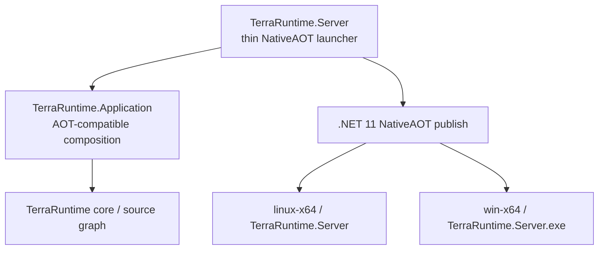
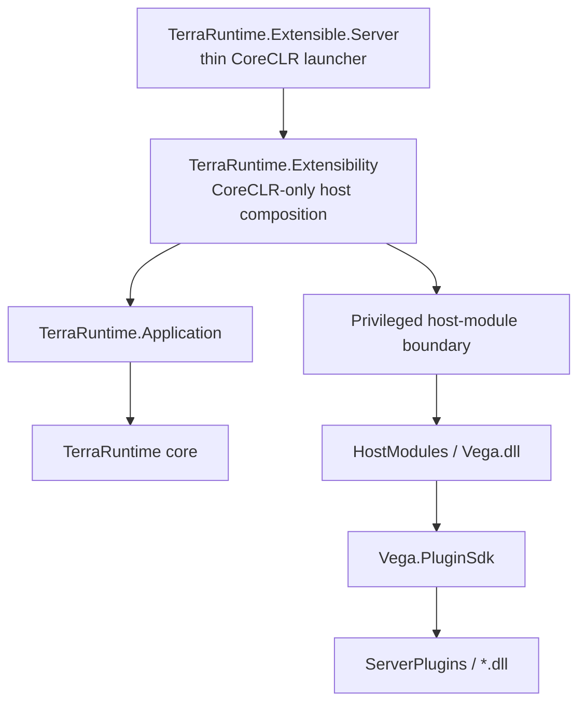
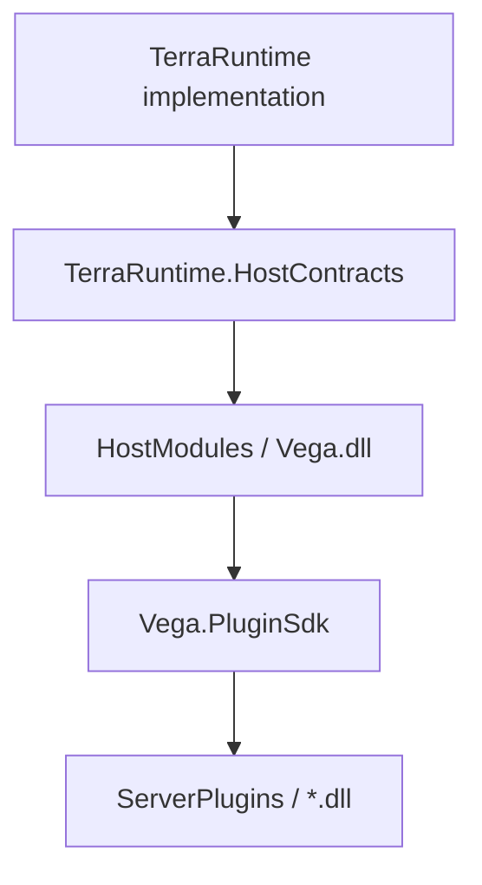

# NativeAOT and CoreCLR hosting baseline

## Current remote style1 clocks and all valid gun prefixes — 2026-10-09, accepted local results

The accepted combined block adds 101 remote tool/broadsword clocks and all 256 source-valid roll-family gun/prefix clocks, with nullable ToolTime/AttackCD custody and exact retained ItemPhase capture/watermarks. Independent original comparisons cover 49,252 runtime phases; 16 meaningful omission controls pass after restoration. Release warnings-as-errors/focused 335, one unfiltered full 1,563,054/1,563,055 (zero failures/errors, one known skip), shipping Windows Native/five smokes, separate typed Native 555 scenarios/26,766 actual ticks and fresh Release/Native 82/49 live checks pass. All 32 shipping DLLs match; no new dependency or graph edge. Genuine Linux NativeAOT remains locally unverified; GitHub CI is not awaited. Next: remaining 172 authoritative launch-prefix identities and retained selected-item crit, then wider inventory/combat/buffs/events and NPC parity. See [accepted evidence and resume state](agent-memory/work-state.md). Prior accepted checkpoints remain history below.

## Current neutral metal equipment and prefixed remote phase — 2026-10-09, accepted local results

The accepted prefix/metal phase uses the existing shipping graph with no new production dependency/reflection dispatch/project edge. Source-platform arithmetic is typed and bound once in standard composition. Fresh shipping Windows NativeAOT/five smokes and a separate typed changed-lane Native harness 237 scenarios/7524 actual State.Tick calls pass; all 14 referenced DLLs match the final shipping snapshot and all 32 shipping DLLs match combined acceptance binaries. Release/focused 327, unfiltered full 1,563,046/1,563,047 (one known skip) and fresh Release/Native82/49 live gates pass. Genuine Linux NativeAOT remains locally unverified. See [current work state](agent-memory/work-state.md).

## Current remote bullet phase — 2026-10-09, accepted local results

Eight remote bullet clock/presentation families, neutral93/112/PendingItemReuse and strict verified-phase pending delivery use the existing shipping graph without new dependencies/reflection dispatch/project edges. Independent2752 State.Tick phases and compact ammo/classification evidence pass; new4/adjacent11, meaningful omission controls and coherent272/werror pass. Fresh shipping NativeAOT, changed typed Native harness and combined full acceptance pass; prior66ca811b results remain dated history. Proof `.cache/remote-bullet-item-phase-tests/final-freeze-manifest.json`, `.cache/pending-bullet-phase-tests/status.json`. LinuxNativeAOT and full player/client RNG compatibility remain locally unverified.

Release warnings-as-errors and coherent focused 272/272 pass. The unfiltered full suite passes 1,563,040/1,563,041 with zero failures/runner errors and one known skip in $538.669\,\mathrm{s}$. Fresh shipping Windows NativeAOT/five smokes, typed Native 26 cases/680 actual State.Tick calls and Release/Native packet82/49 live checks pass. The typed Native harness excludes outside, slot255 and raw player-cursor comparisons; genuine Linux NativeAOT remains locally unverified. CI tools/documentation/production graph/domain/diff gates and source-unchanged checks pass. Results: `.cache/remote-bullet-phase-v1-status.json`, `.cache/remote-bullet-phase-native-smoke/manifest.json` and `.cache/remote-bullet-phase-live-v1/results.json`. Source/test SHA256 `240b972893dc2a128034333d937244bbcb490344b828992d5bc4b91586169f35`; shipping Native SHA256 `4ed00c44319b04893f6e0bba2d83f698ae7e50a822d2c216e455b542868e6224`.

Next source work is bounded neutral armor admission (26 metal pieces and 10 full-set arrangements, including two ancient helmets) and prefixed eight-gun clock effects. Existing combat facts alone do not admit those whole player phases. Full Main scheduling, complete equipment/consumable behavior and arbitrary client RNG ownership remain open. Earlier accepted checkpoints remain dated history below.

## Accepted remote phase history — 2026-10-09, 66ca811b

The shipping graph wires the bounded typed remote phase into actual State.Tick without new dependencies/serializer/reflection dispatch/project edges. Release warnings-as-errors/focused2579 pass. Initial full1563033/1563035 had1obsolete vitals assertion+1existing skip,0runnererrors in $579.954\,\mathrm{s}$; test-only correction passes11 vitals/ownership and finalfast24741/24742,0failures/errors,1skip. All17 shipping DLLs match initialfull/Native/live binaries, so no second exhaustive run. Fresh shipping WindowsNative5smokes and Release/Native82/49 sockets pass; typedNative14cases/38ticks passes0errors, excluding outside/slot255/rawcursor. NativeexeSHA50e88d9d7059a84edc70449868ef9102a5d668e57429b25774b23d62f9d1c1ec. Evidence `.cache/remote-player-phase-final-status.json`, `.cache/remote-player-phase-final-fast-tests/result.json`, `.cache/remote-player-phase-final-shipping-comparison.json`, `.cache/remote-player-phase-native-smoke/manifest.json`, `.cache/remote-player-phase-live-v1/results.json`. Genuine LinuxNativeAOT remains locally unverified; no CI wait/full player-parity claim. Historical foundation results follow separately.

2026-10-08 consumable foundation checkpoint: Local acceptance: Release warnings-as-errors, focused772/772, unfiltered full1563025/1563026 (zero failures/errors, one existing canonical liquid skip; runner $774.565\,\mathrm{s}$), fresh WindowsNativeAOT/five smokes, Release+Native source82/49 two-client socket checks, CI-tool/documentation/domain/graph/diff gates pass. LinuxNativeAOT remains locally unverified; no GitHub CI wait. Source/test SHA256 `f4c9ee70919c45cdb0a19cdb855d79dfc93ae15fa95906b35782135f65ca1662`; shipping Nativeexe SHA256 `ee1da8b983550affad23972cfcbfacdb8316f24f0624d03627709dad5147f2dc`. Evidence `.cache/consumable-foundation-v4-status.json` and `.cache/consumable-foundation-live-v4/results.json`. Rejected v3 focused evidence retains three actual combat/ammo trust regressions: a copied transfer with BuffTypes=null inherited its old full buff state. Full slots now restore only when their compact projection matches a present import; explicit unknown/edited compact payloads retain the existing trust boundary. The new regression also verifies changed compact types cannot restore stale full slots. Existing tests fail on the omitted production repair and final restored checks pass. No new production dependency or project edge. Unverified combined planner is losslessly preserved in `.cache/remote-item-phase-unverified-20261008/manifest.json`, with the optional health-helper patch in `.cache/consumable-health-planner-wip.patch`. Dormant unverified physics transfer state is excluded: future integration must follow source Spawn contact resets while preserving actual jump state. Existing ItemPhase clocks are stored/reported, not continuously simulated; tick animation/death synchronization remains part of the next atomic phase work.

## Inherited equipment checkpoint — 2026-10-08

The 2026-10-08 ready-work merge owns source-order favorited inactive-loadout equipment, actual local255 vanity ownership, locked/vanity compatibility blockers and common human/server-player combat projection. Focused364/364, full 1563004/1563005 with0failures/errors and1existing skip, WindowsNativeAOT/five smokes and Release/Native source82/49 checks pass. Unfinished consumable/mana code is preserved outside shipping source; actual client-RNG reconciliation and broader player/gameplay/NPC parity remain open. LinuxNativeAOT is locally unverified. See [current work state](agent-memory/work-state.md) for exact acceptance and resume evidence.

## Bullet launch checkpoint — 2026-10-08

The 2026-10-08 bullet-launch checkpoint owns bounded source-ordered uses for8 bullet weapons, exact-key atomic volleys and physical1000 lifecycle/join exclusion. Local full/focused, shipping WindowsNativeAOT/five smokes, changed-use Native92/278 and Release/Native source82/49 socket checks pass. Strict server-RNG acceptance does not establish complete client Main.rand reconciliation; full player/inventory/animation and wider gameplay/NPC parity remain open. LinuxNativeAOT is locally unverified. See [current work state](agent-memory/work-state.md) for exact evidence and resume scope.

## Accessory and combat-owner checkpoint — 2026-10-08

The 2026-10-08 checkpoint owns functional accessory slots67/68 under the destination world mode and the generation-owned Demon Heart flag, and rejects stale combat owners after damage-roll callbacks. Selected inactive-loadout sharing and genuine ranged launch spread remain open. See [current work state](agent-memory/work-state.md) for exact local acceptance and the next launch block.

## Pirate foundation checkpoint — 2026-10-06

The 2026-10-06 Pirate foundation checkpoint admits ordinary212–215/252 natural spawning and source-backed loot/defaults. Captain216 and ship491 selected births remain refused; Ghost662 remains DefinitionOnly while its pureAI122/platform defaults are verified. Unfinished death/prepass integration is retained as WIP, not marked complete. Local full/focused, WindowsNativeAOT and source82/49 process checks passed; genuine LinuxNativeAOT was not locally verified. See [current work state](agent-memory/work-state.md).

2026-10-06 Goblin-first ordinary invasion checkpoint is locally accepted on baseline dab428fd. One retained scalar owner now handles trusted negative61 starts, source base-life census including dead players, coast RNG, movement/warnings, source completion98->82->7->remaining warnings, milestones and pending Lantern preservation. Goblin natural selection uses detached source RNG/birth ownership and explicit unsupported-selection refusal; canonical and loaded residents carry the exact town flag, including inactive retained slots. Source NewNPC zero casterAI and Archer111 BaseHeight38 are corrected. Seven ordered loot tables/43 sparse drop defaults share the existing interleaved engine; only verified Pirate212 widens its source rule bound34. Accepted terminal credit follows loot and removes the exact dead generation before78 then23. Socket case6 reads one immutable snapshot7->optional78, case8 emits7 only before sections, and transfers capture fresh destination state. Join zero-start maximum1 is distinct from death maximum0. Source five invasion fields, three milestones and owned pending Lantern flag persist through detached checkpoint patching; prepared cache layout5 invalidates old layout4. Focused 98371/98371; complete full 1562956/1562957 passes in 659.833s runner, zero failures/errors and one unchanged canonical liquid skip. Release zero warnings/errors; WindowsNativeAOT/five smokes and Release/Native two-client source82/49 process checks pass. All15 shipping assemblies are byte-identical to the exercised v1 native/live binaries after the sole test-only legacy rate fixture repair; no redundant Native publish was run. Source/testSHA256 0b2d1c78759ab985ec3cb680c822c900b95eac372680389d26f7a092be865844; NativeexeSHA256 ed89e1e03b5f08559ea41a9126c4ac1b554e7b3d05c06067c361e6bbacb8d10c. Evidence .cache/invasion-v2-status.json plus losslessly retained rejectedv1. Original source proof includes lifecycle50, checkDead24 (16 exact Goblin/Pirate and8 Martian381 atomic fences) plus1 zero-start, headers9 plus2 pending Lantern, spawn predicate/selection68 plus8 day context/8 raw births/696 town facts, loot302 callbacks/731 natural prefixes, wire23 plus3 completion98. Compact copied controls detect source offers/order, stale owners, field preservation, loaded town producer and join sequencing; the repaired underworld class33/33 detects rate20->360. Documentation,56 CI-tool tests, domain/graph/diff gates pass;15projects/29edges/no new dependencies. FullVanillaAiParity remains false; full Main.Update/SwapRandom/floor priorities, Summoner471, Pirate/Martian selectors/full encounters, unsupported Frost semantics, later Lantern-night consumer and genuine LinuxNativeAOT stay open. Commit/push without CI wait, then continue next coherent Pirate cohort/Captain->Ghost block from .cache/invasion-priority-next-plan.md and .cache/invasion-pirate-natural-next-evidence.md, using Pirate19 and Ghost44 genuine source cache profiles. No next actor admission is claimed.

2026-10-06 combat/status checkpoint is locally accepted on baseline0268b414: retained trusted-human projectile2/34/54 hits against canonical Zombie3/BlueSlime1/LavaSlime59 now consume source crit/variation, two hit-point draws and intrinsic status before shared/local immunity, penetration/reset and death publication. Captured inventory/equipment/buffs/projectile/NPC/status/RNG owners are checked before HP; accepted status, projectile and lethal item/RNG/prelude ownership is adopted before first outward callback. Publication skips superseded generations without late state rewinds. Canonical Zombie continuous OnFire/Poisoned life-regeneration, expiry and DOT death share the retained phase; source constructor shimmer0 is owned, imported null/nonzero and shimmer-contact contexts remain fenced. AI003 preserves raw target255 Graveyard constructor ownership before target selection, source ambient RNG and grounded facing. Source dead LavaHitEffect40Next8 and nonlethal damage-dependent draws precede loot. The rejectedv1 full1719 failures remain retained: independent composed dedicatedHitEffect->single-player loot-evaluator references replace ONLY integration Lava rows, preserving old standalone NPCLoot goldens; raw255 bug and legacy snapshot-schema SHA drift are corrected with copied controls. Original full checkDead/dedicated ownership transport/Main.SwapRandom scheduler parity is not claimed; trusted-human interaction credit is an explicit runtime policy. Focused17128/17128, full1562905/1562906 pass in501.930s runner, zero failures/errors and one known canonical liquid skip. Release zero warnings/errors; fresh Windows NativeAOT/five smokes and CI-tool/docs/graph/domain/diff gates pass. Source/test SHA256`a07dbc9f0cbd71982f6eb0f913f361315254b67b464b7ea7397b40ad173eddb9`; Nativeexe SHA256`a47b1d6f013843b9cd773375f704240b7c87de8742336d3cd995722e527ac12f`. Evidence `.cache/combat-status-v2-status.json`, independent actual72 status/private-hit,837 NPC phases,10 whole projectile updates,10 coupled updates and9 LavaHitEffect rows;53 original compact Facts plus one raw255 guard Fact, no new Cartesian expansion. Meaningful copied controls cover RNG offers, accepted owner reentry, atomic refusal, local/shared immunity, constructor shimmer, death publication and raw target255. No new production dependency/graph edge (15 projects/29 edges). Genuine Linux NativeAOT remains locally unverified; FullVanillaAiParity remains false. Commit/push without GitHub CI wait, then continue priority5 events/invasion/progression via cache lifecycle/persistence/context packages and `.cache/combat-status-next-invasion-integration-root-plan.md`. Paused fifteenth fullAI prototypes stay deferred. Post-acceptance staged whitespace check found terminal blank lines in three newly added files. Only those terminal bytes were removed; reconstructing them reproduces the full-suite source SHA exactly. Final source/test SHA256`0b2d9429d10835503230f8361913687408405befe032db4e9ae8da600549c50b`; final Windows NativeAOTexe SHA256`1965a6df3f82395a9b9ef8360a5aac6caa6cc22d6194b1bdd24eca4bb509dcea`. Release rebuild and78/78 targeted owner/status checks plus five fresh NativeAOT smokes pass; the full suite is reused under this exact EOF-only proof, not rerun. Evidence `.cache/combat-status-v2-eof-normalization.json`.

2026-10-06 ammo conservation checkpoint is locally accepted on baseline `731ec84c`: strict source-owned ranged item use now admits known Ammo Box93 and Ammo Reservation112 slots, with original Celebration3930/Next(2), Quiver/Next(5), Box/Next(5), Potion/Next(5), Minishark/Next(3) ordering. Every selected offer executes even after conservation or for endless ammo; duplicate slots project one flag/draw. Missing imported buff ownership stays unknown. Packet50 remote durations remain60 without invented local aging; same-generation transfer, death clearing, reconnect generations and pre-callback currentness preserve the existing atomic use boundary. Tungsten Bullet4915 uses existing projectile14 with damage9/knockback4/speed4.5, closing the selected neutral bullet family97/278/4915/3104. Independent actual original evidence has32 PickAmmo rows and4 lifecycle snapshots, zero capture errors; 12 compact new Facts exercise original consumption/launch math/cursor, actual50->27, refusal and reentrant publication. The rejected preflight is retained: its sole obsolete assertion expected no presentation on no matching ammo; the corrected test requires unchanged ammo/RNG and no combat trust or promoted shot on the existing presentation path. Six source controls and six command controls all fail meaningfully with zero runner errors, restored copies4/4 and9/9 pass. Focused 110/110, fast 24558/24559 and full 1562851/1562852 pass in 449.190s (full runner), zero failures/errors and the one pre-existing canonical liquid skip. Release build has zero warnings/errors; fresh Windows NativeAOT/five smoke paths, CI-tool and documentation/graph/domain/diff gates pass. Source/test SHA256 `7b227dfd0c0e4f4c2521755be59cc9fcfd41cf5d53000038db5710448ef0eec2`; Native executable SHA256 `546a0004b426599164b1e29c0aca7229438f3969bb6869b8c29db843c8a815b6`. Evidence `.cache/ammo-buffs-v1-status.json` and its recorded independent proof manifests. No production dependency or graph edge changed;15 projects/29 edges. Genuine Linux NativeAOT remains locally unverified. Commit/push follows local acceptance without waiting for GitHub CI. Broader item-use/ammo/equipment and full NPC AI remain open. Continue immediately with the source-ordered projectile/NPC status transaction for FireArrow2, Flamelash34 and PoisonedKnife54: two omitted hit-point RNG draws, intrinsic status before strike/death, shared owner immunity and ordinary hostile status/DOT lifecycle. Prepared actual72-row evidence and plan `.cache/projectile-npc-status-next-plan.md` remain cache-only until whole-path acceptance. Priorities events/invasion/progression follow; paused fifteenth AI3/AI7 remains deferred. FullVanillaAiParity stays false.

2026-10-06 player item-use checkpoint is locally accepted on baseline `d6f8370c`: all 26 ordinary metal/ancient helmet pieces and ten complete-set combinations use the common PvE/PvP/server-player equipment snapshot. Already admitted ranged, standalone thrown and channeled magic projectile use now captures player/inventory/equipment/buffs before callbacks, plans conservation on a clone of the existing shared UnifiedRandom and validates currentness, source-selected allocation, RNG and cadence/volley. The callback-free adoption commits projectile, item/mana, trust, RNG and cadence before publication; reentrant changes are never overwritten afterward. Explicit source-born empty buff ownership is admitted; missing imported buffs and active unowned conservation buffs 93/112 remain outside strict ranged trust. Celebration Mk2 is original 3930/Next(2), not Terraformer 5134; only the first volley child owns ammo. Original armor capture 26 defaults/grants plus 10 complete sets; actual PickAmmo 52 captures with 29 represented comparisons and next RNG. The rejected wrong 5134 identity/no-ammo capture is preserved; it did not justify changing the already correct catalog. Focused 98/98, fast 24546/24547 and full 1562839/1562840 pass in $592.370\,\mathrm{s}$ (full runner), zero failures/errors and the one pre-existing canonical liquid skip. Only 24 compact Facts were added, with no new Cartesian case expansion. Release build has zero warnings/errors; fresh Windows NativeAOT and all five smoke paths, 56 CI-tool regressions and documentation/graph/domain/diff gates pass. Immutable source/test SHA256 `743c1a6445f9698da110b60f820a4c8a7d994bb464bdb7cd0b538d0b3cf958aa`; NativeAOT executable SHA256 `27647309f27b5d5edd5d64fbcb0e2ade4f3d33f743af2aeac2444ecd805c98aa`. Evidence `.cache/player-item-use-v1-status.json` and the armor, ownership, command-atomic and source-conservation proof manifests. Copied controls detect missing armor/set rules, stale serial/generation/allocation, early/repeated publication, capture-after-callback, missing RNG adoption, premature cadence publication, child double consumption, skipped endless draws, wrong conservation bound and old Random.Shared. No production dependencies or graph edges changed; 15 projects/29 edges. Public ordinary projectile allocation/replacement/overflow remains unchanged. Complete item use, broader gear/ammo/status/animation/cycling and player-update RNG phases remain open; FullVanillaAiParity remains false. Genuine Linux NativeAOT is not locally verified. Commit/push follows local acceptance without waiting for GitHub CI. Continue priority 3 via `.cache/player-item-use-next-slice.md`; priorities 4 combat/buffs and 5 events/progression follow, then remaining full NPC AI. Paused fifteenth AI3/AI7 and desert proofs stay cache-only.

2026-10-06 fourteenth NPC checkpoint is locally accepted on baseline `44890f09`: all registered town-specific reward tables now use the common lethal-strike and ordered Doll-batch pipeline, including exact resident names, source Hardmode gates, Party Girl stack bounds and interleaved item/prefix/velocity RNG. Standard server composition explicitly owns the original default English loot-name profile; unknown custom locale/nonempty names remain fenced. Travelling Merchant368 remains pure-table-only, without actor/AI/lifecycle admission. The shared death-owner guard now completes external dependency reads before its final direct NPC/prelude/progression checks; an unchanged name callback can no longer admit a stale Hardmode/world reward plan. Full **1562791/1562792** checks pass in **553.030 s**, zero failures/errors and the one pre-existing canonical liquid skip. Focused **8794/8794** pass. Release rebuild has zero warnings/errors; Windows NativeAOT/five smokes, 49 CI-tool regressions and documentation/domain/graph/diff gates pass. Immutable source/test SHA256 `e13c4ebdd6ecfb1d1541d3690f582e75b2b74d169ed1d8d3f4f466be1216c4cc` stayed unchanged. Evidence `.cache/npc-town-rewards-fourteenth-v3-final-status.json`. Independent original evidence: 3060 ordered tables across two reference cultures,12 drop defaults/natural and valid prefixes,1620 admitted whole lethal strikes,280 whole Doll batches,14 independently captured migrations of previously fenced victims and31 actual packet21/22 rows. Copied controls detect incorrect rule order, names, unknown locale, Hardmode, stack range and stale dependencies; restored copies pass. The first focused snapshot8791/8792 is rejected and preserved: its only failure was an obsolete exact callback-read count; the guard still rejects at the second-read mutation, while the corrected assertion admits the necessary final recapture. The v2 full snapshot1562790/1562792 is rejected and preserved losslessly: its single failure exposed an existing King Slime test fixture with missing player-health packet16. Seed7 reproduces the refusal on both checkpoint13 and14; all128 seeds accept with the real pending health command. The v3 fixture supplies that command and fixes seed7 without weakening any production guard or loot/wire/lease assertion. Windows NativeAOT evidence is retained from v2 only after all13 shipping assemblies were verified byte-identical; the production executable SHA256 is recorded in the acceptance status. No new production dependency or project edge;15 projects/29 edges. FullVanillaAiParity remains false; broad N1-N5, remaining actor families, wider status/environment/scheduling/wire phases, unowned locale/imported-name contexts and genuine Linux NativeAOT stay open. Commit/push follows local acceptance without waiting for GitHub CI.

2026-10-06 thirteenth NPC checkpoint is locally accepted on baseline `2d71e8d8`: ordered multi-Guide Doll batches with Wall continuation and additional town victims, shared dedicated town death HitEffect RNG, bound Torch/Blue/Lava status and fatal debuff prepass, source cobweb frame-bank ownership and bounded recursive liquid destruction. Full **1557700/1557701** checks pass in **599.709 s**, with zero failures/errors and the one pre-existing canonical liquid skip. Focused checks **7585/7585** pass. Release rebuild has zero warnings/errors; Windows NativeAOT and all five smokes, 49 CI-tool regressions and documentation/graph/domain/diff gates pass. Immutable production/test SHA256 `fe4142f06e42e34463e19d757c7c0649652434b26786922a2c7f81b9b01bc014` stayed unchanged throughout acceptance. Evidence `.cache/npc-batch-status-web-thirteenth-final-status.json`. Source evidence includes 960 whole Doll batches, 40 town loot registries, 400 town HitEffect calls and 72 whole town-victim burns, 14 status sequences/346 phases, 24 fatal debuff updates and 102 web profiles (70 exact matches, 32 atomic refusals). Independent 761-row numeric SetDefaults manifest covers all 696 positive and 65 signed identities; 394 positive definitions and 36 signed variants are admitted, with 297 valid positive and 29 signed definitions absent. Definition admission is not full behavioral parity. Graph remains 15 projects/29 edges, with no new production dependency. FullVanillaAiParity remains false and broad N1-N5 remain open. Named/nonempty town rewards, unsupported locale/name contexts, generic tile/shape/Echo framing, unowned frame banks/protection history, broader status/contact/scheduling/wire contexts and genuine Linux NativeAOT remain open. Commit/push follows local acceptance without waiting for GitHub CI.

2026-10-05 twelfth NPC checkpoint is locally accepted on baseline `f3506ad6`: bounded continuous NPC-facing player life, atomic one-Guide Doll removal/death/Wall continuation, shared town-strike AI/RNG reaction, generation-owned Guide-name/GreenCap loot and physical Herb/Web Slime producers. Full **1554566/1554567** checks pass in **582.637 s**, with zero failures/errors and the one pre-existing canonical world-generation liquid skip. Release rebuild has zero warnings/errors; Windows NativeAOT and all five smokes pass. CI-tool, documentation, graph, domain and diff gates pass. Immutable production/test SHA256 `d0ccb7dc948d00f028e00b9563ff0b32c5b3d990e93abc4792077d15d839de83`; evidence `.cache/npc-health-burn-producers-twelfth-v3-final-status.json`. Original evidence: 16 continuous player sequences/18080 phases, 24 Spawn and 176 paired DropHeals;936 complete burns including416 preserved multi-victim outcomes;240 town strikes;86 slime producer,22 herb placement and10 source recipient cases. Copied regressions fail the former mistakes and restored copies pass. Two diagnostics were rejected for missing tracked fixture registrations and an obsolete always-invalidated player-life expectation; their artifacts are preserved. Graph remains15 projects/29 edges with no new production dependency. FullVanillaAiParity remains false; multi-Guide/additional-town-victim batches, unknown Guide identity, Torch status/DoT, wider web framing, unsupported player-health contexts and broader N1-N5 remain open. Genuine Linux NativeAOT is not locally accepted. Commit/push follows local acceptance without waiting for GitHub CI. Details: [owned health and producers](en/npc-owned-health-and-producers-1458.md).

2026-10-05 eleventh gameplay/NPC checkpoint is locally accepted on baseline `2e1985f6`: 43 Zombie/Skeleton loot tables (32 existing actors, 11 pure-table-only identities), source-ordered dedicated HitEffect RNG, loaded Hardmode/Skeletron and effective GoodWorld/ExtraGel loot context, current-life provenance at the NPC phase, raw-player AI002 targeting and distinct Bee AI005 including the actual ascending Hive-child NPC pass. Full **1553881/1553882** tests pass in $537.539\,\mathrm{s}$, with zero failures/errors and 1 pre-existing canonical world-generation liquid skip. Release rebuild has zero warnings/errors; Windows NativeAOT/five smokes and documentation/domain/graph/diff gates pass. Immutable production/test SHA256 `2f87739d3ef28db23bc039976a88a2d34af3647d7abe94f8aa84108323d357d4`. Evidence `.cache/undead-raw-flight-eleventh-final-status.json` and `.cache/undead-raw-flight-eleventh-accepted-tests-20261005.xml`. Original source captures and copied regression controls cover table/RNG ordering, loaded-world gates, stale player-life reports, raw None/255 targeting, peer ownership and child phase ordering. Graph remains 15 projects/29 edges; no production dependency or world-file format changed. FullVanillaAiParity remains false. Broad N1-N5, remaining individual loot/encounters, dynamic Skyblock lowTiles, incomplete open Void Bag storage, continuous remote current-life simulation, unowned aggro/history/peer/environment contexts, town lethal/wet/special contexts and complete NPC wire cadence remain open. Genuine Linux NativeAOT is not locally accepted. Commit/push follows local acceptance without waiting for GitHub CI, as explicitly requested. Preserve earlier accepted artifacts. Next cache-only plan: `.cache/gameplay-npc-next-checkpoint-plan.md` prioritizes genuine remote NPC-facing current-life production and whole Guide Doll burn/death/summon admission, alongside remaining AI001 producers and AI003 families. It is planning, not acceptance.

TerraRuntime targets **.NET 11** and deliberately supports two different shipping profiles because the requirements for a pure NativeAOT runtime and a drop-in managed DLL plugin host are not the same.

NativeAOT remains a first-class production capability and CI contract for the TerraRuntime core. The Vega-enabled extensible server uses CoreCLR so it can load ordinary managed DLL plugins, use collectible `AssemblyLoadContext` and retain hot replacement.

This is an architectural split, not a temporary workaround.

See [`roadmap/runtime-host-plugin-architecture.md`](roadmap/runtime-host-plugin-architecture.md) for the complete host/plugin trust model.

## Shipping profiles

### NativeAOT standalone profile

TerraRuntime must continue to publish as a native executable:


```mermaid
flowchart TD
    Launcher["TerraRuntime.Server
thin NativeAOT launcher"] --> App["TerraRuntime.Application
AOT-compatible composition"]
    App --> Core["TerraRuntime core / source graph"]
    Launcher --> Publish[".NET 11 NativeAOT publish"]
    Publish --> Linux["linux-x64 / TerraRuntime.Server"]
    Publish --> Windows["win-x64 / TerraRuntime.Server.exe"]
```

This profile has no arbitrary managed plugin loading. It is intended for runtime-only deployments, native smoke testing, benchmarking and environments that do not require the Vega managed plugin ecosystem.

The current NativeAOT publish and runnable-artifact mechanism remains valid and must not be removed merely because an extensible CoreCLR host is introduced.

### Extensible Vega profile

The normal plugin-enabled topology is a .NET 11 CoreCLR host:


```mermaid
flowchart TD
    Server["TerraRuntime.Extensible.Server
thin CoreCLR launcher"] --> Ext["TerraRuntime.Extensibility
CoreCLR-only host composition"]
    Ext --> App["TerraRuntime.Application"]
    App --> Core["TerraRuntime core"]
    Ext --> Boundary["Privileged host-module boundary"]
    Boundary --> Vega["HostModules / Vega.dll"]
    Vega --> Sdk["Vega.PluginSdk"]
    Sdk --> Plugins["ServerPlugins / *.dll"]
```

Vega is a trusted host module, not an ordinary plugin. Ordinary plugins compile against `Vega.PluginSdk` and do not receive TerraRuntime implementation objects or mutable authoritative state.

The CoreCLR production baseline is:

```xml
<ServerGarbageCollection>true</ServerGarbageCollection>
<TieredCompilation>true</TieredCompilation>
<TieredPGO>true</TieredPGO>
<PublishReadyToRun>true</PublishReadyToRun>
```

These defaults are benchmarkable policy. They may change only when production-like measurements demonstrate a better configuration.

ReadyToRun reduces cold-start JIT work while Tiered Compilation and Dynamic PGO remain free to optimize hot methods from real process behavior. Server GC is the default GC policy for the long-lived server workload.

## Contract and trust boundaries


```mermaid
flowchart TD
    Impl["TerraRuntime implementation"] --> Contracts["TerraRuntime.HostContracts"]
    Contracts --> Vega["HostModules / Vega.dll"]
    Vega --> Sdk["Vega.PluginSdk"]
    Sdk --> Plugins["ServerPlugins / *.dll"]
```

`TerraRuntime.HostContracts` is privileged and narrow. It may expose snapshots, lifecycle notifications, command ingress and controlled operations required by Vega, but it must not expose mutable runtime collections or implementation classes simply for convenience.

`Vega.PluginSdk` remains the normal public plugin surface. Plugin mutations must cross Vega policy/validation and then enter TerraRuntime through authoritative game-loop commands.

The SDK boundary protects invariants, compatibility and accidental misuse. Same-process managed plugins are not a hostile-code security sandbox; true hostile-code isolation requires a separate process/sandbox and is a different feature.

## Clean deployment layouts

### NativeAOT standalone

The intended standalone NativeAOT deployment root remains a literal filesystem layout:

```text
TerraRuntime.Server[.exe]
Worlds/
config/
data/
logs/
```

A NativeAOT `dotnet publish` writes directly to the runnable artifact root selected by `PublishDir`. The repository/CI convention is `artifacts/native-aot/<RuntimeIdentifier>/`.

That directory is the deployment directory, not an SDK staging tree. Release `*.pdb`/`*.dbg` symbols are excluded, runtime-owned directories are created during publish, and CI rejects unexpected root entries. If the native server accidentally starts depending on a loose managed sidecar, the smoke gate must fail.

### Extensible CoreCLR host

The managed profile keeps a clean human-facing root:

```text
TerraRuntime/
├── TerraRuntime.Extensible.Server.exe
├── runtime/              # reserved for deliberately external sidecar dependencies
├── HostModules/
│   └── Vega.dll
├── ServerPlugins/
│   └── *.dll
├── Worlds/
├── config/
├── data/
└── logs/
```

The current production publish is self-contained and single-file, so framework/runtime assemblies required for startup are bundled into the executable rather than copied as loose DLLs. `runtime/` is still created as the explicit location for any future dependency that must remain external. Loose framework/runtime libraries must not flood the root directory.

The repository/CI convention is `artifacts/coreclr/<RuntimeIdentifier>/`.

Release debug symbols and developer-only files are excluded from that runnable artifact. CI copies a host-module fixture into `HostModules/` and starts the executable from the artifact root, proving that the directory can be deployed and launched directly.

## AOT-safe core design rules

The TerraRuntime core and NativeAOT shipping graph must not depend on runtime features that require a JIT or arbitrary managed assembly loading.

Do not introduce these into the AOT/core graph:

- `Assembly.Load*` or arbitrary managed DLL loading;
- collectible/dynamic plugin `AssemblyLoadContext` use;
- `Reflection.Emit`;
- `DynamicMethod`;
- runtime code generation;
- expression-tree compilation that requires generated IL;
- reflection-based serializers without an explicit trimming/AOT contract;
- runtime assembly scanning as a registration mechanism.

Prefer explicit/static registration, compile-time generated registries, source generators, `System.Text.Json` source generation, typed protocol codecs, `Span<T>`/`ReadOnlySpan<T>`/`IBufferWriter<T>` and bounded buffers, and BCL functionality over unnecessary dependencies.

The deliberate exceptions for managed DLL discovery/loading and collectible `AssemblyLoadContext` belong only to the CoreCLR host/plugin layer. They must not leak into TerraRuntime simulation, networking, protocol, world or other core projects.

`TerraRuntime.Application` is the shared AOT-compatible server composition assembly used by both shipping profiles. `TerraRuntime.Server` delegates to it directly. `TerraRuntime.Extensible.Server` delegates only to CoreCLR-specific `TerraRuntime.Extensibility`, which layers trusted module loading over `TerraRuntime.Application`. Neither reusable composition layer references a shipping executable, and the NativeAOT graph never references `TerraRuntime.Extensibility`.

## Dependency admission gate

Every dependency that enters the NativeAOT/core shipping graph must pass:

1. .NET 11 build with AOT/trimming analyzers enabled;
2. NativeAOT publish for every supported native RID;
3. zero unexplained trim/AOT warnings;
4. startup of the produced native executable;
5. an exercised smoke path through the dependency, not merely successful linking;
6. repeat validation on package upgrades.

CoreCLR-only plugin-host dependencies are evaluated separately and must remain outside the NativeAOT graph.

The current dependency audit is recorded in [`aot-dependency-audit.md`](aot-dependency-audit.md).

## CI contract

The expected CI matrix is a literal list of gates rather than a process diagram:

```text
build + tests
NativeAOT linux-x64 + native smoke from artifacts/native-aot/linux-x64
NativeAOT win-x64 + native smoke from artifacts/native-aot/win-x64
CoreCLR linux-x64 + host-module smoke from artifacts/coreclr/linux-x64
CoreCLR win-x64 + host-module smoke from artifacts/coreclr/win-x64
```

The extensible host adds its own CoreCLR build, plugin-load and hot-reload tests rather than replacing the native jobs.

A change to TerraRuntime core that cannot satisfy NativeAOT is an architectural regression unless the core architecture itself is deliberately changed.

## Project policy

AOT/trimming analyzers remain mandatory for TerraRuntime core projects and the NativeAOT host graph.

When the CoreCLR plugin host is introduced, its dynamic loading code must be isolated in explicitly CoreCLR-only host projects. Do not weaken AOT analysis across the entire source tree merely to make `AssemblyLoadContext` warnings disappear.

The current standalone NativeAOT host may continue to set `PublishAot=true` and `IlcTreatWarningsAsErrors=true`. The extensible CoreCLR host instead uses the production JIT baseline documented above.

## Performance comparison

NativeAOT and CoreCLR are both measured, not treated as religions.

Compare at least startup to `NetworkReady`, idle CPU/RSS, mean and $p_{95}/p_{99}$ tick latency, allocation rate/GC pauses, packet throughput, $24$-player realistic load, high-connection stress and CoreCLR plugin-dispatch overhead.

For Vega-enabled deployments, sustained game-server performance plus drop-in DLL extensibility is the governing target. For runtime-only deployments, NativeAOT remains a first-class production option and architectural quality gate.

## Process boundaries

Neither NativeAOT nor CoreCLR requires TerraRuntime simulation to be split across processes. The authoritative game loop remains in-process with the host unless a real isolation or operational requirement justifies another process.

Optional transport/sandbox processes may exist for isolation, tooling or operations, but IPC is not introduced into the normal gameplay hot path merely to satisfy a runtime-label preference.
