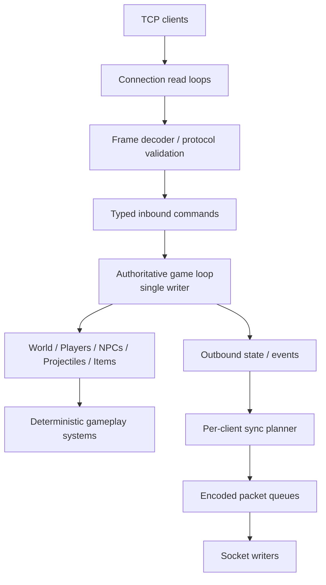
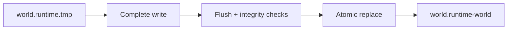
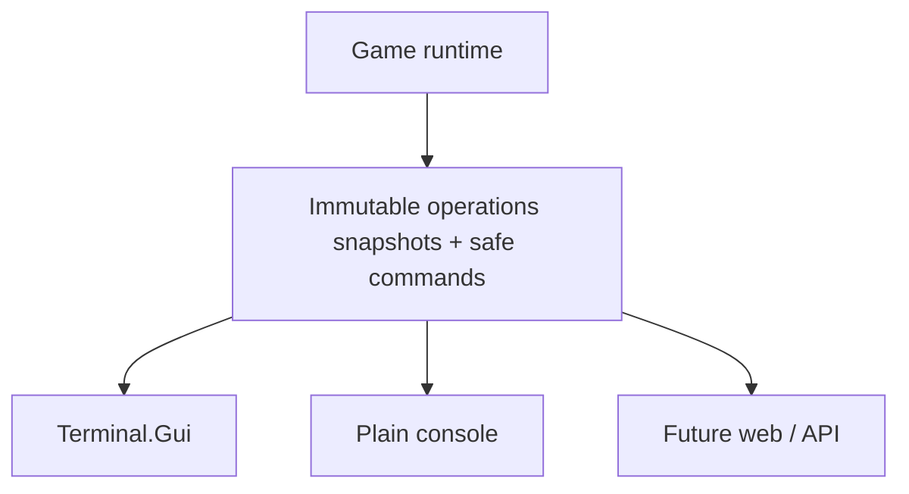
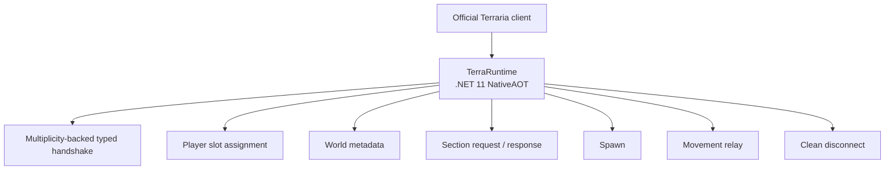

# TerraRuntime roadmap

2026-09-09 ordinary Dungeon complete-pass acceptance: stage36 is bounded R16 (16 retained identical-real-prefix comparisons across Small/Medium/Large, Legacy/Dome/Tower, Corruption/Crimson), plus24 flat fixtures and14 extra Small seeds. All cells, ordered chest inventories/prefixes, OldMan anchor and RNG match the unmodified original. Source removal controls fail for stairs/chandeliers/cracked solidity/entrance RNG/trap framing/late bounds/start depth; restored. Final Release8048/8048, zero build warnings/errors, WindowsNativeAOT/sixsmokes/fresh dual-server load, docs/source/projectgraph/diff gates pass. Unknown-wall guard3/3negative then27/27positive; ordinary output unchanged. Ledger40P+32C=72unfinished; independent multi-stage prefix evidence31E9/279 unchanged. R16 is NOT proof of the preceding prefix, every retained GenVars field, special seeds, final-world equality or client playthrough. Prior paragraphs below are historical.

2026-09-09 Dungeon spikes/walls batch: ordinary source spike ordering/cell preservation and connected wall-region propagation replace approximations; premature sampling padding removed. Independent144 fixtures match cells/RNG;151 new tests, Dungeon1467/1467; negative124fail restored. Release6480/6480, zero build warnings/errors, WindowsNativeAOT/six smokes, fresh dual-server loading, unchanged comparison budgets and documentation/source/domain/projectgraph/diff gates pass. LinuxNativeAOT/client playthrough unverified. Whole crawler bounds/decor/real-prefix equality remain open;40P+33C=73unfinished,31E9/279 unchanged. Prior6329 acceptance below is historical.

2026-09-09 Dungeon discovery/doors batch: ordinary room-edge/hall-axis candidate collection and source door search/masonry replace approximations. Independent234 door fixtures +8 candidate suites pass;250 new regressions, Dungeon1316/1316, negative controls fail30/2 then restored. Release6329/6329, zero build warnings/errors, WindowsNativeAOT/six smokes, fresh dual-server load, unchanged comparison budgets and documentation/source/domain/projectgraph/diff gates pass; earlier6079 is previous-batch evidence. LinuxNativeAOT/client playthrough remain unverified. Dungeon remains `C`, **40P+33C=73 unfinished,31E9/279**. Remaining full crawler/setup/spikes/wall variants/decor and real-prefix equality are not closed.

2026-09-09 cohesive Dungeon building/platform local acceptance: source-derived Dome/Tower buildings replace rectangular shells; shared tree final-framing correction, ordered entrance platform metadata and source platform/shelf placement integrated. Independent original executable:216 buildings +216 building/platform continuations +30 ordinary platform +24 pillar/window/wedge fixtures match cells/RNG. Focused1086/1086; old rectangular renderer fails216/222 tests, then restored. Final standard Release6079/6079, explicit exit0, $180.596\,\mathrm{s}$; build0warnings/errors, WindowsNativeAOT/sixsmokes/fresh dual-server load and unchanged comparison budgets pass. Documentation/source/domain/projectgraph/diff checks pass. Prior5586 acceptance below is historical. Dungeon remainsC;40P+33C=73unfinished,31E9/279 unchanged. Candidate discovery/doors/decor and real-prefix equality remain open; LinuxNativeAOT/client playthrough unverified.

Final layout-origin acceptance: **Release5586/5586**, $184.682\,\mathrm{s}$, build0warnings/errors, WindowsNativeAOT+sixsmokes, freshSmall1458 dual-server load, documentation/source/domain/projectgraph/diff gates pass. Same-reference dungeon anchor now exactly matches `(0,0)` delta; tileL1 .134359/wallL1 .433354 still show whole-world inequality. No ledger promotion, LinuxNativeAOT/client parity claim.

2026-09-09 Dungeon layout-origin batch: same graph loop now preserves the source precalculated initial cursor/RNG order and highest-room InnerBounds connection anchor. Official whole-layout18 and room-metadata63 comparisons match; retained new31 plus existing Dungeon checks pass574/574, old-origin/shell negative20/22 fail. Full/native/fresh-map acceptance is tracked in agent-memory/work-state.md. This is synthetic component evidence, NOT a complete Dungeon prefix. Next: Dome/Tower buildings, remaining crawler/setup/features and real-prefix equality. Ledger unchanged: **40P+33C=73 unfinished,31E9/279**. Historical paragraphs below describe earlier batches.

Current 2026-09-09 gameplay batch: bounded live falling sand/ebonsand/pearlsand/crimsand/silt/slush/shell piles and autonomous selected ordinary-ore PlayerBot Mining are implemented through existing authorities. Mining has eight ore choices, local body-sized Dirt/Stone access, normal drop/pickup, section-revision validation and cancellable tile leases; Follow/Guard assistance remains separate. Falling uses exact server projectile provenance, source ClearTile metadata preservation, bounded wake/active/pending work and normal environmental projectile combat. Actual official28 motion/landing+4 ClearTile fixtures and negative controls support this slice; restored affected741/741. Final **Release5555/5555**, $183.670\,\mathrm{s}$, build0warnings/errors, WindowsNativeAOT+sixsmokes and docs/domain/projectgraph/diff gates passed; details in agent-memory/work-state.md. Other ores, exploration/build/craft, coin piles and complete falling decoration/town-NPC semantics remain open. LinuxNativeAOT/official GUI client unverified. No worldgen ledger promotion; previous generator paragraphs are historical.

Current 2026-09-09 precalculated Dungeon entrance connection: existing graph/LegacyHall now match54 actual-official complete-route fixtures (cells, per-step state, platforms, RNG). Retained59/affected631 pass; wrong-length negative54 failures. Final **Release5501/5501**, $188.865\,\mathrm{s}$, build0warnings/errors, WindowsNativeAOT+sixsmokes, freshSmall1458 dual-server loading, docs/domain/diff gates pass. Ordinary Legacy seed1458 remains byte-identical to prior batch; its unchanged WorldCompare budgets pass, not a whole-Dome/Tower proof. NEXT: precalculated layout initial coordinates/RNG and highest-room InnerBounds, then Dome/Tower buildings and decoration. Dungeon remainsC, **40P+33C=73 unfinished;31E9/279 unchanged**. LinuxNativeAOT/client playthrough and full-world equality unverified. Earlier paragraphs are historical.

Final gate for the following Legacy entrance batch: **Release5442/5442,182.143s**,0warnings/errors, WindowsNativeAOT+sixsmokes and fresh dual-server loading all pass. No LinuxNativeAOT/client playthrough or whole-world equality claim; the listed Dungeon and gameplay debts remain open.

Current 2026-09-09 Legacy entrance batch: ordinary surface building now matches108 actual official fixtures (all cells, shared RNG, bounds, OldManSpawn, platform). Retained113 pass; old rectangle negative111/112; affected608/608 and first full5441/5441 pass. Corrected Old Man bottom-center-to-position persistence through the existing owner, full-world negative1fails/positive1passes. Release0warnings/errors, WindowsNativeAOT+6smokes and freshSmall1458 dual-server loading pass. Final post-correction full suite result is tracked in agent-memory/work-state.md. Same-reference budgets unchanged: tileL1 .134182,wallL1 .426197,dungeon delta(-3,-3), no whole-world equality. Dungeon row remainsC: Dome/Tower/layout/decoration/prefix are open; **40P+33C=73 unfinished,31E9/279 unchanged**. Previous status paragraphs below are historical.

Current 2026-09-09 surface-material batch: Gems / Gravitating Sand / Clean Up Dirt replace three old approximations in the existing owner.54 actual-official delegate fixtures match all cells/next RNG; retained58, old-code negative51, affected473 pass. Standard Release5329/5329,0warnings/errors; WindowsNativeAOT+6smokes and freshSmall1458 dual-server loading pass. Same-reference budgets unchanged: tileL1 .138047,wallL1 .415631; not whole-world equality. Audit39/40/43 P->C: **40P+33C=73 unfinished;31E9/279 checkpoints unchanged**. Steady-state allocation test now actively warms the same loop500ms, unchanged single-sample4096byte cap; injected32768byte negative fails, two standard full suites pass. No disabled tiering or allocation sample filtering. Autonomous selected-ore bot Mining and live falling blocks remain open. Earlier status/counts below are historical.

User clarification: Mining must become autonomous selected-ore acquisition, underground only; existing tunnel assistance stays in Follow/Guard. This remains open, not satisfied by current assisted Mining regressions. Latest standard suite5268/5269 (same empty-tick7960 allocation failure, no GC); restored focused251/251 and combined477/477 pass. Shovel fix is locally verified; bounded falling-block runtime still not implemented.

Current 2026-09-09: ordinary Dungeon entrance renderer now matches90 official component fixtures (including shared TileRunner RNG); retained98 tests, damping negative6 failures. Full5261/5262: only pre-existing empty-tick allocation gate7960 bytes, no GC during measurement. WholeDungeon remains P; no entrance NativeAOT/fresh acceptance yet. User-requested Gravedigger Shovel special-tool admission and bounded18-event burst implemented through existing tile/drop owner; old-tool negative1 and old-budget negative2 failures, restored. Assisted bot Mining verified across consecutive swings; UI now states underground dirt/stone assistance, NOT autonomous mining. Falling-block runtime and broader BotActions remain open; no projectile/tile authority shortcut added.

Dungeon room/hall component validation (2026-09-09):63 room +135 hall official kernels match inside the existing graph. Smoothing tileSolidTop and loading platform/book cascade regressions are fixed; focused345/345, standard Release5164/5164, build0/0, WindowsNativeAOT+6smokes and freshSmallClassicCorruption1458 dual-server loading pass. Same-reference unchanged budgets:tileL1 .186698,wallL1 .415579. Earlier empty-runtime allocation failures remain unexplained, not declared fixed by the later green run. Whole Dungeon remains P and accepted stage counts below do not increase. Next: exact entrance hall/surface opening;18 official reference kernels captured, production entrance not yet changed.

Lakes/Slush bounded ordinary acceptance: **31 E9 stages / 279 checkpoints**, **43P + 30C = 73 unfinished rows**. Nine size/seed prefixes match full cells/RNG and tunnel/lake/snow state. Release `4908/4908`, restored focused `41/41`, Windows NativeAOT, six smokes and fresh Small/Classic/Corruption1458 dual-server loading pass. The empty-tick allocation gate now warms the same non-inlined loop it measures; workload/limit unchanged, injected allocation fails. Earlier allocation failures remain recorded, not erased. Same-reference unchanged budgets pass at tile L1 `0.196460`, wall L1 `0.458101`; whole-world equality, special seeds, Linux NativeAOT and client playthrough remain unverified. Next: source-backed Dungeon rooms/halls inside the existing graph; twelve official room baselines expose current mismatches.

NEW Lakes+Slush WIP after Corruption acceptance: source surface-lake placement/carving and retained snow-bound material scan replace underground ellipses/random slush blobs. Official basin12 + Lakes pass6 + Slush pass3 fixtures match, focused66 passes, negative controls detect6 lake +4 snow regressions. Small real-prefix3 cases through both passes match cells/RNG and retained columns/snow bounds. Medium/Large/full/native gates pending in work-state; no further stage promotion yet.

CURRENT: Corruption stage32 reaches bounded ordinary E9 after all9 real-prefix comparisons and retained85/85 recheck.29 verified stages/261 checkpoints;45P+30C=75 unfinished audit rows. Full4870/4870, Release0/0, WindowsNativeAOT+6smokes, freshSmallCorruption dual-server load passed. Same-reference tileL1 .195909/wallL1 .461801; full-world equality still not achieved. Crimson has6 complete synthetic-pass fixtures, not9 real-prefix cases. Next Lakes then Slush; earlier progress paragraphs below are historical.

NEW Corruption WIP: main/sideways chasms, orb/altar sequencing and column-ordered surface conversion replace the old approximation. Official36 cave kernels +6 complete ordinary Corruption pass fixtures match cells/nextRNG on identical synthetic inputs; existing Crimson evidence retained. New integrated/full/native gates pending in work-state. No full-world prefix equality or stage promotion:46P+30C remain. Previous surface batch passed4827/4827, WindowsNativeAOT+6smokes and freshCrimson dual-server load.

NEW Crimson surface WIP supersedes altar acceptance: jungle columns + shallow source conversion band + depth-limited evil SpreadGrass now replace the broad deep Crimson strip. Twelve initialized official grass kernels match cells/nextRNG; complete surface/pass differential and new full/native gates pending. Corruption still open. No stage promotion;46P+30C remain.

Altar component local acceptance: traced full4804/4804, build0/0, WindowsNativeAOT+6smokes, fresh SmallCorruption and SmallCrimson dual-server load pass. Placement18096-case and late-pass9-fixture source evidence retained; negative fixed-count control fails9/9. Allocation-test instability remains documented (measurement isolation alone was insufficient; traced run green, no threshold/runtime change). Whole-world comparison budgets pass, tileL1 .196990/wallL1 .520040; no whole-world equality or stage promotion. Next exact grass/surface and Corruption geometry;46P+30C remain.

Evil altars WIP: late source scheduling replaces fixed-count floor-scan approximation; Crimson region search precedes deferred hearts. Official placement18096 combinations and late-pass9 fixtures match full cells/nextRNG. Shimmer position is retained from the existing pass; its geometry and full evil surface/Corruption remain open. Current batch gates in work-state; no stage promotion (46P+30C).

Crimson cave component accepted locally: full Release4783/4783 (162.903s), build0/0, WindowsNativeAOT+sixsmokes and NativeAOT-created SmallClassicCrimson1458 loading in both servers pass. Nine official geometry fixtures match full cells/nextRNG/heart endpoints; three canonical final-world heart checks pass. CPU-budget test workload corrected from wall time to actual thread CPU without changing runtime/limits. Corruption geometry, surface conversion and altars remain open; stage32 staysP,46P+30C remain. LinuxAOT/client/whole-world1:1 not claimed.

Crimson cave geometry WIP: generic Crimson tunnel replaced with ordinary CrimStart/CrimVein/CrimEnt and deferred CrimPlaceHearts under the SAME Mid pass. Nine official component comparisons match complete cells/nextRNG/heart endpoints. Surface conversion/SpreadGrass, altars and Corruption geometry remain open; no pass promotion (46P+30C). Current full/native gates in work-state; acceptance below is historical until superseded.

Final bounded evil-placement/excavation acceptance: Release4770/4770, build0 warnings/errors, WindowsNativeAOT+6smokes and freshSmall1458 dual-server load passed. Official CanEvilReplace553436 combinations retained; placement source-contract and distinct Crimson excavation tests added. Same-reference unchanged budgets: tileL1 .196269, wallL1 .523785. Whole evil geometry/object sequencing remains open;46P+30C=76 unfinished rows unchanged. Prior stalled test run is recorded in work-state, not counted as a pass. LinuxAOT/client/full-world1:1 remain unverified.

Evil-biome WIP (2026-09-08): real surface-bound selection replaces bootstrap-center/fixed-coordinate placement; chasm excavation now respects source dungeon protection and retained cell fields. Complete evil geometry and objects remain open; no audit-stage promotion (46P+30C remain). Details: agent-memory/work-state.md. Acceptance paragraphs below describe the preceding Underworld batch.

Final Underworld acceptance: standard full Release4728/4728 (150.146s), zero errors/skips; sequential full4728/4728 and final prefix/contact44/44 also pass. Build0 warnings/errors; WindowsNativeAOT+6smokes and freshSmall1458 loading in both servers passed. Earlier allocation-test failures were not hidden or thresholds widened; final ordinary-parallel run is green. Independent source proof28stages/252 checkpoints;76 incomplete C/P rows remain. LinuxNativeAOT, client playthrough and whole-world parity are not claimed.

Underworld ordinary differential now matches all9 canonical seed/size cases, including full16-byte cells, nextRNG and ordered dresser metadata. Prefix proof advances to28 stages/252 checkpoints:46P+30C remain (76 unfinished rows). The decisive missing step was generation-only LavaCheck's7x7 desert-wall kind conversion, not different water-line inputs.24 independent contact kernels cover loading exclusion and solid/empty target semantics; negative controls6/6 and12/24 fail. Restored full sequential4728/4728 and WindowsNativeAOT+6smokes/fresh dual-load pass; earlier default-parallel runs exposed unrelated allocation-test instability, thresholds unchanged. Final expanded prefix test result in work-state. Whole-world1:1/special seeds/client playthrough/LinuxAOT remain unverified. Next cohesive source target: existing MidPass.ApplyEvilBiome/PickEvilCenter/CarveEvilChasm versus official Corruption and Crimson geometry; preserve current authority/provider architecture.

Current liquid contact batch: original-flag dispatch, full-solid target guard and sub24 lower-contact kind reset corrected in existing shared simulator. Six official mixed-liquid snapshots match; old behavior fails6/6, affected278/278. Full/native acceptance in work-state. Underworld remains C with335/2342/1468 fullSmall differences; no stage promotion from component tests.

Underworld framing batch: source-backed post-growth ash roots, preserved fort brick frames and flat platform endpoints match54 tree and12 fort official kernels (full cells/nextRNG). Small prefix frames match all3 seeds; liquid differences335/2342/1340 remain. Focused324/324; disabling corrections fails49/66 independent regressions, then restored. Current full/native gates are tracked in work-state; preceding4638 acceptance is not current-source acceptance. Underworld remains C, no E9 promotion or whole-world1:1 claim. Next shared-boundary audit: LiquidCheck kind preservation, lower cuttable cells and generation merge behavior.

2026-09-08 final sky/deposit/web acceptance: Release4638/4638, build0 warnings/errors, six WindowsNativeAOT smokes, freshSmall1458 loading in TerraRuntime and official1.4.5.8 pass. Downstream incomplete485 larva cleanup now follows verified CheckSuper footprint semantics; loader rejection remains unchanged,20 new cases/16 failing negative controls. Same-reference budgets unchanged: tileL1 .201211 (was .275338), wallL1 .530400, chests181->144. This is bounded progress, not whole-world equality. Complete Underworld differential is underway;46P/31C remain.

2026-09-08 sky/deposit/web batch: the ordinary prefix now matches27 official stages across9 canonical cases (243 retained checkpoints). Existing sky geometry preserved; ordered islandXY/style/lake and original mountain-caveXY are retained and verified. DirtToMud/Silt/Shinies and Webs replace approximate placements with source ordering and the existing bounded TileRunner.26 independent mixed-cell kernels match the official executable. Negative controls fail13/53, then corrected source is restored. Shared affected/fullRelease/NativeAOT/fresh-world acceptance is tracked in work-state. The audit now has46 P and31 C rows remaining; E9 is bounded ordinary proof, not whole-world1:1. Next complete-prefix target is Underworld, including its already implemented forests/forts/decorations; no replacement architecture or special-seed parity implied.

2026-09-08 tester mining/drop correction: official NetMessage rewrites empty-item SendData(21) to packet151; the missing inbound151 route left client-collected items active server-side until the bounded400-slot pool rejected drop-producing mining. The existing generation/owner-gated removal now accepts compact151 and emits151 for ordinary removals/lease expiry. Pickup reservation recognizes verified matching partial stacks instead of requiring an empty main slot; unknown/favorite/special-storage cases remain closed. Added omitted225-power pickaxes2781/2786/3466. Independent official serializer gives0500971100 for slot17;44 pick defaults and nine ItemSpace fixtures are pinned. Focused95/95, affected179/179; removing the three fixes fails20/47 regressions, then restored. Full Release/native gates are recorded in work-state. The exact tester incident lacks logs/capture; no claim that every temporary mining/placement issue is resolved. Worldgen WIP remains intact.

2026-09-08 Marble+Granite batch: existing Mid passes now match22 official stages across9 canonical cases (198 retained checkpoints), including full16-byte cells, nextRNG and ordered stone-biome structures. Nine Marble and15 Granite independent kernels also match. Shared ellipse removed; existing DesertHive field RNG reused, no alternate generator. Component86/86, affected221/221, restored full4515/4515, zero warnings/errors, WindowsNativeAOT plus6 smokes and fresh Small1458 loading in both servers pass. Negative controls fail12/40 components and9/20 prefix tests, then are restored. Same-reference comparison passes unchanged budgets: tileL1 .275338 (previous .289948), wallL1 .532758 (previous .591555); chests181->142 and dungeonDelta85,-6 still differ.50 P rows remain, plus32 C and other incomplete scope. LinuxAOT, client playthrough and whole-world1:1 remain unverified. Next related batch: Floating Islands retained state, DirtToMud/Silt/ordinary ore runners; preserve verified CloudIsland/CloudLake geometry. Heavy acceptance runs once per related batch, not once per pass.

Earlier continuation evidence (superseded by the current batch above):

2026-09-08 Mushroom Patches: existing MidPass now matches the official ordinary prefix through20 stages on9 canonical cases (180 retained checkpoints), including complete cell ABI and mushroom centres. Six independent ShroomPatch kernels supplement the whole-pass evidence. Existing small Underworld TileRunner is reused for strictly admitted mud roots; no alternate provider. Affected147/147 and six Windows NativeAOT smokes pass; fresh Small1458 loads in both servers. Negative controls fail14/38 then are restored. Final restored focused50/50 and full4475/4475 pass, with zero errors/skips; Release has zero warnings/errors. Documentation and diff gates pass. Next unchecked geometry is Marble/Granite; whole-world1:1 remains open. New unchanged-budget comparison: tileL1 .289948, wallL1 .591555, chests181->142; this is not an identical final map.

Full Desert final local acceptance: Release4457/4457, zero warnings/errors, six Windows NativeAOT smokes, fresh Small1458 loaded by both runtime and official1.4.5.8. Source inherited rolling-cactus non-solidity now survives SmoothWorld; incomplete fragments are cleaned in existing FinalCleanup, coherent484/485 liquid deaths handled by the existing loading path, and validator shares exact settling overrides. Unchanged comparison budgets pass with tileL1 .308584 / wallL1 .589932; this remains a different final map. Next source-prefix target is Mushroom Patches. Linux NativeAOT, client playthrough and complete worldgen1:1 remain unverified/open.

2026-09-08 Full Desert: existing MidPass now composes source-derived surface/mound, all four entrances, clusters, decoration and cleanup. All nine canonical prefixes match the official server through19 stages (171 checkpoints), including Full Desert's complete cell data and retained bounds;35 isolated official geometry fixtures also match. Focused94/94 pass; negative controls fail all9 actual prefix cases and7 seed/executor cases. Final affected/full Release/NativeAOT/new-world gates are tracked in agent memory. Seed identity is shared through WorldGenerationRequest and corrected to source low-UTF16-byte CRC rather than UTF-8. No alternate generator or old chamber fallback. Mushroom Patches and later stages, general StructureMap consumers and whole-world1:1 remain open.

2026-09-08 Final Cleanup correction: source-backed Obsidian-door framing removes fragments left by overlapping HellForts, preserving replacement bricks and valid doors. Six official isolated fixtures and twelve regressions cover this bounded slice; complete object framing and the Final Cleanup pass are not marked exact. The Medium seed42 generated-world regression is retained, not relaxed.

2026-09-08 Jungle/surface continuation: independent official equality now extends to18 stages from Dunes through Mud Caves To Grass across9 canonical cases (162 cell/RNG/pyramid checkpoints). Fixed Jungle wall/tunnel/finishing semantics and replaced random sparse mud grass with source whole-map exposure and small-component removal in existing owners. Natural generation-only KillTile, unknown-object rejection and component boundaries have isolated regressions. Full Desert and later builders/settling remain open: new native whole-world tile/wallL1 .355396/.719732 and chest181→142 still differ, despite successful structural budgets and both runtime/official loading. See [bounded evidence and all remaining rows](en/vanilla-worldgen-pass-audit.md); final gates are in agent memory.

2026-09-08 early worldgen parity continuation: corrected dune curve/reset metadata, rock/dirt population rounding, Small Holes surface selection, Clay/Sand gates, Rock Layer Caves RNG order, missing-surface cave admission, wet tunnels and the actual early Grass rule in the existing owner. Independent official comparisons match all16 stages from Dunes through Grass on9 canonical seed/size cases (144 retained checkpoints), including every cell, next RNG and pyramid candidates. This is bounded E9 evidence in the [complete stage audit](en/vanilla-worldgen-pass-audit.md), not complete Reset/StructureMap/Jungle/Dungeon/full-world parity. Final current-code gates are recorded in agent memory; earlier full-world metrics predate this continuation.

Full-playthrough continuation (2026-09-08): Plantera and Golem now route NPC-specific Classic/Expert/Master death rewards through the existing authoritative combat and world-item/instanced-loot owners. Plantera first-kill rewards consult persisted and live progression; Golem includes1.4.5.8 Mobius Strip. All35 drop definitions and3500 natural-prefix/RNG continuations were checked against the official server;103 focused regressions pass and disconnecting the two actual dispatches fails13 pipeline tests. Full validation is recorded in agent memory. This does **not** close end-to-end progression: Temple Key packet52 unlocking, bag opening, complete item/weapon/projectile semantics, global loot/luck, remaining boss rewards and full dungeon/worldgen parity remain open. See [death-loot scope](en/gameplay.md#plantera-and-golem-death-rewards).


2026-09-08 cave/squad continuation: local full-body cave routes, quantized safe mirror landing and Vortex Pickaxe assistance now use the existing bot/player/tile owners. Assistance is limited to nearby Dirt/Stone after the followed player's committed mining, with both actors below known surface; surface, structures and unknown cases remain forbidden. Guards sharing one protected handle spread targets and positions while retaining locks. These are bounded bot improvements, not completion of general pathfinding, whole-gameplay or worldgen parity. See [scope and exclusions](en/gameplay.md#bot-traversal-correction-2026-09-08); final acceptance is tracked in agent memory.

2026-09-08 bot/sky continuation: corrected active-wing gravity and functional equipment admission; restored Fishron/Insignia/Terraspark/Magiluminescence kits, source flight budget/air acceleration and bounded full-body overflight/overhang routing. Ordinary CloudIsland/CloudLake geometry replaces prior approximations;10 independent official binary fixtures match geometry/liquids/next RNG, with source anchor refusal instead of invented fallback. Full Dungeon entrance geometry, sky-house placement/content, final-map visual parity, general pathfinding and complete gameplay remain OPEN. See [bot scope](en/gameplay.md#bot-traversal-correction-2026-09-08) and [worldgen scope](en/vanilla-worldgen-terrain-parity.md#current-migration-model); final gates are recorded in agent memory.

Final local gates for the bot/sky/cave continuation: sequential full Release4179/4179; Windows NativeAOT six smokes and fresh Small1458 cold listener pass, plus independent official Windows1.4.5.8 load of its pre-checkpoint copy. Earlier Underworld gates were4127/4127. The default-parallel suite is NOT marked green: one earlier run had an unchanged NPC-dispatch allocation failure, a repeat stalled in UI/host fixtures. Linux/new remote CI and official-client visual acceptance remain unverified; no full-gameplay or Level2 completion claim.

2026-09-08 Underworld continuation: ordinary canonical terrain now uses the source roof/basin walks, Ash/cavity/Hellstone runners and pre-Dungeon generation QuickWater in the existing pass. Vegetation/forts/decorations stay on their existing owners. Independent official comparisons:21 runner fixtures match tiles and next RNG;8 fluid fixtures match tile/liquid state. Both later settling stages now include the missing source solid-liquid clearing slice; no validator weakening. Composed-map regressions27/27 and focused94/94 pass; full final gates are recorded in agent memory. Full late settling, reference-seed/world visual equality, other biomes/bosses/gameplay and Level2 handoff remain open. See [precise worldgen scope](en/vanilla-worldgen-terrain-parity.md#ordinary-underworld-terrain).

2026-09-08 acceptance repair: the pushed base `8dcca224` passed main CI (including Linux/Windows NativeAOT), but five separate workflows failed. Local repairs cover named World content identities, current Dungeon ownership paths, XNA-independent Moon Lord source matching, canonical liquid preparation in StartupGate, and live mining probe position/tool-switch ordering. No authority relaxation or additional boss/worldgen coverage is claimed. Level2 is resumed by the user's later request; the previous deferral below is historical, and socket/player handoff remains open.

Rail/Shellphone correction (2026-09-08): newly generated tracks now have reciprocal source-indexed straight/slope/end frames, no phantom back-track, source-sized clearance and preflight protection above the route. Small/Medium/Large final-map regressions cover actual invocation. Magic Conch/ShellphoneOcean now use opposite-shore-first surface crawling through the existing packet73/player-authority/packet65 path; direct official-helper outputs match twelve cases. See [rail scope](en/vanilla-worldgen-micro-biomes.md#parity-boundary) and [teleport scope](en/gameplay.md#ocean-teleport-correction). Whole TrackGenerator geometry/RNG, proactive teleport section preload and official-client acceptance remain open; this is an accumulated WIP push, not full vanilla completion.

Guide doll continuation (2026-09-07): source packet39 owner release, packet21 spawn grab delays/countdowns, bounded flat-terrain doll motion and server-owned whole-stack lava burning now feed the existing Guide damage and Wall-of-Flesh spawn authority. No Guide/extra-stack town victims/duplicate Wall/depth and placement ordering have runtime and literal-packet tests. Focused52 pass; omitting actual doll/packet39 invocation causes18 failures. Client-reserved motion/attraction, general item physics/rarity burns, slopes/platforms/conveyors/shimmer, dynamic town identity and announcements/Bestiary remain open; see [precise scope](en/gameplay.md#guide-voodoo-doll-and-item-ownership-release). This advances the Guide-doll item below, not full lava/worldgen/gameplay parity. Existing generation/bot/Level2 WIP is preserved; Level2 remains deferred.

Guide-doll final gates: Release0 warnings/errors; full4041/4041; Windows NativeAOT and six smokes; documentation/reference/whitespace checks pass. Earlier allocation timing failure passed isolated; a random-armor assumption in the previous bot-lava test was corrected in the fixture only, not by changing loadouts or damage. Linux NativeAOT and official-client acceptance remain unexercised.

Player lava continuation (2026-09-07): clientless PlayerBot/server-owned actors now take equipment-aware contact and ordinary OnFire damage through existing HP/death authority, with independent lava immunity, GodMode, functional Terraspark protection/recharge/recall and packet118 lava/burning reasons. Retained packet50 types include burning for late joiners. Default random kits do not guarantee lava boots. Full Release3996/3996; omitting the real tick invocation causes17 regression failures. Windows NativeAOT/six smokes and documentation gates pass; Linux remains unexercised. This advances the player/bot item below only for the documented [server-owned slice](en/gameplay.md#server-owned-player-lava-damage). Human client authority, general buffs, NPC DoT/shared immunity, Guide doll/world-item burning and generator geometry remain open; Level2 remains deferred.

Tester biome/lava/worldgen report (2026-09-07): confirmed generic underground Blue Slime/Skeleton selection without an Underworld branch and no NPC lava strike pass. Added the ordinary dry Underworld selector with existing AI admission (not all Hell NPCs), live progression input and a bounded direct lava strike for NPC types `1/2/3/21/22` through existing combat/death ownership. Focused46 pass; disconnecting the actual two runtime invocations makes14 regressions fail. Release build0 warnings/errors; full rerun3974/3974 after one isolated CPU-timer test failure; Windows NativeAOT/six smokes green, Linux unexercised. Full lava/buff/player/item parity is **not** closed. [Gameplay scope](en/gameplay.md#underworld-spawning-and-lava-bounded-support) records the explicit remaining limitations.

Immediate open work from that report: equipment-aware bot/player lava damage and death, NPC OnFire/shared immunity, Guide Voodoo Doll burning/WoF source ordering, remaining ordinary biome populations; then Underworld terrain/basins/QuickWater/runners and final-world visual fixtures for Dungeon descent, pyramid descent/walls, buried containers, desert walls/oases, snow boundaries, Living Trees and Crimson topology. Current Underworld `ApplyUnderworld` still builds a solid floor and periodic `x % 19` puddles: structurally loadable worlds are not reference-world geometry proof. Request the tester's exact `.wld`/seed/size/executable and missing screenshots; do not edit their existing worlds or claim those visual reports reproduced without them.

Gameplay/worldgen continuation (2026-09-07): ordinary Duke Fishron ocean/enrage, Classic/Expert/Master defDamage ordering and Cthulhunado enrage provenance now use the existing per-world NPC authority;43 new tests include production composition and fail-closed missing bounds. Underworld now restores the two source lava rows before Hellstone, with11 helper/real-pass tests and three-size omission controls. Full boss parity, whole difficulty/secret-seed spawn stats, Underworld basin/QuickWater/terrain/ore equality and full progression remain open; Level2 stays deferred.

Vanilla startup exit fix (2026-09-07): actual Small user worlds and Large reproduction failed AFTER generation in post-load liquid preparation. Effective TileObjectData style/alternate liquid rules, coherent itemless object removal, complete Jungle detritus233 placement and retained startup-TUI error reporting are now source/test-backed. Full Release3861/3861 and Windows native actual fresh/copy-world NetworkReady proofs passed; Linux NativeAOT remains unexercised locally. This is not full generator or gameplay parity; [failure evidence](en/startup-performance-gate.md#generated-world-startup-failures) separates generator publication from actual startup.

Underworld continuation adds ordinary paintings, banners, chandeliers and lanterns after the existing forts, torches, edge ash forests and all13 floor-furniture arrangements. Source sampling/recentering/exclusion/palette/RNG rules and full frames stay in the existing vanilla pass. Canonical Small/Medium/Large regressions check complete retained decoration footprints as well as persisted empty3x2 dressers; omitting the decoration invocation fails all three maps. Full Underworld terrain/special-seed parity, full dungeon/biome parity and end-to-end NPC/item/projectile gameplay remain open; see [worldgen audit](roadmap/vanilla-worldgen-visual-parity-audit-2026-08-31.md).

Current continuation adds source-backed AI70 physical detonation/shared NPC geometry, ordinary branched cactus growth, Queen Slime/mechanical difficulty loot, shared Twins/Prime interaction credit and Eye of Cthulhu rewards/persisted first-boss progression. Clientless bot kills no longer abort personalized loot delivery; actor-owned personalized rewards remain fail-closed. Whole boss/event coverage remains open. The user deferred Level2 to continue gameplay/worldgen after the Windows .NET11/NativeAOT handoff probe disproved direct BCL transfer of current async/IOCP sockets; [S5 records the prerequisite](roadmap/sandbox/README.md#s5---bidirectional-tcp-socket-handoff), not a playable-worker claim.

TerraRuntime is a clean-room C# implementation of the Terraria dedicated server runtime. The project preserves observable vanilla gameplay behavior while replacing fragile legacy internals with explicit, testable, secure and high-performance subsystems.

The governing rule is: **behavioral parity where players can observe it; freedom of implementation everywhere else.**

Detailed performance and tick-stability work is tracked in [`roadmap/performance-tick-stability.md`](roadmap/performance-tick-stability.md). NativeAOT production constraints are normative and live in [`native-aot-baseline.md`](native-aot-baseline.md).


> Checkbox policy: `[x]` means the item is verified on `main` by implementation plus tests/CI or an equivalent executable proof. Partial/foundation-only work remains `[ ]`.

## Reference hierarchy

Current continuation: ordinary palm growth/frames and Duke phase-one/two attack cycles have narrow source-backed regressions; complete worldgen/boss parity remains open. Dedicated Level2 now has an internal runtime-only worker lifecycle with authenticated bounded control and real-process/Windows NativeAOT smoke, but no host/Vega admission or player/socket handoff. See [sandbox S3–S5](roadmap/sandbox/README.md#s3---transport-server-control-plane) and [NPC AI parity](roadmap/npc-ai-parity.md). Do not interpret lifecycle readiness as a playable Level2 world.

When sources disagree, use this order of authority:

```text
TerrariaServer 1.4.5.8 decompiled  = primary behavioral/runtime truth
Multiplicity 3.0.0                 = primary protocol library for protocol 326 / Terraria 1.4.5.8
terrustia                          = secondary independent cross-check
TShock / OTAPI                    = behavioral/history reference only
```

Rules:

- The locally decompiled official `TerrariaServer.exe` **1.4.5.8** is the primary source of truth for vanilla behavior, `.wld` layout, gameplay ordering, state transitions, packet handling semantics and runtime constants.
- `VegaKernel/Multiplicity` **3.0.0** is the current protocol implementation baseline for protocol **326 / Terraria 1.4.5.8**. Keep golden bytes and real official-client captures as independent verification of its wire behavior.
- `terrustia` is valuable as an independent implementation, testing reference and source of architectural/performance ideas, but it never overrides the current official 1.4.5.8 server when behavior or format details differ.
- TShock/OTAPI are useful for historical behavior, compatibility knowledge and exploit lessons, but they never define TerraRuntime architecture or override current vanilla behavior.
- Never infer a 1.4.5.8 file/packet/gameplay layout from an older-version reference when the 1.4.5.8 decompiled server can answer the question directly.
- Decompiled official source remains local reference material only and is never committed or copied method-for-method into clean implementation code.

## Platform baseline

- Target **.NET 11** from the start.
- The shipping server is **NativeAOT-first**. Linux x64 and Windows x64 native publication and exercised smoke paths are part of the production contract.
- CoreCLR may be used during development, debugging and profiling when it improves iteration, but production architecture must not rely on JIT-only behavior.
- Do not preserve compatibility with older .NET runtimes unless a concrete deployment requirement appears later.
- Use current .NET 11 BCL, GC, `System.IO.Pipelines`, spans, source generators and performance APIs instead of carrying legacy compatibility abstractions.
- Enable nullable reference types, warnings as errors, deterministic builds and analyzers.
- Do not introduce arbitrary managed DLL loading, runtime code generation, reflection-driven registration or serializers without an explicit trimming/AOT contract.
- Prefer modern BCL functionality over third-party dependencies where it is sufficient.

## Architectural goals

- Preserve vanilla rules, packet semantics, world behavior, NPC/boss AI outcomes, progression, events, drops, housing, wiring, liquids and `.wld` compatibility.
- Do not reproduce the original Terraria server architecture merely because gameplay behavior came from it.
- Treat every client packet as untrusted input.
- Keep mutable simulation state under a single authoritative owner by default.
- Keep sockets, compression, persistence, logging and expensive I/O away from the game loop.
- Prefer deterministic, bounded work over shared mutable concurrency.
- Make protocol and gameplay behavior independently testable.
- Design hot paths to be allocation-light from the beginning, but require measurements before introducing unsafe or exotic optimizations.

## Target architecture



Connection code never mutates the world directly. Background work produces immutable results that are applied through explicit game-loop commands.

## Phase 0 - Repository and .NET 11 baseline

- [x] Keep production code under root `src/`.
- [x] Keep tests under root `tests/`.
- [x] Keep locally decompiled official server output under ignored `decompiled/` only.
- [x] Pin the .NET 11 SDK through `global.json`.
- [x] Record the exact Terraria dedicated-server version and binary SHA-256 used as behavioral reference.
- [x] Maintain reproducible local tooling to download and decompile the official server.
- [x] Add .NET 11 CI for restore, build, test and formatting/analyzers.
- [x] Keep Linux and Windows NativeAOT publish + native smoke jobs green.
- [x] Enable nullable, warnings as errors and deterministic builds.
- [ ] Remove dependencies and patterns retained only for old .NET/Mono compatibility.
- [x] Keep namespaces aligned with architectural domains and eliminate redundant or semantically colliding full type names across production code and tests.

## Phase 1 - Typed protocol core

Build a standalone Terraria protocol layer before gameplay.

### Multiplicity bootstrap

Use the `VegaKernel/Multiplicity` NuGet package (`Multiplicity`) as the typed packet implementation.

- [x] Baseline package: `Multiplicity` **3.0.0**, protocol **326 / Terraria 1.4.5.8**.
- [ ] Use its typed packet model when packets need ownership, mutation or re-serialization.
- [ ] Prefer its zero-copy `PacketView` / `PacketViewParser` path for hot-path inspection.
- [x] Keep Multiplicity behind the runtime protocol boundary so gameplay code does not depend on concrete packet-library types.
- [ ] Put protocol fixes in Multiplicity when they belong to the shared protocol model rather than duplicating a second full packet parser in the runtime.
- [ ] Keep golden-byte and real-client captures as the final independent protocol verification; a green Multiplicity round trip cannot prove parity by itself.

The typed-boundary migration now also covers client `packet 61` boss/invasion requests and `packet 73` teleport requests: Multiplicity views own their fixed wire layouts, including segmented-frame handling, while application code receives TerraRuntime-owned values and no longer reads packet offsets directly. The broader packet-model and hot-path checkboxes remain open until every ownership/re-serialization and inspection path follows the same rule.

The 2026-09-06 Level 1 live-stability slice closes the observed delayed-coordinate transfer failure: replacement bootstrap removes source NPC projections, gates stale packet-13 samples until destination landing, applies the source-backed `$640\,\mathrm{px}$` player world border before authoritative movement/section streaming, and consumes the client's immediate packet-12 `SpawningIntoWorld` response to the synthetic replacement-world spawn as a handoff echo rather than a new authoritative respawn. This prevents a vanilla `SpawnX/SpawnY=-1/-1` echo from replacing the destination spawn/correction target with upper-left coordinates. Argumentless text commands are accepted without disconnecting, and bounded packet-48 liquid state is committed instead of treated only as a scheduler wake-up. Real-client revalidation remains required for the reported transfer/render crash scenarios.

The same checkpoint also replaces the runtime liquid simulator's former one-sided 32-unit horizontal trickle with the verified ordinary same-kind `Liquid.Update` gravity-first and 2/3/4/5/7-cell horizontal leveling shape from TerrariaServer 1.4.5.8. Follow-up slices close partial downward-fill continuation, the vanilla `$255 \rightarrow 254$` one-unit preservation case, the fed-source-column exception in 5/7-cell averaging, source-backed lava/honey flow delays, material reactions, the dedicated-server `kill` retirement tail (`10 + activePlayersInSlots0To14 / 3`), and two-unit Underworld water evaporation below `maxTilesY - 200`. The current active-cell slice source-pins the 276-entry final `tileObsidianKill` set, the `21/467/88` container set, lower `tileCut`, packet-20 `TileChangeType` identities and vanilla-order transactional merge clears. Supported safe single-cell active/container replacements own drops/NPC side effects through the authoritative tile boundary; complex `WorldGen.ReplaceTile` dependency/shape cases remain fail-closed. The loading slice now also source-pins `quickSettle`/quick-fall scheduling (fixed kill threshold 8, lava/honey delay bypass and the `>250 -> 255` source refill), loading-time no-merge-block `LiquidCheck`, the bottom-up `Liquid.QuickWater` pre-pass, and `WorldGen.WaterCheck` against the final 10-entry `tileWaterDeath` and 267-entry `tileLavaDeath` tables. Canonical startup now executes `QuickWater -> WaterCheck -> quickSettle drain (maximum 100000 iterations) -> WaterCheck` before runtime/bootstrap cache admission. Runtime cache layout 2 can be serialized only from a world carrying the post-load-prepared invariant; cache decode restores that invariant only after complete validation, and post-save cache rebuilders replay the same initializer before publication. Full liquid parity remains open for complex replacement cases, Remix/Zenith load-time liquid remapping and panic/forced-settle behavior.

The TZ-32 live-stability slice adds the pinned dedicated-server liquid scheduler budget (`curMaxLiquid = 25000 - players * 250`, `cycles = 10 + players / 3`, at most 2500 entries per empty-server tick), eliminates zero-liquid queue starvation, and preserves immediate non-empty neighbour wakes after tile mutation. It also closes the verified destructive projectile path for Bomb/Dynamite, admitted launcher/Mini Nuke aiStyle-16 types and Celebration Mk2 child rockets 715..718 with their separate aiStyle-147 motion. Trusted termination now performs source-backed terrain mutation; matching owner packet-17 frames are convergence echoes rather than mining authority. The packet-17 emergency ceiling is pinned to a calculated worst admitted Celebration burst of 2314 frames (`2400` per-message, `4096` aggregate) instead of an arbitrary large bypass. The same slice introduces conservative server-side world-item reservation/removal ownership, cursor-slot-58 transfer normalization, sandbox-routed GodMode administration and source-backed mining regressions for ordinary picks, drills and Drill Containment Unit. The current bot/worldgen follow-up additionally fixes and acceptance-tests production `+ Bot` wiring, simplifies body-specific UI, makes PlayerBot pickup/healing/buffs invariant, generates per-bot appearance/escort phases, adds the verified Terraspark/Magiluminescence mobility slice, selects ground walking versus useful-height obstacle ascent, keeps NpcBot outside client contact range, deduplicates its type list, adds visible multi-weapon combat and predictive trajectory admission, fixes dungeon entrance/Old Man placement, routes Larva object destruction to authoritative Queen Bee spawn, and adds the structural ordinary-seed cave-house/additional-desert-house slice with persistent palette chests. Full Release evidence is 3258 passing tests; live official-client revalidation remains required before a final TZ-32 checkpoint.

### Framing

- [x] Incremental parser for `[u16 length][u8 message id][payload]`.
- [x] Correctly handle fragmented and coalesced TCP reads.
- [x] Reject impossible lengths, oversized frames and truncated payloads deterministically.
- [x] Never allocate directly from an untrusted client-declared length without a hard ceiling.

### Typed packets

- [ ] Replace magic offsets in gameplay code with typed packet records/structs.
- [x] Centralize message IDs in one named catalog.
- [x] Use explicit bounded `TryDecode`/`Decode` contracts.
- [ ] Represent optional wire sections with named flags and types rather than scattered bit arithmetic.
- [ ] Preserve raw trailing bytes only when protocol semantics genuinely require transparent relay.
- [ ] Use source generation for codecs only where it simplifies correctness or produces measurable gains.

### .NET 11 hot path

- [x] `ReadOnlySpan<byte>` / `Span<byte>` codecs.
- [x] `SequenceReader<byte>` where segmented input is useful.
- [x] `IBufferWriter<byte>` for encoding.
- [x] `PipeReader` / `PipeWriter` compatible framing.
- [ ] Avoid `MemoryStream`, `BinaryReader`, LINQ and temporary arrays on common packet paths.
- [ ] Use `ArrayPool<T>` or `MemoryPool<T>` for large temporary buffers when measurement justifies pooling.

### Security

- [x] Separate byte decoding from gameplay/state validation.
- [x] Per-message size ceilings.
- [x] Per-connection rate accounting.
- [x] Protocol fuzz tests and a permanent malformed-packet corpus.
- [x] Parsing failure returns a bounded error and never crashes the server process.

## Phase 2 - Networking runtime

- [x] Use `System.IO.Pipelines` or an equivalent measured low-allocation .NET 11 socket pipeline.
- [x] One read loop and one write path per connection.
- [x] Bounded outbound queues with an explicit slow-client policy.
- [ ] Size queue limits from measured real workloads and configured player count rather than a guessed constant.
- [x] Batch already queued small frames into fewer socket writes without intentionally delaying latency-sensitive traffic.
- [x] Use `TCP_NODELAY` unless measurement demonstrates a better policy.
- [x] Handshake deadline plus normal idle timeout.
- [x] Gate maximum concurrent connections before allocating expensive player state.
- [x] Cancellation must release all connection resources on every exit path.

### DoS hardening

- [x] Global and per-connection budgets for expensive work.
- [x] Bound password/KDF work, compression and section requests.
- [x] Independent rate limits for tile edits, liquids, chat, item operations and other expensive packet classes.
- [x] Distinguish malformed protocol, rate limit, invalid state and gameplay rejection in structured telemetry.

## Phase 3 - Authoritative game loop and threading

Use a single-writer simulation model initially, borrowing the useful actor-style ownership pattern demonstrated by terrustia.

- [x] One dedicated game-loop thread owns mutable world, players, NPCs, projectiles, items and progression state.
- [x] Keep `ServerRuntimeState` as the single-writer command/tick facade while immutable `ServerRuntimeComposition` owns one-time subsystem construction/wiring, world-scoped execution counters and generation-safe player snapshot aggregation; the composition graph must not hold a back-reference to `ServerRuntimeState` or create a second mutable runtime-state owner.
- [x] Connections submit typed commands/events through bounded channels.
- [ ] No socket callback, TUI thread, timer callback or background worker mutates game state directly.
- [ ] No locks on the main simulation hot path.
- [x] Preserve packet order per connection.
- [x] Bound inbound work processed per tick so one connection cannot monopolize a frame.
- [ ] Use global operation budgets per subsystem; never multiply a full subsystem budget by player count.
- [x] The command loop keeps a hard global operation cap, per-source fairness quota and optional authoritative-thread CPU-time cap, with deferred-work and backlog-age telemetry.
- [x] Fixed 60 Hz simulation schedule with an explicit missed-tick policy.
- [x] Measure both wall time and CPU time; report them separately so OS contention is not confused with simulation cost.
- [x] Record timing per simulation phase and report the worst phase, not only total tick time.

Suggested phases:

```text
Inbound commands
Clock/events
Liquids/growth/spread
Tile entities/wiring
Items
NPC AI
Projectiles
Combat/damage
Spawning
Housing
World progression
Visibility/sync planning
Outbound snapshots
```

### Worker pool

Multithreading is used aggressively only where ownership is clear.

- [x] Networking remains asynchronous and independent per connection.
- [ ] Disk I/O, compression, hashing and other blocking work run outside the game loop.
- [x] CPU-heavy background work uses bounded dedicated workers, not unbounded `Task.Run` fan-out.
- [x] Workers receive immutable snapshots or isolated buffers and return results through explicit completion channels.
- [ ] The game thread applies results at well-defined commit points.
- [ ] Do not parallelize gameplay/worldgen passes that share an order-sensitive RNG stream or read state modified by neighbouring work.
- [ ] Parallelize only proven-independent work and require bit-identical/deterministic regression tests when vanilla ordering matters.

## Phase 4 - World representation

- [ ] Preserve vanilla `.wld` compatibility as a hard requirement unless explicitly versioned otherwise.
- [ ] Separate persistence representation from in-memory simulation representation.
- [ ] Partition the world into sections/chunks for locality, visibility and dirty tracking.
- [ ] Track dirty regions so networking and saving do not scan the entire world.
- [ ] Avoid allocating objects per tile.
- [ ] Benchmark AoS versus SoA/packed layouts before choosing a permanent tile representation.
- [ ] Cache derived section metadata only with explicit invalidation rules.

### Encoded section cache

Borrow the useful terrustia pattern, adapted to .NET 11:

- [ ] cache already encoded/compressed section packets after first construction;
- [ ] invalidate a cached section only when a tile/world mutation affecting it commits;
- [ ] disable dirty-tracking overhead during initial world load/generation when nearly every tile is written;
- [ ] never mark a section as delivered until its encoding has actually succeeded;
- [ ] keep cache memory bounded and observable.

### Save pipeline

- [x] Snapshot required mutable state on the authoritative game-loop owner.
- [x] Serialize and write detached save snapshots outside the game loop.
- [x] Atomically replace the canonical save only after successful complete serialization.
- [x] Keep disk I/O off the simulation thread; tile-shadow synchronization uses a bounded default budget of `4 sections/tick`.
- [x] Permit only one save serialization at a time; coalesce redundant autosave requests rather than building a backlog.
- [x] Graceful shutdown (`Ctrl+C` / POSIX `SIGTERM`) stops the authoritative owner, captures the newest final state and waits for the save coordinator to commit it.
- [x] Maintain the save tile shadow incrementally from dirty sections instead of copying the complete tile array in one save tick.
- [x] Flush save contents before publication and, on Linux, `fsync` the parent directory after replace/move so the directory entry has an explicit durability barrier.
- [x] Regression-test the pre-publication process-crash invariant with a real `SIGKILL`: an existing canonical save stays byte-identical, a first save stays hidden, and the next normal save can still commit (`Authoritative World Save` run `33267501627`).
- [x] Complete broad interrupted-save/crash recovery: durable marker-authorized roll-forward, unsealed-orphan discard, live-writer exclusion, stale-conflict quarantine, previous-generation backup safety, and post-publication stale-sidecar cleanup are covered by unit tests plus the dedicated real-`SIGKILL` recovery workflow.
- [x] Keep one validated previous-generation backup and perform fail-closed automatic rollback for structurally/content-corrupt canonical checkpoints. `World Checkpoint Recovery` run `33269875235` proved backup rotation, exact recovery, invalid-backup refusal, official TerrariaServer 1.4.5.8 reload, and no rollback for unsupported future version `327`.
- [x] Add lease-safe orphan `.tmp` cleanup without deleting a temporary file owned by another live writer/process. `Authoritative World Save` run `33270924996` proved cleanup helper `5/5`, real host startup cleanup before world load `1/1`, plus the SIGKILL durability contract; cleanup also runs before later writes, while unleased legacy temporaries are left untouched because ownership cannot be proven.

## Phase 5 - Fast startup / cached runtime world image

Keep `.wld` as the canonical source of truth and add a disposable optimized runtime cache, following the useful lessons from Vega's derived world-image work.

```text
.wld              = canonical Terraria persistence / recovery format
.runtime-world     = disposable, versioned, optimized startup image
```

The runtime image should contain **already prepared runtime state**, not merely a second copy of the `.wld` bytes.

Candidate contents:

- [ ] packed/predecoded tiles or section blocks;
- [ ] world metadata;
- [ ] chests, signs and tile entities;
- [x] liquid state and pending liquid work where required for behavioral parity;
- [ ] section metadata and dirty-state bootstrap data;
- [ ] measured expensive runtime indexes;
- [ ] prebuilt data useful for initial player section synchronization.

### Validity

Cache acceptance requires at least:

- [x] source `.wld` content hash/fingerprint;
- [x] Terraria world format/version;
- [x] runtime-image schema version;
- [x] critical compiler/layout parameters;
- [x] per-section or whole-image integrity checks.

Timestamps alone never decide validity.

### Atomic rebuild and fallback



- [x] Cache corruption/staleness is never canonical world corruption.
- [x] Any validation/load failure falls back automatically to `.wld` and records a machine-readable miss reason.
- [x] Saving completes the canonical `.wld` first, then schedules a coalesced runtime-image rebuild.
- [x] Shutdown may wait for the final runtime-image rebuild so the next boot gets the newest cache.

### Performance gate

Measure independently:

- [ ] file read;
- [ ] tile reconstruction;
- [x] liquids/post-load initialization;
- [ ] index construction;
- [ ] cache validation;
- [ ] `WorldReady`;
- [ ] `NetworkReady`;
- [ ] allocations and GC deltas.

Vega already demonstrated an important lesson: caching only serialized/tile data can miss the real startup bottleneck, while caching safe post-load runtime state can materially reduce startup. TerraRuntime should design the image around measured post-load work from the beginning.

## Phase 6 - Gameplay parity

Implement observable behavior subsystem by subsystem using the official server plus independent implementations such as terrustia as behavioral references, never as blindly copied architecture.

Priority:

1. [ ] handshake and spawn flow;
2. [ ] player state and movement;
3. [ ] inventory/items;
4. [ ] tile manipulation and sections;
5. [ ] chests/signs/tile entities;
6. [ ] projectiles and combat;
7. [ ] NPC lifecycle and spawning;
8. [ ] NPC AI;
9. [ ] bosses;
10. [ ] drops;
11. [ ] housing/town NPC behavior;
12. [ ] invasions/events;
13. [ ] wiring/liquids;
14. [ ] world progression;
15. [ ] world generation.

Current boss verticals now include Deerclops `AI_123`: authoritative state transitions, world collision/snow queries, projectile IDs `961/962/965`, source-ordered Classic/Expert/Master loot and persistent `downedDeerclops`. Full Deerclops parity remains intentionally false until player `Slow` buff application and Expert passive `playerInteraction[]`-selected shadow hands have an authoritative runtime owner.

For every subsystem:

- [ ] document observable vanilla behavior;
- [ ] add deterministic unit tests;
- [ ] add integration tests with a real Terraria client/bot where practical;
- [ ] maintain explicit known divergences;
- [ ] do not mark work complete merely because it compiles or resembles decompiled code.

## Phase 7 - Server-authoritative validation

Close exploit classes inherited from client-trusting designs without turning the server into a false-positive anti-cheat machine.

### Identity/session

- [x] Ignore client-claimed player slot where server ownership is already known.
- [x] Validate packet legality against the connection state machine.
- [x] Reject impossible pre-handshake and pre-spawn operations.

### Movement

- [ ] Keep server-known position/velocity history.
- [ ] Validate exceptional movement through explicit server-known states such as teleport, mount or respawn.
- [ ] Keep tolerances compatible with real network jitter and vanilla behavior.

### Inventory/items

- [ ] Server owns world item identity and authoritative item slots.
- [ ] Validate pickup distance, ownership, stack bounds and legal transitions.
- [ ] Never accept arbitrary client item metadata without validation.

Current pickup slice assigns the nearest eligible live player every five ticks and publishes packet22. Eligibility includes empty main slots and verified matching partial stacks, including occupied ammo slots, but not cursor/ordinary-item coin slots. Full pickup arrives as compact151; it and the source-supported empty21 input share exact-generation/reservation-owner removal. Unknown maxima/favorite rules, world-item merging/overflow eviction, special magnets and alternate storage remain incomplete, so broad ownership/pickup checkboxes stay open. Cross-runtime transfer treats slot58 as `Main.mouseItem`: move an occupied cursor stack once into an empty slot0..49 or abort before detach, explicitly clear destination58, and reject stale landing packet5 echoes.

### Tiles/world edits

- [x] Bounds-check coordinates before indexing.
- [ ] Validate action type and required world state.
- [ ] Use per-player edit budgets based on vanilla-compatible ceilings.
- [ ] Guard against overflow and oversized area operations.

### NPC/projectile/combat

- [x] Server owns entity identity and lifecycle.
- [ ] Validate targets against live entities across every combat source. The verified direct-melee slice and the admitted trusted-projectile slice already use generation-safe live NPC geometry; PvP must use the same generation-safe player identity and server-owned health/combat state rather than trusting packet 117. Unsupported legacy combat keeps an explicit compatibility fallback until its formula is imported.
- [x] Internally use generation/revision handles so stale slot reuse cannot mutate a different entity.

### Combat integrity

> **One gameplay formula. Anti-cheat must not maintain a separate copy of damage, ammo selection, projectile provenance, velocity, crit, or combat timing rules.**

Combat integrity is not an external packet-sniffing `AntiCheat`. The intended ownership chain is `AuthoritativeCombatCalculator -> CombatValidator -> world mutation`, so normal combat and cheat resistance cannot drift into two competing gameplay implementations. Client `damage`, `crit`, projectile velocity and other combat fields become hints/diagnostics only as source-backed coverage expands.

#### Authoritative item use

- [ ] Apply the same authoritative item-use calculation to PvE and PvP. Tools are combat sources too: pickaxes, axes and hammers with vanilla damage must pass through the same damage/cadence/range rules as swords rather than bypassing combat integrity.
- [ ] Server determines the active weapon from authoritative inventory/equipment state.
- [ ] Validate `useTime`, `useAnimation`, cooldowns and legal attack cadence using the same gameplay facts that drive normal item use. The strict direct-melee slice now enforces player-global `useTime` while allowing one swing to hit multiple targets on the same tick, plus per-target animation cadence.
- [ ] Client-provided `damage` / `crit` are never a source of truth on fully authoritative combat paths.
- [ ] Validate weapon ownership and selected inventory slot for every combat family. The strict direct-melee slice already resolves the server-owned selected inventory item; projectile weapon/ammo source mapping remains open.
- [ ] Reject impossible item-use cadence before projectile spawn or world mutation.

#### Authoritative ammo selection

- [ ] Implement a server-side vanilla-equivalent `PickAmmo` path.
- [ ] Match vanilla priority across dedicated ammo slots and normal inventory.
- [ ] Validate weapon/ammo compatibility through authoritative `useAmmo` / `ammo` facts.
- [ ] Apply ammo `shootSpeed`, damage and knockback contributions server-side.
- [ ] Apply ammo-specific projectile type transformations server-side.
- [ ] Apply ammo-conservation effects using server-owned RNG/state.
- [ ] Consume/decrement ammo only on the server and replicate the resulting inventory mutation.
- [ ] Differential-test `PickAmmo` against TerrariaServer 1.4.5.8, including conservation and unusual ammo transforms.

Checkpoint slice: strict projectile provenance now follows the source-backed `PickAmmo` search order `coin -> ammo -> main inventory`, rejects an unsupported earlier compatible candidate instead of skipping ahead, and owns ammo decrement. The admitted ammo paths are Wooden/Iron/Copper/Tin/Lead/Silver/Tungsten/Gold/Platinum Bow with Wooden/Flaming/Unholy/Jester Arrow; Flintlock Pistol, Musket, Minishark, Handgun, The Undertaker and Revolver with Musket Ball/Silver Bullet; plus Grenade Launcher, Rocket Launcher and Proximity Mine Launcher with Rocket I-IV. Prefix-free Magic Missile, Flamelash and Rainbow Rod are also admitted as source-backed channeled magic projectile sources with server-owned damage, launch magnitude, cadence and mana consumption. The launcher path reproduces vanilla `AmmoID.Rocket` base-projectile-plus-ammo-offset `PickAmmo` transformation, so the three launchers resolve to projectile IDs 133..144 without trusting packet 27. Silver Bullet transformation, bullet/rocket damage/knockback/speed, ammo consumption and Minishark's 1-in-3 conservation are server-owned; Magic Quiver's arrow damage/speed and 20% conservation remain modeled. Shuriken, Bone, Throwing Knife, Poisoned Knife, Rotten Egg, Star Anise and Bone Dagger are separately admitted as selected-stack standalone projectile sources. Later rocket-ammo variants (Dry/Wet/Lava/Honey and related 1.4.5.8 entries), other ammo families, transforms and conservation sources remain open and fail closed for combat trust.

#### Projectile spawn validation

- [ ] Validate legal `ProjectileType` for the authoritative weapon/ammo/use path.
- [ ] Track and validate full `Weapon -> Ammo -> Projectile` provenance.
- [ ] Validate spawn position against the authoritative player/item-use geometry.
- [ ] Validate initial projectile velocity for every player-owned projectile before it can damage NPCs or players.
- [ ] Validate projectile damage for both NPC and PvP targets.
- [ ] Validate projectile knockback.
- [ ] Validate `ai[]` and special spawn parameters for source-backed weapon families.
- [ ] Validate projectile count per item use, including multishot/special weapons.
- [ ] Promote a client packet-27 projectile into authoritative combat only after provenance/spawn validation succeeds; unverified client spawns remain diagnostic/compatibility state and cannot damage authoritative entities.

#### Projectile velocity-magnitude envelope

- [ ] Server computes the legal launch-speed magnitude interval `[MinLaunchSpeed, MaxLaunchSpeed]` for every authoritative player-owned projectile. Combat integrity does not require generic angular/aim validation; weapon-specific direction mechanics may be modeled by gameplay code only where they are required for vanilla behavior.
- [ ] Calculate the base interval from source-backed weapon `shootSpeed` plus authoritative ammo `shootSpeed` / `PickAmmo` semantics. Deterministic weapons may collapse the interval to `MinLaunchSpeed == MaxLaunchSpeed`.
- [ ] Apply prefix, buff/debuff, armor/set-bonus, accessory and class speed modifiers from authoritative player state before deriving the final interval.
- [ ] Apply weapon-specific speed modifiers and exceptional launch mechanics.
- [ ] Expand the interval only for source-backed vanilla RNG/speed variance; do not add arbitrary anti-cheat tolerance that can mask forged velocity.
- [ ] Validate `|velocity|` against `[MinLaunchSpeed, MaxLaunchSpeed]` before the projectile can become combat-trusted.
- [ ] Add specialized magnitude-envelope calculators for weapons whose launch-speed mechanics cannot be represented by the generic weapon+ammo path.
- [ ] Record expected min/max launch speed, received speed magnitude and all authoritative modifier inputs in combat diagnostics.
- [ ] Hard-reject impossible launch-speed magnitude before the projectile enters authoritative combat state.

Checkpoint slice: admitted bow/arrow and basic gun/bullet generations now derive a real `VanillaLaunchSpeedEnvelope` from authoritative weapon `shootSpeed`, ammo `shootSpeed`, supported ranged prefixes and the represented class modifiers; Magic Quiver applies only to the admitted arrow family. The admitted standalone thrown sources use source-backed fixed launch magnitudes. Deterministic combinations collapse to one magnitude with only a small floating-point/network representation epsilon in `ContainsMagnitude`; there is no generic angular envelope. Full buff/debuff, armor/set, accessory and special-weapon speed coverage remains open.

#### Authoritative projectile simulation

- [x] After a projectile generation is marked combat-trusted, client position/velocity updates are never authoritative for its simulation.
- [ ] Server simulates acceleration, gravity, drag, homing, bouncing and source-backed projectile AI.
- [ ] Client projectile position/velocity updates may be retained for diagnostics/divergence metrics only.
- [x] Combat-trusted generations reject owner packet-27 state rewrites (`type`, damage, position/velocity, ownership and related authoritative fields) and packet-29 early termination. The only current packet-27 `ai[]` exception is the explicit controlled-magic intent channel: trusted Magic Missile/Flamelash/Rainbow Rod may submit bounded cursor target `ai[0]/ai[1]`, but the server still owns projectile state and movement.
Checkpoint slice: Magic Missile (16), Flamelash (34) and Rainbow Rod (79) now form the authoritative modern aiStyle-9 client-steered projectile channel. Strict spawn validation derives magic damage from server-owned equipment state, validates the exact vanilla launch magnitude, requires zero initial ai state, consumes mana on the server, and generation-scopes combat trust. During channeling, matching owner packet 27 traffic cannot move or accelerate the projectile directly; only `ai[0]/ai[1]` cursor intent is accepted and clamped to the source-backed 1920x1200 player-reachable area. Packet-13 `controlUseItem` and the authoritative held item drive release, after which aiStyle-9 movement is server-simulated. Release performs the vanilla 800-pixel nearest-NPC line-of-sight acquisition in physical slot order for the currently modeled chaseable candidate set and homes against server-owned NPC centers. Flamelash's two-hit/local-12 immunity and Rainbow Rod's three-hit/local-12 immunity are represented in one generation-safe projectile/NPC-local registry shared by authoritative collision and target lookup. After a committed released Flamelash/Rainbow Rod NPC hit, the source-backed `ai[1] = -1` reset forces reacquisition; `FindTargetWithLineOfSight` then skips every NPC whose exact generation is still present in that projectile's nonzero local-immunity cell, and the positive 12-tick entry becomes eligible again exactly at the source cooldown boundary. Rainbow Rod also keeps the source-backed channelled tile-contact damping instead of dying on first collision. TZ-35 now commits server-owned instance `Friendly/Chaseable/Immortal`, clone 440/Doom 523 spawn exclusions, executed-branch Duke chaseability and Cultist ritual gates; targeting consumes these real flags. Remaining gaps include other NPC-specific transient flag branches, full mana-cost modifier/refill authority, the legacy Flying Knife aiStyle-9 intent model, later controlled families and presentation/localAI-only details.

- [ ] Complete vanilla projectile AI families. `BasicArrow`, `Thrown`, source-backed Enchanted Boomerang type 6, launcher `Bomb` aiStyle-16 types 133..144, controlled aiStyle-9 Magic Missile/Flamelash/Rainbow Rod, the admitted Skeletron/Deerclops families and other existing source-backed slices remain explicit profiles. The server-owned hostile slice now also covers straight no-gravity AI_001 beams for Wall of Flesh/Probe/Retinazer/Golem (83/84/100/259), Plantera Seed/Poison Seed (275/276), Plantera Thorn Ball (277), Golem Fireball (258), Skeletron Prime Bomb (102), Duke Fishron Sharknado/Sharknado Bolt/Cthulunado (384/385/386), Cultist Ice Mist/Lightning Orb/Lightning Arc/Fireball/Fireball Clone (464/465/466/467/468), Phantasmal Eye/Sphere/Deathray (452/454/455), Hallow Boss Lasting Rainbow/Rainbow Streak/Death Aurora (872/873/874), Queen Slime Smash (922), and Fairy Queen Lance/Sun Dance (919/923). Runtime lifecycle owns server-only `Projectile.localAI[0..2]`; Sharknado/Cthulunado keep their source integer-resized dynamic hitboxes and now recursively emit aiStyle-64 segments plus Sharkron/Sharkron2 NPC children at the source intervals, Sharknado Bolt owns aiStyle-65 wave/homing/wet-kill state, Cultist Ice Mist owns its aiStyle-86 rotating emitter/45-update stationary-child lifecycle, and Cultist Lightning owns its aiStyle-88 fade/emission cadence, seeded eighth-subupdate Arc turns, tile-stop behavior and 20-position collapsing trail. Queen Slime Smash owns its nine-update expanding hitbox, released Phantasmal Sphere dynamically uses two subupdates, Phantasmal Deathray owns aiStyle-84 anchoring plus three-sample tile-scanned beam length and line collision, and Empress line/rainbow attacks keep their source movement and damage-gate semantics. Moon Lord Hand performs the source tick-292 generation-safe cross-entity release of already-spawned Sphere 454 (`ai[0] = -1`, speed 12) only after the exact NPC generation commits. Known unsupported families still fail closed; remaining RNG/trail-heavy families and other unverified projectile identities remain explicit follow-up work.
- [ ] Complete projectile ownership/source validation. Connection ownership is enforced, combat-trusted generations are immutable to client packet 27/29 state mutation, and strict source-backed packet-27 promotion now covers the admitted bow/arrow, early gun/bullet, Rocket I-IV launcher, standalone thrown and prefix-free Magic Missile/Flamelash/Rainbow Rod families. Controlled magic consumes packet-27 cursor `ai[0]/ai[1]` only as validated intent and uses packet-13 `controlUseItem` plus the authoritative selected item for release. Unsupported projectile sources remain compatibility/diagnostic state and cannot enter authoritative combat.
- [ ] Complete entity collision. Tile/world collision already exists. Deterministic post-simulation passes now select generation-safe NPC and player AABBs for trusted admitted friendly projectiles; PvP applies hostility/team gating and a source-backed 40-tick projectile-local player immunity window. A generation-safe server-NPC provenance path now also admits source-backed hostile NPC/boss projectiles to authoritative player collision/damage, and a separate source-backed NPC-contact pass owns body-contact damage. Runtime GodMode avoids those hits before HP/immunity mutation and emits packet-119 world combat text rather than chat. Launcher types 133..144 now use aiStyle-16 grenade/mine bounce or straight-rocket impact arming and authoritative 128x128/200x200 on-kill explosion AABBs; Skeletron Prime Bomb (102) uses its source 128x128 on-kill hostile explosion. Phantasmal Eye/Sphere (452/454) now replay their source 144x144/208x208 Kill() damage AABBs with original knockback and exact Moon Lord provenance; Phantasmal Deathray (455) uses source tile-scanned beam length and its 20-update collision warm-up. Queen Slime Smash (922) and Sharknado/Cthulunado (384/386) use runtime-owned dynamic AABBs rather than static SetDefaults dimensions. Cultist Ice Mist (464) child copies use the source six-lobe 30x30 radial collision geometry instead of the sprite AABB, Cultist Lightning Arc (466) uses a generation-scoped 20-position trail, and Cultist Fireball/Clone (467/468) replay their source 176x176 Kill() damage AABBs with preserved NPC provenance/knockback. Fairy Queen Lance/Sun Dance (919/923) use source line collision and localAI warm-up damage gates, while the Empress rainbow families reach the same authoritative hostile player-hit path. Remaining exceptional hitboxes, explosive self-hurt/owner-hit rules and type-specific target exceptions remain open.

Checkpoint slice: exact 1.4.5.8 defaults now admit holder 714, Celebration children 715..718, Bomb 28, Dynamite 29 and Mini Nuke family 793..810 except the source gap at 802. Celebration children use their own aiStyle-147 state/motion rather than pretending to be aiStyle-16 rockets. A generation-safe trusted termination queues exact `Projectile.Kill_ExplodeTiles` facts into `WorldTileAuthority`, including strict `<5` Celebration Rocket IV and `<7` Mini Nuke II radius checks, protected chest/dungeon/temple tile and wall gates, authoritative drops, liquid wake and replication. Client packet 17 can only consume a matching short-lived owner echo; it cannot manufacture explosion authority.
- [ ] Buff/debuff application from projectile hits.
  - Packet `50` presentation sync is now source-backed and bounded: the claimed slot is discarded, the 44-slot/zero-terminator wire shape is validated, snapshots are generation-scoped, relayed, late-join baselined and carried across world transfer. This does **not** close authoritative projectile debuffs. TerrariaServer 1.4.5.8 does not execute hostile `Damage_EVP` on dedicated server, packet `50` carries no duration, and packet `55` is a separate targeted PvP path. Exact remaining PvE debuff effects/duration/immunity stay open until a source-correct authority model is proven rather than inferred from the client snapshot.
  - The admitted projectile-specific PvP slice is source-backed: Fire Arrow `2` rolls `On Fire!` `24` for 180 ticks at `1/3`, Flamelash `34` rolls `On Fire!` for 240 ticks at `1/2`, and Poisoned Knife `54` rolls `Poisoned` `20` for 600 ticks at `1/2`. These rules are evaluated after the legal PvP collision/immunity gate and at the vanilla `StatusPvP` ordering point before `Player.Hurt`; therefore Creative GodMode may avoid HP loss while the status proc still occurs. A successful proc is delivered only to the exact target generation through packet `55` `[player byte][buff ushort][time int32]`, and only version-pinned `Main.pvpBuff` types are relayable. Equipment/enchantment-derived `StatusPvP` effects remain fail-closed until their source state is server-owned.
- [x] Source-backed projectile lifetime remains runtime-owned rather than client-owned.
- [ ] Complete spawn ordering. Physical projectile-slot then NPC-slot hit ordering is deterministic and committed damage precedes penetration, but child-projectile/on-hit spawn ordering is not complete.
- [ ] Complete NPC/projectile side effects. Trusted admitted hits now commit server-resolved NPC/PvP damage, consume source-backed penetration, apply ordinary shared owner/NPC immunity for admitted multi-hit families, apply permanent local NPC immunity for grenade-launcher variants 133/136/139/142, apply Flamelash/Rainbow Rod's source-backed 12-tick projectile-local NPC immunity, and apply the source-backed 40-tick projectile/player immunity baseline in PvP. The projectile-local registry is shared with controlled-magic target acquisition, so a committed released Flamelash/Rainbow Rod hit performs the vanilla `ai[1] = -1` reset and the following `FindTargetWithLineOfSight` excludes still-immune exact NPC generations until the 12-tick local cooldown expires. Launcher and Moon Lord Eye/Sphere Kill() damage is replayed from generation-safe same-tick termination handoffs after the live projectile is removed. Sharknado Bolt (385) Kill() stages source-backed Sharknado (384) or terrain-anchored Cthulunado (386) children with classic/expert damage and inherits the exact originating `NpcHandle` generation; world-bounds removal does not manufacture children. Live aiStyle-64 tornado parents now stage the next segment only after their exact projectile generation commits and revalidate the exact source `NpcHandle` generation before publishing either the segment or its source-interval Sharkron/Sharkron2 NPC. Cultist Ice Mist (464) uses the same post-commit boundary for source 30/60/90/120 child emission; Cultist Lightning Orb (465) revalidates its exact NPC provenance before source-ordered, line-of-sight-gated Arc (466) emission at 30/60/90/120/150; and Cultist Fireball/Clone (467/468) replay 176x176 Kill() damage. The admitted projectile-specific PvP status slice now publishes source-backed packet-55 effects for Fire Arrow/Flamelash/Poisoned Knife, while hostile PvE status mutation including Fireball 467 `On Fire!`, equipment/enchantment-derived PvP status, remaining unrepresented local/static immunity variants, explosive self-hurt, unsupported explosive object-destruction side effects, exact same-pass physical-slot child update ordering and other type-specific effects remain open.

#### Authoritative damage calculation

- [ ] Server-authoritative damage calculation for every player combat source and target class (PvE + PvP). The first strict direct-melee slice covers source-backed Muramasa and Copper Pickaxe facts; Copper Pickaxe is deliberately included to prevent tools from becoming an unvalidated PvP damage bypass. Wire damage/crit are diagnostics only on accepted strict paths.
- [ ] Use one explicit pipeline: `AttackContext -> AuthoritativeAttackDamage -> TargetMitigation -> FinalDamageToHp`. Client-reported final damage is never reused as the result on authoritative paths.
- [ ] `AttackContext` is built entirely from server-owned attacker state: selected weapon/tool, ammo, item/ammo prefixes, armor and set bonuses, accessories, buffs/debuffs, class modifiers, armor penetration, world/difficulty state and source-specific mechanics.
- [ ] Include weapon + ammo contributions.
- [ ] Include item/ammo prefixes.
- [ ] Include attacker armor/set bonuses and accessories.
- [ ] Include attacker buffs/debuffs and class modifiers.
- [ ] Calculate crit server-side for every weapon/projectile family. The verified direct-melee slice already rolls crit server-side.
- [ ] Include armor penetration and other source-backed offensive modifiers.
- [ ] Apply `TargetMitigation` from authoritative target state after attack damage is resolved.
- [ ] For NPC targets include NPC defense, damage-reduction/defense modifiers, buffs/debuffs, immunity state and source-backed exceptional mechanics.
- [ ] For PvP player targets include equipped armor, armor/set bonuses, accessories, defense, endurance/damage reduction, buffs/debuffs, dodge/avoidance, immunity frames and PvP-specific vanilla rules; never reuse NPC defense math blindly for players.
- [ ] Include difficulty/world-state modifiers at the vanilla stage where they actually apply.
- [ ] Include vanilla damage variance using server-owned RNG.
- [ ] Implement source-backed special weapon/projectile damage mechanics without a parallel anti-cheat formula.
- [ ] Damage envelopes must be derived from the same attacker/target gameplay facts used to compute real damage, not from static anti-cheat constants. Source-backed prefix multipliers are imported; full armor/accessory/player-buff/target-mitigation coverage remains intentionally incomplete and must fail closed/fall back rather than be guessed.
- [ ] Validate NPC/player hit target and range across all hit shapes. Strict direct melee has a conservative impossible-distance guard; PvP direct melee must apply the same item-use geometry against player hitboxes, and trusted admitted projectiles must collide server-side with both NPC and hostile legal player targets.
- [ ] Reject impossible damage before world mutation across every combat path. The strict calculator/validator path already rejects before interaction/HP/loot/replication mutation; unsupported legacy combat remains the blocker.

Checkpoint slice: the shared contracts now explicitly represent `AttackContext -> AuthoritativeAttackDamage -> TargetMitigation -> FinalDamageToHp`. Direct melee/tools (Copper Pickaxe/Axe/Hammer/Broadsword and Muramasa) consume an authoritative attacker equipment snapshot. The modeled equipment subset includes the Copper armor set, Cobalt Shield, Warrior/Ranger/Sorcerer Emblem, Magic Quiver, Shark Tooth Necklace and source-backed combat accessory prefixes; unknown active combat equipment fails closed. PvP target mitigation now consumes the equipped target snapshot and uses source-backed Classic/Expert/Master player-defense effectiveness plus endurance/no-knockback semantics. Player buffs/debuffs, dodge and most armor/accessory families remain open, so those combinations do not become `CombatTrusted`.

#### Combat envelopes

- [ ] `MaxDamagePerHit` derived from authoritative gameplay state rather than a static anti-cheat constant.
- [ ] Validate whether a crit is possible for the active weapon/source/state.
- [ ] `MaxHitsPerSecond` / legal hit cadence per weapon/projectile family. Strict direct melee has a player-global `useTime` gate plus per-target animation gate; admitted strict packet-27 projectile sources now also enforce source-backed weapon/useTime cadence before promotion. Remaining projectile families and multi-projectile-per-use rules stay open.
- [ ] `MaxProjectilesPerUse`.
- [ ] `MaxProjectilesPerSecond`.
- [x] Sliding-window DPS ceiling for the verified direct-melee path.
- [ ] Extend `MaxDps` envelopes to authoritative windows such as 1 / 5 / 10 seconds and projectile combat.

#### Hard rejection

Impossible combat events must not be applied to authoritative world state merely because they were well-formed packets.

- [ ] Reject impossible projectile type/source.
- [ ] Reject impossible/incompatible ammo.
- [ ] Reject impossible damage.
- [ ] Reject impossible initial projectile speed magnitude outside the authoritative `[MinLaunchSpeed, MaxLaunchSpeed]` interval.
- [ ] Reject impossible attack cadence/cooldown state. Strict direct melee rejects cross-target cadence bypass before mutation, and admitted strict projectile sources reject same-player packet-27 spawn cadence before promotion. Remaining weapon families and multi-shot rules are open.
- [ ] Reject projectiles without legal authoritative provenance.
- [ ] Reject hits against impossible NPC or PvP player targets, friendly/team-protected players, or targets at impossible range.
- [ ] Perform rejection before HP, inventory/ammo, buffs, loot, projectile side effects or replication mutate authoritative state.

#### Anomaly detection

Anomaly detection is a second-line diagnostic layer. It must never replace hard authoritative rejection of physically impossible combat.

- [x] Statistical crit/damage-roll anomaly detection for strict-path client claims; this is diagnostic evidence, not the source of authoritative damage.
- [ ] Detect anomalous crit rate across meaningful sample windows.
- [ ] Detect suspicious damage RNG distributions / constant max-roll behavior.
- [ ] Detect unusual DPS patterns that remain technically inside individual-hit limits.
- [x] Suspicion score with tick-based decay for strict-path rejects/anomalies.
- [ ] Extend `SuspicionScore` evidence to ammo, projectile provenance, velocity and cadence anomalies without allowing score alone to mutate gameplay.

#### Diagnostics

- [x] Bounded diagnostics ring explaining every strict-path rejected hit before mutation.
- [x] Record exact strict-path rejected-attack reason/code.
- [ ] Record expected/received damage and relevant envelope inputs.
- [ ] Record authoritative min/max launch speed, received speed magnitude and the modifier inputs that produced the interval.
- [ ] Record weapon/ammo/projectile IDs and provenance chain.
- [x] Strict direct-melee diagnostics record tick, generation-safe player identity and target NPC generation; projectile-generation diagnostics remain open.
- [ ] Allow bounded verbose combat audit for a selected player without enabling global packet spam.

#### Parity and exploit regression tests

- [ ] Differential combat tests against TerrariaServer 1.4.5.8.
- [ ] Differential `PickAmmo` tests against TerrariaServer 1.4.5.8.
- [ ] Projectile spawn parity tests.
- [ ] Projectile initial speed-magnitude envelope parity tests, including deterministic and vanilla-RNG speed ranges.
- [ ] Damage parity tests, including defense, crit, armor penetration and variance.
- [ ] Weapon cadence parity tests.
- [ ] Dedicated tests for weapons with unusual projectile count, transforms, velocity or AI parameters.
- [ ] Maintain a regression corpus for known exploit classes: forged damage, forged crit, impossible ammo/projectile, velocity hacks, cadence hacks, provenance spoofing, impossible range and projectile state rewrites.

## Phase 8 - Synchronization and scalability

Preserve observable results, not inefficient vanilla broadcast mechanics.

- [x] Movement-driven packet-10 tile-section streaming keeps a bounded 5x3 world window around each playing client beyond the initial spawn bootstrap; per-connection sent-section state prevents redundant retransmission.
- [ ] Section-aware player visibility/interest sets.
- [ ] Dirty-state-driven NPC/projectile/item synchronization.
  - NPC packet `23` now has a source-backed $30\ \text{tick}$ ordinary-motion containment cadence (`TerrariaServer 1.4.5.8` `Main.npcStreamSpeed`), while spawn/despawn and HP changes remain immediate. This is not completion: per-AI `NPC.netUpdate`/`netSpam` intent and entity-specific delta/full policy remain open.
  - Liquid packet `48` now has a bounded latest-state transport queue ($16$ frames/tick, $16\,384$ pending coordinates). This is protective containment only; a source-verified recipient/section resync policy is still required before it can be considered complete liquid synchronization.
- [ ] Skip updates for clients that cannot observe an entity, with a bounded forced-resync interval so distant entities never freeze forever.
- [ ] Apply the same visibility logic to movement relay where compatible instead of unconditional O(players²) broadcast.
- [ ] Encode one immutable frame once and share it among recipient queues when the bytes are identical.
- [ ] Explicit delta/full-sync policy with resync deadlines.
- [ ] Compare low-frequency progress/state packets against the last transmitted value before sending unchanged data every tick.
- [ ] Build expensive per-tick roster/spatial summaries lazily once per tick and only if a subsystem actually asks for them.

### Runtime-owned interest management

Interest management belongs to TerraRuntime, not Vega or another host layer.

- [x] External hosts receive only the narrow world-scoped `IInterestManagementControl` toggle (`IsEnabled` / `SetEnabled(bool)`).
- [x] The standalone host accepts `--interest-management`; the same mechanism can be switched at runtime through the control interface without restarting the world.
- [x] Spatial policy, cell/section layout, radii, hysteresis, full-resync rules and entity-specific routing remain internal TerraRuntime details.
- [x] Disabling interest management is fail-open and restores vanilla-like global recipient selection.
- [x] Current foundation tracks authoritative player positions in a section-based compact bitset index on spawn, movement and disconnect.
- [ ] Enabling the feature currently uses a passthrough policy. Actual packet suppression must remain disabled until enter/leave transitions, full state on entry, out-of-range semantics and forced resync are implemented and live-tested.
- [x] Invalid/non-finite/out-of-world positions are removed from spatial membership so later visibility logic can fail open rather than leave a player stuck in a stale cell.
- [ ] Initial player-player policy should use hysteresis, for example a smaller enter radius and larger leave radius, to avoid boundary oscillation.
- [ ] Teleport, respawn and slot reuse must recalculate/clear visibility immediately.

### Join pipeline

A player joining must not freeze everybody already online.

- [ ] Create a staged join state machine.
- [ ] Spread first-time uncached section generation/compression across multiple ticks under an explicit **global subsystem budget**, not a full budget per joining player.
- [ ] Prioritize the minimum sections/state required to enter the world.
- [ ] Continue streaming remaining interest data after initial spawn where protocol behavior allows it.
- [ ] Keep outbound queue growth bounded during join bursts.

Benchmark 1, 8, 24, 64, 128 and 255 connections. Any optimization that changes player-visible vanilla behavior requires an explicit compatibility decision.

## Phase 9 - CPU, memory and GC optimization

After correctness baselines exist:

- [ ] Profile allocations per tick and packet type.
- [ ] Keep common movement/control packet processing allocation-free where practical.
- [ ] Replace hot heap objects with structs only when lifetime and copying costs justify it.
- [ ] Pool compression and large temporary buffers only after measuring real benefit; revert experiments that increase RSS or paging cost.
- [ ] Cache immutable encoded packets only with explicit invalidation.
- [ ] Avoid unnecessary async state machines inside the core tick.
- [ ] Use source-generated logging/serialization on hot paths where beneficial.
- [ ] Measure allocation rate, collection counts, pause time and heap size on .NET 11 where the runtime exposes them safely under NativeAOT.
- [ ] Tune GC settings only from production-like native benchmarks rather than folklore.
- [ ] `GC.TryStartNoGCRegion` is not a baseline architecture assumption.
- [ ] `unsafe` requires a benchmark demonstrating material benefit plus focused correctness tests.

### Runtime specialization

Main shipping server runtime:

- [x] .NET 11 NativeAOT;
- [x] `linux-x64` and `win-x64` are exercised production targets;
- [ ] zero unexplained trim/AOT warnings;
- [x] native executable startup plus exercised loop/protocol/network/world smoke paths are required in CI;
- [ ] Server GC and other GC settings are changed only from compatible production-like benchmarks;
- [ ] no tiered-JIT, dynamic-PGO or ReadyToRun assumption may enter production architecture because the shipping process has no JIT requirement.

CoreCLR remains useful for development-only debugging/profiling experiments, but a change that only works under CoreCLR is not considered production-compatible.

## Phase 10 - Operations API and Terminal UI

Borrow Vega's operations boundary instead of wiring a terminal toolkit into the simulation.



- [x] Operations read models are immutable/bounded projections.
- [x] TUI must never traverse mutable world/player/NPC collections.
- [x] TUI has its own event loop/thread.
- [x] Game-state administrative mutations are marshalled back through the same game-loop command boundary used by other control surfaces; host-network endpoint replacement stays outside authoritative game state behind `ListenerManager`.
- [x] TUI failure is not a server-readiness failure; support interactive, plain-console and headless modes independently.
- [x] Use Terminal.Gui v2 as the first UI implementation, but keep core contracts toolkit-independent.
- [x] Dashboard: lifecycle, world, TPS/tick phase, players, queues, packet rates, memory/GC, save/cache state, warnings and recent structured logs.
- [x] `ListenerManager` separates listening generations from accepted client lifetime; live bind-address/port replacement uses `Active -> Draining -> Closed` and is exposed through bounded dashboard settings without disconnecting accepted clients.
- [x] Worlds / Players action row exposes `+ Sandbox` followed by `+ Bot`; the duplicate dashboard Settings button is removed while runtime settings remain in the top-level Settings menu.
- [x] Operator bot policy is isolated in `TerraRuntime.Application.Bots` with source-pinned content facts in `TerraRuntime.Gameplay.Bots`; PlayerBot owns Idle/Follow/Guard, target/PvP mirroring, stuck recovery, source-backed wing/Terraspark/Magiluminescence mobility, ordinary ground walking, useful-height blocked-route ascent, bounded ammo/healing/useful-potion pickup and source-backed consumable use. Pickup, healing and admitted buffs are invariant capabilities rather than UI switches.
- [x] PlayerBot uses coordinated random functional/vanity loadouts, unique names, 500/500 HP and 200 mana. Automatic combat visibly switches supported Muramasa/bow/gun inventory slots, computes accessory-aware launch speeds and consumes ammo. Healing/mana consumption preserves both vitals when used together and avoids trivial losses.
- [x] Hostile operator NpcBot/defender creation, UI settings and the unused hostile preset catalog are removed. Ordinary NPC actor/interaction/shop foundation remains separate and intact.
- [x] Bot production-loop/network acceptance covers late join, PvP mirroring, Guard ownership/ammo, pickup, NPC contact, hostile projectiles/termination explosions, GodMode and real packet-118 death. Untrusted projectile provenance is rejected. Guard holds target/firing position and makes bounded obstacle repositions; catchup presents a 90-tick Magic Mirror use and midpoint packet-12 recall floor.
- [x] Shipping TUI supplies real bot operations to `+ Bot`; Command.Accept is tested. PlayerBot settings expose weapon policy, flight, target, mode and GodMode; no NPC body/preset or pickup/heal/buff switches remain.
- [x] PlayerBot task/action foundation implemented: perception, deterministic brain, typed context/results, executor, navigation and per-runtime generation-safe leases; real Follow/Guard and new assisted Mining/Collect/ReturnToPlayer regressions retained. Local Release4585/4585, affected172/172, build0 warnings/errors, WindowsNativeAOT and six smokes pass. See [architecture and scope](en/runtime-bot-architecture.md); no autonomous ore/build/craft parity or LLM integration implied.
- [ ] PlayerBot foundation external acceptance: LinuxNativeAOT and official GUI-client replay remain unverified; local Windows gates do not close these platform/playtest requirements.
- [ ] Complete independent official Terraria 1.4.5.8 client acceptance for the bot slice; automated packet-graph acceptance does not replace this evidence gate.
- [x] Tester follow-up corrects remote packet-13 gravity/successful-use flags and packet-41 ranged aim; connected-player melee and trusted projectile/explosion PvP now route to owned bot HP with GodMode/immunity intact. Open settings refresh PvP, disconnected generation targets clear, wall-embedded Follow formation endpoints contract, and replacement-world bootstrap clears remote player projections before destination baselines. Final Release evidence: 3874 passing tests; ten negative-control failures establish regression sensitivity. Windows NativeAOT publish/six smokes passed. Exact tester Lost connection, official-client visual acceptance and Linux NativeAOT remain open; this is not full bot/vanilla parity.
- [ ] Add richer obstacle route planning and additional source-verified weapon/projectile policies; current behavior sees blocking tiles/liquid, jumps or ascends locally, and fails closed when it has no admitted trajectory.
- [x] Network graph keeps packets/second and independent IN/OUT scales; numeric byte throughput remains. Repeated telemetry does not append false zero samples, unchanged roster source is retained, and refresh no longer invalidates the whole dashboard. A framebuffer test and negative control verify actual redraw behavior.
- [x] Logs viewer uses bounded retention, filters and follow/pause without blocking telemetry refresh.

## Phase 11 - Observability and performance discipline

- [ ] Structured logging from the start.
- [ ] Stable event IDs/categories.
- [x] Tick CPU/wall duration and worst phase.
- [x] Command processed/deferred counts, budget exhaustion count and oldest pending command age.
- [x] Queue depth and slow-client drops, including the packet type that filled the queue.
- [x] Packet counts/bytes by message ID and direction.
- [x] Invalid/malformed/rejected packet counters.
- [x] Active players/NPCs/projectiles/items.
- [x] Spatial-index membership/section changes/invalid-position counters.
- [x] Save snapshot duration, serialization duration and write duration separately.
- [x] World-cache hit/miss/invalidation reason and load/build times.
- [ ] GC allocation rate, collections, pause time and heap size where available.

Telemetry must not add heavy formatting/allocation to every hot-path operation.

Every performance hypothesis should have a reproducible benchmark/harness. Failed optimizations should be reverted and the measurement/reason documented so the same attractive mistake is not repeated later.

## Phase 12 - Test strategy

### Unit tests

- [ ] packet codecs;
- [ ] flags/bit layouts;
- [ ] world math;
- [ ] AI state transitions;
- [ ] drops and probability rule structure;
- [ ] validation/rate limits;
- [ ] save/load components.

### Golden-byte tests

Pin critical packet layouts to known-good bytes instead of relying only on encode/decode round trips.

### Independent real-client capture/replay

Do not trust only tests where both the client and server use Multiplicity. A shared protocol mistake can make both sides agree on the same wrong bytes.

- [ ] Record raw bidirectional sessions from the official Terraria client.
- [ ] Preserve selected captures as small test fixtures.
- [ ] Replay captures in CI and verify framing consumes every byte exactly.
- [ ] Require the blocking join sequence to contain the expected critical packets.
- [ ] Track packet-id coverage of each capture so absence is never mistaken for proof.

### Differential tests

Drive equivalent scenarios against the official dedicated server and TerraRuntime and compare observable state/output.

### Real process stress tests

For networking/queue/scheduler behavior, prefer a real server subprocess and independent client process/load generator where in-process tests hide OS scheduling and backpressure behavior.

Maintain scenarios for:

- [ ] simultaneous joins;
- [ ] sustained movement relay;
- [ ] slow readers;
- [ ] large section/chest bursts;
- [ ] save during player load;
- [ ] 24-player normal load and 255-connection stress.

### Real-client integration

Maintain bots/scripts for:

- [ ] handshake/join;
- [ ] movement/inventory/tile edits;
- [ ] chest/sign interaction;
- [ ] boss progression;
- [ ] events;
- [ ] save/restart;
- [ ] long-running soak tests.

### Fuzzing

- [ ] frame parsing;
- [ ] all variable-length packet decoders;
- [ ] section/tile decompression;
- [ ] `.wld` parsing;
- [ ] command/text parsing.

A fuzz scenario should be able to throw a large malformed corpus at a running server and then prove the server still accepts a valid connection afterwards.

### Crash/exception budget

Pin dangerous fail-fast assumptions in tests rather than prose. Production network/gameplay paths should return explicit errors or isolate failures; any intentional invariant-throw site must be reviewable and counted so the number cannot silently grow.

## Phase 13 - World generation

Worldgen comes last because it is huge, RNG-order-sensitive and unnecessary for proving the runtime architecture.

2026-09-08 full registration audit: [all109 source positions, owners and remaining parity debt](en/vanilla-worldgen-pass-audit.md). Ordinary plan107 source positions +7 internal stages =114; two source positions are conditional Skyblock registrations. Terrain liquid RNG ownership and surface-sand draining corrected against independent official pass probes. Nine Terrain grids/lines/next-RNG fixtures and one complete surface-drain fixture are evidence for those slices only. Dungeon/desert/Crimson/Living Trees/temple builders, whole-pass liquid settling, downstream placement/loot and full-world 1:1 remain open; pass presence and official loading are not equality proof.

- [x] First load existing vanilla worlds correctly.
- [ ] Port worldgen pass by pass.
- [ ] Treat RNG stream compatibility as explicit behavior.
- [ ] Keep statistical generated-world tests plus selected deterministic seeds.
- [ ] Profile worldgen by CPU time per pass as well as wall time.
- [ ] Do not parallelize pass-level work sharing Terraria's order-sensitive RNG stream.
- [ ] For genuinely independent intra-pass work, use read/compute on workers and deterministic apply on the owner thread, then prove bit-identical output against the single-thread reference.
- [ ] Do not let worldgen block protocol, runtime or gameplay replacement.

## Performance acceptance direction

Concrete targets will be replaced by measurements on defined hardware. See [`roadmap/performance-tick-stability.md`](roadmap/performance-tick-stability.md) for the detailed gates and stress matrix.

- Common movement/control packets should avoid avoidable heap allocations.
- Typical ticks must stay comfortably below the 16.67 ms budget with room for spikes.
- Idle CPU should approach sleeping cost rather than burn an entire core.
- Ordinary sync must not scan the entire world.
- No unbounded queue/allocation may be controlled by a client.
- Joining a player must not stall simulation while sections are compressed or written.
- Autosave must not perform disk serialization on the authoritative game thread.
- Fast-start cache must always have a safe `.wld` fallback and must demonstrate an end-to-end `WorldReady`/`NetworkReady` win before default enablement.
- 24-player realistic workload is the first meaningful optimization baseline; 255 connections are a stress/scalability target.

## Non-goals

- Source or binary compatibility with original Terraria server internals.
- Reproducing private class layouts or global-state architecture.
- Keeping Mono or obsolete .NET compatibility baggage.
- Premature ECS conversion because it is fashionable.
- Parallelizing every subsystem.
- Copying decompiled method bodies into the clean implementation.
- Trading vanilla-visible behavior for benchmark numbers without documenting the divergence.
- Introducing IPC or worker processes solely to advertise NativeAOT.

## First milestone



Completion requires a real client to join an existing vanilla world, move, receive nearby world state and disconnect cleanly. The same build must survive malformed frame tests without crashing or allocating unbounded memory.

## Continuous bilingual documentation

Detailed documentation work is tracked in [`roadmap/documentation.md`](roadmap/documentation.md).

Documentation is a permanent parallel workstream, not a final cleanup phase after code completion.

- [x] Maintain first-class documentation trees under `docs/ru/` and `docs/en/`.
- [x] Provide bilingual project guides describing build, startup, runtime operation, worlds, persistence, gameplay boundaries and operational behavior.
- [x] Provide bilingual architecture documentation describing ownership, threading, data flow, NativeAOT/CoreCLR profiles, network/protocol boundaries, persistence and extension boundaries.
- [x] Provide bilingual host-interface documentation with lifecycle, status/error semantics and interaction examples.
- [x] Require code changes that alter behavior, architecture, public contracts, CLI/deployment, persistence, lifecycle or supported scope to update both language versions in the same change.
- [x] Treat code/documentation mismatch as an incomplete change in repository agent rules and Definition of Done.
- [x] Expand dedicated bilingual subsystem guides for protocol/networking, world persistence/cache, gameplay, synchronization, operations/TUI, worldgen and security.
- [x] Validate repository-local documentation links in CI.
- [x] Validate required RU/EN mirrored page sets in CI without requiring line-by-line translation equivalence.

For every new significant subsystem, documentation must describe purpose, owner, inputs/outputs, lifecycle, public integration surface, safety/failure semantics, observable behavior, known limitations and verification evidence. Roadmap target design must remain visibly distinct from behavior that is already implemented.
