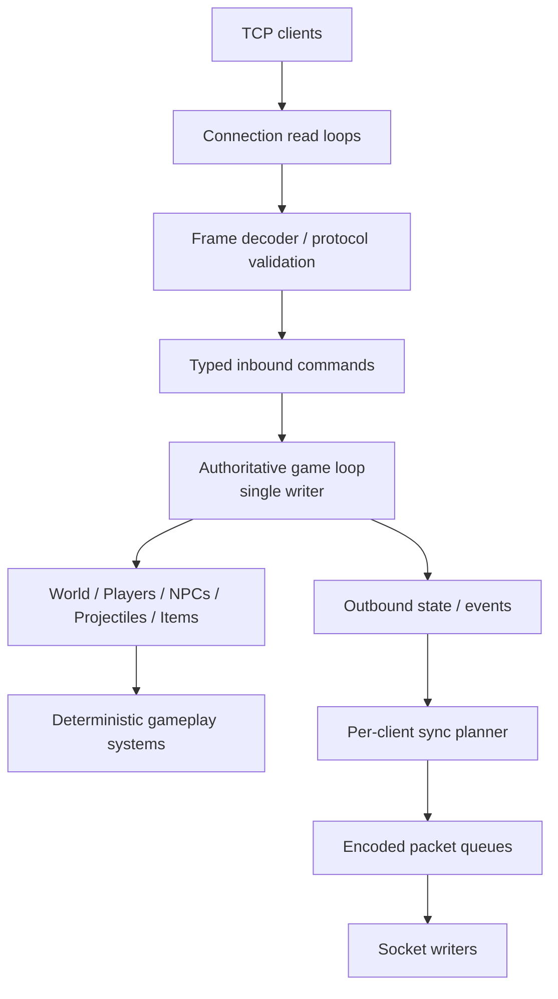
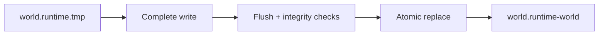
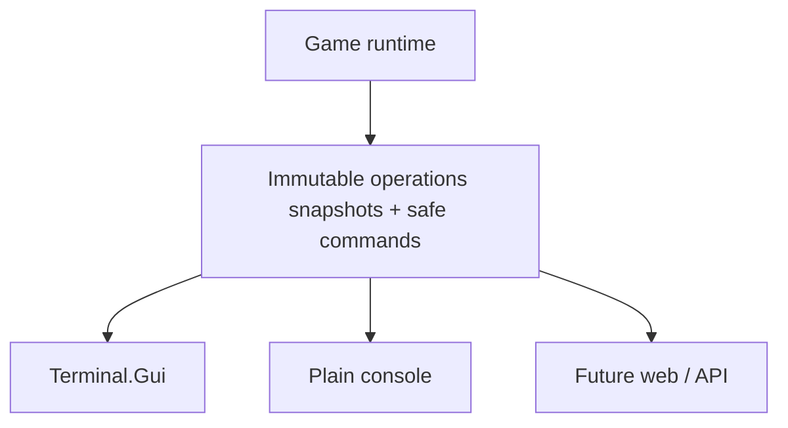
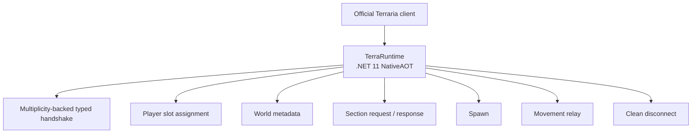

# TerraRuntime roadmap

TerraRuntime is a clean-room C# implementation of the Terraria dedicated server runtime. The project preserves observable vanilla gameplay behavior while replacing fragile legacy internals with explicit, testable, secure and high-performance subsystems.

The governing rule is: **behavioral parity where players can observe it; freedom of implementation everywhere else.**

Detailed performance and tick-stability work is tracked in [`roadmap/performance-tick-stability.md`](roadmap/performance-tick-stability.md). NativeAOT production constraints are normative and live in [`native-aot-baseline.md`](native-aot-baseline.md).


> Checkbox policy: `[x]` means the item is verified on `main` by implementation plus tests/CI or an equivalent executable proof. Partial/foundation-only work remains `[ ]`.

## Reference hierarchy

When sources disagree, use this order of authority:

```text
TerrariaServer 1.4.5.8 decompiled  = primary behavioral/runtime truth
Multiplicity 3.0.0                 = primary protocol library for protocol 326 / Terraria 1.4.5.8
terrustia                          = secondary independent cross-check
TShock / OTAPI                    = behavioral/history reference only
```

Rules:

- The locally decompiled official `TerrariaServer.exe` **1.4.5.8** is the primary source of truth for vanilla behavior, `.wld` layout, gameplay ordering, state transitions, packet handling semantics and runtime constants.
- `VegaKernel/Multiplicity` **3.0.0** is the current protocol implementation baseline for protocol **326 / Terraria 1.4.5.8**. Keep golden bytes and real official-client captures as independent verification of its wire behavior.
- `terrustia` is valuable as an independent implementation, testing reference and source of architectural/performance ideas, but it never overrides the current official 1.4.5.8 server when behavior or format details differ.
- TShock/OTAPI are useful for historical behavior, compatibility knowledge and exploit lessons, but they never define TerraRuntime architecture or override current vanilla behavior.
- Never infer a 1.4.5.8 file/packet/gameplay layout from an older-version reference when the 1.4.5.8 decompiled server can answer the question directly.
- Decompiled official source remains local reference material only and is never committed or copied method-for-method into clean implementation code.

## Platform baseline

- Target **.NET 11** from the start.
- The shipping server is **NativeAOT-first**. Linux x64 and Windows x64 native publication and exercised smoke paths are part of the production contract.
- CoreCLR may be used during development, debugging and profiling when it improves iteration, but production architecture must not rely on JIT-only behavior.
- Do not preserve compatibility with older .NET runtimes unless a concrete deployment requirement appears later.
- Use current .NET 11 BCL, GC, `System.IO.Pipelines`, spans, source generators and performance APIs instead of carrying legacy compatibility abstractions.
- Enable nullable reference types, warnings as errors, deterministic builds and analyzers.
- Do not introduce arbitrary managed DLL loading, runtime code generation, reflection-driven registration or serializers without an explicit trimming/AOT contract.
- Prefer modern BCL functionality over third-party dependencies where it is sufficient.

## Architectural goals

- Preserve vanilla rules, packet semantics, world behavior, NPC/boss AI outcomes, progression, events, drops, housing, wiring, liquids and `.wld` compatibility.
- Do not reproduce the original Terraria server architecture merely because gameplay behavior came from it.
- Treat every client packet as untrusted input.
- Keep mutable simulation state under a single authoritative owner by default.
- Keep sockets, compression, persistence, logging and expensive I/O away from the game loop.
- Prefer deterministic, bounded work over shared mutable concurrency.
- Make protocol and gameplay behavior independently testable.
- Design hot paths to be allocation-light from the beginning, but require measurements before introducing unsafe or exotic optimizations.

## Target architecture



Connection code never mutates the world directly. Background work produces immutable results that are applied through explicit game-loop commands.

## Phase 0 - Repository and .NET 11 baseline

- [x] Keep production code under root `src/`.
- [x] Keep tests under root `tests/`.
- [x] Keep locally decompiled official server output under ignored `decompiled/` only.
- [x] Pin the .NET 11 SDK through `global.json`.
- [x] Record the exact Terraria dedicated-server version and binary SHA-256 used as behavioral reference.
- [x] Maintain reproducible local tooling to download and decompile the official server.
- [x] Add .NET 11 CI for restore, build, test and formatting/analyzers.
- [x] Keep Linux and Windows NativeAOT publish + native smoke jobs green.
- [x] Enable nullable, warnings as errors and deterministic builds.
- [ ] Remove dependencies and patterns retained only for old .NET/Mono compatibility.

## Phase 1 - Typed protocol core

Build a standalone Terraria protocol layer before gameplay.

### Multiplicity bootstrap

Use the `VegaKernel/Multiplicity` NuGet package (`Multiplicity`) as the typed packet implementation.

- [x] Baseline package: `Multiplicity` **3.0.0**, protocol **326 / Terraria 1.4.5.8**.
- [ ] Use its typed packet model when packets need ownership, mutation or re-serialization.
- [ ] Prefer its zero-copy `PacketView` / `PacketViewParser` path for hot-path inspection.
- [x] Keep Multiplicity behind the runtime protocol boundary so gameplay code does not depend on concrete packet-library types.
- [ ] Put protocol fixes in Multiplicity when they belong to the shared protocol model rather than duplicating a second full packet parser in the runtime.
- [ ] Keep golden-byte and real-client captures as the final independent protocol verification; a green Multiplicity round trip cannot prove parity by itself.

### Framing

- [x] Incremental parser for `[u16 length][u8 message id][payload]`.
- [x] Correctly handle fragmented and coalesced TCP reads.
- [x] Reject impossible lengths, oversized frames and truncated payloads deterministically.
- [x] Never allocate directly from an untrusted client-declared length without a hard ceiling.

### Typed packets

- [ ] Replace magic offsets in gameplay code with typed packet records/structs.
- [x] Centralize message IDs in one named catalog.
- [x] Use explicit bounded `TryDecode`/`Decode` contracts.
- [ ] Represent optional wire sections with named flags and types rather than scattered bit arithmetic.
- [ ] Preserve raw trailing bytes only when protocol semantics genuinely require transparent relay.
- [ ] Use source generation for codecs only where it simplifies correctness or produces measurable gains.

### .NET 11 hot path

- [x] `ReadOnlySpan<byte>` / `Span<byte>` codecs.
- [x] `SequenceReader<byte>` where segmented input is useful.
- [x] `IBufferWriter<byte>` for encoding.
- [x] `PipeReader` / `PipeWriter` compatible framing.
- [ ] Avoid `MemoryStream`, `BinaryReader`, LINQ and temporary arrays on common packet paths.
- [ ] Use `ArrayPool<T>` or `MemoryPool<T>` for large temporary buffers when measurement justifies pooling.

### Security

- [x] Separate byte decoding from gameplay/state validation.
- [x] Per-message size ceilings.
- [x] Per-connection rate accounting.
- [x] Protocol fuzz tests and a permanent malformed-packet corpus.
- [x] Parsing failure returns a bounded error and never crashes the server process.

## Phase 2 - Networking runtime

- [x] Use `System.IO.Pipelines` or an equivalent measured low-allocation .NET 11 socket pipeline.
- [x] One read loop and one write path per connection.
- [x] Bounded outbound queues with an explicit slow-client policy.
- [ ] Size queue limits from measured real workloads and configured player count rather than a guessed constant.
- [x] Batch already queued small frames into fewer socket writes without intentionally delaying latency-sensitive traffic.
- [x] Use `TCP_NODELAY` unless measurement demonstrates a better policy.
- [x] Handshake deadline plus normal idle timeout.
- [x] Gate maximum concurrent connections before allocating expensive player state.
- [x] Cancellation must release all connection resources on every exit path.

### DoS hardening

- [x] Global and per-connection budgets for expensive work.
- [x] Bound password/KDF work, compression and section requests.
- [x] Independent rate limits for tile edits, liquids, chat, item operations and other expensive packet classes.
- [x] Distinguish malformed protocol, rate limit, invalid state and gameplay rejection in structured telemetry.

## Phase 3 - Authoritative game loop and threading

Use a single-writer simulation model initially, borrowing the useful actor-style ownership pattern demonstrated by terrustia.

- [x] One dedicated game-loop thread owns mutable world, players, NPCs, projectiles, items and progression state.
- [x] Connections submit typed commands/events through bounded channels.
- [ ] No socket callback, TUI thread, timer callback or background worker mutates game state directly.
- [ ] No locks on the main simulation hot path.
- [x] Preserve packet order per connection.
- [x] Bound inbound work processed per tick so one connection cannot monopolize a frame.
- [ ] Use global operation budgets per subsystem; never multiply a full subsystem budget by player count.
- [x] The command loop keeps a hard global operation cap, per-source fairness quota and optional authoritative-thread CPU-time cap, with deferred-work and backlog-age telemetry.
- [x] Fixed 60 Hz simulation schedule with an explicit missed-tick policy.
- [x] Measure both wall time and CPU time; report them separately so OS contention is not confused with simulation cost.
- [x] Record timing per simulation phase and report the worst phase, not only total tick time.

Suggested phases:

```text
Inbound commands
Clock/events
Liquids/growth/spread
Tile entities/wiring
Items
NPC AI
Projectiles
Combat/damage
Spawning
Housing
World progression
Visibility/sync planning
Outbound snapshots
```

### Worker pool

Multithreading is used aggressively only where ownership is clear.

- [x] Networking remains asynchronous and independent per connection.
- [ ] Disk I/O, compression, hashing and other blocking work run outside the game loop.
- [x] CPU-heavy background work uses bounded dedicated workers, not unbounded `Task.Run` fan-out.
- [x] Workers receive immutable snapshots or isolated buffers and return results through explicit completion channels.
- [ ] The game thread applies results at well-defined commit points.
- [ ] Do not parallelize gameplay/worldgen passes that share an order-sensitive RNG stream or read state modified by neighbouring work.
- [ ] Parallelize only proven-independent work and require bit-identical/deterministic regression tests when vanilla ordering matters.

## Phase 4 - World representation

- [ ] Preserve vanilla `.wld` compatibility as a hard requirement unless explicitly versioned otherwise.
- [ ] Separate persistence representation from in-memory simulation representation.
- [ ] Partition the world into sections/chunks for locality, visibility and dirty tracking.
- [ ] Track dirty regions so networking and saving do not scan the entire world.
- [ ] Avoid allocating objects per tile.
- [ ] Benchmark AoS versus SoA/packed layouts before choosing a permanent tile representation.
- [ ] Cache derived section metadata only with explicit invalidation rules.

### Encoded section cache

Borrow the useful terrustia pattern, adapted to .NET 11:

- [ ] cache already encoded/compressed section packets after first construction;
- [ ] invalidate a cached section only when a tile/world mutation affecting it commits;
- [ ] disable dirty-tracking overhead during initial world load/generation when nearly every tile is written;
- [ ] never mark a section as delivered until its encoding has actually succeeded;
- [ ] keep cache memory bounded and observable.

### Save pipeline

- [x] Snapshot required mutable state on the authoritative game-loop owner.
- [x] Serialize and write detached save snapshots outside the game loop.
- [x] Atomically replace the canonical save only after successful complete serialization.
- [x] Keep disk I/O off the simulation thread; tile-shadow synchronization uses a bounded default budget of `4 sections/tick`.
- [x] Permit only one save serialization at a time; coalesce redundant autosave requests rather than building a backlog.
- [x] Graceful shutdown (`Ctrl+C` / POSIX `SIGTERM`) stops the authoritative owner, captures the newest final state and waits for the save coordinator to commit it.
- [x] Maintain the save tile shadow incrementally from dirty sections instead of copying the complete tile array in one save tick.
- [x] Flush save contents before publication and, on Linux, `fsync` the parent directory after replace/move so the directory entry has an explicit durability barrier.
- [x] Regression-test the pre-publication process-crash invariant with a real `SIGKILL`: an existing canonical save stays byte-identical, a first save stays hidden, and the next normal save can still commit (`Authoritative World Save` run `33267501627`).
- [x] Complete broad interrupted-save/crash recovery: durable marker-authorized roll-forward, unsealed-orphan discard, live-writer exclusion, stale-conflict quarantine, previous-generation backup safety, and post-publication stale-sidecar cleanup are covered by unit tests plus the dedicated real-`SIGKILL` recovery workflow.
- [x] Keep one validated previous-generation backup and perform fail-closed automatic rollback for structurally/content-corrupt canonical checkpoints. `World Checkpoint Recovery` run `33269875235` proved backup rotation, exact recovery, invalid-backup refusal, official TerrariaServer 1.4.5.8 reload, and no rollback for unsupported future version `327`.
- [x] Add lease-safe orphan `.tmp` cleanup without deleting a temporary file owned by another live writer/process. `Authoritative World Save` run `33270924996` proved cleanup helper `5/5`, real host startup cleanup before world load `1/1`, plus the SIGKILL durability contract; cleanup also runs before later writes, while unleased legacy temporaries are left untouched because ownership cannot be proven.

## Phase 5 - Fast startup / cached runtime world image

Keep `.wld` as the canonical source of truth and add a disposable optimized runtime cache, following the useful lessons from Vega's derived world-image work.

```text
.wld              = canonical Terraria persistence / recovery format
.runtime-world     = disposable, versioned, optimized startup image
```

The runtime image should contain **already prepared runtime state**, not merely a second copy of the `.wld` bytes.

Candidate contents:

- [ ] packed/predecoded tiles or section blocks;
- [ ] world metadata;
- [ ] chests, signs and tile entities;
- [ ] liquid state and pending liquid work where required for behavioral parity;
- [ ] section metadata and dirty-state bootstrap data;
- [ ] measured expensive runtime indexes;
- [ ] prebuilt data useful for initial player section synchronization.

### Validity

Cache acceptance requires at least:

- [x] source `.wld` content hash/fingerprint;
- [x] Terraria world format/version;
- [x] runtime-image schema version;
- [x] critical compiler/layout parameters;
- [x] per-section or whole-image integrity checks.

Timestamps alone never decide validity.

### Atomic rebuild and fallback



- [x] Cache corruption/staleness is never canonical world corruption.
- [x] Any validation/load failure falls back automatically to `.wld` and records a machine-readable miss reason.
- [x] Saving completes the canonical `.wld` first, then schedules a coalesced runtime-image rebuild.
- [x] Shutdown may wait for the final runtime-image rebuild so the next boot gets the newest cache.

### Performance gate

Measure independently:

- [ ] file read;
- [ ] tile reconstruction;
- [ ] liquids/post-load initialization;
- [ ] index construction;
- [ ] cache validation;
- [ ] `WorldReady`;
- [ ] `NetworkReady`;
- [ ] allocations and GC deltas.

Vega already demonstrated an important lesson: caching only serialized/tile data can miss the real startup bottleneck, while caching safe post-load runtime state can materially reduce startup. TerraRuntime should design the image around measured post-load work from the beginning.

## Phase 6 - Gameplay parity

Implement observable behavior subsystem by subsystem using the official server plus independent implementations such as terrustia as behavioral references, never as blindly copied architecture.

Priority:

1. [ ] handshake and spawn flow;
2. [ ] player state and movement;
3. [ ] inventory/items;
4. [ ] tile manipulation and sections;
5. [ ] chests/signs/tile entities;
6. [ ] projectiles and combat;
7. [ ] NPC lifecycle and spawning;
8. [ ] NPC AI;
9. [ ] bosses;
10. [ ] drops;
11. [ ] housing/town NPC behavior;
12. [ ] invasions/events;
13. [ ] wiring/liquids;
14. [ ] world progression;
15. [ ] world generation.

Current boss verticals now include Deerclops `AI_123`: authoritative state transitions, world collision/snow queries, projectile IDs `961/962/965`, source-ordered Classic/Expert/Master loot and persistent `downedDeerclops`. Full Deerclops parity remains intentionally false until player `Slow` buff application and Expert passive `playerInteraction[]`-selected shadow hands have an authoritative runtime owner.

For every subsystem:

- [ ] document observable vanilla behavior;
- [ ] add deterministic unit tests;
- [ ] add integration tests with a real Terraria client/bot where practical;
- [ ] maintain explicit known divergences;
- [ ] do not mark work complete merely because it compiles or resembles decompiled code.

## Phase 7 - Server-authoritative validation

Close exploit classes inherited from client-trusting designs without turning the server into a false-positive anti-cheat machine.

### Identity/session

- [x] Ignore client-claimed player slot where server ownership is already known.
- [x] Validate packet legality against the connection state machine.
- [x] Reject impossible pre-handshake and pre-spawn operations.

### Movement

- [ ] Keep server-known position/velocity history.
- [ ] Validate exceptional movement through explicit server-known states such as teleport, mount or respawn.
- [ ] Keep tolerances compatible with real network jitter and vanilla behavior.

### Inventory/items

- [ ] Server owns world item identity and authoritative item slots.
- [ ] Validate pickup distance, ownership, stack bounds and legal transitions.
- [ ] Never accept arbitrary client item metadata without validation.

### Tiles/world edits

- [x] Bounds-check coordinates before indexing.
- [ ] Validate action type and required world state.
- [ ] Use per-player edit budgets based on vanilla-compatible ceilings.
- [ ] Guard against overflow and oversized area operations.

### NPC/projectile/combat

- [x] Server owns entity identity and lifecycle.
- [ ] Validate targets against live entities across every combat source. The verified direct-melee slice and the admitted trusted-projectile slice already use generation-safe live NPC geometry; PvP must use the same generation-safe player identity and server-owned health/combat state rather than trusting packet 117. Unsupported legacy combat keeps an explicit compatibility fallback until its formula is imported.
- [x] Internally use generation/revision handles so stale slot reuse cannot mutate a different entity.

### Combat integrity

> **One gameplay formula. Anti-cheat must not maintain a separate copy of damage, ammo selection, projectile provenance, velocity, crit, or combat timing rules.**

Combat integrity is not an external packet-sniffing `AntiCheat`. The intended ownership chain is `AuthoritativeCombatCalculator -> CombatValidator -> world mutation`, so normal combat and cheat resistance cannot drift into two competing gameplay implementations. Client `damage`, `crit`, projectile velocity and other combat fields become hints/diagnostics only as source-backed coverage expands.

Projectile parity in Phase 7 means **server-authoritative gameplay parity**, not cosmetic parity: movement/AI state, collision, lifetime, damage/status, immunity, penetration and child spawn/kill behavior must match the pinned server wherever they affect gameplay. Dust, gore, light, sound and other visual-only branches stay client-side unless they alter authoritative gameplay state.

#### Authoritative item use

- [ ] Apply the same authoritative item-use calculation to PvE and PvP. Tools are combat sources too: pickaxes, axes and hammers with vanilla damage must pass through the same damage/cadence/range rules as swords rather than bypassing combat integrity.
- [ ] Server determines the active weapon from authoritative inventory/equipment state.
- [ ] Validate `useTime`, `useAnimation`, cooldowns and legal attack cadence using the same gameplay facts that drive normal item use. The strict direct-melee slice now enforces player-global `useTime` while allowing one swing to hit multiple targets on the same tick, plus per-target animation cadence.
- [ ] Client-provided `damage` / `crit` are never a source of truth on fully authoritative combat paths.
- [ ] Validate weapon ownership and selected inventory slot for every combat family. The strict direct-melee slice already resolves the server-owned selected inventory item; projectile weapon/ammo source mapping remains open.
- [ ] Reject impossible item-use cadence before projectile spawn or world mutation.

#### Authoritative ammo selection

- [ ] Implement a server-side vanilla-equivalent `PickAmmo` path.
- [ ] Match vanilla priority across dedicated ammo slots and normal inventory.
- [ ] Validate weapon/ammo compatibility through authoritative `useAmmo` / `ammo` facts.
- [ ] Apply ammo `shootSpeed`, damage and knockback contributions server-side.
- [ ] Apply ammo-specific projectile type transformations server-side.
- [ ] Apply ammo-conservation effects using server-owned RNG/state.
- [ ] Consume/decrement ammo only on the server and replicate the resulting inventory mutation.
- [ ] Differential-test `PickAmmo` against TerrariaServer 1.4.5.8, including conservation and unusual ammo transforms.

Checkpoint slice: the strict ammo path now follows the source-backed `PickAmmo` search order `coin -> ammo -> main inventory`, rejects an unsupported earlier compatible candidate instead of skipping ahead, and owns ammo decrement. The admitted arrow set is Wooden/Iron/Copper/Tin/Lead/Silver/Tungsten/Gold/Platinum Bow with Wooden/Flaming/Unholy/Jester Arrow; the admitted bullet set is Flintlock Pistol/Musket/Minishark/Handgun with Musket Ball/Tungsten Bullet. Magic/Molten/Stalker's Quiver arrow modifiers, Molten Quiver's Wooden Arrow -> Fire Arrow transform/+2 ammo damage, Minishark intrinsic 1/3 conservation, Fossil `ammoCost80` and server-confirmed Ammo Reservation conservation are modeled. Unsupported earlier compatible ammo still fail-closes rather than being skipped; remaining ammo families/transforms/conservation sources and authoritative acquisition provenance for consumable buffs remain open.

#### Projectile spawn validation

- [ ] Validate legal `ProjectileType` for the authoritative weapon/ammo/use path.
- [ ] Track and validate full `Weapon -> Ammo -> Projectile` provenance.
- [ ] Validate spawn position against the authoritative player/item-use geometry.
- [ ] Validate initial projectile velocity for every player-owned projectile before it can damage NPCs or players.
- [ ] Validate projectile damage for both NPC and PvP targets.
- [ ] Validate projectile knockback.
- [ ] Validate `ai[]` and special spawn parameters for source-backed weapon families.
- [ ] Validate projectile count per item use, including multishot/special weapons.
- [ ] Promote a client packet-27 projectile into authoritative combat only after provenance/spawn validation succeeds; unverified client spawns remain diagnostic/compatibility state and cannot damage authoritative entities.

#### Projectile velocity-magnitude envelope

- [ ] Server computes the legal launch-speed magnitude interval `[MinLaunchSpeed, MaxLaunchSpeed]` for every authoritative player-owned projectile. Combat integrity does not require generic angular/aim validation; weapon-specific direction mechanics may be modeled by gameplay code only where they are required for vanilla behavior.
- [ ] Calculate the base interval from source-backed weapon `shootSpeed` plus authoritative ammo `shootSpeed` / `PickAmmo` semantics. Deterministic weapons may collapse the interval to `MinLaunchSpeed == MaxLaunchSpeed`.
- [ ] Apply prefix, buff/debuff, armor/set-bonus, accessory and class speed modifiers from authoritative player state before deriving the final interval.
- [ ] Apply weapon-specific speed modifiers and exceptional launch mechanics.
- [ ] Expand the interval only for source-backed vanilla RNG/speed variance; do not add arbitrary anti-cheat tolerance that can mask forged velocity.
- [ ] Validate `|velocity|` against `[MinLaunchSpeed, MaxLaunchSpeed]` before the projectile can become combat-trusted.
- [ ] Add specialized magnitude-envelope calculators for weapons whose launch-speed mechanics cannot be represented by the generic weapon+ammo path.
- [ ] Record expected min/max launch speed, received speed magnitude and all authoritative modifier inputs in combat diagnostics.
- [ ] Hard-reject impossible launch-speed magnitude before the projectile enters authoritative combat state.

Checkpoint slice: admitted bow/arrow and ordinary gun/bullet generations now derive a real `VanillaLaunchSpeedEnvelope` from authoritative weapon `shootSpeed`, ammo `shootSpeed`, supported ranged prefixes and the current combat snapshot. Deterministic combinations collapse to one magnitude with only a small floating-point/network representation epsilon in `ContainsMagnitude`; there is no generic angular envelope. Magic Quiver and server-confirmed Archery apply the pinned 1.4.5.8 arrow speed rules, including Archery's `<20` check and 20 cap. Remaining special-weapon launch variance/mechanics and unmodeled speed-affecting state remain fail-closed.

#### Authoritative projectile simulation

- [x] After a projectile generation is marked combat-trusted, client position/velocity updates are never authoritative for its simulation.
- [ ] Server simulates acceleration, gravity, drag, homing, bouncing and source-backed projectile AI.
- [ ] Client projectile position/velocity updates may be retained for diagnostics/divergence metrics only. Rejected packet-27 rewrites on combat-trusted generations should accumulate a bounded deviation/suspicion signal, and large position/velocity divergence should trigger an immediate resend of the authoritative packet-27 state so prediction is corrected instead of merely rejected. This correction path must never promote client state or mutate gameplay from the reported values.
- [x] Combat-trusted generations reject owner packet-27 state rewrites (`type`, damage, position/velocity, `ai[]`, ownership and related authoritative fields) and packet-29 early termination.
- [ ] Complete vanilla projectile gameplay-AI families. `BasicArrow`, `Thrown`, source-backed Enchanted Boomerang type 6, the admitted Skeletron/Deerclops families, Star Cannon Star type 955 (`aiStyle 5`), Super Star type 728 (`AI_151`) and the spawned Super Star Slash type 729 (`AI_152` gameplay branch) are explicit simulation profiles; known unsupported families still fail closed. Natural Falling Star type 12 is definition-cataloged but intentionally not profile-admitted yet because its non-remix daytime `damage == 1000` kill gate depends on authoritative world-time/remix state that is not wired into this projectile stepper. Super Star type 728 now owns its source-backed `SummonSuperStarSlash` child creation and local NPC immunity, and the existing For-the-Worthy star reflection is interleaved per physical slot before damage. Type 729 remains combat fail-closed even though its movement/lifetime/static-immunity facts are cataloged, because `extraUpdates=2` requires collision/damage to be interleaved between local subupdates before complete hit parity can be claimed.
- [ ] Complete projectile ownership/source validation. Connection ownership is enforced, combat-trusted generations are immutable to client packet 27/29 mutation, and admitted ordinary bow/arrow plus gun/bullet packet-27 spawns are promoted only after server-owned weapon/ammo/damage/knockback/speed/cadence provenance validation. Broader weapon/ammo/special-spawn families remain open and fail closed for combat trust.
- [ ] Complete entity collision. Tile/world collision exists, and deterministic post-simulation passes now select NPC and hostile legal PvP player targets for trusted admitted friendly projectiles with generation-safe ownership/team gating. The admitted PvP slice now reproduces general 8-tick PvP immunity, generation-safe per-projectile/per-player 40-tick `Projectile.playerImmune[]`, dodge resolution and the current type-specific `Colliding` gate for Bone Shard. Remaining work is unsupported projectile-family collision hooks/hit shapes, owner-hit checks and other exceptional target rules.
- [ ] Buff/debuff application from projectile hits. The admitted PvP slice owns the complete type-specific `StatusPvP` overlap for its current projectile IDs (Fire Arrow type 2 -> `On Fire!` 1/3 for 180 base ticks; Poisoned Knife type 54 -> `Poisoned` 1/2 for 600), plus the source-ordered weapon-imbue and Frost-armor branches that precede those type-specific effects in `Projectile.StatusPvP`. Server-confirmed imbues map vanilla `meleeEnchant` 1..8 to Venom/Cursed Flames/Fire/Gold/Ichor/Nanites/Confetti/Poison semantics; status-bearing admitted melee projectiles apply the corresponding debuff RNG/duration, admitted melee/ranged projectiles from Frost armor apply `Frostburn2`, and Gold/Confetti remain non-status/child-spawn cases exactly where the pinned source does. Server-owned `Player.AddBuff` difficulty duration scaling (Classic 1x / Expert 2x / Master 2.5x), inclusive final active update, negative `lifeRegenCount` accumulation and authoritative HP loss are modeled for Poisoned, Venom, On Fire!, Hellfire/OnFire3, Cursed Inferno, Frostburn and Frostburn2. Status is applied after the general-immunity gate and before `Player.Hurt`, so a successful dodge retains the debuff. Remaining work is unsupported `StatusPvP` projectile families, authoritative Confused movement semantics, debuff-immunity accessory families, status replication/visuals and the rest of vanilla buff side effects. The admitted Confetti branch now creates its child projectile in source order; same-tick scheduler insertion is tracked under spawn ordering rather than status application.
- [x] Source-backed projectile lifetime remains runtime-owned rather than client-owned.
- [ ] Complete spawn ordering. The projectile phase now walks the live physical table in vanilla slot order `0..999` rather than a pre-pass projectile snapshot: a child allocated into a later unvisited slot is simulated again in the same global tick, while allocation into an already-visited slot waits until the next tick. Reflection and NPC/PvP combat are interleaved after each visited slot, and NPC candidates are generation-safe live-rechecked so earlier-slot kills/replacements are visible to later-slot children. The admitted Confetti Flask child type 289 retains its pinned combat-mutation order, and Super Star type 728 now spawns type 729 after committed NPC hit/immunity/penetration side effects through the normal first-free-slot allocator. Remaining ordering work is combat interleave between `extraUpdates` subupdates, kill/on-kill child families, full slot-pressure/oldest-projectile replacement parity and the other child families.
- [ ] Complete NPC/projectile side effects. Trusted admitted hits now commit NPC damage/death through the existing pipeline and consume source-backed penetration. In PvP, a collided hit that dodges still consumes penetration and starts the projectile-local 40-tick target cooldown, while a globally immune player is skipped before those side effects, matching `Damage_PVP`. Current admitted type-specific status, server-confirmed `meleeEnchant`, Frost-armor `frostBurn` and `magmaStone` on-hit state are server-owned, and Hallowed `Player.OnHit` protection acquisition is modeled for admitted hits. Confetti child creation is server-owned; Super Star type 728 now reproduces generation-local `localNPCHitCooldown=-1`, source-ordered post-hit type-729 slash spawning and the child definition's shared-by-type `idStaticNPCHitCooldown=10` fact. Type-729 damage remains fail-closed until per-subupdate combat interleave exists. Remaining generic `Player.OnHit`/on-kill effects, other child families, unsupported enchantment/status projectile families, status replication and special projectile families remain open.

Checkpoint PvP collision/immunity pass: the strict admitted player-projectile path no longer treats one generic cooldown as all immunity. `Player.Hurt(pvp:true)` general immunity is held for 8 ticks, while each exact projectile generation keeps a generation-safe 40-tick target row matching vanilla `Projectile.playerImmune[target]`. Dodge order is source-matched as Mystic Sash 1/10 -> Black Belt/Master Ninja Gear 1/10 -> Brain of Confusion 1/6 when buff 321 is absent -> active Shadow Dodge. Successful ordinary dodge grants the vanilla 80-tick immunity (120 with Cross Necklace `longInvince`), Brain dodge records authoritative buff-321 cooldown for 240 ticks, and Shadow/Hallowed Protection consumes buff 59 and starts the source-matched 1800-tick Hallowed cooldown. Hallowed armor now reacquires authoritative protection through `Player.OnHit` only when that cooldown is clear. Server-confirmed Shimmer state is checked before general immunity/dodge exactly as `Player.Hurt` does, and the pinned `ProjectileID.Sets.CanHitPastShimmer` allow-list bypasses that dodge for the corresponding projectile types. Dodge consumes projectile penetration/cooldown as vanilla does; pre-existing global immunity does not. Bone Shard type 1124 also observes the pinned `ai[0] >= 15` collision gate. Automatic Shimmer-state acquisition from liquid/runtime, remaining avoidance sources and unsupported exceptional projectile collision hooks remain open.

Checkpoint PvP status/DoT/on-hit pass: `StatusPvP` is no longer a client-side decoration for the admitted projectile set. Fire Arrow and Poisoned Knife rolls, server-confirmed flask `meleeEnchant` status branches, Frost-armor `Frostburn2` and Magma Stone/Fire Gauntlet effects all use server RNG and server-owned lifetimes, and the player owner advances vanilla bad-life-regeneration accumulation into authoritative HP changes. Direct melee PvP follows `StatusToPlayerPvP` source order `meleeEnchant -> frostBurn -> magmaStone` before `Player.Hurt`; admitted projectile PvP follows the matching `Projectile.StatusPvP` order `meleeEnchant -> frostBurn -> magmaStone -> type-specific status`. Hallowed/Frost armor pieces and set bonuses are projected from authoritative equipment; Hallowed Protection acquisition/consumption/cooldown and server-confirmed Shimmer dodge ordering are modeled. Difficulty extension is applied at the authoritative AddBuff boundary. Packet 50 remains non-provenance, so positive flask/Shimmer state cannot enlarge or alter combat merely because a client claims it. Actual gameplay provenance for consuming/granting every flask and Shimmer liquid state, Confused movement, debuff-immunity accessories and unsupported status/projectile families remain open. Confetti combat-mutation spawn order is now modeled; exact same-tick scheduler insertion remains open under projectile spawn ordering.

Checkpoint projectile child/gameplay-AI pass: the admitted Confetti Flask projectile branch now owns child type 289 creation instead of treating Confetti as a cosmetic/status no-op. Against NPCs, Nano Flask's pinned 1.05 damage boost is applied before Confetti child creation and the child is created before `StrikeNPC`; in PvP, the child is created after `Player.Hurt`/authoritative commit and before projectile-local target immunity/penetration, matching the pinned source order for the supported slice. Star Cannon Star type 955 now uses the source-backed `aiStyle 5` gameplay state transition that arms `ai[1]` after leaving solid collision, while Super Star type 728 imports only the gameplay-relevant `AI_151` behavior and deliberately omits alpha/rotation/sound/gore/dust. Natural Falling Star type 12 remains fail-closed as a combat AI profile until authoritative day/remix-world state can reproduce its source kill gate. Super Star's on-NPC-hit `SummonSuperStarSlash` -> type 729 child and the For-the-Worthy reflection branch for types 728/955 remain explicitly open, so this checkpoint claims simulation-AI parity for those profiles rather than complete combat parity. Full same-tick child slot scheduling, other child/on-kill families and broader projectile gameplay-AI families remain open.

Checkpoint live-slot/Star child pass: projectile simulation no longer snapshots the active projectile table for the whole phase. The authoritative loop visits physical slots `0..999` live, commits each generation, then applies reflection and NPC/PvP interactions before advancing. This reproduces the key `NewProjectile` insertion rule: first-free children in later slots may run during the same global tick, while children placed in earlier slots wait. NPC targets are live generation-rechecked before hit mutation. Super Star type 728 now uses its vanilla generation-local one-hit-per-NPC immunity and spawns Super Star Slash type 729 after the committed NPC hit/penetration side effects with source-backed geometry, 0.75 parent damage, ai[1]=targetY and server-owned combat provenance. Type 729 has its 20x20, tileCollide=false, extraUpdates=2, 30-update lifetime and shared-by-type 10-tick NPC immunity facts, but authoritative damage remains deliberately fail-closed until collision/damage can execute between its three local subupdates exactly like vanilla. Prediction-hardening follow-up is also explicit: rejected packet-27 divergence should feed bounded suspicion and large divergence should force an authoritative packet-27 correction resend without trusting any reported client state.

#### Authoritative damage calculation

- [ ] Server-authoritative damage calculation for every player combat source and target class (PvE + PvP). The first strict direct-melee slice covers source-backed Muramasa and Copper Pickaxe facts; Copper Pickaxe is deliberately included to prevent tools from becoming an unvalidated PvP damage bypass. Wire damage/crit are diagnostics only on accepted strict paths.
- [ ] Use one explicit pipeline: `AttackContext -> AuthoritativeAttackDamage -> TargetMitigation -> FinalDamageToHp`. Client-reported final damage is never reused as the result on authoritative paths.
- [ ] `AttackContext` is built entirely from server-owned attacker state: selected weapon/tool, ammo, item/ammo prefixes, armor and set bonuses, accessories, buffs/debuffs, class modifiers, armor penetration, world/difficulty state and source-specific mechanics.
- [ ] Include weapon + ammo contributions.
- [ ] Include item/ammo prefixes.
- [ ] Include attacker armor/set bonuses and accessories.
- [ ] Include attacker buffs/debuffs and class modifiers. The combat snapshot must consume server-owned active buff state; modeled attacker effects include damage/crit/attack-speed/defense/arrow-speed/ammo-conservation modifiers rather than treating buffs as packet annotations.
- [ ] Client packet 50 (`PlayerBuffs`) is never sufficient provenance for increasing a combat envelope. Positive combat buffs may increase authoritative damage/crit/speed/ammo-save only after a server-owned gameplay source confirms the buff and duration; forged/self-claimed packet-50 state must not promote a projectile or hit to `CombatTrusted`.
- [ ] Keep buff/debuff lifetimes generation-safe and tick-owned by the server. Expired buffs, slot reuse, disconnect and world-transfer detach must not leak combat modifiers into a later player generation.
- [ ] Calculate crit server-side for every weapon/projectile family. The verified direct-melee slice already rolls crit server-side.
- [ ] Include armor penetration and other source-backed offensive modifiers.
- [ ] Apply `TargetMitigation` from authoritative target state after attack damage is resolved.
- [ ] For NPC targets include NPC defense, damage-reduction/defense modifiers, buffs/debuffs, immunity state and source-backed exceptional mechanics.
- [ ] For PvP player targets include equipped armor, armor/set bonuses, accessories, defense, endurance/damage reduction, buffs/debuffs, dodge/avoidance, immunity frames and PvP-specific vanilla rules; never reuse NPC defense math blindly for players. The admitted slice now includes 8-tick general PvP immunity, 40-tick exact-projectile target immunity, Mystic Sash, Black Belt/Master Ninja Gear, Brain of Confusion cooldown gating, Cross Necklace dodge-duration extension, Shadow/Hallowed Protection acquisition+cooldown, server-confirmed Shimmer dodge with the pinned projectile bypass allow-list, Ichor and Broken Armor target-defense ordering. Remaining target families still fail closed.
- [ ] Include difficulty/world-state modifiers at the vanilla stage where they actually apply.
- [ ] Include vanilla damage variance using server-owned RNG.
- [ ] Implement source-backed special weapon/projectile damage mechanics without a parallel anti-cheat formula.
- [ ] Damage envelopes must be derived from the same attacker/target gameplay facts used to compute real damage, not from static anti-cheat constants. Source-backed prefix multipliers are imported; full armor/accessory/player-buff/target-mitigation coverage remains intentionally incomplete and must fail closed/fall back rather than be guessed.
- [ ] Validate NPC/player hit target and range across all hit shapes. Strict direct melee has a conservative impossible-distance guard; PvP direct melee must apply the same item-use geometry against player hitboxes, and trusted admitted projectiles must collide server-side with both NPC and hostile legal player targets.
- [ ] Reject impossible damage before world mutation across every combat path. The strict calculator/validator path already rejects before interaction/HP/loot/replication mutation; unsupported legacy combat remains the blocker.

Checkpoint slice: the shared contracts explicitly represent `AttackContext -> AuthoritativeAttackDamage -> TargetMitigation -> FinalDamageToHp`. The authoritative combat snapshot composes equipment plus generation-safe, tick-owned server-confirmed combat buffs. The modeled combat-modifier subset includes Ironskin, Magic Power, Archery, Tipsy, Well Fed / Plenty Satisfied / Exquisitely Stuffed, Weak, Ichor, Broken Armor, Ammo Reservation, Endurance, Rage, Wrath, Hallowed Protection/Shadow Dodge, Brain of Confusion cooldown, Shimmer state, Frost-armor status provenance, the eight vanilla weapon-imbue states and Neutral Hunger/Hunger/Starving. Server-owned PvP DoT state covers Poisoned, Venom, On Fire!, Hellfire/OnFire3, Cursed Inferno, Frostburn and Frostburn2. Packet 50 cannot grant these modifiers/statuses by itself. Direct melee/tools (Copper Pickaxe/Axe/Hammer/Broadsword and Muramasa) consume the same snapshot. Equipment projection now covers the main pre-Hardmode metal/class armor families plus Hallowed/Ancient Hallowed and Frost armor, and the modeled glove, emblem, scope, quiver, Celestial Stone/Shell, Cobalt Shield, Shark Tooth, Cross Necklace, Black Belt/Master Ninja Gear, Brain of Confusion, Mystic Sash, Magma Stone and Fire Gauntlet families and combat accessory prefixes. Fire Gauntlet/Magma Stone project authoritative `magmaStone` on-hit provenance; Hallowed/Frost set effects project their PvP-critical state. Unknown active combat equipment still fails closed, which also prevents unsupported debuff-immunity accessories from being silently ignored on the strict status path. PvP target mitigation consumes the equipped+buffed target snapshot and source-backed Classic/Expert/Master player-defense effectiveness plus endurance/no-knockback semantics. Server-side provenance from the actual consumption/world sources for every positive potion/flask/Shimmer state, later armor/accessory families, debuff-immunity equipment and the remaining buff/status side effects are still open; unsupported or unconfirmed combinations must not raise `CombatTrusted` envelopes.

#### Combat envelopes

- [ ] `MaxDamagePerHit` derived from authoritative gameplay state rather than a static anti-cheat constant.
- [ ] Validate whether a crit is possible for the active weapon/source/state.
- [ ] `MaxHitsPerSecond` / legal hit cadence per weapon/projectile family. Strict direct melee now has a player-global `useTime` gate plus per-target animation gate; projectile-family cadence remains open.
- [ ] `MaxProjectilesPerUse`.
- [ ] `MaxProjectilesPerSecond`.
- [x] Sliding-window DPS ceiling for the verified direct-melee path.
- [ ] Extend `MaxDps` envelopes to authoritative windows such as 1 / 5 / 10 seconds and projectile combat.

#### Hard rejection

Impossible combat events must not be applied to authoritative world state merely because they were well-formed packets.

- [ ] Reject impossible projectile type/source.
- [ ] Reject impossible/incompatible ammo.
- [ ] Reject impossible damage.
- [ ] Reject impossible initial projectile speed magnitude outside the authoritative `[MinLaunchSpeed, MaxLaunchSpeed]` interval.
- [ ] Reject impossible attack cadence/cooldown state. Strict direct melee already rejects cross-target cadence bypass before mutation; remaining weapon/projectile families are open.
- [ ] Reject projectiles without legal authoritative provenance.
- [ ] Reject hits against impossible NPC or PvP player targets, friendly/team-protected players, or targets at impossible range.
- [ ] Perform rejection before HP, inventory/ammo, buffs, loot, projectile side effects or replication mutate authoritative state.

#### Anomaly detection

Anomaly detection is a second-line diagnostic layer. It must never replace hard authoritative rejection of physically impossible combat.

- [x] Statistical crit/damage-roll anomaly detection for strict-path client claims; this is diagnostic evidence, not the source of authoritative damage.
- [ ] Detect anomalous crit rate across meaningful sample windows.
- [ ] Detect suspicious damage RNG distributions / constant max-roll behavior.
- [ ] Detect unusual DPS patterns that remain technically inside individual-hit limits.
- [x] Suspicion score with tick-based decay for strict-path rejects/anomalies.
- [ ] Extend `SuspicionScore` evidence to ammo, projectile provenance, velocity/cadence and rejected packet-27 prediction divergence without allowing score alone to mutate gameplay. Large trusted-projectile divergence should additionally request an immediate authoritative state resend; suspicion remains diagnostic and never becomes an alternate gameplay authority.

#### Diagnostics

- [x] Bounded diagnostics ring explaining every strict-path rejected hit before mutation.
- [x] Record exact strict-path rejected-attack reason/code.
- [ ] Record expected/received damage and relevant envelope inputs.
- [ ] Record authoritative min/max launch speed, received speed magnitude and the modifier inputs that produced the interval.
- [ ] Record weapon/ammo/projectile IDs and provenance chain.
- [x] Strict direct-melee diagnostics record tick, generation-safe player identity and target NPC generation; projectile-generation diagnostics remain open.
- [ ] Allow bounded verbose combat audit for a selected player without enabling global packet spam.

#### Parity and exploit regression tests

- [ ] Differential combat tests against TerrariaServer 1.4.5.8.
- [ ] Differential `PickAmmo` tests against TerrariaServer 1.4.5.8.
- [ ] Projectile spawn parity tests.
- [ ] Projectile initial speed-magnitude envelope parity tests, including deterministic and vanilla-RNG speed ranges.
- [ ] Damage parity tests, including defense, crit, armor penetration and variance.
- [ ] Weapon cadence parity tests.
- [ ] Dedicated tests for weapons with unusual projectile count, transforms, velocity or AI parameters.
- [ ] Maintain a regression corpus for known exploit classes: forged damage, forged crit, impossible ammo/projectile, velocity hacks, cadence hacks, provenance spoofing, impossible range and projectile state rewrites.

## Phase 8 - Synchronization and scalability

Preserve observable results, not inefficient vanilla broadcast mechanics.

- [x] Movement-driven packet-10 tile-section streaming keeps a bounded 5x3 world window around each playing client beyond the initial spawn bootstrap; per-connection sent-section state prevents redundant retransmission.
- [ ] Section-aware player visibility/interest sets.
- [ ] Dirty-state-driven NPC/projectile/item synchronization.
- [ ] Skip updates for clients that cannot observe an entity, with a bounded forced-resync interval so distant entities never freeze forever.
- [ ] Apply the same visibility logic to movement relay where compatible instead of unconditional O(players²) broadcast.
- [ ] Encode one immutable frame once and share it among recipient queues when the bytes are identical.
- [ ] Explicit delta/full-sync policy with resync deadlines.
- [ ] Compare low-frequency progress/state packets against the last transmitted value before sending unchanged data every tick.
- [ ] Build expensive per-tick roster/spatial summaries lazily once per tick and only if a subsystem actually asks for them.

### Runtime-owned interest management

Interest management belongs to TerraRuntime, not Vega or another host layer.

- [x] External hosts receive only the narrow world-scoped `IInterestManagementControl` toggle (`IsEnabled` / `SetEnabled(bool)`).
- [x] The standalone host accepts `--interest-management`; the same mechanism can be switched at runtime through the control interface without restarting the world.
- [x] Spatial policy, cell/section layout, radii, hysteresis, full-resync rules and entity-specific routing remain internal TerraRuntime details.
- [x] Disabling interest management is fail-open and restores vanilla-like global recipient selection.
- [x] Current foundation tracks authoritative player positions in a section-based compact bitset index on spawn, movement and disconnect.
- [ ] Enabling the feature currently uses a passthrough policy. Actual packet suppression must remain disabled until enter/leave transitions, full state on entry, out-of-range semantics and forced resync are implemented and live-tested.
- [x] Invalid/non-finite/out-of-world positions are removed from spatial membership so later visibility logic can fail open rather than leave a player stuck in a stale cell.
- [ ] Initial player-player policy should use hysteresis, for example a smaller enter radius and larger leave radius, to avoid boundary oscillation.
- [ ] Teleport, respawn and slot reuse must recalculate/clear visibility immediately.

### Join pipeline

A player joining must not freeze everybody already online.

- [ ] Create a staged join state machine.
- [ ] Spread first-time uncached section generation/compression across multiple ticks under an explicit **global subsystem budget**, not a full budget per joining player.
- [ ] Prioritize the minimum sections/state required to enter the world.
- [ ] Continue streaming remaining interest data after initial spawn where protocol behavior allows it.
- [ ] Keep outbound queue growth bounded during join bursts.

Benchmark 1, 8, 24, 64, 128 and 255 connections. Any optimization that changes player-visible vanilla behavior requires an explicit compatibility decision.

## Phase 9 - CPU, memory and GC optimization

After correctness baselines exist:

- [ ] Profile allocations per tick and packet type.
- [ ] Keep common movement/control packet processing allocation-free where practical.
- [ ] Replace hot heap objects with structs only when lifetime and copying costs justify it.
- [ ] Pool compression and large temporary buffers only after measuring real benefit; revert experiments that increase RSS or paging cost.
- [ ] Cache immutable encoded packets only with explicit invalidation.
- [ ] Avoid unnecessary async state machines inside the core tick.
- [ ] Use source-generated logging/serialization on hot paths where beneficial.
- [ ] Measure allocation rate, collection counts, pause time and heap size on .NET 11 where the runtime exposes them safely under NativeAOT.
- [ ] Tune GC settings only from production-like native benchmarks rather than folklore.
- [ ] `GC.TryStartNoGCRegion` is not a baseline architecture assumption.
- [ ] `unsafe` requires a benchmark demonstrating material benefit plus focused correctness tests.

### Runtime specialization

Main shipping server runtime:

- [x] .NET 11 NativeAOT;
- [x] `linux-x64` and `win-x64` are exercised production targets;
- [ ] zero unexplained trim/AOT warnings;
- [x] native executable startup plus exercised loop/protocol/network/world smoke paths are required in CI;
- [ ] Server GC and other GC settings are changed only from compatible production-like benchmarks;
- [ ] no tiered-JIT, dynamic-PGO or ReadyToRun assumption may enter production architecture because the shipping process has no JIT requirement.

CoreCLR remains useful for development-only debugging/profiling experiments, but a change that only works under CoreCLR is not considered production-compatible.

## Phase 10 - Operations API and Terminal UI

Borrow Vega's operations boundary instead of wiring a terminal toolkit into the simulation.



- [x] Operations read models are immutable/bounded projections.
- [x] TUI must never traverse mutable world/player/NPC collections.
- [x] TUI has its own event loop/thread.
- [x] Administrative mutations are marshalled back through the same game-loop command boundary used by other control surfaces.
- [x] TUI failure is not a server-readiness failure; support interactive, plain-console and headless modes independently.
- [x] Use Terminal.Gui v2 as the first UI implementation, but keep core contracts toolkit-independent.
- [x] Dashboard: lifecycle, world, TPS/tick phase, players, queues, packet rates, memory/GC, save/cache state, warnings and recent structured logs.
- [x] Logs viewer uses bounded retention, filters and follow/pause without blocking telemetry refresh.

## Phase 11 - Observability and performance discipline

- [ ] Structured logging from the start.
- [ ] Stable event IDs/categories.
- [x] Tick CPU/wall duration and worst phase.
- [x] Command processed/deferred counts, budget exhaustion count and oldest pending command age.
- [x] Queue depth and slow-client drops, including the packet type that filled the queue.
- [x] Packet counts/bytes by message ID and direction.
- [x] Invalid/malformed/rejected packet counters.
- [x] Active players/NPCs/projectiles/items.
- [x] Spatial-index membership/section changes/invalid-position counters.
- [x] Save snapshot duration, serialization duration and write duration separately.
- [x] World-cache hit/miss/invalidation reason and load/build times.
- [ ] GC allocation rate, collections, pause time and heap size where available.

Telemetry must not add heavy formatting/allocation to every hot-path operation.

Every performance hypothesis should have a reproducible benchmark/harness. Failed optimizations should be reverted and the measurement/reason documented so the same attractive mistake is not repeated later.

## Phase 12 - Test strategy

### Unit tests

- [ ] packet codecs;
- [ ] flags/bit layouts;
- [ ] world math;
- [ ] AI state transitions;
- [ ] drops and probability rule structure;
- [ ] validation/rate limits;
- [ ] save/load components.

### Golden-byte tests

Pin critical packet layouts to known-good bytes instead of relying only on encode/decode round trips.

### Independent real-client capture/replay

Do not trust only tests where both the client and server use Multiplicity. A shared protocol mistake can make both sides agree on the same wrong bytes.

- [ ] Record raw bidirectional sessions from the official Terraria client.
- [ ] Preserve selected captures as small test fixtures.
- [ ] Replay captures in CI and verify framing consumes every byte exactly.
- [ ] Require the blocking join sequence to contain the expected critical packets.
- [ ] Track packet-id coverage of each capture so absence is never mistaken for proof.

### Differential tests

Drive equivalent scenarios against the official dedicated server and TerraRuntime and compare observable state/output.

### Real process stress tests

For networking/queue/scheduler behavior, prefer a real server subprocess and independent client process/load generator where in-process tests hide OS scheduling and backpressure behavior.

Maintain scenarios for:

- [ ] simultaneous joins;
- [ ] sustained movement relay;
- [ ] slow readers;
- [ ] large section/chest bursts;
- [ ] save during player load;
- [ ] 24-player normal load and 255-connection stress.

### Real-client integration

Maintain bots/scripts for:

- [ ] handshake/join;
- [ ] movement/inventory/tile edits;
- [ ] chest/sign interaction;
- [ ] boss progression;
- [ ] events;
- [ ] save/restart;
- [ ] long-running soak tests.

### Fuzzing

- [ ] frame parsing;
- [ ] all variable-length packet decoders;
- [ ] section/tile decompression;
- [ ] `.wld` parsing;
- [ ] command/text parsing.

A fuzz scenario should be able to throw a large malformed corpus at a running server and then prove the server still accepts a valid connection afterwards.

### Crash/exception budget

Pin dangerous fail-fast assumptions in tests rather than prose. Production network/gameplay paths should return explicit errors or isolate failures; any intentional invariant-throw site must be reviewable and counted so the number cannot silently grow.

## Phase 13 - World generation

Worldgen comes last because it is huge, RNG-order-sensitive and unnecessary for proving the runtime architecture.

- [x] First load existing vanilla worlds correctly.
- [ ] Port worldgen pass by pass.
- [ ] Treat RNG stream compatibility as explicit behavior.
- [ ] Keep statistical generated-world tests plus selected deterministic seeds.
- [ ] Profile worldgen by CPU time per pass as well as wall time.
- [ ] Do not parallelize pass-level work sharing Terraria's order-sensitive RNG stream.
- [ ] For genuinely independent intra-pass work, use read/compute on workers and deterministic apply on the owner thread, then prove bit-identical output against the single-thread reference.
- [ ] Do not let worldgen block protocol, runtime or gameplay replacement.

## Performance acceptance direction

Concrete targets will be replaced by measurements on defined hardware. See [`roadmap/performance-tick-stability.md`](roadmap/performance-tick-stability.md) for the detailed gates and stress matrix.

- Common movement/control packets should avoid avoidable heap allocations.
- Typical ticks must stay comfortably below the 16.67 ms budget with room for spikes.
- Idle CPU should approach sleeping cost rather than burn an entire core.
- Ordinary sync must not scan the entire world.
- No unbounded queue/allocation may be controlled by a client.
- Joining a player must not stall simulation while sections are compressed or written.
- Autosave must not perform disk serialization on the authoritative game thread.
- Fast-start cache must always have a safe `.wld` fallback and must demonstrate an end-to-end `WorldReady`/`NetworkReady` win before default enablement.
- 24-player realistic workload is the first meaningful optimization baseline; 255 connections are a stress/scalability target.

## Non-goals

- Source or binary compatibility with original Terraria server internals.
- Reproducing private class layouts or global-state architecture.
- Keeping Mono or obsolete .NET compatibility baggage.
- Premature ECS conversion because it is fashionable.
- Parallelizing every subsystem.
- Copying decompiled method bodies into the clean implementation.
- Trading vanilla-visible behavior for benchmark numbers without documenting the divergence.
- Introducing IPC or worker processes solely to advertise NativeAOT.

## First milestone



Completion requires a real client to join an existing vanilla world, move, receive nearby world state and disconnect cleanly. The same build must survive malformed frame tests without crashing or allocating unbounded memory.

## Continuous bilingual documentation

Detailed documentation work is tracked in [`roadmap/documentation.md`](roadmap/documentation.md).

Documentation is a permanent parallel workstream, not a final cleanup phase after code completion.

- [x] Maintain first-class documentation trees under `docs/ru/` and `docs/en/`.
- [x] Provide bilingual project guides describing build, startup, runtime operation, worlds, persistence, gameplay boundaries and operational behavior.
- [x] Provide bilingual architecture documentation describing ownership, threading, data flow, NativeAOT/CoreCLR profiles, network/protocol boundaries, persistence and extension boundaries.
- [x] Provide bilingual host-interface documentation with lifecycle, status/error semantics and interaction examples.
- [x] Require code changes that alter behavior, architecture, public contracts, CLI/deployment, persistence, lifecycle or supported scope to update both language versions in the same change.
- [x] Treat code/documentation mismatch as an incomplete change in repository agent rules and Definition of Done.
- [x] Expand dedicated bilingual subsystem guides for protocol/networking, world persistence/cache, gameplay, synchronization, operations/TUI, worldgen and security.
- [x] Validate repository-local documentation links in CI.
- [x] Validate required RU/EN mirrored page sets in CI without requiring line-by-line translation equivalence.

For every new significant subsystem, documentation must describe purpose, owner, inputs/outputs, lifecycle, public integration surface, safety/failure semantics, observable behavior, known limitations and verification evidence. Roadmap target design must remain visibly distinct from behavior that is already implemented.
