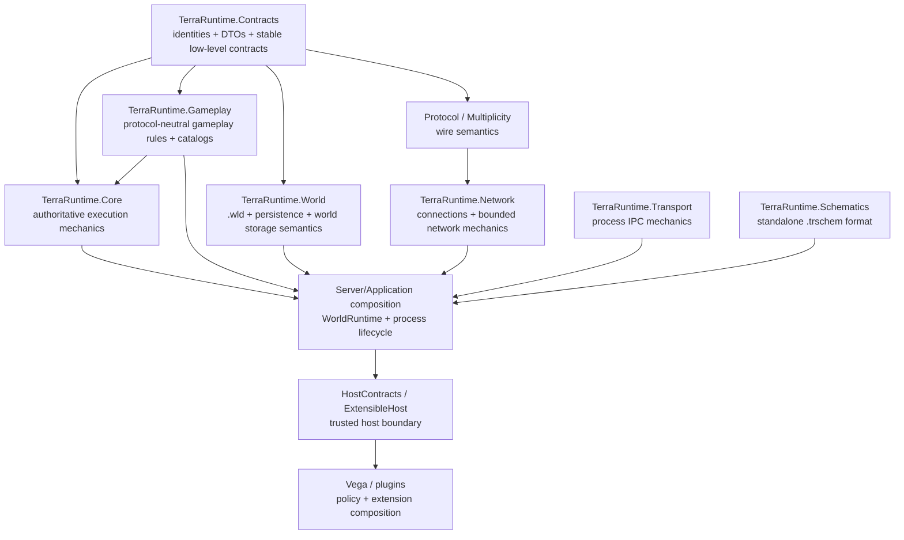

# Architecture and code cleanup roadmap

This is the living refactoring plan for TerraRuntime. It is normative for structural cleanup. Checkboxes are updated as work lands on `main`; `[x]` means the structural change is present in the repository and has passed the relevant build/tests/CI, not merely that a file was moved.

The goal is not to maximize the number of projects, interfaces or patterns. The goal is to make ownership obvious, dependency direction boring, names short enough to read, and large code units cohesive enough to change safely.

## Target dependency direction



The diagram is a direction guide, not a demand that every arrow become a direct project reference. Fewer references are better when a layer does not actually need another layer.

## Non-negotiable ownership boundaries

- `TerraRuntime.Contracts` owns stable low-level identities and data contracts. It does not become a dumping ground for implementations.
- `TerraRuntime.Gameplay` owns protocol-neutral Terraria gameplay/content semantics: items, buffs, gameplay rules, source-backed catalogs and similar behavior that does not require runtime scheduling, networking, persistence or Vega policy.
- `TerraRuntime.Core` owns authoritative execution mechanics: single-writer ownership, scheduling, command ingress, bounded workers, lifecycle primitives and genuinely cross-subsystem runtime mechanics. It is not the default home for gameplay code.
- `TerraRuntime.World` owns `.wld`, persistence representation and world-storage semantics. It does not own generic gameplay merely because gameplay touches a world.
- `TerraRuntime.Schematics` remains standalone and NativeAOT-safe. It does not depend on Core, World, Vega or editor/runtime ownership code.
- `TerraRuntime.Transport` remains the mechanics-only process boundary for Vega-to-server sessions and sandbox supervisor-to-worker IPC.
- Network/protocol projects own wire/connection mechanics, not world mutation policy.
- Server/application composition owns concrete `WorldRuntime` composition and process lifecycle. Vega/plugin/module policy stays above TerraRuntime.
- Every live `WorldRuntime` has exactly one authoritative owner of mutable simulation state.
- A new project is justified by a real dependency, lifecycle, trust or deployment boundary. A directory is not automatically a project.

## R0 - Establish the cleanup boundary

- [x] Add `TerraRuntime.Gameplay` as a NativeAOT-compatible gameplay layer.
- [x] Move the buff catalog out of Core into `TerraRuntime.Gameplay.Buffs`.
- [x] Move protocol-neutral NPC loot rules/evaluator/RNG boundary out of Core into `TerraRuntime.Gameplay.Npcs`.
- [x] Keep `TerraRuntime.Schematics` standalone.
- [x] Keep `.wld` implementation in `TerraRuntime.World` rather than Core.
- [ ] Make all source projects follow the common architecture/naming rules in `src/AGENTS.md`.

Exit criteria: the intended dependency direction is documented and new code has an obvious default owner before implementation begins.

## R1 - Slim `TerraRuntime.Core`

Goal: Core becomes execution mechanics rather than a convenient warehouse.

- [x] Move source-backed item definitions, object-placement mappings and prefix gameplay from `Core/Items` into `TerraRuntime.Gameplay.Items`.
- [x] Move the source-backed player item-slot catalog plus protocol-neutral item-use request/capability semantics from `Core/Items` into `TerraRuntime.Gameplay.Items`.
- [x] Re-evaluate packet-5 net-id normalization that remains in `Core/Items`; signed legacy net-id canonicalization now lives only at the application packet-5 ingress boundary, authoritative Core inventory state validates canonical item identities directly, and the empty `Core/Items` path is removed.
- [x] Move the immutable vanilla NPC definition/net-variant and definition-family catalogs from `Core/Npcs` into `TerraRuntime.Gameplay.Npcs`.
- [x] Split NPC catchability facts from captured-world-item materialization: `VanillaNpcCatchCatalog1458` lives in Gameplay while `VanillaNpcCatchWorldItem1458` remains Core runtime mechanics.
- [x] Move source-backed town shop, happiness and spawn-eligibility rules into `TerraRuntime.Gameplay.Npcs`; keep the mutable per-world town-spawn cadence in Core and the shared typed moon-phase identity in Contracts.
- [x] Re-evaluate remaining protocol-neutral NPC mechanics and mixed catalog/runtime files in `Core/Npcs`: source-backed motion/targeting/gravity/check-active/spawn rules, AI coverage, town identity/rescue and boss-loot evaluators live in `TerraRuntime.Gameplay.Npcs`; stores, behavior adapters/state steppers, generation-safe interaction ledgers, world-item transactions and finalizers remain in Core.
- [x] Consolidate the source-backed `NewNPC` lifetime fact into `VanillaNpcDefinitionCatalog` and make `RuntimeNpcStore.TrySpawnIntent` the single materialization path for committed AI spawn intents; remove the duplicate Core helper and Application copy.
- [x] Re-evaluate player gameplay code with the same rule: player commit DTOs live in `TerraRuntime.Contracts.Runtime`, source-backed appearance/movement/spawn/vitals normalization lives in `TerraRuntime.Gameplay.Players`, and authoritative ingress/stores/command application remain in Core/application runtime.
- [x] Re-evaluate projectile gameplay definitions versus runtime stores/executors: source-backed definitions, lifecycle/default facts, hostility, ownership, extra-update semantics and reflection live in `TerraRuntime.Gameplay.Projectiles`; generation-safe stores, lifecycle mutation, executors and commit boundaries remain in Core. The world-only `CutTilesAt` predicate remains with the World/Contracts boundary until that sibling-layer dependency is redesigned rather than making `TerraRuntime.World` point upward to Gameplay.
- [x] Re-evaluate `Core/Gameplay/Extensions`: deterministic extension RNG plus behavior stage/binding/dispatch-plan semantics live in `TerraRuntime.Gameplay.Extensions`; mutable registries, publication revisions, archetype identity/state stores, lifecycle sinks and admission remain in Core.
- [x] Align namespaces with the new owner while moving code. Do not leave compatibility aliases for old namespaces in this pre-1.0 project.
- [x] Remove empty subject folders left behind by moves.

Exit criteria: opening `TerraRuntime.Core` shows execution ownership/scheduling/runtime mechanics, not broad Terraria content catalogs.

## R2 - Purge transparent proxies and compatibility facades

A type survives only if it owns at least one real concern: invariant, lifecycle, state, cache, policy, admission decision, translation, protocol boundary, resource ownership or non-trivial algorithm.

- [x] Remove the unused packet-5 `NormalizeNetId` compatibility wrapper and retain the typed `PlayerEquipmentPacket5Normalizer.TryNormalizeNetId` ingress boundary.
- [x] Remove `VanillaNpcLootRuleCatalog.GetNpcSpecificRules`; typed table lookup is the single support boundary.
- [x] Remove `VanillaTileInteractionItemFacts` after migrating remaining callers to `VanillaItemDefinitionCatalog` directly.
- [ ] Search production code for proxy-only `*Facts`, `*Helper`, `*Provider`, `*Manager`, `*Service`, `*Factory` and compatibility wrappers. Local 2026-09-02 audit found the remaining suffix candidates to be source-backed fact owners, multi-implementation world-generation providers, mutation algorithms or explicit host/UI boundaries; the same pass removed the unused one-implementation `INpcSnapshotReader` and `IProjectileSnapshotReader` contracts. Keep this checkbox open until the audit lands and CI validates the slice on `main`.
- [x] Rename authoritative command owners that were mislabeled as generic services: `RuntimeNpcActorControlOwner` names NPC actor command ownership; the follow-up local slice expands the server-player owner into `ServerPlayerAuthority`, which owns server-player lifecycle/control plus authoritative dry-physics state.
- [x] Rename the expanded world-save cluster from stale `TileChest...Service` terminology to `RuntimeWorldCheckpointCoordinator`, `RuntimeWorldCheckpointSnapshotSource` and `RuntimeWorldCheckpointSnapshot`; the checkpoint now owns tiles, chests, signs, town NPC state and progression capture.
- [ ] Delete wrappers that merely rename or forward one existing operation. The 2026-09-02 follow-up removes the transparent `SourceBackedVanillaWorldGenerationCanonical1458` alias plus compatibility-only world-section, NPC-gravity, NPC-definition and raw tile-collision overloads; continue the repository-wide audit before closing this item.
- [ ] Collapse duplicate catalogs when they own the same source-backed facts. The local cleanup already folds the duplicate tile-object anchor view into `VanillaMultiTileObjectCatalog`; continue auditing other source-backed catalogs before closing globally.
- [ ] Remove one-implementation interfaces that exist only because “there might be another implementation later”, unless they mark a real trust/thread/process/testing boundary.
- [ ] Do not create replacement aliases for deleted names. There is no backwards-compatibility commitment yet.

Exit criteria: no known transparent production facade remains without a documented compatibility or boundary reason.

## R3 - Naming cleanup

Naming follows three layers of context:

1. namespace says the subsystem;
2. type says the responsibility;
3. member says the action/data.

Rules to apply while touching code:

- [ ] Remove redundant `Runtime`, `World`, `Server`, `Gameplay` prefixes/suffixes when the namespace/owner already makes the meaning unambiguous. The server-player slices rename `RuntimeServerPlayerMovementIntentController` to `ServerPlayerMovementIntentResolver` and, after moving storage into `TerraRuntime.Core.Players`, rename `RuntimeServerPlayerStateStore`/`RuntimeServerPlayerSlotRegistry` to `ServerPlayerStateStore`/`ServerPlayerSlotRegistry`; continue the broader audit before closing this item.
- [ ] Keep `Vanilla` when it communicates an actual source-pinned vanilla boundary, vanilla-versus-extension distinction or content identity.
- [ ] Keep version suffixes such as `1458` only when a type is deliberately version-pinned and a future version could coexist or differ materially.
- [ ] Replace vague nouns with ownership nouns: prefer `Store`, `Registry`, `Catalog`, `Router`, `Queue`, `Pool`, `Supervisor`, `Coordinator`, `Session`, `Clock`, `Cache`, `Codec`, `Parser`, `Writer`, `Reader` when that is what the type actually owns.
- [ ] Avoid stacked role names such as `WorldRuntimeManagerProviderFactory`, `...FactsHelper`, `...ServiceManager`, or `...FactoryProvider`.
- [ ] `Manager` is a last resort. Prefer the concrete owned resource/lifecycle concept.
- [ ] `Provider` is allowed only when resolving a value from a meaningful external/contextual source; not as a one-method forwarding wrapper.
- [ ] `Factory` is allowed only when creation has real variants, policy or non-trivial construction. A single `new T(...)` path does not need a factory.
- [ ] `Helper` must not be a public architectural type. Put behavior on the owning domain type or use a precise internal name.
- [ ] `Facts` is reserved for an authoritative source-backed fact owner, never a compatibility proxy.
- [ ] Avoid `IThing` + `Thing` pairs by default. Introduce an interface when multiple real implementations, a trust/process boundary or independently testable substitution already exists.

Exit criteria: touched APIs read as domain concepts rather than a transcript of every architectural layer they passed through.

## R4 - Decompose long files and god objects by responsibility

Line count is a review trigger, not the decomposition algorithm. Do not split cohesive generated/source-backed catalogs into artificial fragments merely to satisfy a number.

Audit triggers:

- a handwritten production file above roughly 600 lines deserves a responsibility review;
- above roughly 1,000 lines requires an explicit cohesion justification or decomposition plan;
- a method above roughly 100 lines deserves a control-flow/responsibility review;
- a method above roughly 200 lines requires an explicit reason when source-order fidelity makes splitting worse;
- a constructor with roughly 12+ independent collaborators is a composition smell and should trigger ownership review.

These are review triggers, not CI limits.

Checklist:

- [ ] Decompose `ServerRuntimeState` by real world-owned responsibilities while preserving one authoritative writer.
- [x] Extract per-player tile-edit admission counters and ceiling from `ServerRuntimeState` into the precise world-owned `PlayerTileEditBudget` policy object without changing authoritative tick ordering.
- [x] Extract active player membership, connection-generation guards, pre-spawn vitals, conversation/shop session lifetime and revisioned snapshots from `ServerRuntimeState` into the world-owned `RuntimePlayerMembership`.
- [x] Extract authoritative client-player command application, inventory and transfer-profile lifecycle plus player metrics from `ServerRuntimeState` into `PlayerAuthority`; keep it on the existing world writer.
- [ ] Extract server-owned player lifecycle/control/physics state from `ServerRuntimeState` into one world-owned authority. The local 2026-09-02 slice introduces `ServerPlayerAuthority` for leases, semantic intents, dry-physics progression, liquid-contact state and server-player snapshot lookup; leave open until focused server-player tests and CI are green.
- [x] Extract town-NPC housing, rescue/progression, commerce, schedule, shimmer and combat orchestration from `ServerRuntimeState` into the world-owned `TownNpcAuthority` without changing authoritative tick order.
- [x] Extract packet-17 tile admission, tile/object mutation transactions, tile replication and tile-drop allocation accounting from `ServerRuntimeState` into the world-owned `WorldTileAuthority`.
- [x] Finish decomposing `TerrariaServerHost`: canonical world cleanup/load/cache/recovery/bootstrap lives in `WorldStartupPreparation`, process-scoped runtime/signal/TUI/shutdown ownership lives in `ServerProcessSession`, and listener/admission/connection draining lives in `ServerConnectionAcceptor`.
- [x] Extract coherent player, NPC, projectile, item, town/housing and world-lifecycle collaborators only where they own state/behavior; do not produce one class per method.
- [x] Extract non-town NPC command application, AI/actor/archetype lifecycle, network combat/catch flow and town-NPC coordination from `ServerRuntimeState` into the world-owned `NpcAuthority`.
- [x] Extract authoritative world-item commands plus instanced-item lease expiry from `ServerRuntimeState` into the world-owned `WorldItemAuthority`; keep tile-generated item allocation accounting with `WorldTileAuthority`.
- [ ] Keep source-order-sensitive boss/AI logic cohesive when decomposition would obscure verified vanilla ordering.
- [ ] Keep large source-backed catalogs cohesive when their size is data, not mixed responsibility.
- [x] Remove nested conditional/constructor composition tangles when a concrete composition object can own them.
- [ ] Decompose retained connection replication state without creating forwarding managers. The local 2026-09-02 slices extract `RuntimeConnectionEndpoint` and `ServerPlayerReplicaStore` from the former ~1,000-line `RuntimeConnectionRegistry`, split lifecycle/player/server-player/resync code by responsibility and make retained appearance/equipment/movement baselines exact-`PlayerHandle`-generation scoped; leave open until relay/resync tests and CI validate the move.
- [ ] Prefer private methods/records for local complexity before inventing a public subsystem.

Exit criteria: large handwritten runtime units have clear ownership boundaries, and no decomposition exists solely to lower line counts.

## R5 - `WorldRuntime` composition boundary

Goal: the primary world and Level 1 sandbox worlds are the same runtime type. “Primary” is host policy, not a subclass or special simulation implementation.

- [x] Introduce concrete `WorldRuntime` as the lifecycle owner of one live world.
- [x] Move per-world mutable simulation state behind `WorldRuntime`.
- [x] Move the authoritative loop/owner, world-scoped save/cache lifecycle and world-scoped ingress capabilities behind that owner.
- [x] Keep public TCP listener/acceptance, OS signals and process shutdown in process/application composition.
- [x] Let the process own a collection/registry of `WorldRuntime` instances.
- [x] Do not introduce a generic `WorldRuntimeManager` facade if a concrete collection/registry/host owns the lifecycle directly.
- [x] Preserve the invariant that each world has one authoritative writer.
- [x] Keep mutable `WorldFileData` storage internal to application/runtime composition; public `WorldRuntime` callers use snapshots and typed operations rather than writable tile/storage access.
- [x] Make current single-world startup one ordinary `WorldRuntime` selected as primary by host/Vega policy.
- [x] Project multi-world/player topology through detached snapshots rather than exposing mutable runtime or connection-route collections to the TUI.
- [x] Keep operator UI transfer invocation on the typed runtime-transfer boundary and keep its blocking barrier off the Terminal.Gui input thread.
- [ ] Use the same `WorldRuntime` implementation inside a Level 2 sandbox worker.

Exit criteria: two independent in-process worlds can run without singleton current-world assumptions, and the primary world is not architecturally privileged inside simulation code.

## R6 - Launcher and host composition cleanup

- [x] Remove the architectural dependency where reusable extensible-host code depends on the shipping executable project.
- [x] Extract one shared AOT-compatible application/server composition assembly if a distinct assembly is still the smallest clean boundary after `WorldRuntime` extraction.
- [x] Keep NativeAOT and CoreCLR launchers thin.
- [x] Keep Vega/plugin/module concepts above TerraRuntime runtime/core layers.
- [x] Re-audit `InternalsVisibleTo` and cross-project internal access after project moves; retain only concrete justified friendships.

Exit criteria: executable projects are entry points, not reusable libraries disguised as applications.

## R7 - Constants and magic-number audit

Every touched non-trivial literal must fall into one category:

- source-backed vanilla fact;
- protocol/file binary layout;
- safety/bounds policy;
- measured operational tuning;
- local mathematical constant;
- test fixture data.

Checklist:

- [x] Replace Transport envelope field-offset literals with named layout constants.
- [x] Name the Schematics stream-copy buffer size rather than leaving the I/O literal inline.
- [x] Replace raw town-NPC combat, housing and schedule identities plus optimized world-generation loot ids with source-backed catalogs and behavior-family predicates.
- [ ] Audit touched binary codecs for unnamed offsets, masks, section sizes and length ceilings.
- [ ] Audit gameplay magic numbers and keep source-backed constants near their authoritative catalog/rule with source provenance. The connection replication slice now derives protocol slot capacity from `byte.MaxValue + 1` and names the source-backed 16-pixel tile scale locally; continue the broader gameplay audit.
- [ ] Audit queue/cache/time/batch limits; operational values require rationale or measurement, not mythology.
- [ ] Do not move fixed vanilla/protocol constants into configuration merely to make a literal disappear.
- [ ] Do not centralize unrelated constants into a giant `Constants` class.

Exit criteria: a reviewer can tell why an important number exists without archaeology through unrelated call sites.

## R8 - Namespace and project cleanup

- [ ] Align new/moved namespaces with actual ownership. The server-player storage/identity slice now lives in `TerraRuntime.Core.Players` with no compatibility namespace shim; continue the broader Core namespace audit.
- [ ] Remove pre-1.0 namespace compatibility shims after call sites migrate.
- [ ] Avoid root `TerraRuntime.Core` namespace becoming a flat global namespace for every runtime concept.
- [ ] Avoid creating new csproj projects for folders that have no independent dependency/lifecycle/deployment boundary.
- [x] Keep project references acyclic and downward-oriented. `tools/ci/check_project_references.py` classifies every source project, rejects cycles/upward edges and runs in the main CI workflow; the local gate passes 14 projects / 24 edges.
- [x] Document any intentional upward/cross-layer reference that cannot yet be removed. EN/RU architecture docs record the intentional same-level `TerraRuntime.Protocol.Multiplicity -> TerraRuntime.World` adapter dependency and its non-mutation constraint.

## R9 - Validation discipline for refactoring

Each coherent refactoring slice should:

- [ ] preserve observable Terraria behavior unless the same commit intentionally fixes a verified behavior bug;
- [ ] build with warnings as errors;
- [ ] run focused tests for moved/renamed behavior;
- [ ] run the existing test suite;
- [ ] keep relevant Linux/Windows NativeAOT smoke paths green;
- [ ] update architecture/naming docs in the same change when the ownership rule changes;
- [ ] remove old code in the same slice instead of leaving permanent forwarding shims;
- [ ] update this roadmap checkbox state when the slice closes an item.

## R10 - Differential verification, persistence safety, failure handling and host observation

Goal: strengthen correctness, recovery and operator integration around the existing architecture without creating a parallel framework architecture.

### R10.1 - Protocol probe and differential verification

- [ ] Add a small `TerraRuntime.TestClient` or `TerraRuntime.ProtocolProbe` tooling project outside the production runtime dependency graph.
- [ ] Implement only capabilities required by verification scenarios; do not build a general-purpose alternative Terraria client.
- [ ] Start with handshake, join/bootstrap, player spawn, movement, basic entity observation and raw/decoded packet capture.
- [ ] Allow the same scenario to run against TerraRuntime and the pinned reference `TerrariaServer.exe`.
- [ ] Compare normalized observable results rather than internal implementation details, and explicitly document legitimate timing/order/non-deterministic normalization.
- [ ] Preserve raw evidence for failed differentials so mismatches remain inspectable after the run.
- [ ] Grow differential coverage incrementally across bootstrap/section streaming, player replication, NPCs, projectiles and other behavior where reference-server comparison provides meaningful evidence.
- [ ] Treat reference-server comparison as verification evidence, not as an instruction to reproduce the reference server's internal architecture.

Exit criteria: important observable behavior can be exercised through one scenario against both implementations and a mismatch produces actionable evidence.

### R10.2 - Exhaustive persistence-state contract

- [ ] Give persistence-relevant authoritative mutable state an explicit classification: persisted, derived/reconstructable, session-ephemeral or intentionally excluded.
- [ ] Keep the persistence decision close to the owning state/checkpoint projection rather than duplicating ownership in a central registry.
- [ ] Add deterministic architecture/test coverage that fails when new persistence-relevant authoritative state is introduced without an explicit classification.
- [ ] Add representative save/reload and checkpoint/recovery tests for progression, NPC/town state, world objects and other authoritative domains as they become persistence-relevant.
- [ ] Prefer compile-time or deterministic test failures over documentation-only requirements.

Exit criteria: adding authoritative state cannot silently omit the decision about whether and how it survives save/recovery.

### R10.3 - Fatal runtime and graceful-crash contract

- [ ] Define explicit connection-local, world-local and process-fatal failure scopes.
- [ ] Malformed input and recoverable connection-pipeline failures reject or disconnect only the affected connection.
- [ ] A world-local fatal invariant stops or quarantines only the affected `WorldRuntime` when safe isolation is possible.
- [ ] A process-fatal invariant attempts bounded checkpoint/shutdown handling for viable worlds and terminates non-zero.
- [ ] Fatal shutdown work must be bounded; stale background persistence work must not overwrite newer authoritative state.
- [ ] Level 2 sandbox workers must use the same failure model at the worker/process boundary rather than inventing a separate fatal-path architecture.
- [ ] Add focused tests for packet-path failure, authoritative execution failure, world-local fatal failure, checkpoint/shutdown failure and process exit status.
- [ ] Do not introduce a generic exception/failure framework unless multiple concrete paths demonstrate the need.

Exit criteria: connection, world-fatal and process-fatal failures have deterministic, documented and tested outcomes.

### R10.4 - Unified runtime observation boundary

Goal: provide one authoritative read-only observation model for TUI, Vega and future operator surfaces without introducing a universal event bus.

- [ ] Define the shared read-only observation boundary in `TerraRuntime.HostContracts`.
- [ ] Expose detached immutable snapshots for current state and bounded events for meaningful transitions over time.
- [ ] Keep mutation commands separate from observation; observing a runtime must never grant mutation authority.
- [ ] TUI and Vega must consume the same authoritative snapshot/event contracts where they observe the same runtime facts.
- [ ] Do not maintain separate TUI-only and Vega-only production observation pipelines for the same information.
- [ ] Prefer snapshot refresh for continuously readable state such as world/player topology and metrics; emit events only for meaningful transitions with real consumers.
- [ ] Observation delivery must be bounded; a slow TUI, WebSocket client or other observer must never block the authoritative game loop.
- [ ] Observer failure must not affect already committed runtime state.
- [ ] Do not introduce a generic application-wide `EventBus`, mediator framework or reflection-based event dispatch system.

Exit criteria: TUI, Vega and verification tooling can observe the same authoritative facts without duplicated production pipelines or mutable-runtime access.

### R10.5 - Vega Web API ownership boundary

- [ ] Keep HTTP/HTTPS/WebSocket hosting and remote-administration policy outside TerraRuntime.
- [ ] Implement the product-facing Web API in Vega or a Vega-owned infrastructure assembly.
- [ ] Vega owns authentication, authorization/permissions, API keys/tokens, REST resource design, JSON representations, OpenAPI, API versioning and remote rate limiting.
- [ ] TerraRuntime owns the typed capabilities consumed by Vega: immutable snapshots, bounded observations, semantic runtime operations and generation-safe runtime identities.
- [ ] Vega Web API must use the same semantic authoritative operations used by other trusted operator surfaces; it must not create a Web-specific mutation path.
- [ ] Core, Gameplay, World, Network and Protocol must not acquire ASP.NET Core/HTTP/Web/JSON dependencies solely to support Vega administration.
- [ ] Ordinary Vega plugins must not gain unrestricted TerraRuntime internals merely because Vega Web API has trusted-host access.

Target direction:

```text
Browser / remote client
          |
          v
      Vega Web API
 HTTP / WS / auth / policy
          |
          v
 TerraRuntime.HostContracts
 snapshots / events / operations
          |
          v
      TerraRuntime
 authoritative WorldRuntime ownership
```

Exit criteria: Web administration can be added, replaced or versioned without introducing Web concerns into TerraRuntime or creating a second runtime-control path.

### R10 guardrails

- [ ] TestClient/ProtocolProbe must not become a production dependency.
- [ ] Do not create interfaces solely to make these additions appear abstract.
- [ ] Do not expose mutable `WorldRuntime`, entity stores or connection internals to probes/operator surfaces.
- [ ] Prefer one concrete implementation until a second real implementation or trust/process boundary exists.
- [ ] No new surface may bypass generation-safe runtime identities or the authoritative command boundary.
- [ ] A smaller verified implementation is preferable to a reusable framework whose future consumers are hypothetical.

## Completion definition

The cleanup program is complete when all of the following are true:

- Core is visibly execution mechanics rather than a gameplay catch-all;
- Gameplay owns protocol-neutral gameplay semantics without depending back on Core;
- there are no known transparent compatibility/proxy layers left without a real compatibility requirement;
- names rely on namespaces instead of stacking every context word into every type;
- large handwritten runtime files are decomposed around real state/lifecycle ownership;
- `WorldRuntime` is the single concrete live-world composition for primary, Level 1 and Level 2 worlds;
- launcher/application boundaries no longer point reusable code at an executable project;
- constants have explicit provenance/policy meaning;
- dependency direction remains acyclic, understandable and NativeAOT-compatible.

## Working rule

Prefer deleting code over wrapping it again. A new abstraction must own something real. If the only explanation for a type is “it might be useful later”, do not add it now.