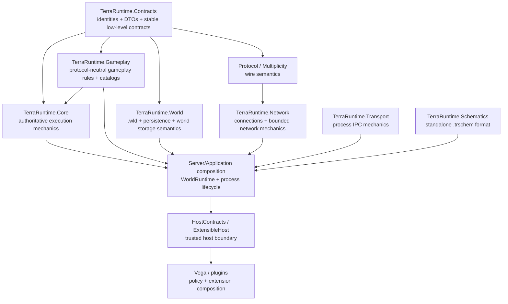

# Architecture and code cleanup roadmap

This is the living refactoring plan for TerraRuntime. It is normative for structural cleanup. Checkboxes are updated as work lands on `main`; `[x]` means the structural change is present in the repository and has passed the relevant build/tests/CI, not merely that a file was moved.

The goal is not to maximize the number of projects, interfaces or patterns. The goal is to make ownership obvious, dependency direction boring, names short enough to read, and large code units cohesive enough to change safely.

## Target dependency direction

The diagram is a direction guide, not a demand that every arrow become a direct project reference. Fewer references are better when a layer does not actually need another layer.

## Non-negotiable ownership boundaries

- `TerraRuntime.Contracts` owns stable low-level identities and data contracts. It does not become a dumping ground for implementations.
- `TerraRuntime.Gameplay` owns protocol-neutral Terraria gameplay/content semantics: items, buffs, gameplay rules, source-backed catalogs and similar behavior that does not require runtime scheduling, networking, persistence or Vega policy.
- `TerraRuntime.Core` owns authoritative execution mechanics: single-writer ownership, scheduling, command ingress, bounded workers, lifecycle primitives and genuinely cross-subsystem runtime mechanics. It is not the default home for gameplay code.
- `TerraRuntime.World` owns `.wld`, persistence representation and world-storage semantics. It does not own generic gameplay merely because gameplay touches a world.
- `TerraRuntime.Schematics` remains standalone and NativeAOT-safe. It does not depend on Core, World, Vega or editor/runtime ownership code.
- `TerraRuntime.Transport` remains the mechanics-only process boundary for Vega-to-server sessions and sandbox supervisor-to-worker IPC.
- Network/protocol projects own wire/connection mechanics, not world mutation policy.
- Server/application composition owns concrete `WorldRuntime` composition and process lifecycle. Vega/plugin/module policy stays above TerraRuntime.
- Every live `WorldRuntime` has exactly one authoritative owner of mutable simulation state.
- A new project is justified by a real dependency, lifecycle, trust or deployment boundary. A directory is not automatically a project.

## R0 - Establish the cleanup boundary

- [x] Add `TerraRuntime.Gameplay` as a NativeAOT-compatible gameplay layer.
- [x] Move the buff catalog out of Core into `TerraRuntime.Gameplay.Buffs`.
- [x] Move protocol-neutral NPC loot rules/evaluator/RNG boundary out of Core into `TerraRuntime.Gameplay.Npcs`.
- [x] Keep `TerraRuntime.Schematics` standalone.
- [x] Keep `.wld` implementation in `TerraRuntime.World` rather than Core.
- [ ] Make all source projects follow the common architecture/naming rules in `src/AGENTS.md`.

Exit criteria: the intended dependency direction is documented and new code has an obvious default owner before implementation begins.

## R1 - Slim `TerraRuntime.Core`

Goal: Core becomes execution mechanics rather than a convenient warehouse.

- [ ] Move item definitions, normalization and item-use gameplay from `Core/Items` into `TerraRuntime.Gameplay.Items` where they do not require authoritative runtime ownership.
- [ ] Re-evaluate `Core/Npcs`: move protocol-neutral definitions/catalogs/rules to Gameplay; retain stores, execution ownership and runtime mutation mechanics in Core.
- [ ] Re-evaluate player gameplay code with the same rule: gameplay semantics in Gameplay, authoritative mutable stores/command application in Core/application runtime.
- [ ] Re-evaluate projectile gameplay definitions versus runtime stores/executors.
- [ ] Re-evaluate `Core/Gameplay/Extensions`; keep only runtime-owned extension mechanics in Core and move pure gameplay identity/behavior semantics downward when dependency direction permits it.
- [ ] Align namespaces with the new owner while moving code. Do not leave compatibility aliases for old namespaces in this pre-1.0 project.
- [ ] Remove empty subject folders left behind by moves.

Exit criteria: opening `TerraRuntime.Core` shows execution ownership/scheduling/runtime mechanics, not broad Terraria content catalogs.

## R2 - Purge transparent proxies and compatibility facades

A type survives only if it owns at least one real concern: invariant, lifecycle, state, cache, policy, admission decision, translation, protocol boundary, resource ownership or non-trivial algorithm.

- [x] Remove the unused `VanillaPlayerItemNormalizer.NormalizeNetId` compatibility wrapper and retain the typed `TryNormalizeNetId` boundary.
- [x] Remove `VanillaNpcLootRuleCatalog.GetNpcSpecificRules`; typed table lookup is the single support boundary.
- [ ] Remove `VanillaTileInteractionItemFacts` after the remaining callers use `VanillaItemDefinitionCatalog` directly.
- [ ] Search production code for proxy-only `*Facts`, `*Helper`, `*Provider`, `*Manager`, `*Service`, `*Factory` and compatibility wrappers.
- [ ] Delete wrappers that merely rename or forward one existing operation.
- [ ] Collapse duplicate catalogs when they own the same source-backed facts.
- [ ] Remove one-implementation interfaces that exist only because “there might be another implementation later”, unless they mark a real trust/thread/process/testing boundary.
- [ ] Do not create replacement aliases for deleted names. There is no backwards-compatibility commitment yet.

Exit criteria: no known transparent production facade remains without a documented compatibility or boundary reason.

## R3 - Naming cleanup

Naming follows three layers of context:

1. namespace says the subsystem;
2. type says the responsibility;
3. member says the action/data.

Rules to apply while touching code:

- [ ] Remove redundant `Runtime`, `World`, `Server`, `Gameplay` prefixes/suffixes when the namespace/owner already makes the meaning unambiguous.
- [ ] Keep `Vanilla` when it communicates an actual source-pinned vanilla boundary, vanilla-versus-extension distinction or content identity.
- [ ] Keep version suffixes such as `1458` only when a type is deliberately version-pinned and a future version could coexist or differ materially.
- [ ] Replace vague nouns with ownership nouns: prefer `Store`, `Registry`, `Catalog`, `Router`, `Queue`, `Pool`, `Supervisor`, `Coordinator`, `Session`, `Clock`, `Cache`, `Codec`, `Parser`, `Writer`, `Reader` when that is what the type actually owns.
- [ ] Avoid stacked role names such as `WorldRuntimeManagerProviderFactory`, `...FactsHelper`, `...ServiceManager`, or `...FactoryProvider`.
- [ ] `Manager` is a last resort. Prefer the concrete owned resource/lifecycle concept.
- [ ] `Provider` is allowed only when resolving a value from a meaningful external/contextual source; not as a one-method forwarding wrapper.
- [ ] `Factory` is allowed only when creation has real variants, policy or non-trivial construction. A single `new T(...)` path does not need a factory.
- [ ] `Helper` must not be a public architectural type. Put behavior on the owning domain type or use a precise internal name.
- [ ] `Facts` is reserved for an authoritative source-backed fact owner, never a compatibility proxy.
- [ ] Avoid `IThing` + `Thing` pairs by default. Introduce an interface when multiple real implementations, a trust/process boundary or independently testable substitution already exists.

Exit criteria: touched APIs read as domain concepts rather than a transcript of every architectural layer they passed through.

## R4 - Decompose long files and god objects by responsibility

Line count is a review trigger, not the decomposition algorithm. Do not split cohesive generated/source-backed catalogs into artificial fragments merely to satisfy a number.

Audit triggers:

- a handwritten production file above roughly 600 lines deserves a responsibility review;
- above roughly 1,000 lines requires an explicit cohesion justification or decomposition plan;
- a method above roughly 100 lines deserves a control-flow/responsibility review;
- a method above roughly 200 lines requires an explicit reason when source-order fidelity makes splitting worse;
- a constructor with roughly 12+ independent collaborators is a composition smell and should trigger ownership review.

These are review triggers, not CI limits.

Checklist:

- [ ] Decompose `ServerRuntimeState` by real world-owned responsibilities while preserving one authoritative writer.
- [ ] Decompose `TerrariaServerHost` so process lifecycle/network acceptance are separate from one-world composition.
- [ ] Extract coherent player, NPC, projectile, item, town/housing and world-lifecycle collaborators only where they own state/behavior; do not produce one class per method.
- [ ] Keep source-order-sensitive boss/AI logic cohesive when decomposition would obscure verified vanilla ordering.
- [ ] Keep large source-backed catalogs cohesive when their size is data, not mixed responsibility.
- [ ] Remove nested conditional/constructor composition tangles when a concrete composition object can own them.
- [ ] Prefer private methods/records for local complexity before inventing a public subsystem.

Exit criteria: large handwritten runtime units have clear ownership boundaries, and no decomposition exists solely to lower line counts.

## R5 - `WorldRuntime` composition boundary

Goal: the primary world and Level 1 sandbox worlds are the same runtime type. “Primary” is host policy, not a subclass or special simulation implementation.

- [ ] Introduce concrete `WorldRuntime` as the lifecycle owner of one live world.
- [ ] Move per-world mutable simulation state behind `WorldRuntime`.
- [ ] Move the authoritative loop/owner, world-scoped save/cache lifecycle and world-scoped ingress capabilities behind that owner.
- [ ] Keep public TCP listener/acceptance, OS signals and process shutdown in process/application composition.
- [ ] Let the process own a collection/registry of `WorldRuntime` instances.
- [ ] Do not introduce a generic `WorldRuntimeManager` facade if a concrete collection/registry/host owns the lifecycle directly.
- [ ] Preserve the invariant that each world has one authoritative writer.
- [ ] Make current single-world startup one ordinary `WorldRuntime` selected as primary by host/Vega policy.
- [ ] Use the same `WorldRuntime` implementation inside a Level 2 sandbox worker.

Exit criteria: two independent in-process worlds can run without singleton current-world assumptions, and the primary world is not architecturally privileged inside simulation code.

## R6 - Launcher and host composition cleanup

- [ ] Remove the architectural dependency where reusable extensible-host code depends on the shipping executable project.
- [ ] Extract one shared AOT-compatible application/server composition assembly if a distinct assembly is still the smallest clean boundary after `WorldRuntime` extraction.
- [ ] Keep NativeAOT and CoreCLR launchers thin.
- [ ] Keep Vega/plugin/module concepts above TerraRuntime runtime/core layers.
- [ ] Re-audit `InternalsVisibleTo` and cross-project internal access after project moves; retain only concrete justified friendships.

Exit criteria: executable projects are entry points, not reusable libraries disguised as applications.

## R7 - Constants and magic-number audit

Every touched non-trivial literal must fall into one category:

- source-backed vanilla fact;
- protocol/file binary layout;
- safety/bounds policy;
- measured operational tuning;
- local mathematical constant;
- test fixture data.

Checklist:

- [x] Replace Transport envelope field-offset literals with named layout constants.
- [x] Name the Schematics stream-copy buffer size rather than leaving the I/O literal inline.
- [ ] Audit touched binary codecs for unnamed offsets, masks, section sizes and length ceilings.
- [ ] Audit gameplay magic numbers and keep source-backed constants near their authoritative catalog/rule with source provenance.
- [ ] Audit queue/cache/time/batch limits; operational values require rationale or measurement, not mythology.
- [ ] Do not move fixed vanilla/protocol constants into configuration merely to make a literal disappear.
- [ ] Do not centralize unrelated constants into a giant `Constants` class.

Exit criteria: a reviewer can tell why an important number exists without archaeology through unrelated call sites.

## R8 - Namespace and project cleanup

- [ ] Align new/moved namespaces with actual ownership.
- [ ] Remove pre-1.0 namespace compatibility shims after call sites migrate.
- [ ] Avoid root `TerraRuntime.Core` namespace becoming a flat global namespace for every runtime concept.
- [ ] Avoid creating new csproj projects for folders that have no independent dependency/lifecycle/deployment boundary.
- [ ] Keep project references acyclic and downward-oriented.
- [ ] Document any intentional upward/cross-layer reference that cannot yet be removed.

## R9 - Validation discipline for refactoring

Each coherent refactoring slice should:

- [ ] preserve observable Terraria behavior unless the same commit intentionally fixes a verified behavior bug;
- [ ] build with warnings as errors;
- [ ] run focused tests for moved/renamed behavior;
- [ ] run the existing test suite;
- [ ] keep relevant Linux/Windows NativeAOT smoke paths green;
- [ ] update architecture/naming docs in the same change when the ownership rule changes;
- [ ] remove old code in the same slice instead of leaving permanent forwarding shims;
- [ ] update this roadmap checkbox state when the slice closes an item.

## Completion definition

The cleanup program is complete when all of the following are true:

- Core is visibly execution mechanics rather than a gameplay catch-all;
- Gameplay owns protocol-neutral gameplay semantics without depending back on Core;
- there are no known transparent compatibility/proxy layers left without a real compatibility requirement;
- names rely on namespaces instead of stacking every context word into every type;
- large handwritten runtime files are decomposed around real state/lifecycle ownership;
- `WorldRuntime` is the single concrete live-world composition for primary, Level 1 and Level 2 worlds;
- launcher/application boundaries no longer point reusable code at an executable project;
- constants have explicit provenance/policy meaning;
- dependency direction remains acyclic, understandable and NativeAOT-compatible.

## Working rule

Prefer deleting code over wrapping it again. A new abstraction must own something real. If the only explanation for a type is “it might be useful later”, do not add it now.
