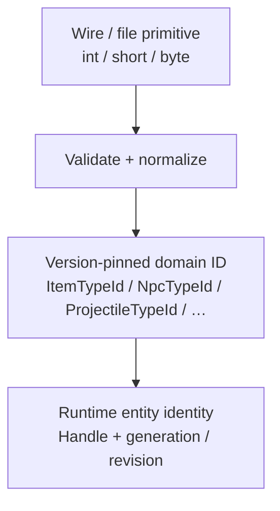
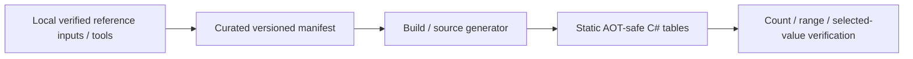
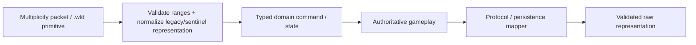

# Gameplay decomposition and typed vanilla catalogs roadmap

This document defines the mandatory decomposition of TerraRuntime gameplay code as vanilla parity grows. The goal is not merely prettier constant names. Protocol numbers, Terraria content IDs, gameplay rules, mutable runtime state and subsystem orchestration must not collapse into the same code paths.

The source-of-truth hierarchy remains: TerrariaServer 1.4.5.8 decompile first, Multiplicity for protocol 326 wire models, terrustia as independent implementation cross-check, TShock/OTAPI for behavioral/history reference only.

> **A numeric representation may cross a protocol/file boundary, but gameplay code should operate on named, validated domain concepts wherever the number has stable semantic meaning.**

> Checkbox policy: `[x]` means the item is verified on `main` by implementation plus tests/CI or equivalent executable proof. Partial/foundation-only work remains `[ ]`.

## 1. What counts as a magic number

A number is magic when correctness depends on Terraria/version/domain knowledge not apparent locally. Examples include content type IDs/counts/ranges, inventory slot families, protocol enum/flag values, AI styles, frame/layout dimensions, world-format gates, verified gameplay timers/radii/speeds/damage multipliers, special-case entity IDs, legacy/sentinel IDs and canonicalization tables.

Local loop arithmetic, obvious counters and short-lived benchmark values need not become ceremonial constants. Do not create a giant `Constants.cs` graveyard; constants/catalogs belong to the subsystem owning the invariant.

## 2. Separate raw representation from domain identity



`NpcTypeId(1)` means a vanilla content type, while `NpcHandle(slot=1, generation=7)` means one live entity instance. Projectile/item/tile content identity is likewise distinct from slots, coordinates and runtime handles.

## 3. Version-pinned ID value types

Candidate types remain literal API/domain names:

```text
ItemTypeId
NpcTypeId
ProjectileTypeId
TileTypeId
WallTypeId
BuffTypeId
PrefixId
TileEntityTypeId
LiquidKind
NpcAiStyleId
ProjectileAiStyleId
```

Use compact value types where they prevent category mistakes. Construction/validation happens at trust boundaries; equality/hash/formatting stay cheap; no reflection/common-path allocation; codec/persistence primitive conversion is explicit; invalid IDs do not silently enter authoritative state; version ranges are centralized.

## 4. Vanilla content catalogs

TerraRuntime owns version-pinned catalogs and never references `Terraria.ID.*` assemblies at runtime.

Conceptual catalog names include `VanillaItemIds`, `VanillaNpcIds`, `VanillaProjectileIds`, `VanillaTileIds`, `VanillaWallIds`, `VanillaBuffIds`, `VanillaPrefixIds`, `VanillaTileEntityIds` and `VanillaLiquidKinds`.

Catalogs are pinned to Terraria 1.4.5.8/protocol 326 where applicable, verified against the official hierarchy, AOT-safe and do not ship copyrighted game text/assets merely for convenience.

## 5. Metadata tables, not giant switch forests

ID catalogs answer identity; immutable definitions answer verified properties. Candidate definition families include items, NPCs, projectiles, tiles, walls, buffs, prefixes and tile objects.

Only facts used by runtime behavior and independently verified belong in these tables. Dense vanilla spaces should prefer immutable indexed tables over hot-path dictionaries where measurement supports it.

## 6. Data generation and maintenance



Decompiled official source remains local and is never committed. Generated output contains reviewed facts/flags/constants, not copied method bodies or game assets/text. Generation is deterministic and version-pinned; extraction success alone is not proof of correctness.

## 7. Gameplay package decomposition

The source tree should reflect subsystem ownership without becoming directory bureaucracy. Conceptual families include:

```text
Core/Gameplay: Combat, Buffs, Spawning, Loot, Progression, Events
Core/Items: Definitions, Inventory, Use, Equipment, Placement
Core/Npcs: Definitions, Lifecycle, Spawning, Behavior, Physics, Combat, Town, Bosses
Core/Projectiles: Definitions, Lifecycle, Behavior, Physics, Collision, Combat
Core/Worlds: Tiles, Walls, Objects, Chests, Signs, TileEntities, Wiring, Liquids, Growth, Biomes, Generation
```

Do not split a cohesive small implementation into layers merely to satisfy a diagram. Decompose when behavior/data/lifecycle have genuinely different ownership or testing needs.

## 8. Item subsystem decomposition

Items separate immutable definition/defaults, normalized runtime stack, named inventory layout and semantic item use.

Raw slot spans such as `0..98` and `700..989` are centralized behind named categories such as main inventory, armor, dyes, equipment, banks, trash, loadouts, relayable and private slots.

Networking converts client requests into semantic item-use commands; it does not own use timing, weapons/tools, ammo, consumables, placement, healing/mana, equipment or use-triggered entity/world behavior.

## 9. Projectile subsystem decomposition

Separate definitions, lifecycle/generation, provenance, behavior/AI, physics, collision, combat, immunity/penetration, child spawning, kill effects and dirty replication.

Instead of conditions such as `if (type == 14 || type == 20 || type == 36)`, use named IDs for genuinely small sets, a verified metadata trait/family or a behavior strategy. Traits must represent real gameplay rules, not merely hide numbers.

This decomposition enables the custom projectile contracts in `gameplay-worldgen-extensibility.md`.

## 10. NPC subsystem decomposition

Separate definitions/defaults, lifecycle/generation, spawning, targeting, behavior/AI, physics/world queries, combat, buffs, loot, town/housing, bosses and dirty replication.

NPC AI should not encode packets, scan unrelated global arrays, write persistence or contain plugin-dispatch internals. Verified shared behavior families are encouraged, but unlike NPCs should not be forced into one giant `switch(type)`.

## 11. Tile, wall and world-object decomposition

Separate tile identity/state, static metadata, semantic mutation services and multi-tile object definitions.

Semantic mutation names remain literal API concepts: `PlaceTile`, `KillTile`, `PlaceWall`, `KillWall`, `SlopeTile`, `PlaceObject`, `Actuate`, `WirePulse`, `SetLiquid`, `Grow/Spread`.

The authoritative world validates/commits them, updates section revisions/dirty state and schedules replication. Multi-tile definitions own dimensions, origin, anchors/support, style/frame mapping and associated tile entities. Do not scatter frame-width arithmetic across object handlers.

## 12. Buffs, prefixes and combat semantics

Use typed buff/prefix identity plus verified metadata and central validation. Combat gets explicit semantic structures for damage source/provenance, target, base/final damage, defense, knockback, crit, immunity/cooldowns, death result and source category.

Avoid APIs made from unnamed integer/boolean argument soup.

## 13. Loot, recipes and spawn rules

Large rule tables should become data/rules when that can preserve verified behavior and RNG order. Loot concepts include `LootTable`, `LootRule`, conditions, chance, stack range and item identity. Recipe validation, when authoritative, remains separate from inventory packet handling.

NPC spawning separates environmental query, eligible pool, weights/chances, population caps, progression/event modifiers, selected definition and final spawn request.

## 14. World progression, events and biome rules

Use named state for boss/progression milestones, hardmode transformations, invasions/events, time/weather, biome/zone classification and town/housing progression. Do not create one universal `WorldFlags` bucket mixing persistence, gameplay and networking bits.

## 15. Flags and bitfields

Raw protocol/file masks stay at codecs/boundaries. Gameplay sees named semantics such as `PlayerControlFlags`, `TileWireFlags`, `NpcStateFlags`, `ProjectileStateFlags` and `ItemFlags` where bit composition is genuinely part of the domain.

Multiplicity remains wire-packet authority; gameplay does not duplicate protocol bit-layout catalogs merely to rename them.

## 16. Timers, distances, speeds and tuning constants

Vanilla constants that encode observable behavior live with the behavior owning them, for example `BlueSlimeBehaviorParameters`, `NpcPhysicsConstants`, `ProjectileCollisionConstants`, `PlayerRespawnRules` and `SpawnRateRules`.

Comments/tests identify non-obvious vanilla provenance; units are explicit (`ticks`, `pixels`, `tiles`, seconds); parameter records are preferred for behavior families; named constants do not automatically become configuration options.

## 17. Units and coordinate types

Prevent accidental mixing of tile coordinates, pixel positions, section coordinates, tile/pixel rectangles and tick/wall-clock durations. Use named value types or unit-explicit API names where beneficial without bloating hot paths.

Conversions such as the Terraria tile scale should be centralized. For example, where relevant document the conversion dimensionally rather than scattering bare `16` literals:

$$
1\ \text{tile}=16\ \mathrm{px}.
$$

## 18. Protocol and persistence boundaries



A packet DTO never becomes the authoritative gameplay entity merely because its fields are convenient.

## 19. Custom content compatibility

Keep identities distinct:

| Identity | Meaning |
|---|---|
| `NpcTypeId` | vanilla client-visible NPC type |
| `CustomNpcArchetypeId` | namespaced server-defined NPC archetype |
| `ProjectileTypeId` | vanilla client-visible projectile type |
| `CustomProjectileArchetypeId` | namespaced server-defined projectile archetype |

A custom archetype may choose a vanilla presentation type, but namespaced identity is never smuggled into vanilla protocol content-ID fields. The same rule applies to future custom items/tiles.

## 20. TShock as reference, not dependency

TShock is useful for human-readable ID naming, historical validation categories and exploit/edge-case discovery. It is not authoritative for 1.4.5.8 exact behavior, TerraRuntime ownership, threading, hooks, packet ownership or global architecture.

Never add a TShock dependency merely to obtain constants.

## 21. Preventing magic numbers from returning

Outside catalog/codec/persistence/test-fixture code, new raw vanilla content/message IDs, duplicated count/range constants, raw slot arithmetic and undocumented protocol/file masks are prohibited.

Start enforcement with a high-signal repository audit and tiny allowlist; move to a Roslyn analyzer only when typed APIs exist and textual false positives justify it. Make correct code easy first, then enforce it.

## 22. Testing strategy

Catalog tests verify selected IDs/ranges/table lengths/uniqueness and deterministic generation. Boundary tests verify invalid raw IDs, serialization, legacy/sentinel handling and safe future-ID rejection. Gameplay refactors require focused semantic/differential tests. Architecture tests prevent runtime references to Terraria/Vega/TShock and keep protocol/library coupling at the intended boundaries.

Renaming a constant is not evidence; tests cover the semantic branch controlled by the value.

## 23. Migration order

### D0 - Numeric/domain audit

Inventory and classify raw content IDs, counts/ranges, masks, slot ranges, timers/distances/speeds, giant switches and duplicate constants as wire/file representation, content identity, runtime identity, behavior tuning or local arithmetic.

### D1 - ID types and catalog foundation

- [x] add typed vanilla IDs;
- [x] add version-pinned catalogs;
- [x] central range validation;
- [ ] deterministic generated-data path if needed;
- [x] selected independent verification tests.

### D2 - Items and inventory

- [ ] item definitions/defaults;
- [x] typed inventory layout;
- [x] prefix/stack normalization;
- [x] item-use semantic boundary;
- [ ] remove raw item/slot IDs from gameplay paths.

### D3 - Projectiles

- [x] projectile definitions;
- [x] typed lifecycle/provenance;
- [ ] behavior/physics/collision/combat decomposition;
- [ ] remove raw projectile IDs and AI-style numbers from gameplay paths;
- [x] align with custom projectile extension pipeline.

### D4 - NPCs

- [x] NPC definitions;
- [x] AI family/behavior decomposition;
- [ ] spawn/physics/combat/loot separation;
- [ ] boss/town behavior boundaries;
- [ ] remove raw NPC IDs/AI-style numbers;
- [x] align with custom NPC extension pipeline.

### D5 - Tiles, walls and objects

- [ ] tile/wall definitions;
- [ ] named tile state flags;
- [ ] multi-tile object definitions;
- [ ] placement/break/framing operations;
- [ ] wiring/liquids/growth decomposition;
- [ ] remove raw tile/wall IDs and frame constants from unrelated handlers.

### D6 - Buffs, combat, loot and progression

- [ ] buff/prefix catalogs;
- [x] damage-source model;
- [ ] loot rules;
- [ ] event/progression IDs/state;
- [ ] biome/zone semantics;
- [ ] remove remaining cross-subsystem magic values.

### D7 - Enforcement

- [ ] CI audit for prohibited raw IDs/masks;
- [ ] architecture tests;
- [ ] optional Roslyn analyzer if textual enforcement is insufficient;
- [ ] document intentional remaining raw values and ownership.

## 24. Definition of done

This slice is complete when gameplay no longer relies on unexplained raw vanilla IDs; required content families have explicit version-pinned identity/catalog boundaries; raw packet/file primitives convert at boundaries; inventory/range semantics are centralized; entity type cannot be confused with slot/generation; behavior decomposition supports extension contracts without packet hacks; tile/world mutation is separated from packet handling/replication; tuning constants live with owning behavior; TShock/Terraria assemblies remain absent from runtime dependencies; CI/code review prevents new raw IDs/masks; differential tests preserve vanilla behavior; and generated/catalog code remains clean under Linux/Windows NativeAOT publication.
