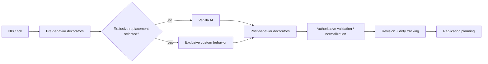
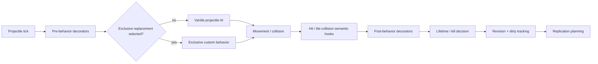
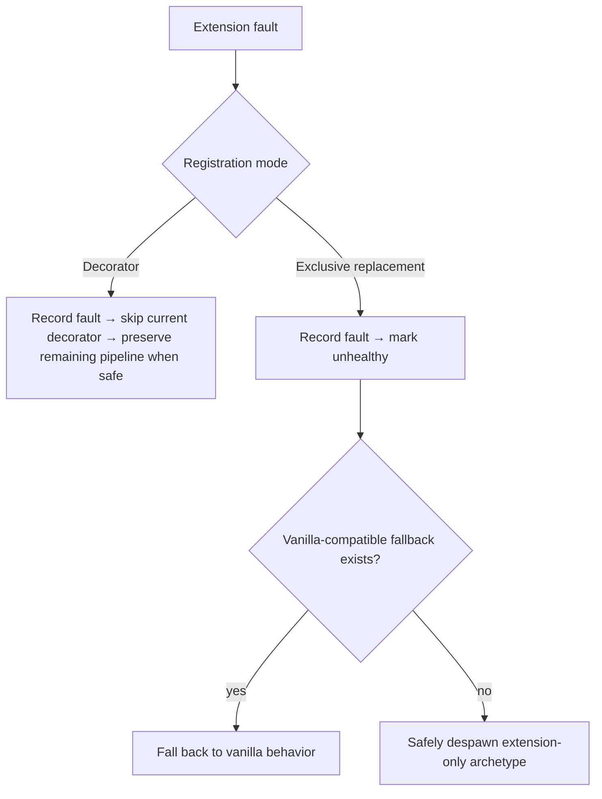
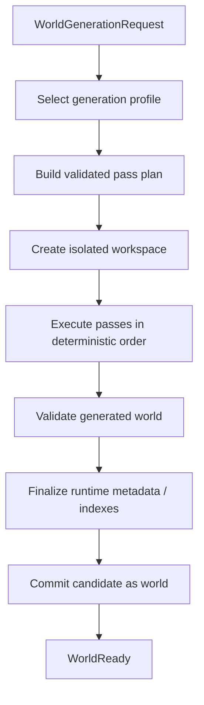
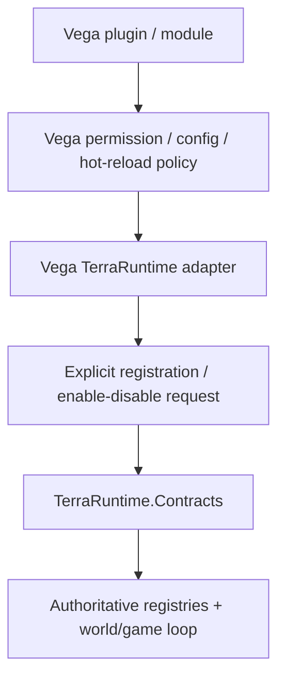

# Gameplay and world-generation extensibility roadmap

This document defines controlled customization of NPC behavior, projectile behavior and world generation without giving an external host a second mutable owner of Terraria simulation state.

> **Extensions may supply policy and behavior; TerraRuntime remains the only authority that applies simulation state.**

TerraRuntime remains NativeAOT-first, deterministic where vanilla requires it, and authoritative over entity/world lifecycle. Hosts register providers explicitly; TerraRuntime owns execution, validation, scheduling, state commit and replication.

> Checkbox policy: `[x]` means the item is verified on `main` by implementation plus tests/CI or equivalent executable proof. Partial/foundation-only work remains `[ ]`.

## 1. Scope and ownership

### TerraRuntime owns

NPC/projectile lifecycle and generation identity, authoritative motion/combat/despawn, vanilla behavior, extension dispatch/order, safe mutation contexts, per-world activation, exception/timing telemetry, deterministic extension RNG, dirty tracking/replication, worldgen orchestration/validation/final commit and all wire representation.

### Host owns

Module/plugin discovery/loading, permission to register, user-facing config/permissions, selection of enabled behavior/generator profiles, hot-reload policy and non-canonical application persistence.

TerraRuntime never references Vega assemblies, scans plugin directories or uses reflection-driven registration.

## 2. Compatibility boundary

An unmodified official client only understands client-known network-visible content IDs.

A server-defined archetype may have a stable host/runtime identity, custom server AI/stats/spawn/drop/extension state and a chosen vanilla NPC/projectile type as client-visible presentation.

Truly new sprites, animation sets or client-unknown content IDs require a modified client and explicitly versioned protocol/content extension. Server-only plugins cannot manufacture native client content that does not exist in the client.

## 3. Extension registration model

Conceptual contracts remain literal API names:

```text
INpcBehaviorProvider
IProjectileBehaviorProvider
INpcArchetypeProvider
IProjectileArchetypeProvider
IWorldGenerationProvider
```

Registration is explicit/AOT-safe: no assembly scanning/runtime codegen/`Type` magic registry; stable IDs plus explicit instances/delegates; deterministic registration lease/token; explicit conflict handling/order; runtime/world scoping; activation only at an authoritative safe point; immutable/precomputed hot-path dispatch snapshots.

Hosts may prepare registry snapshots off-thread, but the authoritative owner swaps the active snapshot at a defined commit point.

## 4. NPC behavior extension pipeline

Vanilla NPC AI remains the default and differential-test baseline. Extensions may decorate vanilla behavior, exclusively replace it or compose ordered synchronous stages.



NPC behavior executes synchronously on the authoritative thread. The context exposes current identity/state, controlled setters/commands, bounded world/entity queries, target/collision helpers, runtime-owned spawn/projectile requests, deterministic extension RNG, tick/world identity and extension-scoped state. It exposes no raw arrays, queues or arbitrary packet sending.

Initial lifecycle hooks cover spawn/init, AI/tick, needed target/hit decision points and death/despawn cleanup. Add semantic hooks only for real use cases.

## 5. Projectile behavior extension pipeline

Projectiles use a dedicated contract because lifecycle/collision/ownership/replication semantics differ from NPCs.



The context exposes generation-safe projectile identity, authoritative provenance, presentation/archetype identity, safe customizable fields, bounded queries, collision/combat/child-spawn requests, deterministic RNG and extension state. Runtime invariants still validate finite state, target legality, slot/generation and protocol-safe ranges.

## 6. Custom NPC/projectile archetypes

Behavior and presentation are separate. Conceptual descriptor fields remain schema-like literals:

```text
CustomNpcArchetype
    Id
    VanillaPresentationNpcType
    BaseStats
    BehaviorId
    SpawnPolicyId?
    DropPolicyId?

CustomProjectileArchetype
    Id
    VanillaPresentationProjectileType
    BaseStats
    BehaviorId
```

Archetype IDs are namespaced/stable and distinct from wire IDs. Runtime validates presentation IDs against the active Terraria version, emits only protocol-valid vanilla-visible values in official-client mode, keeps custom identity in runtime snapshots/diagnostics and never silently invents new `.wld` entity types. Future persistent custom state belongs in a separately versioned extension store.

## 7. Extension-scoped entity state

Per-entity extension state is tied to behavior/archetype registration and entity generation; it is deterministically cleaned on despawn/reuse/unregister; it does not require reflection serialization or common-path allocation. Prefer pre-registered typed/fixed slots, compact side arrays or another measured layout over per-entity `Dictionary<string, object>`.

## 8. RNG and determinism

Vanilla behavior retains verified vanilla RNG stream/order. Extensions receive separate deterministic RNG by default, derived from stable world/runtime/extension/archetype/entity identity. Adding an unrelated extension must not shift vanilla RNG state. Deliberate participation in vanilla RNG is explicit, privileged and regression-tested.

Replay tests cover registration order, fixed seeds and entity-slot reuse.

## 9. Performance budgets and fault isolation

A callback invoked every entity tick can efficiently destroy a

$$
60\,\mathrm{Hz}
$$

server, which is not the sort of extensibility we are aiming for.

Common-path dispatch avoids avoidable allocation; callbacks perform no blocking I/O/`Task`/sleep/network access; provider call count and wall/CPU cost are observable; extension work is accounted inside NPC/projectile phases; enable/disable is per-world; exceptions are caught at the registration boundary.



Repeated fault/over-budget policy may disable a registration at a safe tick boundary. In-process synchronous managed code cannot be hard-preempted; strict CPU isolation requires a stronger sandbox/process boundary.

## 10. Hot reload and registration lifetime

Vega may reload plugins and submit new registrations. TerraRuntime swaps immutable registry snapshots at safe boundaries; active entities do not retain raw delegates that pin unloaded contexts; stable behavior IDs/leases provide indirection; unregister has explicit vanilla/alternate/despawn fallback; extension state cleanup finishes before host unload completion.

Hot reload is host capability; TerraRuntime guarantees deterministic registration lifecycle and cleanup semantics.

## 11. World-generation extensibility

Custom generation is an explicit validated pass plan, not arbitrary live-world mutation from a plugin thread.



Conceptual contracts include `IWorldGenerationProvider`, `IWorldGenerationPass`, `WorldGenerationPassDescriptor`, `WorldGenerationPlan`, `WorldGenerationContext` and `WorldGenerationResult`.

Providers may select vanilla unchanged, add passes around extension points, replace specifically replaceable passes, build a complete custom plan, choose supported generation parameters and report bounded progress.

### Pass IDs and dependencies

The planner rejects duplicate exclusive IDs, cycles and missing required dependencies; distinguishes hard dependencies from optional ordering; produces deterministic order and records the resolved plan for reproduction.

### Isolated workspace

Generation runs against runtime-owned isolated state. Runtime validates bounds/content IDs; final commit happens only after validation; cancellation/failure discards the candidate; official-client profiles remain `.wld` compatible. Regeneration of a live server uses a separate candidate and explicit lifecycle switch, never concurrent active-tile mutation.

### RNG semantics

Literal mode names are:

```text
VanillaSharedRng
IsolatedDeterministic
CustomProviderRng
```

`VanillaSharedRng` participates in verified order and is restricted. `IsolatedDeterministic` derives an independent stream from seed plus stable pass ID. `CustomProviderRng` uses provider-documented deterministic semantics.

### Parallelism

Do not parallelize order/RNG-sensitive vanilla passes. Independent custom computation may use workers against isolated/immutable data, but deterministic apply order is required. Vanilla-equivalent optimization requires bit-identical/reference evidence and per-pass timing/allocation/output metrics.

### Content compatibility

Official-client generators emit only vanilla-known tile/wall/liquid/entity IDs and protocol-valid metadata. New content belongs to a future modded-client layer.

## 12. Vega integration boundary



Vega-facing conveniences may include `RegisterNpcBehavior`, `RegisterProjectileBehavior`, archetype/generator registration and per-world enablement. Execution invariants remain TerraRuntime-owned.

Vega does not patch entity arrays, fake authoritative state with packets, run AI on a separate Vega thread, own worldgen pass order or bypass generation handles/dirty tracking.

## 13. Security and trust model

This is a trusted-host extension API, not a hostile-code sandbox. TerraRuntime validates extension-produced finite state, bounds, handles/generations, official-client content IDs, legal ranges/lifetimes/stacks, bounded spawn requests, bounded world-query areas and bounded work submitted back through runtime APIs. Behavior contexts expose no raw socket/arbitrary-packet capability.

Strong isolation for untrusted code would require a separate sandbox/process transport.

## 14. Testing requirements

### NPC behavior

Default vanilla path unchanged without registrations; deterministic decorator order; exclusive replacement semantics; exception fallback; unregister behavior; generation-scoped state cleanup; deterministic fixed-seed extension RNG; protocol-valid presentation.

### Projectile behavior

Default path unchanged; custom behavior cannot bypass ownership/generation/combat validation; child spawns bounded/generation-safe; kill cleanup; unsupported client type IDs never emitted.

### Worldgen

Reference vanilla seeds where exact parity is required, graph/cycle/conflict tests, isolated RNG non-perturbation, cancellation isolation, invalid content rejection, official server/client load of compatible `.wld`, reproducible deterministic plan+seed output.

### Performance

Benchmark zero extensions, one NPC decorator, dense replacement workload, high projectile workload, registry snapshot swap and representative custom worldgen. Zero-extension dispatch remains extremely close to direct vanilla path.

## 15. Delivery order

### G0 - Contract foundation

- [x] stable behavior/archetype IDs;
- [x] explicit AOT-safe registration API;
- [x] immutable registry snapshots and tick-boundary swap;
- [x] extension diagnostics identity;
- [x] extension RNG service;
- [x] extension-state lifecycle primitive.

### G1 - NPC behavior

- [x] vanilla/default dispatch;
- [x] decorators;
- [x] exclusive replacement;
- [x] spawn/tick/despawn hooks;
- [ ] Vega adapter proof-of-concept;
- [x] focused allocation-light gate for zero-extension and one-decorator dispatch.

### G2 - Projectile behavior

- [x] dedicated projectile pipeline;
- [x] collision/hit/kill semantics;
- [ ] child spawn requests;
- [ ] Vega adapter proof-of-concept;
- [ ] focused performance gate.

### G3 - Custom archetypes

- [x] server-defined NPC/projectile archetype descriptors;
- [x] vanilla presentation mapping;
- [x] snapshot/diagnostic identity;
- [x] explicit persistence semantics.

### G4 - Worldgen pass planner

- [x] provider/pass contracts;
- [x] stable pass IDs/dependencies;
- [x] deterministic planner;
- [x] isolated workspace;
- [x] progress/cancellation;
- [x] isolated deterministic RNG mode;
- [x] runtime-owned `terraruntime:vanilla` compatibility generator;
- [x] verified Terraria 1.4.5.8 per-pass vanilla RNG seed semantics;
- [x] special/secret seed profile resolution and fresh `.wld` persistence;
- [x] runtime-owned deterministic `terraruntime:skyblock` profile with separated biome-island layout, lowered depth metadata, starter spawn, reserved lower dungeon island and persistent generated chests;
- [x] ordinary canonical `terraruntime:vanilla` plan covers the complete pinned 109-pass TerrariaServer 1.4.5.8 registration sequence through `Final Cleanup`;
- [x] generated canonical vanilla `.wld` loads through TerraRuntime and boots successfully in the pinned official TerrariaServer 1.4.5.8 acceptance gate;
- [x] generated canonical vanilla `.wld` is validated in-process through `VanillaWorldGenerationFullIntegrationTests`: `4200x1200` ordinary world is generated, tile/wall id/flag/shape bounds, chest-anchor uniqueness and `Guide` persistence are checked, fresh `v326` composition is validated by `WorldFileLoader` and deterministic SHA-256 replay is proved;
- [ ] source-exact 109-pass/reference-world vanilla parity.

### G5 - Vega/plugin integration

- [ ] permission/config policy stays in Vega;
- [ ] registration leases tied to plugin lifecycle;
- [ ] safe unregister/hot-reload flow;
- [ ] per-world enable/disable;
- [ ] example plugin implementing a modified vanilla mob/projectile plus small custom worldgen pass.

## Definition of done

This slice is not complete until:

- [ ] zero extensions preserve vanilla behavior/performance baselines;
- [x] host can explicitly register NPC decorators/replacements without reflection/scanning;
- [x] host can explicitly register projectile decorators/replacements through a dedicated contract;
- [x] custom server-side NPC/projectile archetypes safely use vanilla client presentations;
- [ ] unregister/plugin reload leaves no stale callbacks/entity state;
- [ ] extension faults are isolated/observable;
- [ ] extension CPU cost is visible in tick telemetry;
- [x] custom worldgen provider can add/replace passes in deterministic validated plan;
- [x] failed/cancelled generation cannot partially commit;
- [x] official-client-compatible generated worlds contain only client-known IDs – enforced by `Final Cleanup` (`VanillaTileIds`/`VanillaWallIds`/known-flag gate) and covered by `VanillaWorldGenerationFullIntegrationTests` (tile/wall/shape/flag scan plus `WorldFileFreshComposer326`→`WorldFileLoader` round-trip);
- [x] built-in vanilla generator matches the complete source-pinned Terraria 1.4.5.8 pass pipeline (109 names through `Final Cleanup`, `114-plan` via `SourceBackedVanillaWorldGenerationFinal1458`) – reference-world byte-identical parity remains the remaining open item;
- [ ] reference-world byte-identical vanilla parity for fixed official seeds;
- [x] Linux/Windows NativeAOT smoke remains green with extension contracts present.
