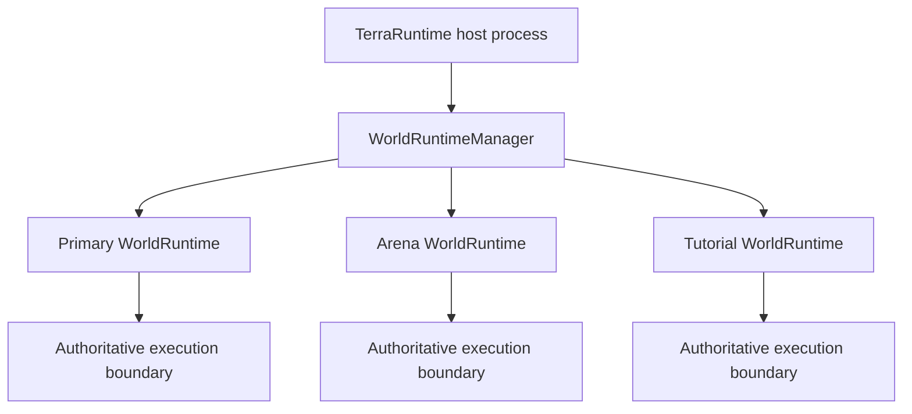
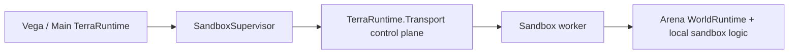
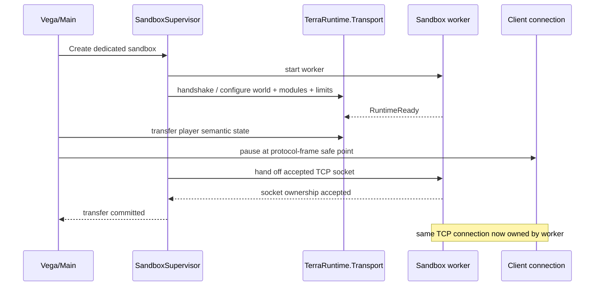
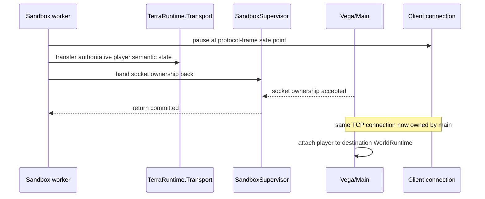
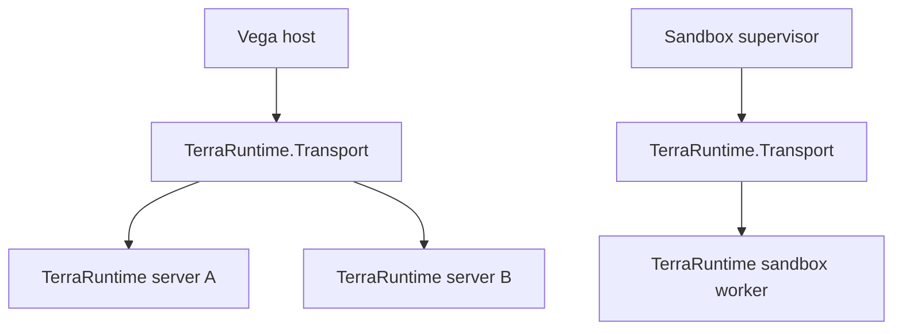
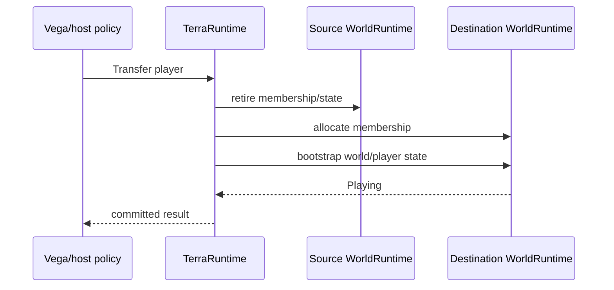

# Multi-world runtime and sandbox isolation roadmap

This roadmap defines native TerraRuntime support for multiple simultaneously live runtime worlds and two sandbox isolation levels.

The feature is **not a Dimensions replacement**. Dimensions-style long-lived secondary worlds may later reuse the same runtime-world foundation, but the immediate use cases are isolated minigame arenas, tutorials, temporary dungeons, event instances, plugin-owned test worlds and stronger process isolation.

`TerraRuntime.Transport` is retained as a first-class process/server boundary. It serves two concrete topologies:

1. Vega can keep transport sessions to multiple TerraRuntime servers and expose policy-controlled cross-server features to Vega plugins.
2. TerraRuntime can supervise second-level sandbox worker processes through the same bounded, versioned transport envelope.

The transport layer remains below world/gameplay/plugin service protocols. It provides bounded framing, correlation, negotiated mechanics and process identity; it does not become a gameplay god-bus.

For a local level-2 sandbox, `TerraRuntime.Transport` is the **control plane**, not the permanent Terraria gameplay data path. Player runtime state is transferred through bounded semantic transport messages, while ownership of the already accepted TCP connection is handed to the sandbox worker through an operating-system socket-handoff mechanism. The same TCP connection is handed back to the main process when the player leaves the sandbox.

> Checkbox policy: `[x]` means verified on `main` by implementation plus tests/CI or equivalent executable proof. Foundation-only work remains `[ ]`.

## 1. Concepts

A canonical `.wld`, a logical runtime world and one live activation are separate concepts:

- **world source**: `.wld`, generated workspace, template or snapshot source;
- **`WorldRuntimeId`**: stable identity of one logical runtime-world instance;
- **`WorldSessionId`**: identity of one live activation of that runtime; restart creates a new session;
- **world runtime**: authoritative mutable simulation state and its lifecycle;
- **sandbox**: an isolation/persistence policy applied to a world runtime.

This distinction prevents a cloned arena derived from the same `.wld` from accidentally sharing runtime identity and prevents stale handles from a previous process/session being accepted after restart.

## 2. Orthogonal policies

Isolation and persistence are independent.

```text
WorldIsolationLevel
    InProcess
    DedicatedProcess

WorldPersistenceMode
    Persistent
    Ephemeral
    SnapshotClone
```

An ephemeral arena may be cheap and in-process. A third-party minigame may be ephemeral and process-isolated. A persistent secondary world may be in-process and not considered a sandbox by operators.

Do not encode `sandbox`, `dimension`, `minigame` or `persistent` as one overloaded world-kind enum.

## 3. Level 1: in-process sandbox worlds

Level 1 keeps multiple isolated `WorldRuntime` instances in one TerraRuntime process.



Each runtime owns its own mutable state, including players, NPCs, projectiles, items, progression, RNG streams, extension state, replication state, section/cache state and persistence policy.

The invariant is **one authoritative owner per world runtime**, not necessarily one operating-system thread forever. The first implementation may use one dedicated game-loop thread per active runtime because it is simple and easy to reason about. A later measured scheduler may host multiple low-load worlds while preserving single-writer semantics.

In-process worlds do **not** route ordinary gameplay through `TerraRuntime.Transport`. Direct typed command/snapshot boundaries are cheaper and preserve the existing hot-path architecture.

## 4. Level 2: dedicated-process sandbox worlds

Level 2 runs the sandbox world, its local game logic and selected sandbox-side modules/plugins in another TerraRuntime worker process.

Creation is declarative: the supervisor starts a worker with the selected world source, module/plugin set, configuration and resource limits. The worker materializes its own `WorldRuntime`, attaches the selected local logic and reports readiness through `TerraRuntime.Transport` before any player is transferred.



The dedicated process provides a stronger fault/resource boundary for workloads where in-process isolation is insufficient: third-party game modes, risky native dependencies, strict CPU/memory accounting, crash containment or operator policy.

A worker crash, hang or forced termination must not kill the supervising server process. The supervisor owns worker lifecycle, handshake, heartbeat/liveness, bounded shutdown, restart policy and fault projection to affected world sessions.

The first implementation should prefer **one sandbox world per worker process**. Supporting multiple worlds per worker is a later optimization only when measurements show process count or memory overhead justifies it.

### 4.1 Control plane and gameplay data plane

Normal Terraria traffic is not permanently proxied through `TerraRuntime.Transport` for a local level-2 sandbox.

Before transfer:

```text
Terraria client <---- TCP ----> Main TerraRuntime
```

After a successful transfer:

```text
Terraria client <---- same TCP connection ----> Sandbox worker
```

`TerraRuntime.Transport` remains connected between the main process and worker for lifecycle, heartbeat, faults, metrics, administrative operations, player-transfer state and other bounded semantic control messages.

The accepted TCP connection itself is moved with an operating-system-specific ownership handoff:

- Windows: Winsock socket duplication/handoff semantics such as `WSADuplicateSocket`/equivalent .NET support;
- Unix/Linux: file-descriptor passing over a local Unix-domain control channel using `SCM_RIGHTS` or an equivalent verified mechanism.

The kernel socket is not copied as ordinary serialized bytes. Transport coordinates the transfer and carries the semantic player/runtime state; the platform handoff transfers ownership of the live socket/descriptor.

### 4.2 Socket ownership invariant

At any instant exactly one process owns application-level reads and writes for a transferred client connection.

The sender must stop reading, reach a complete protocol-frame boundary, flush/retire pending application writes, transfer the required player/runtime state, perform the socket handoff and wait for destination acknowledgement before relinquishing ownership.

The destination must not start reading or writing until ownership is committed. Any duplicate descriptor/socket that remains temporarily during the handoff is not permission for both processes to process the connection concurrently.

User-space bytes already consumed into a decoder, `PipeReader`, frame buffer or other process-local queue do not migrate with the kernel socket. Therefore a handoff may commit only at a connection transfer safe point where no partial Terraria frame or untransferred process-local receive state remains.

### 4.3 Entering a dedicated sandbox

The target sequence is:



The worker then handles normal Terraria packets directly and executes its sandbox-local hooks, commands and gameplay logic without round-tripping hot-path events through the main Vega process.

### 4.4 Leaving a dedicated sandbox

Return uses the same transaction in reverse:



The destination world decides which parts of player state are transferable. World-owned NPC/projectile/item/tile state is never smuggled across merely because the socket moved.

A failed transfer must fail closed: ownership remains with the last committed owner, or the connection is deterministically disconnected if ownership cannot be proven. Two active readers/writers are never an accepted recovery mode.

## 5. `TerraRuntime.Transport` role

`TerraRuntime.Transport` remains transport-neutral and service-neutral.

It owns:

- fixed bounded envelope/framing;
- protocol version negotiation;
- request/response/event/cancellation mechanics;
- correlation IDs;
- heartbeat capability;
- per-process instance identity in the handshake;
- semantic player/runtime transfer messages used to coordinate sandbox handoff;
- negotiated optional mechanics such as compression/shared-memory snapshots when explicitly supported.

It does not own:

- player/NPC/world business operations;
- Vega permissions;
- plugin discovery/lifecycle;
- sandbox policy;
- game-loop mutation;
- raw arbitrary plugin packet sending;
- permanent proxying of Terraria gameplay packets for a local dedicated sandbox.

Two first-class uses share this layer:



Vega plugins use cross-server transport **through Vega-owned capabilities/policy**, not by receiving unrestricted raw transport access.

## 6. World-scoped identity

Raw Terraria slots are local to one live world session. Cross-boundary identities must eventually carry or be associated with `WorldRuntimeIdentity`.

Affected handle families include players, NPCs, projectiles, items, chests and other runtime-owned actors.

Do not mechanically enlarge every hot-path handle immediately. Introduce world scope where identities cross a multi-world/host/process boundary, then propagate it through existing APIs as the multi-world manager lands.

## 7. Connection/world membership

A client connection belongs to at most one active world session at a time and, for a level-2 handoff, has at most one committed process owner at a time.

An in-process world transfer is a TerraRuntime-owned lifecycle operation:



A level-2 process transfer additionally moves the accepted TCP socket after semantic player state has been prepared and before the destination resumes connection processing. Leaving that sandbox performs the reverse handoff back to the main process.

Hosts/plugins do not fake either transfer by manually sending world-info, tile sections and entity baselines.

## 8. Resource policy

Every sandbox creation path is bounded.

Level 1 needs process-wide and per-world limits for active worlds, total tiles/memory, players, entities, background work and authoritative CPU/tick budgets.

Level 2 adds operating-system process limits where available, while TerraRuntime still keeps application-level bounds. Process isolation is not an excuse for unbounded queues or payloads.

## 9. Generation and persistence

The existing isolated world-generation workspace is the correct source boundary for generated sandboxes.

Persistent flow:

```text
generate -> validate -> publish canonical .wld -> start WorldRuntime
```

Ephemeral flow:

```text
generate -> validate -> materialize WorldRuntime -> discard on teardown
```

Snapshot clone starts from an immutable source/snapshot and receives a new `WorldRuntimeId`. Copy-on-write tile/page storage is explicitly deferred until measurements show that ordinary isolated state is too expensive.

## 10. Delivery order

### S0 - identity and architecture foundation

- [x] retain `TerraRuntime.Transport` as a first-class process/server boundary;
- [x] define `WorldRuntimeId` and `WorldSessionId`;
- [x] define explicit in-process/dedicated-process isolation levels;
- [x] define persistent/ephemeral/snapshot-clone persistence policy names;
- [x] document that sandbox worlds are not a Dimensions replacement;
- [ ] propagate world identity through cross-world host-facing handles.

### S1 - in-process runtime container

- [ ] introduce one `WorldRuntime` composition root containing authoritative state/lifecycle;
- [ ] remove new single-world globals/current-world assumptions;
- [ ] introduce `WorldRuntimeManager` create/start/stop/list lifecycle;
- [ ] run two independent worlds concurrently in one process;
- [ ] prove state/RNG/entity/extension isolation;
- [ ] add bounded process-wide world/resource admission.

### S2 - ephemeral minigame sandbox

- [ ] create an ephemeral runtime from validated generation/template state without canonical `.wld` publication;
- [ ] deterministic teardown releases all world-owned resources;
- [ ] host API can create/destroy a bounded sandbox through semantic operations;
- [ ] transfer a connection between two world sessions through authoritative lifecycle;
- [ ] prove no state from the source world leaks into the destination session.

### S3 - Vega multi-server transport

- [ ] define a versioned higher-level server-control service over `TerraRuntime.Transport`;
- [ ] Vega can maintain independent bounded sessions to multiple TerraRuntime servers;
- [ ] server identity/reconnect semantics are explicit and do not rely only on socket addresses;
- [ ] Vega PluginSdk exposes capability-scoped cross-server operations rather than raw transport;
- [ ] malformed/oversized/unauthorized remote requests fail closed and are observable.

### S4 - dedicated sandbox process with TCP socket handoff

- [ ] introduce `SandboxSupervisor`;
- [ ] launch one worker process for one sandbox world initially;
- [ ] pass world source, selected sandbox modules/plugins, configuration and limits to the worker;
- [ ] handshake through `TerraRuntime.Transport` and wait for `RuntimeReady` before player admission;
- [ ] heartbeat/liveness and bounded control queues;
- [ ] define bounded semantic player-state transfer messages over `TerraRuntime.Transport`;
- [ ] implement a protocol-frame connection-transfer safe point with no partial process-local receive state;
- [ ] implement Windows accepted-socket handoff using verified Winsock/.NET duplication semantics;
- [ ] implement Unix/Linux accepted-socket descriptor handoff using verified Unix-domain `SCM_RIGHTS` semantics;
- [ ] transfer socket ownership main -> worker when entering the sandbox without reconnecting the Terraria client;
- [ ] transfer socket ownership worker -> main when leaving the sandbox without reconnecting the Terraria client;
- [ ] prove exactly-one-reader/writer ownership across successful, cancelled and failed handoffs;
- [ ] prove gameplay traffic goes directly between client and worker after handoff rather than through permanent Transport proxying;
- [ ] graceful stop plus forced-kill fallback;
- [ ] worker crash leaves supervisor/main world alive;
- [ ] CPU/memory/process-count limits and cleanup;
- [ ] affected players receive deterministic fallback/disconnect handling when the worker or socket handoff fails.

### S5 - optional optimizations

Only after measurement:

- [ ] shared-memory immutable snapshots for large local transfers;
- [ ] copy-on-write world template storage;
- [ ] multiple low-load worlds per sandbox worker;
- [ ] shared authoritative-world scheduler rather than one thread per world;
- [ ] remote-host sandbox workers over a secure transport.

## 11. Non-goals

This roadmap does not require:

- replacing Dimensions compatibility work;
- routing in-process gameplay through IPC;
- permanently proxying local level-2 Terraria gameplay traffic through the main process;
- making same-process managed plugins a security sandbox;
- a generic distributed RPC framework;
- distributed transactions between worlds;
- cross-host sandbox workers before a local-process implementation proves the service contract;
- copy-on-write storage before measurement.

The architecture deliberately keeps the common in-process minigame path cheap while allowing a dedicated sandbox worker to become the direct owner of a player's existing TCP connection for the lifetime of that sandbox session.
