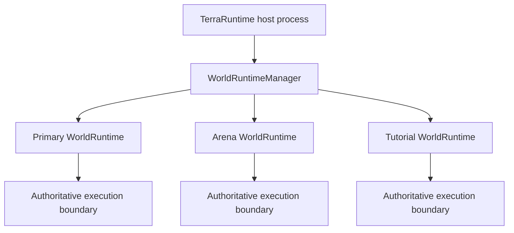
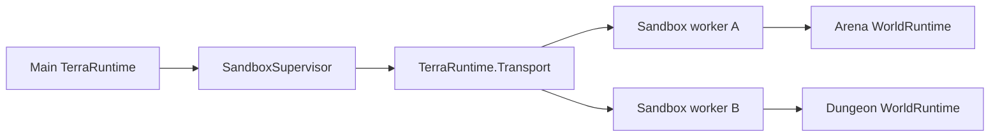
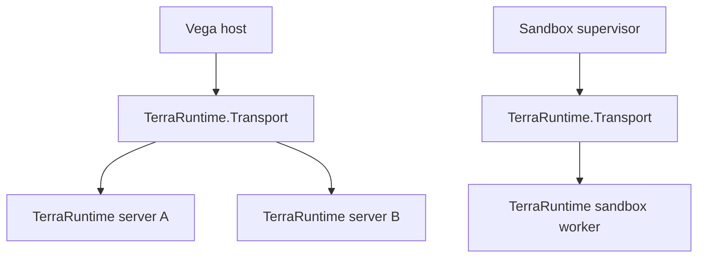
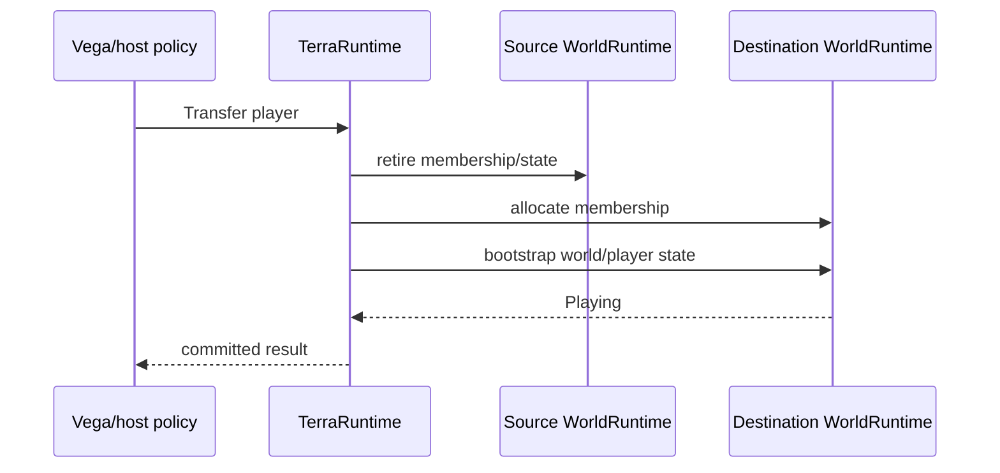

# Multi-world runtime and sandbox isolation roadmap

This roadmap defines native TerraRuntime support for multiple simultaneously live runtime worlds and two sandbox isolation levels.

The feature is **not a Dimensions replacement**. Dimensions-style long-lived secondary worlds may later reuse the same runtime-world foundation, but the immediate use cases are isolated minigame arenas, tutorials, temporary dungeons, event instances, plugin-owned test worlds and stronger process isolation.

`TerraRuntime.Transport` is retained as a first-class process/server boundary. It serves two concrete topologies:

1. Vega can keep transport sessions to multiple TerraRuntime servers and expose policy-controlled cross-server features to Vega plugins.
2. TerraRuntime can supervise second-level sandbox worker processes through the same bounded, versioned transport envelope.

The transport layer remains below world/gameplay/plugin service protocols. It provides bounded framing, correlation, negotiated mechanics and process identity; it does not become a gameplay god-bus.

> Checkbox policy: `[x]` means verified on `main` by implementation plus tests/CI or equivalent executable proof. Foundation-only work remains `[ ]`.

## 1. Concepts

A canonical `.wld`, a logical runtime world and one live activation are separate concepts:

- **world source**: `.wld`, generated workspace, template or snapshot source;
- **`WorldRuntimeId`**: stable identity of one logical runtime-world instance;
- **`WorldSessionId`**: identity of one live activation of that runtime; restart creates a new session;
- **world runtime**: authoritative mutable simulation state and its lifecycle;
- **sandbox**: an isolation/persistence policy applied to a world runtime.

This distinction prevents a cloned arena derived from the same `.wld` from accidentally sharing runtime identity and prevents stale handles from a previous process/session being accepted after restart.

## 2. Orthogonal policies

Isolation and persistence are independent.

```text
WorldIsolationLevel
    InProcess
    DedicatedProcess

WorldPersistenceMode
    Persistent
    Ephemeral
    SnapshotClone
```

An ephemeral arena may be cheap and in-process. A third-party minigame may be ephemeral and process-isolated. A persistent secondary world may be in-process and not considered a sandbox by operators.

Do not encode `sandbox`, `dimension`, `minigame` or `persistent` as one overloaded world-kind enum.

## 3. Level 1: in-process sandbox worlds

Level 1 keeps multiple isolated `WorldRuntime` instances in one TerraRuntime process.



Each runtime owns its own mutable state, including players, NPCs, projectiles, items, progression, RNG streams, extension state, replication state, section/cache state and persistence policy.

The invariant is **one authoritative owner per world runtime**, not necessarily one operating-system thread forever. The first implementation may use one dedicated game-loop thread per active runtime because it is simple and easy to reason about. A later measured scheduler may host multiple low-load worlds while preserving single-writer semantics.

In-process worlds do **not** route ordinary gameplay through `TerraRuntime.Transport`. Direct typed command/snapshot boundaries are cheaper and preserve the existing hot-path architecture.

## 4. Level 2: dedicated-process sandbox worlds

Level 2 runs sandbox runtime state in another TerraRuntime worker process.



The dedicated process provides a stronger fault/resource boundary for workloads where in-process isolation is insufficient: third-party game modes, risky native dependencies, strict CPU/memory accounting, crash containment or operator policy.

A worker crash, hang or forced termination must not kill the supervising server process. The supervisor owns worker lifecycle, handshake, heartbeat/liveness, bounded shutdown, restart policy and fault projection to affected world sessions.

The first implementation should prefer **one sandbox world per worker process**. Supporting multiple worlds per worker is a later optimization only when measurements show process count or memory overhead justifies it.

## 5. `TerraRuntime.Transport` role

`TerraRuntime.Transport` remains transport-neutral and service-neutral.

It owns:

- fixed bounded envelope/framing;
- protocol version negotiation;
- request/response/event/cancellation mechanics;
- correlation IDs;
- heartbeat capability;
- per-process instance identity in the handshake;
- negotiated optional mechanics such as compression/shared-memory snapshots when explicitly supported.

It does not own:

- player/NPC/world business operations;
- Vega permissions;
- plugin discovery/lifecycle;
- sandbox policy;
- game-loop mutation;
- raw arbitrary plugin packet sending.

Two first-class uses share this layer:



Vega plugins use cross-server transport **through Vega-owned capabilities/policy**, not by receiving unrestricted raw transport access.

## 6. World-scoped identity

Raw Terraria slots are local to one live world session. Cross-boundary identities must eventually carry or be associated with `WorldRuntimeIdentity`.

Affected handle families include players, NPCs, projectiles, items, chests and other runtime-owned actors.

Do not mechanically enlarge every hot-path handle immediately. Introduce world scope where identities cross a multi-world/host/process boundary, then propagate it through existing APIs as the multi-world manager lands.

## 7. Connection/world membership

A client connection belongs to at most one active world session at a time.

World transfer is a TerraRuntime-owned lifecycle operation:



Hosts/plugins do not fake a transfer by manually sending world-info, tile sections and entity baselines.

## 8. Resource policy

Every sandbox creation path is bounded.

Level 1 needs process-wide and per-world limits for active worlds, total tiles/memory, players, entities, background work and authoritative CPU/tick budgets.

Level 2 adds operating-system process limits where available, while TerraRuntime still keeps application-level bounds. Process isolation is not an excuse for unbounded queues or payloads.

## 9. Generation and persistence

The existing isolated world-generation workspace is the correct source boundary for generated sandboxes.

Persistent flow:

```text
generate -> validate -> publish canonical .wld -> start WorldRuntime
```

Ephemeral flow:

```text
generate -> validate -> materialize WorldRuntime -> discard on teardown
```

Snapshot clone starts from an immutable source/snapshot and receives a new `WorldRuntimeId`. Copy-on-write tile/page storage is explicitly deferred until measurements show that ordinary isolated state is too expensive.

## 10. Delivery order

### S0 - identity and architecture foundation

- [x] retain `TerraRuntime.Transport` as a first-class process/server boundary;
- [x] define `WorldRuntimeId` and `WorldSessionId`;
- [x] define explicit in-process/dedicated-process isolation levels;
- [x] define persistent/ephemeral/snapshot-clone persistence policy names;
- [x] document that sandbox worlds are not a Dimensions replacement;
- [ ] propagate world identity through cross-world host-facing handles.

### S1 - in-process runtime container

- [ ] introduce one `WorldRuntime` composition root containing authoritative state/lifecycle;
- [ ] remove new single-world globals/current-world assumptions;
- [ ] introduce `WorldRuntimeManager` create/start/stop/list lifecycle;
- [ ] run two independent worlds concurrently in one process;
- [ ] prove state/RNG/entity/extension isolation;
- [ ] add bounded process-wide world/resource admission.

### S2 - ephemeral minigame sandbox

- [ ] create an ephemeral runtime from validated generation/template state without canonical `.wld` publication;
- [ ] deterministic teardown releases all world-owned resources;
- [ ] host API can create/destroy a bounded sandbox through semantic operations;
- [ ] transfer a connection between two world sessions through authoritative lifecycle;
- [ ] prove no state from the source world leaks into the destination session.

### S3 - Vega multi-server transport

- [ ] define a versioned higher-level server-control service over `TerraRuntime.Transport`;
- [ ] Vega can maintain independent bounded sessions to multiple TerraRuntime servers;
- [ ] server identity/reconnect semantics are explicit and do not rely only on socket addresses;
- [ ] Vega PluginSdk exposes capability-scoped cross-server operations rather than raw transport;
- [ ] malformed/oversized/unauthorized remote requests fail closed and are observable.

### S4 - dedicated sandbox process

- [ ] introduce `SandboxSupervisor`;
- [ ] launch one worker process for one sandbox world initially;
- [ ] handshake through `TerraRuntime.Transport`;
- [ ] heartbeat/liveness and bounded request queues;
- [ ] graceful stop plus forced-kill fallback;
- [ ] worker crash leaves supervisor/main world alive;
- [ ] CPU/memory/process-count limits and cleanup;
- [ ] affected players receive deterministic fallback/disconnect/return handling.

### S5 - optional optimizations

Only after measurement:

- [ ] shared-memory immutable snapshots for large local transfers;
- [ ] copy-on-write world template storage;
- [ ] multiple low-load worlds per sandbox worker;
- [ ] shared authoritative-world scheduler rather than one thread per world;
- [ ] remote-host sandbox workers over a secure transport.

## 11. Non-goals

This roadmap does not require:

- replacing Dimensions compatibility work;
- routing in-process gameplay through IPC;
- making same-process managed plugins a security sandbox;
- a generic distributed RPC framework;
- distributed transactions between worlds;
- cross-host sandbox workers before a local-process implementation proves the service contract;
- copy-on-write storage before measurement.

The architecture deliberately keeps the common in-process minigame path cheap while leaving a real operating-system isolation path for workloads that need it.
