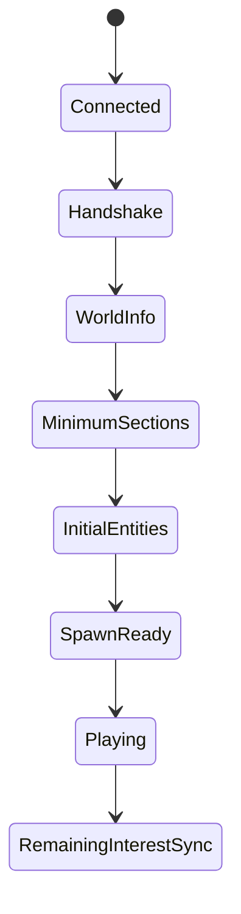
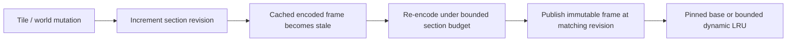
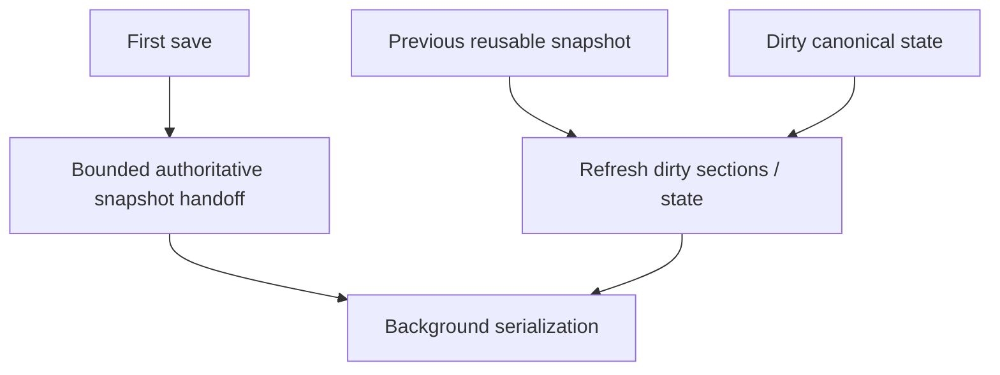
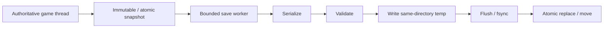
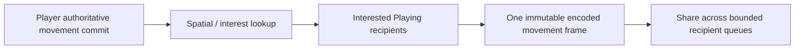
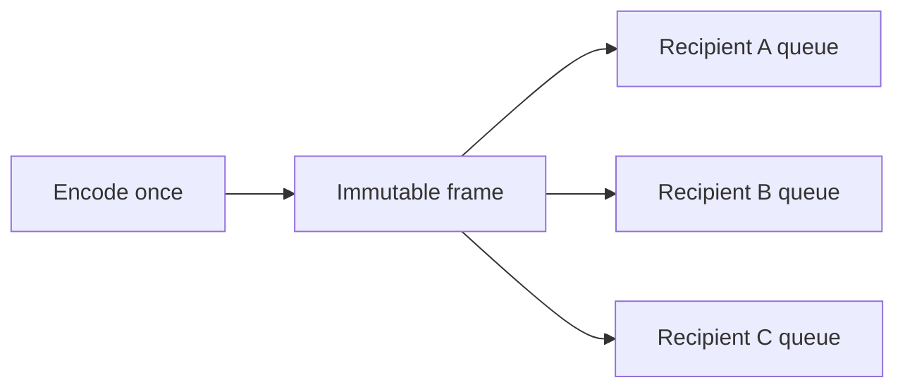
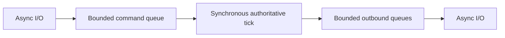

# Roadmap: Performance & Tick Stability

This document is the detailed performance/scalability contract for TerraRuntime. It expands the main roadmap with concrete constraints, metrics, stress profiles and acceptance criteria.

> Не пытаться сделать каждый code path максимально быстрым. Сначала сделать его стоимость ограниченной и предсказуемой.

## Goal

TerraRuntime must preserve a stable authoritative simulation rate under gameplay, networking and background load.

Baseline direction:

$$
f_{\mathrm{simulation}}=60\,\mathrm{TPS},
\qquad
T_{\mathrm{tick}}\approx16.67\,\mathrm{ms}.
$$

No subsystem may consume an unbounded share of one tick. Burst-heavy work is bounded, incremental or moved off the authoritative game thread; slow clients, mass join, autosave, section generation, entity synchronization and administrative work cannot create uncontrolled tick stalls; performance changes require reproducible measurements.

Current foundation includes a dedicated authoritative loop with wall/CPU timing, bounded worker pool/completion handoff, bounded per-connection outbound queues, server-authoritative player identity/movement relay, real two-client TCP movement smoke, runtime-owned interest-management control/routing boundary and a revision-safe encoded section cache with a bounded dynamic-memory LRU.

The routing boundary does **not** mean spatial culling is complete. Suppression remains blocked on enter/leave, hysteresis and resync correctness.

## Verified implementation checklist

> Checkbox policy: `[x]` means the item is verified on `main` by implementation plus tests/CI or equivalent executable proof. Partial/foundation-only work remains `[ ]`.

- [x] Dedicated authoritative loop with wall/CPU timing.
- [x] Bounded worker pool with explicit completion handoff.
- [x] Join-critical on-demand section rebuild admission has deterministic tick priority over background dirty rebuilds.
- [x] Bounded per-connection outbound queues with slow-client signaling.
- [x] Server-authoritative player identity/movement relay with a real two-client TCP movement smoke.
- [x] Runtime-owned interest-management control/routing boundary.
- [x] Single-active-save coalescing scheduler.
- [x] Atomic save-file writer.
- [ ] End-to-end staged/fair join work budget under mass join.
- [x] Encoded section cache with section-local invalidation and bounded memory.
- [ ] Full dirty-section-driven sync/save architecture.
- [ ] Actual AOI packet suppression with enter/leave hysteresis and forced resync.
- [ ] Complete $24/64/128/255$-connection stress acceptance matrix.

## 1. Global per-tick work budgets

Introduce explicit global budgets for inbound commands, section generation/encoding, initial synchronization, dirty entity synchronization, liquids, world scans, expensive gameplay maintenance and background-result application.

Each budget exposes hard operation limit, optional CPU-time limit, backlog size, oldest backlog age and processed/deferred/dropped counters.

The budget is global **per subsystem**, never multiplied by player count. For example, if section streaming has

$$
B_{\mathrm{sections}}=4\,\mathrm{ms/tick},
$$

twenty simultaneous joins still share that total budget instead of receiving $4\,\mathrm{ms}$ each.

Initial section-streaming direction is

$$
B_{\mathrm{sections}}\in[2,4]\,\mathrm{ms/tick},
$$

to be corrected by Small/Medium/Large-world benchmarks.

## 2. Staged join pipeline



First-time section encoding is spread across ticks, spawn-critical data has priority, all joining players share one section-work budget, scheduling is fair and already-playing clients retain tick stability during mass join.

The first scheduling guarantee is implemented: if a tick begins with pending on-demand section rebuilds, that tick admits join-critical rebuild work but no new background dirty-section rebuilds. Existing in-flight dirty work is not cancelled. This removes a scheduler race where a fast worker dequeue could make background admission depend on OS timing. See [`section-cache-scheduling.md`](../en/section-cache-scheduling.md).

Telemetry now includes the count of ticks where dirty work was deliberately deferred for on-demand priority, in addition to pending/unique/deduplicated/rejected on-demand requests and cache-wait completion/timeout counters. Full multi-player fairness, oldest-join age, CPU-time budgets and mass-join acceptance remain open.

Metrics include currently joining players, pending sections, oldest pending join, sections encoded/tick, section CPU time and join completion average plus $p_{95}/p_{99}$.

## 3. Encoded section cache

A runtime section tracks revision, dirty state, encoded immutable frame and encoded revision. When `encodedRevision == revision`, the frame may be reused for multiple recipients.



One immutable frame can be shared by many outbound queues, invalidation is section-local, stale committed state is never sent and failed encoding never marks a section cached/sent. Production rebuilds use bounded dedicated workers and publish only after the authoritative owner confirms the revision still matches.

Bootstrap/base sections are pinned because every join requires them. Non-bootstrap entries use deterministic LRU eviction with default dynamic byte budget

$$
B_{\mathrm{dynamic}}=64\,\mathrm{MiB}.
$$

Because one Terraria wire frame is bounded by the 16-bit length field,

$$
B_{\mathrm{frame,max}}=65\,535\,\mathrm{B},
$$

and for `$N_{\mathrm{base}}$` pinned bootstrap sections the explicit total ceiling is

$$
B_{\mathrm{cache,max}}=
B_{\mathrm{dynamic}}+N_{\mathrm{base}}\cdot B_{\mathrm{frame,max}}.
$$

Dynamic hits refresh LRU recency; a new dynamic frame evicts oldest dynamic entries until it fits. A stale dynamic entry is reclaimed immediately when a revision mismatch is observed. Snapshot telemetry exposes total/dynamic bytes, byte ceilings, evictions, hit/miss, stale reads, wait/completion/timeout counts, encode counts and encode duration.

The `$64\,\mathrm{MiB}$` budget is a correctness-first bounded default and remains subject to representative Small/Medium/Large-world measurement. Average encoded/compressed section size can be derived from cache bytes/entries and should be recorded explicitly in future benchmark artifacts.

## 4. Section revision and dirty tracking

Dirty tracking is world-runtime architecture, not a networking patch. Tile/wall/liquid/wiring/multi-tile and other section-visible mutations mark affected sections through a deduplicated dirty queue/set. Repeated writes to one section in one tick must not create hundreds of queue entries. Avoid full-world change-discovery scans.

## 5. Incremental save snapshots

Autosave does not serialize live mutable world state on the authoritative thread.



Reusable snapshot strategy eventually covers all canonical mutable persistent state: chests, signs, tile entities, persistent NPC/progression/liquid state, `.wld` runtime metadata and other canonical save data.

Measure snapshot copy time separately from serialization, compression/encoding, disk write, `fsync` and atomic replace.

## 6. Background save pipeline



At most one save is active; overlapping autosaves coalesce; shutdown waits for active save work; final shutdown state commits last; save failure is isolated; snapshot memory is immutable after handoff.

## 7. Fine-grained tick phases

The subsystem sequence is conceptual rather than a text diagram:

`Ingress → Commands → Snapshot → Liquids → Growth → Spread → Weather/World → Sections → Items → NPC → Projectiles → Damage → Spawning → Housing → Sync`.

Per tick record wall duration, CPU duration, phase timing, worst phase, processed counts and deadline state. Reporting windows expose average, $p_{50}$, $p_{95}$, $p_{99}$ and worst.

A wall tick of $40\,\mathrm{ms}$ with only $1\,\mathrm{ms}$ authoritative-thread CPU is primarily scheduler/contention evidence, not automatically a gameplay-hot-path regression.

## 8. Incremental $O(\mathrm{world})$ systems

Large full-world scans in one tick are prohibited unless verified vanilla semantics require atomic completion. Candidates include biome/evil census, housing, liquids, growth/spread, world maintenance, inactive-entity cleanup and spatial-index rebuilds.

Each incremental system defines cursor/state, operation/CPU budget, maximum completion latency, invalidation/restart behavior and safety of stale intermediate results.

## 9. Runtime-owned interest management / spatial visibility

Interest management belongs entirely to TerraRuntime. Vega, TUI and future hosts may only enable/disable it.

Public control remains literal API:

```csharp
IInterestManagementControl control;
control.SetEnabled(true);
control.SetEnabled(false);
bool enabled = control.IsEnabled;
```

Standalone startup remains literal CLI:

```text
TerraRuntime.Server --world world.wld --interest-management
```

State is world-scoped; external code receives no spatial buckets/radii/hysteresis/observer callbacks; Multiplicity owns wire representation, not visibility; TerraRuntime owns spatial policy and resync; disabled/unknown state fails open; enable/disable does not require restart.

Foundation remains passthrough until initial position state, enter full-state, leave semantics, teleport/respawn rebuild, hysteresis and forced resync are correct.

Target index is a section/interest-cell bucket containing players, NPCs, items and projectiles; actual cell geometry remains internal and measurement-driven.

## 10. Remove unconditional $O(P^2)$ movement relay



Full state is sent on visibility entry, leave semantics are correct, teleports/respawn recalculate immediately, player slots remain server-owned and forced resync prevents permanent stale state.

Benchmark $255$-player movement in clustered, evenly distributed, two-group and all-moving profiles.

## 11. Dirty-state entity synchronization

NPC/projectile/item synchronization uses revisions/dirty flags rather than unconditional full broadcast. The planner decides whether to send, full versus delta, recipients and recipient state.

## 12. Proximity-based sync frequency

Where correctness permits, cadence may vary by interest tier:

| Tier | Direction |
|---|---|
| very near | high frequency |
| near | normal frequency |
| far | reduced frequency |
| not visible | skip |

Candidates include NPCs, safe projectile classes, items and player movement. Distance alone is insufficient when verified section/visibility state is more correct.

## 13. Forced periodic resync

Define a bounded maximum skipped-update count and/or elapsed duration per entity/recipient class. Crossing it forces a full/delta resync even if normal throttling would skip the update.

## 14. Sync frame sharing



Async writers retain frame lifetime safely, recipients cannot mutate shared bytes, queue accounting remains logical per connection and one slow recipient cannot corrupt/block others.

## 15. Outbound batching

Batch only already-queued frames; never intentionally wait for a batch to fill. Measure frames/write, bytes/write, syscalls/s, queue drain rate and packet latency. Latency-sensitive traffic has a strict batching latency ceiling.

## 16. Slow-client isolation

Every connection owns bounded outbound frame/byte capacity. Where protocol permits, low-priority updates may be dropped/coalesced with resync; pathological readers may disconnect. Socket output never blocks simulation. Telemetry records connection, queue depth/bytes, exhausting packet class and action.

## 17. Inbound flood isolation

Per-source quotas/category budgets prevent one source from monopolizing shared command work. Track rejects/deferred traffic, throttled source and oldest command age.

## 18. Dedicated worker isolation

CPU-heavy work without mutable-world ownership uses bounded dedicated workers, not unlimited `Task.Run`. Compression, save serialization, expensive validation, password hashing, runtime-cache generation and diagnostics need controlled worker count, bounded input/completion queues, backpressure, cancellation and authoritative result application.

## 19. Allocation budget on hot paths

Measure bytes/tick, allocations/tick, allocation by packet/event class and Gen0 collections/minute. Priority paths include movement codecs, entity sync, routing, command staging and visibility. Movement/control should be zero or near-zero allocation per packet where achievable without unsafe complexity.

## 20. GC observability and tuning

Collect allocation rate, Gen0/1/2 counts, pause duration, LOH rate, heap size and fragmentation where available. GC settings are benchmark decisions. `GC.TryStartNoGCRegion` is experimental, never baseline architecture.

## 21. Avoid async machinery inside simulation hot path



Normal tick work is not hidden behind `await`, uncontrolled continuations, ThreadPool scheduling or arbitrary external callbacks.

## 22. Spatial indexes

Add measured incremental indexes for nearby entities, visibility, pickup/damage candidates and section subscribers. Do not retain global `for every entity → for every player` scans when section/grid buckets preserve semantics more cheaply.

## 23. Performance benchmark suite

Population checkpoints:

$$
P\in\{1,8,24,64,128,255\}.
$$

Scenarios: idle, all-player movement, $255$-player clustered worst-case fan-out, distributed Large-world movement, mass join, NPC/projectile/combat load, tile edits, liquids, autosave and join during combined gameplay/save load.

## 24. Tick performance gates

Record average CPU tick, $p_{50}/p_{95}/p_{99}/\max$, missed deadlines, wall stalls, worst phase, allocations/tick, network throughput, outbound peak, drops and slow-client disconnects.

Initial directional gates, subject to recalibration as gameplay fills out:

$$
p_{99,\mathrm{normal}} < 8\,\mathrm{ms},
$$

$$
p_{99,\mathrm{stress}} < 12\,\mathrm{ms},
$$

and no sustained simulation workload should exceed

$$
16.67\,\mathrm{ms/tick}.
$$

## 25. Performance regression CI

Fast PR gate: microbenchmarks, allocations, queue behavior, section encoding, scheduler checks and selected $8/24$-player simulations.

Scheduled/nightly: $64/128/255$ players, Large world, mass join, movement, autosave and NPC/projectile load. Release gate runs the full matrix; compatible-environment regressions beyond tolerances fail.

## 26. Real subprocess load tests

Critical crowd/network tests prefer a real TerraRuntime process, separate load generator and real TCP connections so OS socket buffers, scheduling, backpressure and contention are represented.

## 27. Machine-readable performance baselines

Record CPU model, OS, runtime/build identity, NativeAOT RID, world size, player count, scenario, commit SHA, tick/allocation/network/memory metrics. Compare only compatible environments or label the difference explicitly.

## 28. Measure before optimizing

A performance change records hypothesis, baseline, change, measurement, result and decision. Revert complexity without measurable value or with memory/readability/correctness/latency regressions. Document attractive failed experiments so they are not rediscovered repeatedly.

## 29. Memory scalability targets

Measure total/categorized memory at

$$
P\in\{0,24,128,255\}.
$$

Track world state, section cache, outbound queues, entity state, save snapshots/workers, runtime-world cache, protocol buffers and spatial indexes. Do not buy resilience with $255\times$ huge per-player queue growth.

## 30. Acceptance criteria

Performance architecture is not complete until real stress evidence shows a stable $60\,\mathrm{TPS}$ loop, mass join without multi-tick stalls, autosave serialization off simulation, slow-client isolation, per-source fairness, globally bounded section work, removal of unconditional $O(P^2)$ movement as baseline architecture, runtime-owned world-scoped interest management, dirty/interest-driven entity sync, incremental full-world maintenance where legal, measured movement allocation budget, sustained $255$ real TCP clients, sustained Large-world load, automated regression validation and telemetry that identifies the subsystem responsible for slow ticks.
