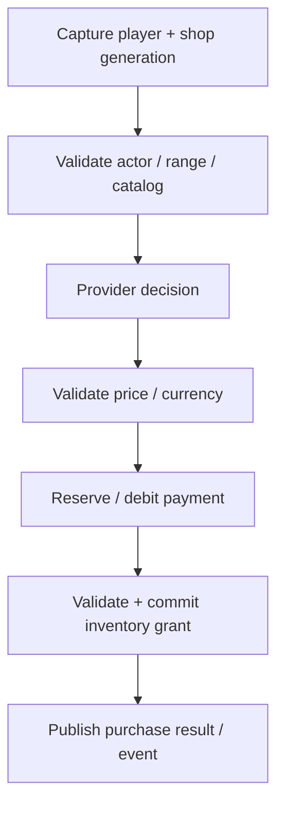

# Runtime-controlled actors, fake players and commerce roadmap

This roadmap extends the gameplay/world-generation extensibility plan with runtime-owned actor control and interaction surfaces required by Vega plugins and minigames.

> **Vega/plugins submit intent and policy. TerraRuntime owns simulation, validation, state mutation and replication.**

This stage is mandatory for the gameplay extensibility story. It is not a packet-scripting convenience layer.

> Checkbox policy: `[x]` means the item is verified on `main` by implementation plus tests/CI or equivalent executable proof. Partial/foundation-only work remains `[ ]`.

## G6 - Runtime-controlled actors and commerce

### Goals

TerraRuntime must support runtime-controlled NPC actors through authoritative movement/collision/gravity/liquid/lifecycle paths, high-level actor intent, connection-free runtime-owned players, server-owned player physics, interaction-capable actors where vanilla protocol permits useful presentation, runtime-owned commerce/transactions and deterministic cleanup across plugin reload/unload.

### Non-goals

Plugins do not directly mutate NPC/player arrays, simulate movement on arbitrary threads, fabricate fake-player state from raw movement packets, debit currency/edit inventories directly, forge purchase-result packets or pretend the official client supports arbitrary new shop UI.

## G6.1 - Actor identity and control intent

Conceptual contracts remain literal API/domain names:

```text
RuntimeActorId
RuntimeActorKind = Npc | FakePlayer
ActorControllerId
ActorControlLease

NpcActorCommand
  FollowPlayer(PlayerHandle target, FollowOptions options)
  MoveTo(Vector2 target, MoveOptions options)
  Stop()
  Face(Direction direction)
  KeepDistance(PlayerHandle target, float min, float max)

FakePlayerCommand
  MoveTo(...)
  FollowPlayer(...)
  Jump(...)
  UseItem(...)
  Stop()
```

Actor identity is generation-safe, controller ownership is explicit/lease-based, exclusive movement control has one owner, command changes publish at authoritative tick boundaries, stale commands fail closed after slot reuse, commands express intent rather than position writes, and unload returns actors to a defined fallback state.

## G6.2 - Runtime-controlled NPC actors

```mermaid
flowchart LR
    Plugin["Vega / plugin command"] --> Registry["Actor command registry"]
    Registry --> ResolveNpc["Resolve exact NPC handle + generation"]
    ResolveNpc --> ResolveTarget["Resolve target player snapshot"]
    ResolveTarget --> Intent["Actor intent stepper"]
    Intent --> Behavior["Existing NPC behavior pipeline"]
    Behavior --> Motion["Source-backed world motion + collision"]
    Motion --> Store["RuntimeNpcStore validation / commit"]
    Store --> Replication["Normal NPC replication"]
```



`FollowPlayer` does not teleport or directly set final position. It produces bounded intent/velocity/targeting that flows through normal runtime NPC motion.

Initial options should bound desired distance, horizontal speed/acceleration, supported jump/step behavior, stop radius, optional chase distance and fallback when the target disappears or changes generation.

## G6.3 - Fake/server-controlled players

```mermaid
flowchart LR
    Identity["FakePlayerArchetype / identity"] --> Allocate["Runtime player-slot allocation"]
    Allocate --> Handle["Server-owned PlayerHandle / generation"]
    Handle --> State["Appearance / equipment / vitals / inventory"]
    State --> Physics["Runtime-owned player physics"]
    Physics --> Commit["Validated authoritative state commit"]
    Commit --> Replication["Ordinary player replication to real clients"]
```



Completion requires server-owned player physics for gravity/fall speed, horizontal acceleration/friction, jump state, tile/platform collision, liquids, explicitly supported mounts, death/respawn and deterministic authoritative tick ownership without a network session.

Fake players use protocol-valid slots/appearance/equipment, coexist with real connections and cannot be controlled by client packets claiming their server-owned slots.

## G6.4 - Interaction surface

Conceptual runtime request types include `ActorInteractionRequest`, `ActorInteractionKind`, `NpcConversationRequest`, `NpcShopOpenRequest` and `NpcShopPurchaseRequest`.

Runtime validation covers player/session generation, target actor generation, interaction range, actor availability, shop registration generation, item/quantity, inventory capacity, currency/payment and duplicate/replay protection where required.

Plugins receive semantic requests and return policy/offer decisions, not raw frames.

## G6.5 - Custom NPC shops

Conceptual commerce contracts include `ShopId`, `ShopRegistrationLease`, `ShopCatalogSnapshot`, `ShopOffer`, `ShopPurchaseRequest`, `ShopPurchaseDecision` and `ShopPurchaseCommit`.

A shop offer supports protocol-valid vanilla item identity, stack/quantity limits, price, currency kind, optional availability predicate and stable offer identity independent from catalog order.

### Transaction rule



Authoritative commit failure aborts the purchase without partial money/item mutation. Plugins do not directly edit `RuntimePlayerInventoryStore` as the normal shop API.

Vanilla coin currency is the initial model. Future custom currencies require an explicit transactional prepare/commit/rollback-style contract, not a callback that merely claims it removed tokens.

### UI compatibility

Use vanilla shop/UI protocol only where the selected actor/presentation supports it, never emit unknown content IDs, and use a server-mediated fallback when arbitrary catalog UI cannot be represented safely. A future modified-client extension may add richer UI without changing the transaction model.

## G6.6 - Vega/plugin SDK boundary

Expected convenience operations remain semantic names such as `SpawnNpcActor`, `ControlNpc`, `FollowPlayer`, `StopActor`, `SpawnFakePlayer`, `ControlFakePlayer`, `RegisterShop` and `UpdateShopCatalog`.

Vega owns permissions/config/plugin lifetime; TerraRuntime owns actor simulation and commerce commits. Plugin unload retires actor control leases, actor extension state, shop registrations/catalog snapshots, pending purchase intents and fake-player ownership according to configured fallback/despawn policy.

## Delivery order

### G6-A - NPC actor control foundation

- [x] stable actor/controller IDs;
- [x] generation-safe NPC control bindings;
- [x] `Stop`, `MoveTo`, `FollowPlayer` command state;
- [x] player snapshot query adapter;
- [x] NPC control stepper integrated with existing behavior/world-motion path;
- [x] target disconnect/generation change handling;
- [x] focused tests proving movement goes through authoritative NPC physics rather than position teleport.

### G6-B - NPC interactions and shops

- [ ] actor interaction request boundary;
- [x] stable `ShopId` and registration lease;
- [x] immutable shop catalog snapshot;
- [x] vanilla item/price validation;
- [x] atomic inventory + coin transaction path;
- [ ] purchase commit diagnostics/events;
- [ ] Vega adapter proof-of-concept with a custom merchant NPC.

### G6-C - Fake player foundation

- [x] server-owned player identity/slot allocation separate from connection ownership;
- [ ] fake-player appearance/vitals/equipment/inventory state;
- [ ] replication to real players;
- [ ] rejection of client control packets for server-owned slots.

### G6-D - Runtime player physics

- [x] server-owned player physics stepper;
- [ ] source-backed movement/collision/gravity/jump/liquid semantics;
- [ ] fake-player `MoveTo`/`FollowPlayer` controller;
- [ ] deterministic tick integration and performance gate.

### G6-E - Gameplay integration

- [ ] NPC escort/follow example;
- [ ] custom merchant example;
- [ ] fake-player/bot example;
- [ ] per-world enable/disable;
- [ ] plugin hot-reload/retirement tests;
- [ ] NativeAOT Linux/Windows coverage.

## Definition of done

G6 is not complete until:

- [ ] a Vega plugin can spawn/control an NPC and tell it to follow a specific live player while TerraRuntime performs actual movement/collision physics;
- [x] the NPC continues to replicate through the ordinary authoritative NPC path;
- [x] player disconnect/slot reuse cannot redirect the NPC to a different generation by accident;
- [ ] a Vega plugin can attach a custom shop to a runtime NPC and supply protocol-valid vanilla merchandise;
- [x] a purchase is validated and committed atomically by TerraRuntime, not direct plugin inventory mutation;
- [x] a fake player can exist without a client connection and is allocated without colliding with real-player slots;
- [ ] fake-player movement is produced by a runtime-owned player physics path rather than direct packet/position scripting;
- [x] real clients cannot seize control of a fake player's slot;
- [ ] actor/shop/plugin unload leaves no stale callbacks, control leases, catalog state or entity-generation state;
- [ ] zero actor/shop registrations keep ordinary vanilla/runtime path allocation-light;
- [ ] NativeAOT and normal CI remain green.
