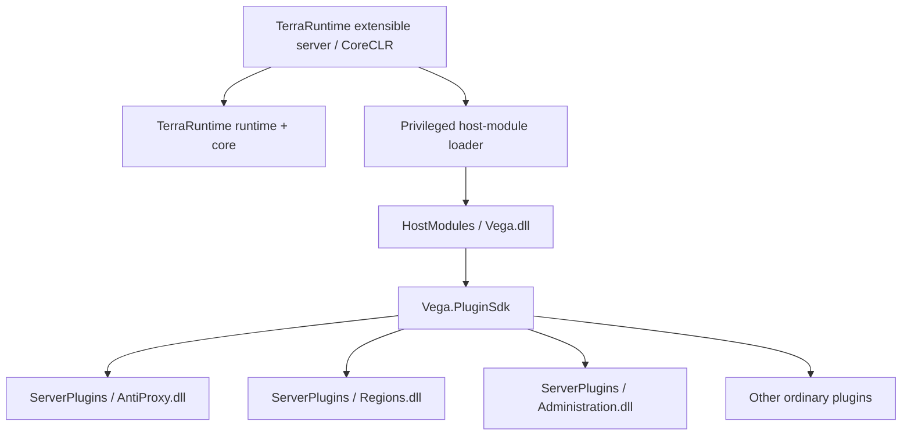
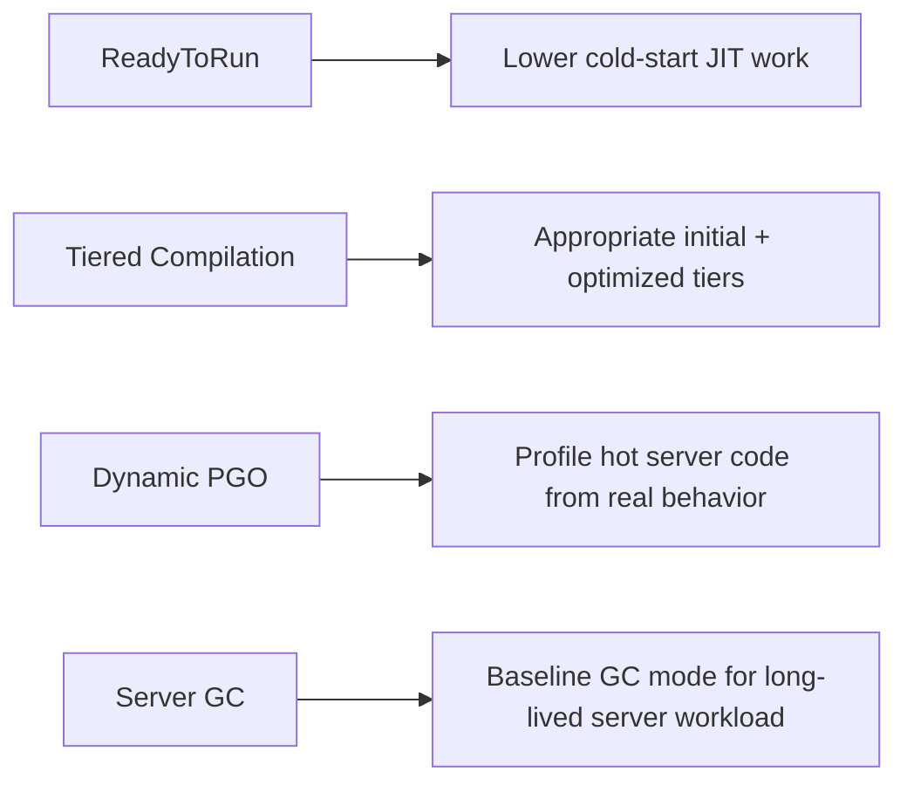
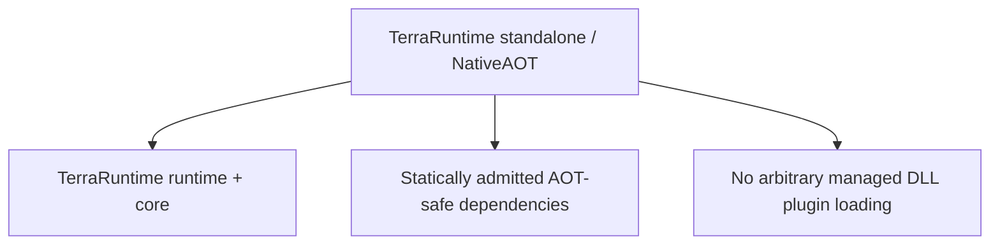
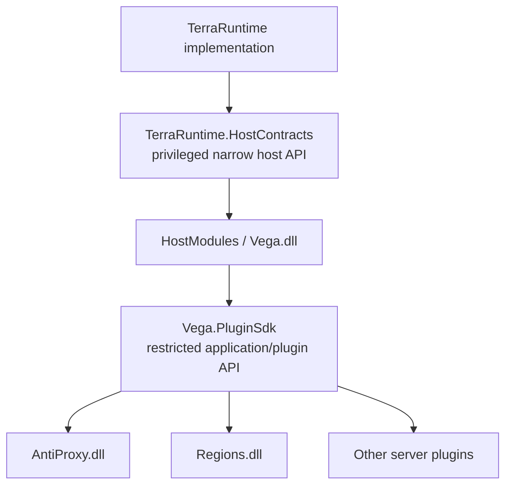
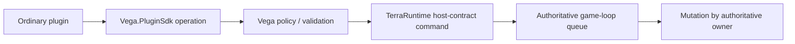
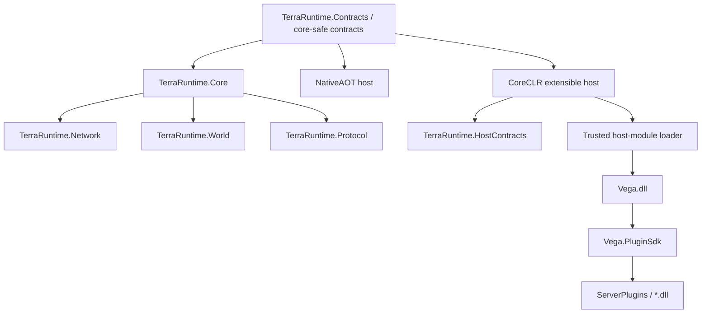

# Runtime host and plugin architecture

This roadmap entry defines the production hosting model for TerraRuntime, Vega and third-party server plugins.

The design priorities are, in order: sustained server throughput/low tick latency, drop-in managed DLL plugins including Vega as a DLL host module, and a strict API boundary that keeps ordinary plugins away from TerraRuntime internals and direct authoritative mutation.

NativeAOT remains a first-class build/deployment target for TerraRuntime. The extensible plugin host deliberately uses CoreCLR because arbitrary managed DLL loading, collectible `AssemblyLoadContext` and hot replacement belong to that product profile.

> Checkbox policy: `[x]` means the item is verified on `main` by implementation plus tests/CI or equivalent executable proof. Partial/foundation-only work remains `[ ]`.

## Two supported host profiles

TerraRuntime keeps one runtime core and two explicit host profiles instead of forcing incompatible requirements into one executable.

### Extensible production host

The normal Vega-enabled server runs on .NET 11 CoreCLR:



This profile may depend on JIT/runtime features needed by the managed plugin model, but those dependencies stay in the host/plugin boundary and do not leak into the AOT-compatible TerraRuntime core.

The default production compilation/runtime baseline is:

```xml
<ServerGarbageCollection>true</ServerGarbageCollection>
<TieredCompilation>true</TieredCompilation>
<TieredPGO>true</TieredPGO>
<PublishReadyToRun>true</PublishReadyToRun>
```

These are benchmarkable defaults, not folklore-based permanent truths.



Hot-path acceptance is based on tick latency, CPU time, allocation rate, GC pauses, packet throughput and sustained player load. Startup time alone does not decide between CoreCLR and NativeAOT for the extensible server.

### NativeAOT standalone host



Linux x64 and Windows x64 NativeAOT publication, exercised native smoke tests and zero unexplained trimming/AOT warnings remain permanent CI gates for the TerraRuntime core.

NativeAOT remains a deployable runtime-only profile, an architectural quality gate, protection against accidental reflection/runtime-codegen creep, a benchmark target against CoreCLR, and an option for deployments that do not need managed plugins.

## Trust boundary

Vega is a DLL, but not an ordinary server plugin.



`TerraRuntime.HostContracts` and `Vega.PluginSdk` are different boundaries with different trust levels.

### `TerraRuntime.HostContracts`

This privileged host-facing contract may expose immutable snapshots, command ingress, lifecycle notifications, runtime controls, interest-management enable/disable, safe world/player/NPC operations and bounded telemetry. It must not expose mutable implementation objects merely for convenience.

### `Vega.PluginSdk`

Ordinary plugins compile against Vega's SDK, not TerraRuntime internals or the privileged host contract. The exact capability surface remains Vega-owned and can include players, commands, messaging, worlds, NPC/chest operations, configuration, logging and permissions.

Safe mutation path:



Direct implementation mutation such as `TerraRuntime.World.Players[index].Position = ...` is a boundary violation.

## Plugin loading ownership

TerraRuntime owns loading explicitly trusted host modules such as Vega. Vega continues to own ordinary server-plugin lifecycle and policy: `ServerPlugins/*.dll` discovery, metadata/compatibility checks, collectible `AssemblyLoadContext` where appropriate, activation/deactivation, hot replacement, command/event registration, config/data directories, lifecycle failure isolation and permissions/capabilities.

No per-tick plugin dispatch path depends on assembly scanning or repeated reflection. Reflection may be used at bounded CoreCLR discovery/activation boundaries; steady-state dispatch uses explicit registrations and cached delegates/interfaces.

## Security model

The SDK boundary protects runtime invariants, compatibility and accidental misuse. It is not a cryptographic sandbox for hostile same-process code.

Ordinary plugins are trusted-to-run but least-privileged by API design; TerraRuntime internals remain non-public where practical; mutable runtime objects are not exposed for convenience; true hostile-code isolation requires a separate process/sandbox and is a different feature.

The normal plugin architecture does not introduce IPC into the gameplay hot path merely to pretend same-process managed code is fully sandboxed.

## Deployment layout

The human-facing CoreCLR server root remains literal filesystem structure:

```text
TerraRuntime/
├── TerraRuntime.Server.exe
├── runtime/
│   └── managed/native runtime dependencies
├── HostModules/
│   └── Vega.dll
├── ServerPlugins/
│   ├── AntiProxy.dll
│   ├── Regions.dll
│   └── ...
├── Worlds/
├── config/
├── data/
└── logs/
```

The exact dependency subdirectory may be `runtime/` or `libs/`, but loose framework/runtime libraries must not flood the root. NativeAOT remains independently clean and does not need managed-plugin directories.

## Project-boundary implications



AOT analyzers remain mandatory for runtime core and the NativeAOT shipping graph. CoreCLR-only dynamic loading stays isolated so `AssemblyLoadContext` and managed DLL loading do not contaminate the NativeAOT core graph.

## Performance acceptance

The CoreCLR and NativeAOT profiles are benchmarked separately on identical scenarios. Compare startup to `NetworkReady`, idle CPU/RSS, mean and $p_{95}/p_{99}$ tick latency, worst simulation phase, allocations per tick, GC counts/pause duration, packet throughput/bytes per second, a $24$-player realistic workload, high-connection stress and representative plugin-dispatch overhead.

Do not claim either runtime is universally faster. The profile must be judged on the workload it serves.

## Acceptance criteria

This roadmap item is complete when:

1. [x] TerraRuntime core remains buildable and smoke-tested under NativeAOT on Linux x64 and Windows x64.
2. [ ] A CoreCLR extensible host can load `HostModules/Vega.dll` without exposing TerraRuntime implementation assemblies as a public plugin SDK.
3. [ ] Vega can load an ordinary managed plugin by placing its DLL in `ServerPlugins/`.
4. [ ] Ordinary plugins compile only against `Vega.PluginSdk` for normal server capabilities.
5. [ ] Plugin mutations cross Vega policy and TerraRuntime command boundaries before touching authoritative state.
6. [x] CoreCLR production defaults include Server GC, Tiered Compilation, Dynamic PGO and ReadyToRun as listed above.
7. [ ] Hot reload remains available for compatible Vega plugins through collectible `AssemblyLoadContext`.
8. [ ] The CoreCLR and NativeAOT profiles have reproducible performance comparisons rather than assumption-based claims.
