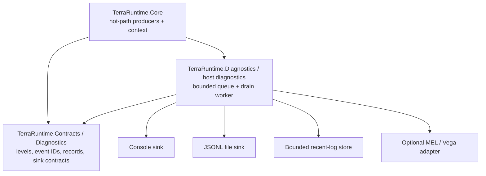
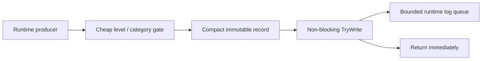
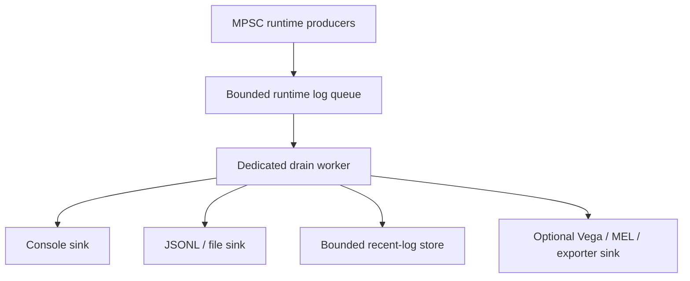
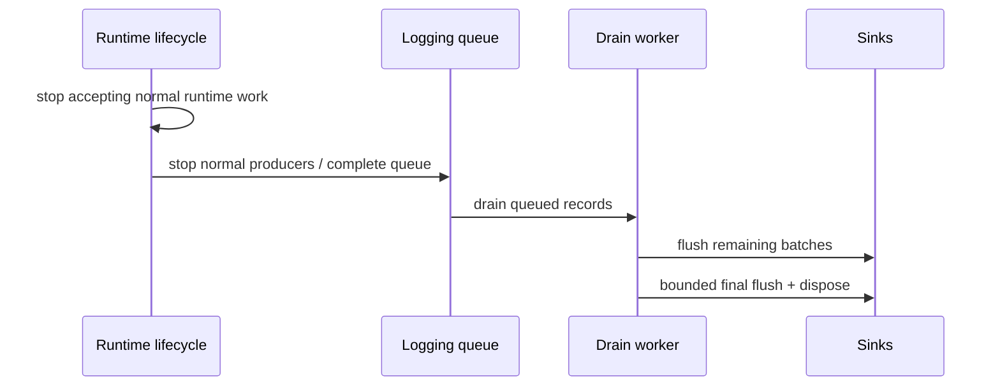

# Runtime-owned structured logging pipeline roadmap

This document defines the logging architecture that belongs to TerraRuntime itself rather than to Vega or another host.

The runtime must be independently observable without Vega, and logging I/O must never become part of the authoritative simulation critical path. Vega may consume TerraRuntime log events, render them in its TUI/API and combine them with application/plugin logs, but TerraRuntime remains the source of runtime/network/gameplay diagnostics.

> **Producing a runtime log event must be bounded and non-blocking on simulation/network hot paths; formatting and I/O happen outside the authoritative loop.**

> Checkbox policy: `[x]` means the item is verified on `main` by implementation plus tests/CI or equivalent executable proof. Partial/foundation-only work remains `[ ]`.

## 1. Migration decision from Vega

Take the useful concepts from Vega's operations logging layer, but do not mechanically move its current implementation.

The currently visible `Vega.Operations.Logging.StructuredOperationsLogger` on `general-devel` constructs an immutable record and invokes sinks synchronously on the caller thread. Its JSON file sink writes directly with `AutoFlush = true`. Those semantics are useful reference material, but not the TerraRuntime hot-path target.

TerraRuntime should own immutable structured records, stable levels/categories/event IDs, a bounded producer queue, dedicated background drain worker, sink fan-out/failure isolation, bounded recent-log retention, drop/backpressure telemetry, shutdown drain/flush semantics and optional Vega/MEL adapters.

Vega retains application/plugin-policy logs and consumes TerraRuntime records through an adapter/sink. TerraRuntime never references Vega assemblies.

## 2. Ownership boundary

### TerraRuntime owns

Runtime lifecycle, networking/protocol/session, gameplay validation, world load/save/cache/worldgen, entity simulation diagnostics, runtime queueing/prioritization, sequence/timestamps, runtime context, drain worker, standalone sinks, queue/sink health and lifecycle-aware final flush.

### Vega owns

Accounts/permissions/moderation/application-policy logs, module/plugin lifecycle, plugin-specific events, operator retention/export policy, UI/API presentation/filtering and external logging infrastructure selected by deployment.

### Shared integration

Vega may install a TerraRuntime sink/observer that forwards immutable runtime records into Vega's operations layer. That does not transfer runtime logging ownership back to Vega.

## 3. Proposed project/boundary shape



Exact project names may change. The dependency rule is normative: core simulation code does not depend on filesystem sinks, console UI frameworks, Vega or external exporters.

## 4. Structured event model

Candidate fields remain literal schema identifiers:

```text
Sequence
TimestampUtc
Level
EventId
Category
Source/Subsystem
MessageTemplate or stable message key
RenderedMessage?
Exception
CorrelationId
WorldId
ConnectionId
PlayerHandle
NpcHandle
ProjectileHandle
ItemHandle
PacketDirection
PacketId/Type
Properties
```

Records are immutable; context is optional/meaningful; mutable world/entity objects and large arbitrary payloads are never retained; exception capture does not force expensive formatting on every event; endpoint/IP exposure follows explicit privacy policy; frequent events prefer typed compact fields over allocating `Dictionary<string, object>`.

Stable event IDs are grouped by subsystem rather than allocated ad hoc.

## 5. Producer path



Requirements: no disk write, console lock, sink wait, unbounded allocation, synchronous JSON serialization or blocking `ChannelWriter.WriteAsync` from the game loop. Avoid interpolation/formatting when filtered out. Frequent events should prefer source-generated/static logging methods or equivalent precompiled templates.

Use a bounded BCL primitive such as `Channel<T>` initially unless measurement demonstrates a better specialized queue.

## 6. Queue architecture and backpressure



Overflow policy is preferential: `Trace`/`Debug` drop first; `Information` may sample/coalesce/drop; `Warning`/`Error` receive reserved/preferential capacity; `Critical` may use one bounded emergency fallback if the worker is unavailable.

Expose queue depth/capacity, high-water mark, dropped count by level/category, oldest queued age where practical, drain rate, sink failures and last failure information. The authoritative loop never waits for log queue space.

## 7. Drain worker

The drain worker never owns simulation state. Start with one long-lived loop, batch when useful, fan out outside the game loop, isolate sink exceptions, quarantine repeatedly broken sinks with health telemetry, perform explicit bounded shutdown and avoid unbounded `Task.Run` fan-out.

Network exporters require their own bounded buffering and cannot indefinitely stall the primary drain loop.

## 8. File sink

Durable baseline: newline-delimited JSON (`.jsonl`). Writes occur only from the background worker, with configurable directory/prefix, size/day rotation, bounded retention, safe directory creation, append/recovery tolerant of a truncated final line, batched writes, explicit flush policy and final graceful-shutdown flush.

File failure never crashes the game loop.

## 9. Recent-log store and TUI/API consumption

The operations/TUI layer consumes the same immutable runtime records rather than maintaining a second logging path.

Requirements include bounded ring retention, filtering by level/category/source/event/context, sequence-based follow/tail reads, explicit gap indication for slow consumers, non-blocking UI consumption and no TUI object references in logging core.

## 10. `Microsoft.Extensions.Logging` interoperability

Provide adapters without letting arbitrary external `ILogger` providers execute synchronously on the authoritative game-loop thread. If MEL is used as a producer abstraction in non-hot subsystems, it routes into the same bounded TerraRuntime pipeline. Frequent gameplay/network events still need allocation-aware producer paths.

## 11. Correlation and scopes

Useful correlation includes connection/session, player handle/generation, join/bootstrap, save, world load/worldgen and operations-command correlation.

Avoid mutable ambient bags that leak across async work. Prefer explicit immutable context or carefully bounded `AsyncLocal` usage outside authoritative hot paths.

## 12. Logging versus telemetry

Logs and metrics are complementary. High-frequency packet counts/bytes, tick duration and queue depth belong primarily in counters/histograms/gauges. Threshold events may emit bounded warning/error logs. Repetitive hostile diagnostics are rate-limited so a malicious client cannot fill queue or disk.

## 13. Security and sensitive data

Sanitize control characters, never log credentials/tokens/raw secrets, avoid full packet payloads by default, bound untrusted strings/properties, distinguish client text from trusted fields, make endpoint/IP logging policy explicit and prevent exception rendering from recursively serializing arbitrary state graphs.

Security events use stable IDs/categories so tooling does not parse message text.

## 14. Shutdown and crash behavior



Shutdown is bounded. A permanently blocked sink cannot hang process shutdown forever. Fatal emergencies may write one bounded message to stderr without complex serialization or game-loop locks.

## 15. Testing requirements

### Functional

- preserve sequence/order under queue semantics;
- filtered events do not reach sinks;
- fields survive fan-out;
- recent retention reports sequence gaps;
- rotation/retention works;
- shutdown drains expected queued records;
- sink failure does not stop other sinks;
- Vega adapter receives immutable records without runtime-state ownership.

### Backpressure

- queue never grows beyond capacity;
- low-priority drops follow policy;
- warning/error reserve behavior is deterministic;
- drop counters are correct;
- stalled sinks cannot block authoritative progress.

### Security

- oversized untrusted fields are bounded;
- credentials never render on dedicated security paths;
- control characters cannot corrupt console framing.

### NativeAOT

- Linux/Windows native publish remains warning-free;
- native smoke exercises console/file events and clean shutdown;
- JSON serialization uses an explicit AOT-safe source-generated context or another verified AOT-safe path.

### Performance

Benchmark filtered call cost, enabled hot-path enqueue, saturation/drop path, batch drain throughput, JSONL serialization throughput and recent-buffer reads under active production. Producer cost matters most because it taxes hot paths directly.

## 16. Delivery order

### L0 - Contracts and event taxonomy

- [ ] runtime log level/event ID/category types;
- [ ] compact immutable record;
- [ ] subsystem event-ID allocation policy;
- [ ] sensitive-data rules.

### L1 - Bounded queue and worker

- [ ] non-blocking producer path;
- [ ] bounded channel;
- [ ] background drain loop;
- [ ] drop/backpressure metrics;
- [ ] lifecycle/shutdown integration.

### L2 - Core sinks

- [ ] console sink;
- [ ] JSONL rotating file sink;
- [ ] bounded recent-log store;
- [ ] sink health/failure isolation.

### L3 - Runtime adoption

- [ ] startup/lifecycle;
- [ ] networking/protocol;
- [ ] world load/save/cache;
- [ ] player/session validation;
- [ ] NPC/projectile/gameplay;
- [ ] worldgen and extension diagnostics.

Do not convert hot paths into chatty per-tick logs while migrating.

### L4 - Vega integration

- [ ] Vega runtime-log sink/adapter;
- [ ] TUI recent-log consumption;
- [ ] REST/debug projection where appropriate;
- [ ] remove duplicate runtime-origin logging from Vega once TerraRuntime is authoritative source.

### L5 - Enforcement and performance gate

- [ ] architecture test preventing core dependency on concrete sinks/Vega;
- [ ] saturation stress test;
- [ ] NativeAOT smoke;
- [ ] producer-path benchmark and documented budget.

## Definition of done

This slice is complete when TerraRuntime is independently observable without Vega, normal sinks never perform I/O on the authoritative thread, producer path is bounded/non-blocking, overflow has explicit policy/telemetry, sinks are isolated, graceful shutdown drains under a bounded policy, Vega consumes runtime records rather than owning runtime diagnostics, frequent events use stable structured IDs/categories and Linux/Windows NativeAOT smoke exercises the pipeline.
