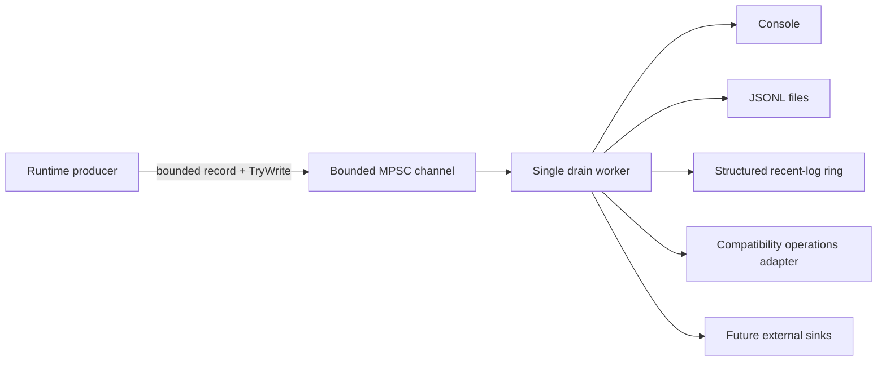

# Runtime structured logging pipeline roadmap

Current status: **L0, L1 and L2 are implemented. L3 is partially adopted in the live host. L4-L5 remain open.**

This roadmap tracks the replacement of ad-hoc host logging with a runtime-owned structured logging subsystem. The implementation remains NativeAOT-first and keeps authoritative simulation producers free from blocking console, disk, network, and external-sink I/O.

## Non-negotiable constraints

- Producers must never synchronously perform sink I/O.
- Queueing must be bounded and non-blocking for the caller.
- Accepted records keep FIFO order through the single drain worker.
- Warning/error/critical traffic must retain queue capacity during normal-level floods.
- Record contracts contain detached scalar context, not mutable runtime entities or raw packet payloads.
- External serialization remains trimming/AOT-safe and does not use reflection-driven runtime schema discovery.
- Sink failures are observable and isolated from healthy sinks.
- Documentation in `docs/en` and `docs/ru` changes atomically with logging code.

## Data flow

For queue capacity \(N_q\) and priority reserve \(N_r\), low-priority traffic is capped at

\[
N_{normal}=N_q-N_r.
\]

Current defaults are \(N_q=2048\) and \(N_r=256\).

## L0 - Stable structured log contract

- [x] Add stable runtime log severity and category types.
- [x] Add compact immutable `RuntimeLogRecord` and detached `RuntimeLogContext`.
- [x] Define subsystem event-ID ranges and seed lifecycle event IDs.
- [x] Document sensitive-data rules and prohibit secrets/raw payload/object dumps.

Event-ID ranges remain `1000-1999` lifecycle, `2000-2999` network, `3000-3999` protocol, `4000-4999` world, `5000-5999` persistence, `6000-6999` plugin, `7000-7999` gameplay, `8000-8999` operations and `9000-9999` security.

## L1 - Bounded non-blocking runtime pipeline

- [x] Add one bounded MPSC channel with a single runtime-owned drain worker.
- [x] Keep the producer path non-blocking through `TryWrite` only.
- [x] Reserve queue capacity for `Warning`/`Error`/`Critical` records.
- [x] Track accepted, filtered, per-severity drops, drained count, queue depth and high-water mark.
- [x] Add bounded shutdown drain and per-sink operation timeouts.
- [x] Bound and sanitize free-form text before enqueueing.

## L2 - First-party sinks and failure isolation

- [x] Add a background console sink.
- [x] Add a NativeAOT-safe JSONL sink using explicit `Utf8JsonWriter` serialization.
- [x] Add size/day rotation and bounded file retention.
- [x] Add a bounded structured recent-log ring for future TUI/API retrieval.
- [x] Track sink health and quarantine repeatedly failing sinks without stopping healthy sinks.
- [x] Cover FIFO drain, saturation/reserve, drops, quarantine, rotation/retention, recent-log bounds and text sanitization with tests.

Default JSONL policy is \(16\,\mathrm{MiB}\) maximum file size, UTC-day rotation, \(8\) retained files, periodic flush every \(64\) records and immediate flush for `Error`/`Critical`.

## L3 - Runtime adoption

### Completed live-host bridge slice

- [x] Route `RuntimeHostLog.Write` and `RuntimeHostLog.Publish` through `RuntimeLogPipeline` instead of synchronous console/read-model calls.
- [x] Move compatibility `RuntimeLogBuffer` publication behind a worker-owned sink so existing TUI/read-model behavior remains available during migration.
- [x] Move compatibility stdout/stderr writes behind a worker-owned sink while preserving TUI suppression and plain-console fallback semantics.
- [x] Add transitional stable bridge routing IDs `8000-8002`; final subsystem call-site IDs remain separate work.
- [x] Verify with tests that a blocked console writer cannot block the producer call.
- [x] Add bounded process-exit drain fallback plus explicit `DisposeAsync` on the bridge.

### Remaining L3 work

- [ ] Replace remaining direct `Console.*` startup/world-host call sites with the structured pipeline.
- [ ] Allocate final semantic event IDs for lifecycle/startup/shutdown/world/network/protocol/gameplay/persistence/plugin/security call-site families.
- [ ] Propagate correlation IDs and detached world/connection/player/entity/packet context.
- [ ] Replace the transitional `RuntimeLogBuffer` operations adapter with `RuntimeRecentLogStore` consumption in the TUI/operations surface.
- [ ] Define configuration for minimum level, enabled sinks, file directory, capacities, retention and sink timeouts.
- [ ] Wire explicit logging disposal into normal server-host shutdown rather than relying on the process-exit fallback.
- [ ] Ensure every migrated call-site family performs no synchronous sink I/O.

The transitional bridge IDs describe delivery semantics only. They must not be reused as the final semantic ID of a world/network/gameplay event.

## L4 - Metrics, operator surfaces and quality gates

- [ ] Export queue depth/high-water, drop counters, sink failures/quarantine and recent-store overwrites to runtime metrics.
- [ ] Expose bounded recent logs and sink health through TUI/API operator surfaces.
- [ ] Add deterministic filtering by level/category/event ID/subsystem/correlation identifiers.
- [ ] Add sustained-flood and slow/failing-sink benchmarks with explicit CPU/allocation/latency budgets.
- [ ] Add Linux and Windows NativeAOT smoke gates for the adopted logging path.
- [ ] Add rotation/retention crash-recovery and disk-full scenarios.

## L5 - Optional external sinks

- [ ] Define a stable runtime-level sink registration boundary; plugins must not bind directly to implementation backends.
- [ ] Add optional external sink adapters only behind bounded worker-owned queues and explicit budgets.
- [ ] Document security/redaction requirements for remote export.
- [ ] Add overload and endpoint-failure tests proving that remote sinks cannot stall the game loop.

## Implementation evidence

L0-L2 contracts and implementation live under:

- `src/TerraRuntime.Contracts/Diagnostics/`;
- `src/TerraRuntime/Diagnostics/`;
- `tests/TerraRuntime.Tests/RuntimeLogPipelineTests.cs`.

The first L3 live-host bridge slice is covered by:

- `src/TerraRuntime/RuntimeHostLog.cs`;
- `src/TerraRuntime.Contracts/Diagnostics/RuntimeLogEventIds.cs`;
- `tests/TerraRuntime.Tests/RuntimeHostLogTests.cs`;
- `docs/en/observability-logging.md`;
- `docs/ru/observability-logging.md`.

## Next closure target

The next coherent L3 commit should migrate the remaining direct startup/world-host `Console.*` families together, allocate their final semantic event IDs and detached context in the same change, and make pipeline disposal an explicit part of normal server-host shutdown. Only after that should the transitional `RuntimeLogBuffer` adapter be removed in favor of the structured recent-log operations surface.
