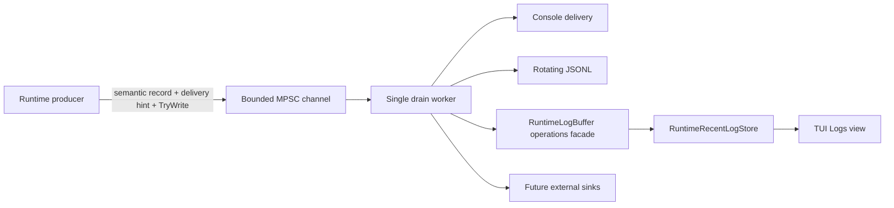

# Runtime structured logging pipeline roadmap

Current status: **L0-L3 are complete. L4-L5 remain open.**

This roadmap tracks the replacement of ad-hoc host logging with a runtime-owned structured logging subsystem. The implementation remains NativeAOT-first and keeps authoritative simulation producers free from blocking console, disk, network, and external-sink I/O.

## Non-negotiable constraints

- Producers never synchronously perform sink I/O.
- Queueing is bounded and non-blocking for the caller.
- Accepted records keep FIFO order through the single drain worker.
- Warning/error/critical traffic retains queue capacity during normal-level floods.
- Record contracts contain detached scalar context, not mutable runtime entities or raw packet payloads.
- External serialization remains trimming/AOT-safe and does not use reflection-driven runtime schema discovery.
- Sink failures are observable and isolated from healthy sinks.
- Semantic event identity is independent from host-local stdout/stderr routing.
- Stable event IDs are never recycled for unrelated semantics.
- Documentation in `docs/en` and `docs/ru` changes atomically with logging code.

## Data flow

The host-local delivery hint lives beside `RuntimeLogRecord` in a private pipeline envelope. Ordinary structured sinks see only the semantic record.

For queue capacity \(N_q\) and priority reserve \(N_r\), low-priority traffic is capped at

\[
N_{normal}=N_q-N_r.
\]

Current defaults are \(N_q=2048\) and \(N_r=256\).

## L0 - Stable structured log contract

- [x] Add stable runtime log severity and category types.
- [x] Add compact immutable `RuntimeLogRecord` and detached `RuntimeLogContext`.
- [x] Define subsystem event-ID ranges and seed lifecycle event IDs.
- [x] Document sensitive-data rules and prohibit secrets/raw payload/object dumps.

Event-ID ranges remain `1000-1999` lifecycle, `2000-2999` network, `3000-3999` protocol, `4000-4999` world, `5000-5999` persistence, `6000-6999` plugin, `7000-7999` gameplay, `8000-8999` operations and `9000-9999` security.

## L1 - Bounded non-blocking runtime pipeline

- [x] Add one bounded MPSC channel with a single runtime-owned drain worker.
- [x] Keep the producer path non-blocking through `TryWrite` only.
- [x] Reserve queue capacity for `Warning`/`Error`/`Critical` records.
- [x] Track accepted, filtered, per-severity drops, drained count, queue depth and high-water mark.
- [x] Add bounded shutdown drain and per-sink operation timeouts.
- [x] Bound and sanitize free-form text before enqueueing.

## L2 - First-party sinks and failure isolation

- [x] Add a background console sink.
- [x] Add a NativeAOT-safe JSONL sink using explicit `Utf8JsonWriter` serialization.
- [x] Add size/day rotation and bounded file retention.
- [x] Add a bounded structured recent-log ring for TUI/API retrieval.
- [x] Track sink health and quarantine repeatedly failing sinks without stopping healthy sinks.
- [x] Cover FIFO drain, saturation/reserve, drops, quarantine, rotation/retention, recent-log bounds and text sanitization with tests.

Default JSONL policy is \(16\,\mathrm{MiB}\) maximum file size, UTC-day rotation, \(8\) retained files, periodic flush every \(64\) records and immediate flush for `Error`/`Critical`.

## L3 - Runtime adoption

- [x] Route live-host logging through `RuntimeLogPipeline` rather than synchronous console/read-model calls.
- [x] Replace direct `Console.WriteLine` / `Console.Error.WriteLine` and duplicate `RuntimeLogBuffer.Publish` logging in `TerrariaServerHost` with semantic structured events.
- [x] Allocate stable semantic IDs for migrated lifecycle, network, world, persistence, plugin/host-integration and operations families.
- [x] Carry stdout/stderr/buffered delivery separately from semantic event IDs inside the private pipeline envelope.
- [x] Add run-scoped correlation plus detached world/connection/player context where verified identifiers exist.
- [x] Wire explicit logging disposal into normal `TerrariaServerHost.RunAsync` ownership with `await using`, covering early returns and normal shutdown.
- [x] Replace the independent legacy recent-log ring with `RuntimeRecentLogStore` behind the existing `RuntimeLogBuffer`/`ILogOperations` TUI facade.
- [x] Define bounded runtime configuration for minimum level, console/JSONL enablement, JSONL directory, queue/reserve capacities, rotation/retention, flush cadence and sink/shutdown timeouts.
- [x] Keep migrated host call sites free from synchronous sink I/O and verify blocked console I/O cannot block the producer.
- [x] Remove transitional `RuntimeHostLog.Write` / `RuntimeHostLog.Publish` APIs after all production callers migrated.
- [x] Permanently retire transitional delivery IDs `8000-8002`; they are not reused for new meanings.
- [x] Give direct local operations-read-model publication its own semantic ID `8004` (`OperationsReadModelMessage`).

`RuntimeHostLog` now exposes one semantic producer API, `Log(...)`. TUI activation affects only delivery routing; it does not change event identity. Operations ID `8003` remains `OperationsTerminalUiFailed`. IDs `8000-8002` are historical tombstones so old logs cannot be reinterpreted after upgrades.

Production configuration is read from `TERRARUNTIME_LOG_*` environment variables. Defaults remain queue \(2048\), priority reserve \(256\), JSONL rotation at \(16\,\mathrm{MiB}\), retention \(8\) files, flush every \(64\) records, sink timeout \(2000\,\mathrm{ms}\), and shutdown drain \(5000\,\mathrm{ms}\).

Protocol/gameplay/security ranges remain available for future real semantic events. Their absence today is not L3 migration debt; new IDs are allocated when those subsystems actually gain log events.

## L4 - Metrics, operator surfaces and quality gates

- [ ] Export queue depth/high-water, drop counters, sink failures/quarantine and recent-store overwrites to runtime metrics.
- [ ] Expose bounded recent logs and sink health through TUI/API operator surfaces.
- [ ] Add deterministic filtering by level/category/event ID/subsystem/correlation identifiers.
- [ ] Add sustained-flood and slow/failing-sink benchmarks with explicit CPU/allocation/latency budgets.
- [ ] Add Linux and Windows NativeAOT smoke gates for the fully adopted logging path.
- [ ] Add rotation/retention crash-recovery and disk-full scenarios.

## L5 - Optional external sinks

- [ ] Define a stable runtime-level sink registration boundary; plugins must not bind directly to implementation backends.
- [ ] Add optional external sink adapters only behind bounded worker-owned queues and explicit budgets.
- [ ] Document security/redaction requirements for remote export.
- [ ] Add overload and endpoint-failure tests proving that remote sinks cannot stall the game loop.

## Implementation evidence

L0-L3 are implemented across:

- `src/TerraRuntime.Contracts/Diagnostics/`;
- `src/TerraRuntime/Diagnostics/`;
- `src/TerraRuntime/RuntimeHostLog.cs`;
- `src/TerraRuntime/Operations/RuntimeLogBuffer.cs`;
- `src/TerraRuntime/TerrariaServerHost.cs`;
- `tests/TerraRuntime.Tests/RuntimeLogPipelineTests.cs`;
- `tests/TerraRuntime.Tests/RuntimeHostLogTests.cs`;
- `tests/TerraRuntime.Tests/RuntimeHostLoggingOptionsTests.cs`;
- `tests/TerraRuntime.Tests/RuntimeLogBufferTests.cs`;
- paired `docs/en/observability-logging.md` and `docs/ru/observability-logging.md`.

## Next closure target

The next coherent logging milestone is **L4 operator observability and quality gates**: expose pipeline/recent-store health without introducing another state store, then add deterministic structured filtering and sustained overload/failure acceptance tests.
