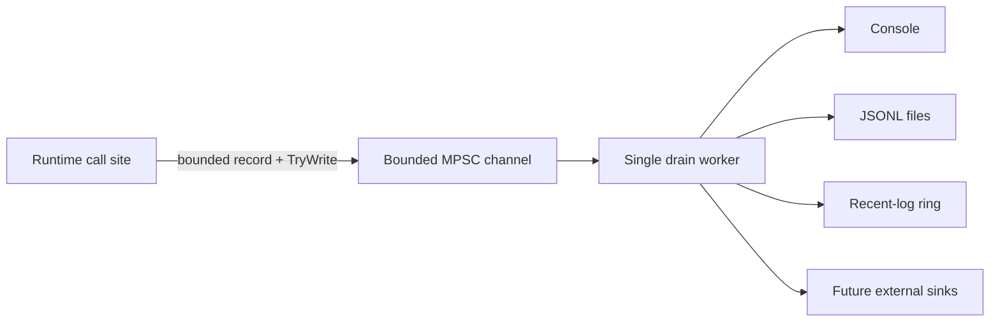

# Runtime structured logging pipeline roadmap

Status after this milestone: **L0, L1 and L2 are implemented. L3-L5 remain open.**

This roadmap tracks the replacement of ad-hoc host logging with a runtime-owned structured logging subsystem. The implementation remains NativeAOT-first and keeps authoritative simulation producers free from blocking console, disk, network, and external-sink I/O.

## Non-negotiable constraints

- Producers must never synchronously perform sink I/O.
- Queueing must be bounded and non-blocking for the caller.
- Accepted records keep FIFO order through the single drain worker.
- Warning/error/critical traffic must retain queue capacity during normal-level floods.
- Record contracts must contain detached scalar context, not mutable runtime entities or raw packet payloads.
- External serialization must remain trimming/AOT-safe and must not depend on reflection-driven runtime schema discovery.
- Sink failures must be observable and isolated from healthy sinks.
- Documentation in `docs/en` and `docs/ru` changes atomically with the code.

## Data flow

For queue capacity \(N_q\) and priority reserve \(N_r\), low-priority traffic is capped at

\[
N_{normal}=N_q-N_r.
\]

Current defaults are \(N_q=2048\) and \(N_r=256\).

## L0 - Stable structured log contract

- [x] Add stable runtime log severity and category types.
- [x] Add compact immutable `RuntimeLogRecord` and detached `RuntimeLogContext`.
- [x] Define subsystem event-ID ranges and seed lifecycle event IDs.
- [x] Document sensitive-data rules and prohibit secrets/raw payload/object dumps.

Event-ID ranges:

| Range | Owner |
| ---: | --- |
| `1000-1999` | Lifecycle |
| `2000-2999` | Network |
| `3000-3999` | Protocol |
| `4000-4999` | World |
| `5000-5999` | Persistence |
| `6000-6999` | Plugin |
| `7000-7999` | Gameplay |
| `8000-8999` | Operations |
| `9000-9999` | Security |

IDs are stable semantic identifiers. Never recycle an allocated ID for unrelated meaning merely because message text changed.

## L1 - Bounded non-blocking runtime pipeline

- [x] Add one bounded MPSC channel with a single runtime-owned drain worker.
- [x] Keep the producer path non-blocking through `TryWrite` only.
- [x] Reserve queue capacity for `Warning`/`Error`/`Critical` records.
- [x] Track accepted, filtered, per-severity drops, drained count, queue depth and high-water mark.
- [x] Add bounded shutdown drain and per-sink operation timeouts.
- [x] Bound and sanitize free-form text before enqueueing.

The queue uses `BoundedChannelFullMode.Wait` only to give `TryWrite` deterministic bounded-capacity semantics; producers never call a waiting write API. Normal-level slots are independently capped so they cannot consume the priority reserve.

## L2 - First-party sinks and failure isolation

- [x] Add a background console sink.
- [x] Add a NativeAOT-safe JSONL sink using explicit `Utf8JsonWriter` serialization.
- [x] Add size/day rotation and bounded file retention.
- [x] Add a bounded recent-log ring for future TUI/API retrieval.
- [x] Track sink health and quarantine repeatedly failing sinks without stopping healthy sinks.
- [x] Add focused tests for FIFO drain, saturation/reserve, drops, quarantine, rotation/retention, recent-log bounds and text sanitization.

Default JSONL policy:

- maximum file size \(16\,\mathrm{MiB}\);
- rotate at UTC day boundary;
- retain \(8\) files;
- flush every \(64\) records;
- flush immediately for `Error` and `Critical`.

## L3 - Runtime adoption

- [ ] Replace `RuntimeHostLog` and direct console logging with `RuntimeLogPipeline`.
- [ ] Allocate stable event IDs for lifecycle/startup/shutdown/world/network/protocol/gameplay/persistence/plugin/security call sites.
- [ ] Propagate correlation IDs and detached world/connection/player/entity/packet context.
- [ ] Route current bounded runtime log operations to the new recent-log store without duplicating authoritative state.
- [ ] Define configuration for minimum level, enabled sinks, file directory, capacities, retention and sink timeouts.
- [ ] Ensure no migrated call site performs synchronous sink I/O.

## L4 - Metrics, operator surfaces and quality gates

- [ ] Export queue depth/high-water, drop counters, sink failures/quarantine and recent-store overwrites to runtime metrics.
- [ ] Expose bounded recent logs and sink health through TUI/API operator surfaces.
- [ ] Add deterministic filtering by level/category/event ID/subsystem/correlation identifiers.
- [ ] Add sustained-flood and slow/failing-sink benchmarks with explicit CPU/allocation/latency budgets.
- [ ] Add Linux and Windows NativeAOT smoke gates for the adopted logging path.
- [ ] Add rotation/retention crash-recovery and disk-full scenarios.

## L5 - Optional external sinks

- [ ] Define a stable runtime-level sink registration boundary; plugins must not bind directly to implementation backends.
- [ ] Add optional external sink adapters only behind bounded worker-owned queues and explicit budgets.
- [ ] Document security/redaction requirements for remote export.
- [ ] Add overload and endpoint-failure tests proving that remote sinks cannot stall the game loop.

## Implementation evidence for L0-L2

Contracts:

- `src/TerraRuntime.Contracts/Diagnostics/RuntimeLogLevel.cs`
- `src/TerraRuntime.Contracts/Diagnostics/RuntimeLogCategory.cs`
- `src/TerraRuntime.Contracts/Diagnostics/RuntimeLogEventId.cs`
- `src/TerraRuntime.Contracts/Diagnostics/RuntimeLogEventIds.cs`
- `src/TerraRuntime.Contracts/Diagnostics/RuntimeLogContext.cs`
- `src/TerraRuntime.Contracts/Diagnostics/RuntimeLogRecord.cs`
- `src/TerraRuntime.Contracts/Diagnostics/IRuntimeLogSink.cs`

Runtime implementation:

- `src/TerraRuntime/Diagnostics/RuntimeLogPipeline.cs`
- `src/TerraRuntime/Diagnostics/RuntimeLogPipelineOptions.cs`
- `src/TerraRuntime/Diagnostics/RuntimeLogPipelineMetrics.cs`
- `src/TerraRuntime/Diagnostics/RuntimeConsoleLogSink.cs`
- `src/TerraRuntime/Diagnostics/RuntimeJsonLinesLogSink.cs`
- `src/TerraRuntime/Diagnostics/RuntimeRecentLogStore.cs`

Tests:

- `tests/TerraRuntime.Tests/RuntimeLogPipelineTests.cs`

Paired operator/architecture documentation:

- `docs/en/observability-logging.md`
- `docs/ru/observability-logging.md`

## Next closure target

The next coherent commit should be **L3 Runtime adoption**. It should migrate complete call-site families together, allocate their stable IDs in the same change, wire configuration/lifecycle ownership, and keep the old logging path only until all live host call sites have moved.
