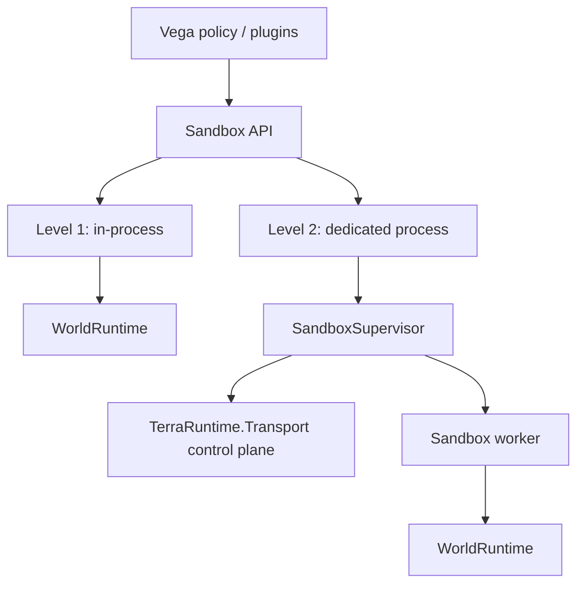
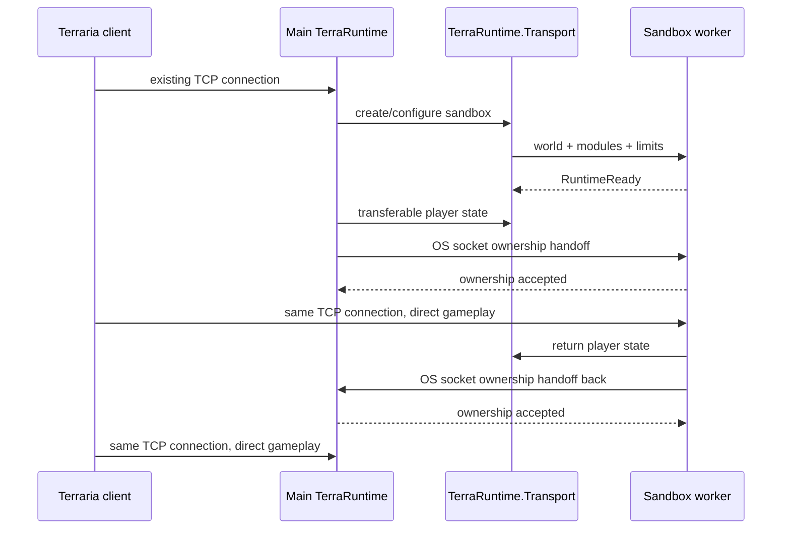

# Sandbox runtime roadmap

This directory is the normative delivery roadmap for TerraRuntime sandbox worlds. User-facing architecture is documented in [`../../en/sandbox/README.md`](../../en/sandbox/README.md) and [`../../ru/sandbox/README.md`](../../ru/sandbox/README.md).

Sandbox runtime is **not** a Dimensions replacement. It provides two isolation levels over the same `WorldRuntime` model:

The same logical world/runtime concepts are used at both levels. Level 2 changes placement and fault boundary, not gameplay semantics.

## Normative Level 2 decision

For a **local** dedicated-process sandbox, normal Terraria gameplay traffic is not permanently proxied through `TerraRuntime.Transport`.

The selected worker is prepared first. Player semantic state is transferred through bounded, versioned Transport messages. Then ownership of the already accepted client TCP connection is handed from the main process to the worker using an operating-system socket-handoff mechanism. When the player leaves, player state and socket ownership are transferred back in the reverse direction.

The invariant is strict: **exactly one process performs application-level reads/writes for a transferred connection at any moment**.

## Delivery phases

### S0 - identity and architecture foundation

- [x] retain `TerraRuntime.Transport` as a first-class process/server boundary;
- [x] define `WorldRuntimeId`, `WorldSessionId` and `WorldRuntimeIdentity`;
- [x] define `InProcess` and `DedicatedProcess` isolation policies;
- [x] define `Persistent`, `Ephemeral` and `SnapshotClone` persistence policies;
- [x] document that sandbox runtime is not Dimensions compatibility;
- [x] make runtime identity/isolation/persistence visible through trusted host runtime info;
- [ ] propagate world identity through every cross-world/process boundary that currently exposes only local handles.

### S1 - in-process runtime container

- [ ] extract one world composition root into a concrete `WorldRuntime` lifecycle owner;
- [ ] introduce a bounded host/registry for multiple live runtime worlds without a new generic manager/facade layer;
- [ ] run at least two independent live worlds concurrently;
- [ ] prove isolation of mutable player/NPC/projectile/item/world/extension state;
- [ ] prove deterministic RNG streams do not leak between runtimes;
- [ ] add bounded process-wide admission for live worlds/resources;
- [ ] evolve trusted-host attachment from one global `runtimeAttached` state to scopes keyed by `WorldRuntimeIdentity`.

### S2 - Level 1 sandbox lifecycle

- [ ] create an ephemeral runtime from `.wld`, validated generated state or snapshot-clone source;
- [ ] attach selected Vega/world logic to the exact world runtime scope;
- [ ] register world-scoped hooks/commands/events with revocable registration leases;
- [ ] deterministic teardown retires registrations, timers, extension state and world resources;
- [ ] transfer one client between two in-process world sessions without packet-emulation hacks;
- [ ] default single-world behavior remains unchanged when sandbox support is unused.

### S3 - Transport server-control plane

- [ ] define a versioned service protocol over `TerraRuntime.Transport` for server/sandbox control;
- [ ] Vega can hold independent sessions to multiple TerraRuntime servers;
- [ ] remote server identity and reconnect semantics do not rely only on socket addresses;
- [ ] Vega PluginSdk exposes policy-scoped operations rather than unrestricted raw Transport access;
- [ ] malformed, oversized and unauthorized control requests fail closed and are observable;
- [ ] define bounded semantic player-state transfer contracts used by sandbox handoff.

### S4 - Level 2 worker lifecycle

- [ ] introduce `SandboxSupervisor` in the TerraRuntime host layer;
- [ ] first implementation uses one sandbox world per worker process;
- [ ] creation descriptor supplies world source, selected sandbox-side modules/plugins, configuration and resource limits;
- [ ] worker reports `RuntimeReady` only after world and selected local logic are attached;
- [ ] heartbeat/liveness and bounded control queues;
- [ ] graceful stop plus forced-kill fallback;
- [ ] worker crash cannot terminate the main server process;
- [ ] process, CPU and memory limits are enforceable where the target OS supports them;
- [ ] plugin-bearing workers use a CoreCLR extensible profile; runtime-only workers may remain NativeAOT when no dynamic module loading is required.

### S5 - bidirectional TCP socket handoff

- [ ] define a connection-transfer safe point at a complete Terraria protocol-frame boundary;
- [ ] no partial frame or untransferred bytes may remain in process-local decoder/pipe buffers when ownership commits;
- [ ] pending outbound writes are flushed or explicitly transferred/retired before handoff;
- [ ] Windows path uses verified Winsock socket duplication/handoff semantics;
- [ ] Unix/Linux path uses verified file-descriptor passing, such as `SCM_RIGHTS`, over a local Unix-domain control channel;
- [ ] main -> worker handoff preserves the existing Terraria TCP connection without client reconnect;
- [ ] worker -> main handoff preserves the same connection when the player leaves;
- [ ] prove exactly-one-reader/writer ownership for success, cancellation, timeout and failure paths;
- [ ] failed ownership negotiation fails closed; dual ownership is never a recovery strategy;
- [ ] after handoff, ordinary gameplay traffic flows directly client <-> worker rather than through permanent Transport proxying.

### S6 - Vega sandbox integration

- [ ] Vega can request `Auto`, `InProcess` or `DedicatedProcess` isolation while operator/policy may strengthen isolation;
- [ ] sandbox creation can select world source and sandbox-side modules/plugins;
- [ ] Level 1 creates a per-world plugin scope in the main Vega process;
- [ ] Level 2 loads selected sandbox-side plugin/module packages inside the worker scope;
- [ ] hot-path hooks and world-local commands execute in the process that owns that `WorldRuntime`;
- [ ] global/operator commands remain in main Vega and use semantic control operations;
- [ ] package identity/version/hash and configuration are explicit for worker-side plugin loading;
- [ ] teardown/hot reload retires every hook, command, timer and retained runtime reference for the affected scope.

### S7 - optional optimizations

Only after measurements justify them:

- [ ] shared-memory immutable snapshots for large local control-plane transfers;
- [ ] copy-on-write world source storage;
- [ ] multiple low-load worlds in one worker;
- [ ] a shared scheduler for low-load in-process worlds;
- [ ] remote-host sandbox workers with a different data-plane design, because OS socket handoff is local-host specific.

## Non-goals

- no permanent local Level 2 packet proxy through the main process;
- no generic distributed RPC framework;
- no global event bus shared by unrelated world runtimes;
- no requirement that every plugin understand Transport internals;
- no socket serialization into ordinary Transport payload bytes;
- no COW/process pooling before measurement;
- no claim that Level 1 provides security isolation from malicious or crashing in-process code.
