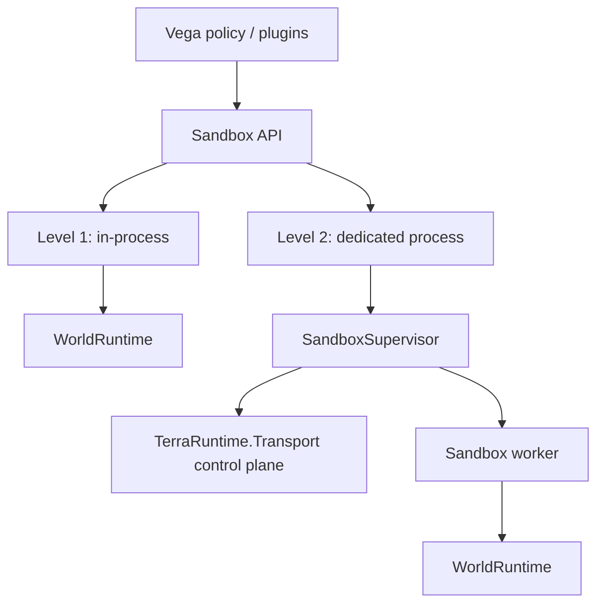
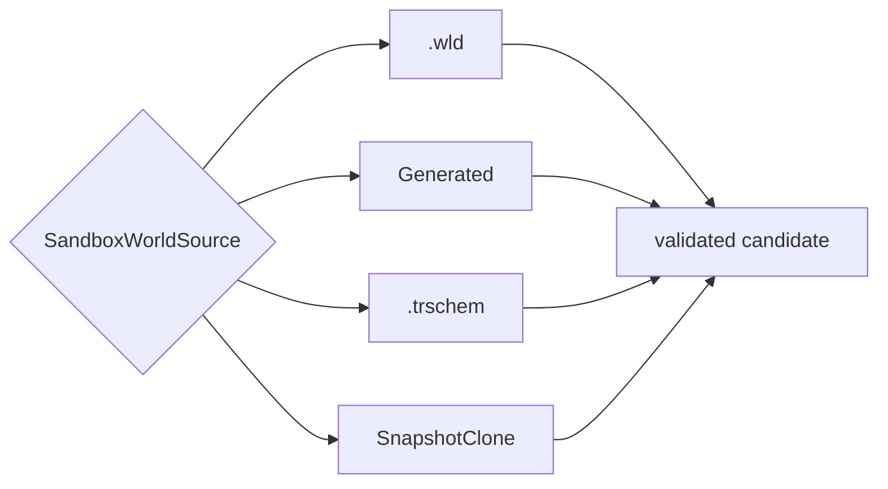
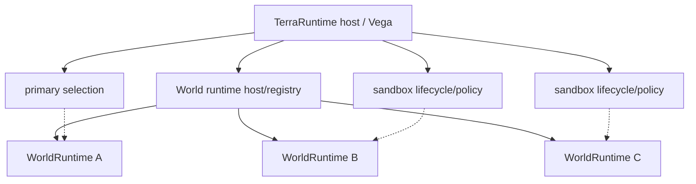
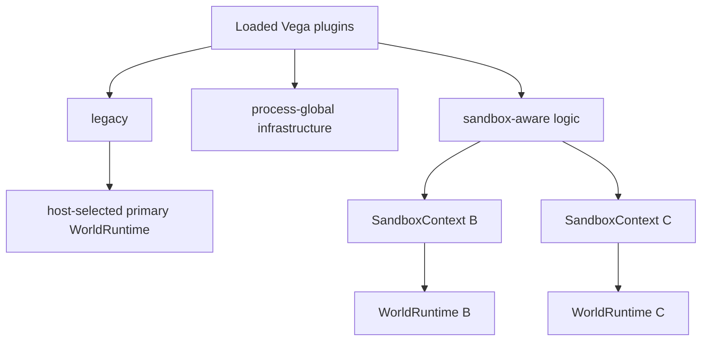
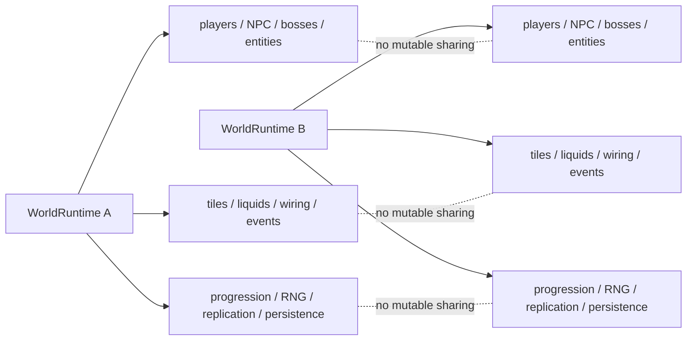
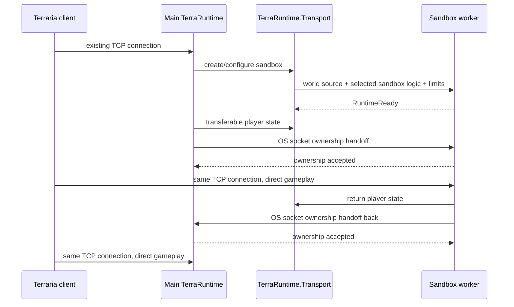

# Sandbox runtime roadmap

This directory is the normative delivery roadmap for TerraRuntime sandbox worlds. User-facing architecture is documented in [`../../en/sandbox/README.md`](../../en/sandbox/README.md) and [`../../ru/sandbox/README.md`](../../ru/sandbox/README.md).

Detailed source/materialization and `.trschem` delivery is tracked in [`world-sources-schematics.md`](world-sources-schematics.md). That page is normative for the shared `SandboxWorldSource` model and the TerraRuntime Schematic format used directly by TerraRuntime, Vega and WorldEdit.

Sandbox runtime is **not** a Dimensions replacement. It provides two isolation levels over the same `WorldRuntime` model:

The same logical world/runtime concepts are used at both levels. Level 2 changes placement and fault boundary, not gameplay semantics.

## Normative world-source decision

Level 1 and Level 2 accept the same source families:

Isolation must not determine the map format. The same `.wld`, generation request or `.trschem` arena can be materialized as Level 1 or Level 2.

`.trschem` is the native TerraRuntime schematic format. WorldEdit and Vega use it directly through the shared format/model boundary; TerraRuntime does not carry a WorldEdit compatibility adapter in the baseline. The v1 schematic includes tiles/walls/liquids/wiring, chests/items, signs, typed tile entities, NPC placements, world items and named markers/regions. Runtime IDs, connection state and raw transient AI state are never schematic identity.

## Normative Level 1 decision

The primary world and a Level 1 sandbox are the **same `WorldRuntime` abstraction**. Do not introduce `PrimaryWorldRuntime`, `SandboxWorldRuntime` or parallel simulation implementations.

The host/Vega may select one live runtime as the **primary runtime** for default admission, compatibility behavior and normal persistent-server operation, but that designation is external policy. `WorldRuntime` itself does not need a gameplay-kind flag saying primary/sandbox/minigame.

Level 1 keeps all currently loaded Vega plugin assemblies loaded once in the main process. It does **not** reload a second plugin set for every sandbox and the baseline does not require an arbitrary `Modules = [...]` graph.

Plugin compatibility policy is explicit:

- legacy/single-world plugins remain loaded but receive world-scoped callbacks only for the host-selected primary runtime;
- process-global infrastructure may remain shared when it does not own/mutate one world's gameplay state;
- sandbox/multi-world-aware logic explicitly creates independent world-scoped state through the sandbox context for each runtime it participates in;
- sandbox creation selects one game-mode/owner logic in the baseline; helpers remain normal code/services instead of a miniature module dependency system.

### Level 1 world-isolation boundary

A `WorldRuntime` owns the complete mutable gameplay world. Isolation is not limited to players, chests or inventories.

Each runtime must independently own at least:

- players and membership;
- NPCs, town NPCs, bosses, AI state, interaction credit and boss lifecycle;
- projectiles, dropped items and entity registries/IDs;
- tiles, walls, objects, chests, signs and tile entities;
- liquids, wiring and mechanisms;
- day/night, clock, weather and environment state;
- invasions, events, event counters and spawn state;
- boss/event progression flags;
- RNG streams;
- replication/section/bootstrap/cache state;
- persistence/autosave state under that runtime's persistence policy;
- world-scoped extension/game-mode state, hooks, commands, timers and subscriptions.

No mutable gameplay object or progression flag may leak across runtimes through process-global singletons. Killing a boss in an arena must not progress the runtime selected as primary. Weather, invasions, housing, chest contents, NPC population, projectiles, wiring or liquids in one runtime must not affect another.

The Level 1 baseline explicitly allows a shared **Vega chat router** because chat is host/service infrastructure rather than authoritative world simulation state. Messages originating from a world carry `WorldRuntimeIdentity`, allowing global, same-world, team/match and private visibility policy. Shared chat does not make gameplay hooks or state global.

Other cross-world services are added only as explicit host-level contracts. Sharing a process is never sufficient reason to share mutable world state.

## Normative Level 2 decision

For a **local** dedicated-process sandbox, normal Terraria gameplay traffic is not permanently proxied through `TerraRuntime.Transport`.

The selected worker is prepared first. Player semantic state is transferred through bounded, versioned Transport messages. Then ownership of the already accepted client TCP connection is handed from the main process to the worker using an operating-system socket-handoff mechanism. When the player leaves, player state and socket ownership are transferred back in the reverse direction.

The invariant is strict: **exactly one process performs application-level reads/writes for a transferred connection at any moment**.

## Delivery phases

### S0 - identity and architecture foundation

- [x] retain `TerraRuntime.Transport` as a first-class process/server boundary;
- [x] define `WorldRuntimeId`, `WorldSessionId` and `WorldRuntimeIdentity`;
- [x] define `InProcess` and `DedicatedProcess` isolation policies;
- [x] define `Persistent`, `Ephemeral` and `SnapshotClone` persistence policies;
- [x] document that sandbox runtime is not Dimensions compatibility;
- [x] make runtime identity/isolation/persistence visible through trusted host runtime info;
- [ ] propagate world identity through every cross-world/process boundary that currently exposes only local handles.

### S1 - common multi-world runtime container

- [x] extract one world composition root into a concrete `WorldRuntime` lifecycle owner;
- [x] primary and Level 1 sandbox worlds use the exact same `WorldRuntime` implementation;
- [x] keep primary designation outside `WorldRuntime` as host/Vega selection policy rather than a simulation kind;
- [x] introduce a bounded host/registry for multiple live runtimes without a generic manager/facade layer;
- [x] run at least two independent live runtimes concurrently;
- [x] isolate players, NPCs, town NPCs, bosses/AI, projectiles, items, tiles, chests/signs/tile entities, liquids, wiring, world events, weather/time, progression, spawn state, RNG, replication and persistence state;
- [x] prove boss/event progression in one runtime cannot mutate another runtime;
- [ ] prove deterministic RNG streams do not leak between runtimes;
- [x] prove entity IDs/registries and replication baselines are runtime-local;
- [x] add bounded process-wide admission for live worlds/resources;
- [x] expose a detached process topology snapshot containing primary, pending/live Level 1 sandboxes and current connection membership;
- [ ] evolve trusted-host attachment from one global `runtimeAttached` state to scopes keyed by `WorldRuntimeIdentity`.

### S2 - Level 1 sandbox and Vega compatibility

- [ ] create an ephemeral runtime from `.wld`, `Generated`, `.trschem` or snapshot-clone source through the shared source/materialization path;
- [ ] `.trschem` materialization restores supported tiles, chests, signs, tile entities, NPC placements, world items and markers into isolated candidate state before runtime admission;
- [x] all existing Vega plugin assemblies remain loaded once; sandbox creation does not reload the full plugin set;
- [x] legacy/single-world plugins receive world-scoped callbacks only for the host-selected primary runtime;
- [ ] sandbox/multi-world-aware logic explicitly receives a per-runtime `SandboxContext`;
- [ ] baseline creation selects one sandbox game-mode/owner logic rather than an arbitrary module dependency graph;
- [ ] one loaded game-mode plugin can create multiple independent per-sandbox instances without shared mutable match state;
- [ ] register world-scoped hooks/commands/events/timers with revocable lifetime ownership;
- [ ] shared Vega chat router may span Level 1 runtimes, but messages carry `WorldRuntimeIdentity` and visibility policy remains explicit;
- [ ] no other mutable gameplay service becomes shared merely because runtimes are in one process;
- [ ] deterministic teardown retires registrations, timers, extension/game-mode state and world-owned resources;
- [x] transfer one client between two in-process runtime sessions without packet-emulation hacks, retaining the accepted socket in the process and switching one connection route between runtime-local bindings;
- [x] show primary and all pending/live Level 1 sandboxes with their routed players in the operator TUI, capture drag identity by exact player generation, accept the full destination branch as a drop surface, and map drag/drop to the same typed semantic transfer operation;
- [x] publish background sandbox job failures to both TUI feedback and plain-console structured logging without making observers part of lifecycle ownership;
- [x] default single-world behavior remains unchanged when sandbox support is unused.

### Source/materialization track

The detailed WS0-WS6 checklist is maintained in [`world-sources-schematics.md`](world-sources-schematics.md). In particular, sandbox implementation is not complete until both Level 1 and Level 2 can launch the same asset from `.wld`, `Generated` and `.trschem` sources.

### S3 - Transport server-control plane

- [ ] define a versioned service protocol over `TerraRuntime.Transport` for server/sandbox control;
- [ ] Vega can hold independent sessions to multiple TerraRuntime servers;
- [ ] remote server identity and reconnect semantics do not rely only on socket addresses;
- [ ] Vega PluginSdk exposes policy-scoped operations rather than unrestricted raw Transport access;
- [ ] malformed, oversized and unauthorized control requests fail closed and are observable;
- [ ] define bounded semantic player-state transfer contracts used by sandbox handoff.

### S4 - Level 2 worker lifecycle

- [ ] introduce `SandboxSupervisor` in the TerraRuntime host layer;
- [ ] first implementation uses one sandbox world per worker process;
- [ ] creation descriptor accepts the same `.wld` / `Generated` / `.trschem` / snapshot source model as Level 1, plus selected sandbox-side game mode/plugin package, configuration and resource limits;
- [ ] `Generated` may execute and validate inside the worker; `.wld`/`.trschem` source references are integrity checked before materialization;
- [ ] worker reports `RuntimeReady` only after world source materialization and selected local logic are attached;
- [ ] heartbeat/liveness and bounded control queues;
- [ ] graceful stop plus forced-kill fallback;
- [ ] worker crash cannot terminate the main server process;
- [ ] process, CPU and memory limits are enforceable where the target OS supports them;
- [ ] plugin-bearing workers use a CoreCLR extensible profile; runtime-only workers may remain NativeAOT when no dynamic module loading is required.

### S5 - bidirectional TCP socket handoff

- [ ] define a connection-transfer safe point at a complete Terraria protocol-frame boundary;
- [ ] no partial frame or untransferred bytes may remain in process-local decoder/pipe buffers when ownership commits;
- [ ] pending outbound writes are flushed or explicitly transferred/retired before handoff;
- [ ] Windows path uses verified Winsock socket duplication/handoff semantics;
- [ ] Unix/Linux path uses verified file-descriptor passing, such as `SCM_RIGHTS`, over a local Unix-domain control channel;
- [ ] main -> worker handoff preserves the existing Terraria TCP connection without client reconnect;
- [ ] worker -> main handoff preserves the same connection when the player leaves;
- [ ] prove exactly-one-reader/writer ownership for success, cancellation, timeout and failure paths;
- [ ] failed ownership negotiation fails closed; dual ownership is never a recovery strategy;
- [ ] after handoff, ordinary gameplay traffic flows directly client <-> worker rather than through permanent Transport proxying.

### S6 - Vega Level 2 integration

- [ ] Vega can request `Auto`, `InProcess` or `DedicatedProcess` isolation while operator/policy may strengthen isolation;
- [ ] Level 2 loads only the selected sandbox-side game mode/plugin package and its declared runtime dependencies inside the worker, not the complete main Vega plugin set;
- [ ] hot-path hooks and world-local commands execute in the process that owns that `WorldRuntime`;
- [ ] global/operator commands remain in main Vega and use semantic control operations;
- [ ] package identity/version/hash and configuration are explicit for worker-side plugin loading;
- [ ] teardown/hot reload retires every hook, command, timer and retained runtime reference for the affected scope.

### S7 - optional optimizations

Only after measurements justify them:

- [ ] shared-memory immutable snapshots for large local control-plane transfers;
- [ ] copy-on-write world source storage;
- [ ] multiple low-load worlds in one worker;
- [ ] a shared scheduler for low-load in-process worlds;
- [ ] remote-host sandbox workers with a different data-plane design, because OS socket handoff is local-host specific.

## Non-goals

- no special primary-world simulation class;
- no permanent local Level 2 packet proxy through the main process;
- no generic distributed RPC framework;
- no global mutable gameplay event bus shared by unrelated world runtimes;
- no automatic legacy-plugin attachment to every Level 1 runtime;
- no Level 1 arbitrary module/dependency graph in the baseline;
- no TerraRuntime dependency on WorldEdit or legacy WorldEdit schematic adapter in the baseline;
- no `.trschem` dump of runtime IDs, connection state or raw transient NPC AI arrays;
- no requirement that every plugin understand Transport internals;
- no socket serialization into ordinary Transport payload bytes;
- no COW/process pooling before measurement;
- no claim that Level 1 provides security isolation from malicious or crashing in-process code.
